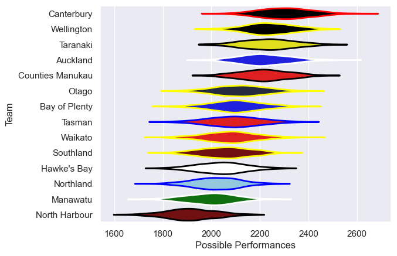

---  
title: "NPC 2012"  
date: 2025-07-29 6:00:00 -0500  
categories: model review projection  
layout: article  
aside:  
    toc: true  
---
# Current Team Rankings

# Standings

## Current Standings

| Club             |   Played |   Wins |   Point Differential |   Losing Bonus Points |   Try Bonus Points |   Competition Points |
|:-----------------|---------:|-------:|---------------------:|----------------------:|-------------------:|---------------------:|
| Canterbury       |       12 |     10 |                  324 |                     1 |                    |                   41 |
| Counties Manukau |       12 |      8 |                  140 |                     3 |                  1 |                   36 |
| Auckland         |       12 |      9 |                   68 |                     0 |                    |                   36 |
| Wellington       |       11 |      8 |                  109 |                     0 |                    |                   32 |
| Taranaki         |       11 |      7 |                   33 |                     0 |                    |                   28 |
| Otago            |       12 |      6 |                  -11 |                     2 |                    |                   26 |
| Waikato          |       10 |      6 |                   42 |                     1 |                    |                   25 |
| Tasman           |       11 |      5 |                  -25 |                     3 |                    |                   23 |
| Southland        |       11 |      4 |                 -151 |                     2 |                    |                   18 |
| Northland        |       10 |      3 |                  -94 |                     2 |                    |                   14 |
| Manawatu         |       10 |      3 |                 -123 |                     2 |                    |                   14 |
| Bay of Plenty    |       10 |      3 |                  -79 |                     1 |                    |                   13 |
| Hawke's Bay      |       10 |      3 |                 -131 |                     1 |                    |                   13 |
| North Harbour    |       10 |      1 |                 -102 |                     3 |                    |                    7 |

# Completed Match Review

| Model | Percent Correct Predictions | Spread Error |
| ------ | ------ | ------ |
| Club Level | 76.3% | 14.7 |
| Player Level: Lineup | nan% | nan |
| Player Level: Minutes | nan% | nan |

