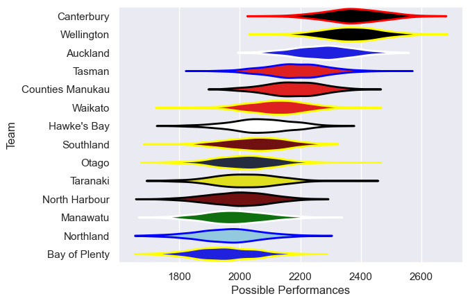

---  
title: "NPC 2013 Status"  
date: 2025-07-28 6:00:00 -0500  
categories: model review projection  
layout: article  
aside:  
    toc: true  
---
# Current Team Rankings

# Standings

## Current Standings

| Club             |   Played |   Wins |   Point Differential |   Losing Bonus Points |   Try Bonus Points |   Competition Points |
|:-----------------|---------:|-------:|---------------------:|----------------------:|-------------------:|---------------------:|
| Canterbury       |       12 |     10 |                  254 |                     1 |                  9 |                   50 |
| Wellington       |       12 |     10 |                  167 |                     0 |                  7 |                   47 |
| Tasman           |       12 |     10 |                  169 |                     0 |                  5 |                   45 |
| Auckland         |       11 |      7 |                   40 |                     1 |                  7 |                   36 |
| Hawke's Bay      |       12 |      7 |                   72 |                     3 |                  3 |                   34 |
| Otago            |       11 |      6 |                   -6 |                     3 |                  4 |                   31 |
| Counties Manukau |       11 |      6 |                   -6 |                     1 |                  3 |                   28 |
| Southland        |       11 |      4 |                  -51 |                     2 |                  3 |                   21 |
| Waikato          |       10 |      4 |                  -63 |                     3 |                  2 |                   21 |
| Manawatu         |       10 |      4 |                 -151 |                     1 |                  1 |                   18 |
| Taranaki         |       10 |      3 |                 -105 |                     2 |                    |                   14 |
| Northland        |       10 |      2 |                  -91 |                     2 |                  1 |                   13 |
| North Harbour    |       10 |      1 |                 -137 |                     3 |                  1 |                   10 |
| Bay of Plenty    |       10 |      1 |                  -92 |                     4 |                    |                    8 |

# Completed Match Review

| Model | Percent Correct Predictions | Spread Error |
| ------ | ------ | ------ |
| Club Level | 69.7% | 12.7 |
| Player Level: Lineup | nan% | nan |
| Player Level: Minutes | nan% | nan |

