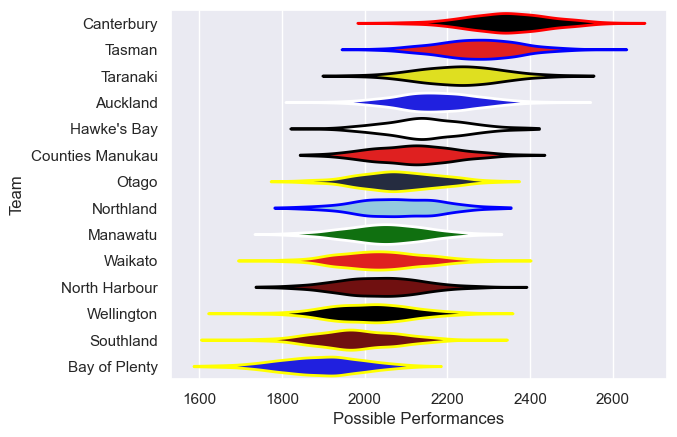

---  
title: "NPC 2014"  
date: 2025-07-29 6:00:00 -0500  
categories: model review projection  
layout: article  
aside:  
    toc: true  
---
# Current Team Rankings

# Standings

## Current Standings

| Club             |   Played |   Wins |   Point Differential |   Losing Bonus Points |   Try Bonus Points |   Competition Points |
|:-----------------|---------:|-------:|---------------------:|----------------------:|-------------------:|---------------------:|
| Taranaki         |       12 |      9 |                  147 |                     2 |                  6 |                   46 |
| Tasman           |       12 |      8 |                  148 |                     3 |                  7 |                   44 |
| Manawatu         |       11 |      9 |                   57 |                     0 |                  3 |                   39 |
| Hawke's Bay      |       13 |      6 |                   45 |                     2 |                  4 |                   36 |
| Canterbury       |       11 |      7 |                  112 |                     2 |                  4 |                   34 |
| Auckland         |       11 |      6 |                   44 |                     0 |                  4 |                   30 |
| Counties Manukau |       10 |      5 |                   59 |                     2 |                  4 |                   28 |
| Northland        |       11 |      5 |                  -13 |                     3 |                  3 |                   26 |
| Waikato          |       10 |      4 |                 -101 |                     2 |                  3 |                   21 |
| Southland        |       11 |      4 |                  -78 |                     1 |                  1 |                   20 |
| North Harbour    |       10 |      3 |                  -94 |                     3 |                  3 |                   18 |
| Otago            |       10 |      3 |                  -51 |                     2 |                  1 |                   15 |
| Bay of Plenty    |       10 |      2 |                 -110 |                     2 |                  3 |                   13 |
| Wellington       |       10 |      1 |                 -165 |                     2 |                  1 |                    7 |

# Completed Match Review

| Model | Percent Correct Predictions | Spread Error |
| ------ | ------ | ------ |
| Club Level | 67.1% | 14.1 |
| Player Level: Lineup | nan% | nan |
| Player Level: Minutes | nan% | nan |

