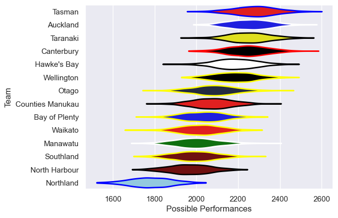

---  
title: "NPC 2015"  
date: 2025-07-29 6:00:00 -0500  
categories: model review projection  
layout: article  
aside:  
    toc: true  
---
# Current Team Rankings

# Standings

## Current Standings

| Club             |   Played |   Wins |   Point Differential |   Losing Bonus Points |   Try Bonus Points |   Competition Points |
|:-----------------|---------:|-------:|---------------------:|----------------------:|-------------------:|---------------------:|
| Canterbury       |       12 |     11 |                  156 |                     1 |                  7 |                   52 |
| Hawke's Bay      |       12 |      9 |                   91 |                     1 |                  5 |                   44 |
| Auckland         |       12 |      8 |                  125 |                     3 |                  5 |                   42 |
| Wellington       |       12 |      7 |                  145 |                     3 |                  7 |                   40 |
| Tasman           |       11 |      7 |                   77 |                     0 |                  7 |                   35 |
| Taranaki         |       11 |      6 |                   89 |                     3 |                  5 |                   32 |
| Otago            |       11 |      6 |                   26 |                     1 |                  7 |                   32 |
| Counties Manukau |       10 |      4 |                  -14 |                     2 |                  5 |                   23 |
| Waikato          |       10 |      4 |                  -56 |                     2 |                  3 |                   21 |
| Bay of Plenty    |       11 |      4 |                  -53 |                     2 |                  2 |                   20 |
| Manawatu         |       10 |      3 |                 -119 |                     2 |                  5 |                   19 |
| North Harbour    |       10 |      3 |                  -82 |                     2 |                  3 |                   17 |
| Southland        |       10 |      2 |                 -108 |                     3 |                  1 |                   14 |
| Northland        |       10 |      0 |                 -277 |                     0 |                  1 |                    1 |

# Completed Match Review

| Model | Percent Correct Predictions | Spread Error |
| ------ | ------ | ------ |
| Club Level | 65.8% | 15.8 |
| Player Level: Lineup | nan% | nan |
| Player Level: Minutes | nan% | nan |

