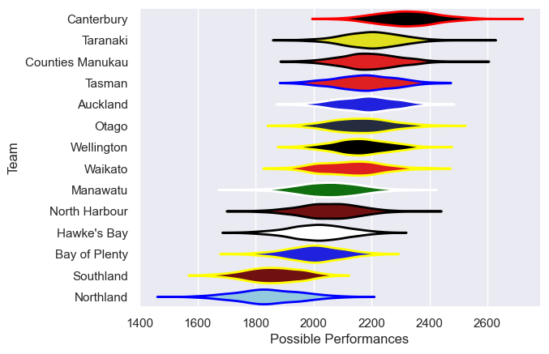

---  
title: "NPC 2016 Status"  
date: 2025-07-28 6:00:00 -0500  
categories: model review projection  
layout: article  
aside:  
    toc: true  
---
# Current Team Rankings

# Standings

## Current Standings

| Club             |   Played |   Wins |   Point Differential |   Losing Bonus Points |   Try Bonus Points |   Competition Points |
|:-----------------|---------:|-------:|---------------------:|----------------------:|-------------------:|---------------------:|
| Canterbury       |       12 |     10 |                  209 |                     1 |                  8 |                   49 |
| Tasman           |       12 |      8 |                   68 |                     1 |                  4 |                   39 |
| Otago            |       12 |      8 |                   27 |                     2 |                  5 |                   39 |
| Taranaki         |       11 |      7 |                   67 |                     2 |                  6 |                   38 |
| North Harbour    |       12 |      7 |                    5 |                     1 |                  4 |                   35 |
| Counties Manukau |       11 |      6 |                   35 |                     4 |                  6 |                   34 |
| Wellington       |       11 |      6 |                    1 |                     2 |                  8 |                   34 |
| Waikato          |       10 |      5 |                   10 |                     2 |                  6 |                   30 |
| Auckland         |       10 |      5 |                   33 |                     3 |                  6 |                   29 |
| Manawatu         |       10 |      4 |                   -7 |                     3 |                  4 |                   23 |
| Bay of Plenty    |       11 |      3 |                  -23 |                     5 |                  6 |                   23 |
| Hawke's Bay      |       10 |      2 |                 -132 |                     3 |                  4 |                   15 |
| Northland        |       10 |      1 |                  -98 |                     2 |                  5 |                   11 |
| Southland        |       10 |      2 |                 -195 |                     1 |                  2 |                   11 |

# Completed Match Review

| Model | Percent Correct Predictions | Spread Error |
| ------ | ------ | ------ |
| Club Level | 73.7% | 11.1 |
| Player Level: Lineup | nan% | nan |
| Player Level: Minutes | nan% | nan |

