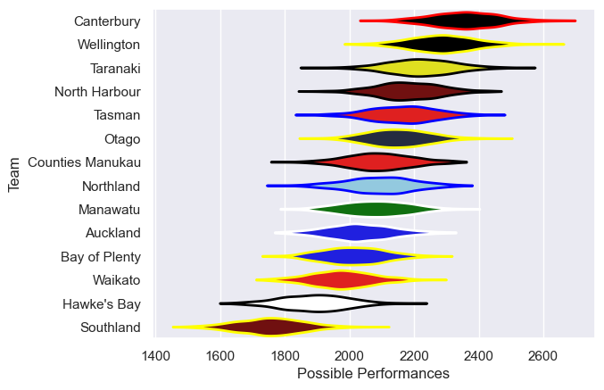

---  
title: "NPC 2017 Status"  
date: 2025-07-28 6:00:00 -0500  
categories: model review projection  
layout: article  
aside:  
    toc: true  
---
# Current Team Rankings

# Standings

## Current Standings

| Club             |   Played |   Wins |   Point Differential |   Losing Bonus Points |   Try Bonus Points |   Competition Points |
|:-----------------|---------:|-------:|---------------------:|----------------------:|-------------------:|---------------------:|
| Wellington       |       12 |     11 |                  242 |                     1 |                 11 |                   56 |
| Canterbury       |       12 |     10 |                  232 |                     0 |                 10 |                   50 |
| Taranaki         |       11 |      8 |                   71 |                     1 |                 10 |                   43 |
| North Harbour    |       11 |      8 |                   97 |                     1 |                  4 |                   37 |
| Bay of Plenty    |       12 |      6 |                   36 |                     1 |                  7 |                   34 |
| Tasman           |       12 |      7 |                  -52 |                     0 |                  6 |                   34 |
| Otago            |       11 |      4 |                   46 |                     5 |                  6 |                   27 |
| Counties Manukau |       10 |      5 |                  -40 |                     1 |                  4 |                   27 |
| Northland        |       11 |      5 |                   15 |                     1 |                  3 |                   24 |
| Manawatu         |       10 |      4 |                   -9 |                     3 |                  4 |                   23 |
| Auckland         |       10 |      3 |                  -63 |                     2 |                  3 |                   17 |
| Waikato          |       10 |      2 |                  -80 |                     4 |                  3 |                   15 |
| Hawke's Bay      |       10 |      2 |                 -195 |                     1 |                  2 |                   11 |
| Southland        |       10 |      0 |                 -300 |                     1 |                    |                    1 |

# Completed Match Review

| Model | Percent Correct Predictions | Spread Error |
| ------ | ------ | ------ |
| Club Level | 67.1% | 14.3 |
| Player Level: Lineup | nan% | nan |
| Player Level: Minutes | nan% | nan |

