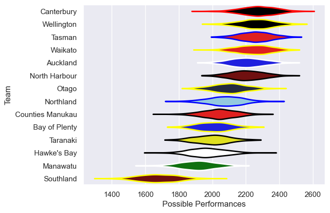

---  
title: "NPC 2018"  
date: 2025-07-29 6:00:00 -0500  
categories: model review projection  
layout: article  
aside:  
    toc: true  
---
# Current Team Rankings

# Standings

## Current Standings

| Club             |   Played |   Wins |   Point Differential |   Losing Bonus Points |   Try Bonus Points |   Competition Points |
|:-----------------|---------:|-------:|---------------------:|----------------------:|-------------------:|---------------------:|
| Auckland         |       12 |     11 |                  162 |                     1 |                 11 |                   56 |
| Canterbury       |       12 |      9 |                  111 |                     2 |                  7 |                   45 |
| Waikato          |       12 |      8 |                  170 |                     3 |                  9 |                   44 |
| Tasman           |       11 |      9 |                  119 |                     1 |                  7 |                   44 |
| Wellington       |       11 |      6 |                  131 |                     3 |                  7 |                   34 |
| Otago            |       12 |      7 |                  -18 |                     1 |                  4 |                   33 |
| North Harbour    |       10 |      6 |                   20 |                     0 |                  5 |                   29 |
| Hawke's Bay      |       11 |      5 |                  -26 |                     2 |                  7 |                   29 |
| Northland        |       11 |      4 |                  -52 |                     3 |                  6 |                   25 |
| Bay of Plenty    |       10 |      4 |                  -39 |                     2 |                  3 |                   21 |
| Counties Manukau |       10 |      2 |                  -57 |                     6 |                  2 |                   16 |
| Manawatu         |       10 |      3 |                 -155 |                     0 |                  2 |                   14 |
| Taranaki         |       10 |      2 |                 -132 |                     2 |                  3 |                   13 |
| Southland        |       10 |      0 |                 -234 |                     1 |                  3 |                    4 |

# Completed Match Review

| Model | Percent Correct Predictions | Spread Error |
| ------ | ------ | ------ |
| Club Level | 67.1% | 13.3 |
| Player Level: Lineup | nan% | nan |
| Player Level: Minutes | nan% | nan |

