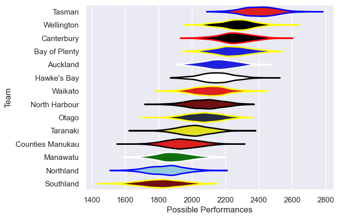

---  
title: "NPC 2019 Status"  
date: 2025-07-28 6:00:00 -0500  
categories: model review projection  
layout: article  
aside:  
    toc: true  
---
# Current Team Rankings

# Standings

## Current Standings

| Club             |   Played |   Wins |   Point Differential |   Losing Bonus Points |   Try Bonus Points |   Competition Points |
|:-----------------|---------:|-------:|---------------------:|----------------------:|-------------------:|---------------------:|
| Tasman           |       12 |     12 |                  303 |                     0 |                  4 |                   52 |
| Bay of Plenty    |       12 |     10 |                  247 |                     2 |                  6 |                   48 |
| Hawke's Bay      |       12 |      8 |                   46 |                     1 |                  5 |                   40 |
| Wellington       |       12 |      8 |                   46 |                     0 |                  5 |                   39 |
| Canterbury       |       11 |      6 |                  136 |                     3 |                  4 |                   31 |
| Auckland         |       11 |      5 |                   57 |                     0 |                  3 |                   27 |
| North Harbour    |       10 |      4 |                    6 |                     3 |                  3 |                   24 |
| Otago            |       11 |      5 |                  -66 |                     1 |                  3 |                   24 |
| Manawatu         |       11 |      4 |                 -179 |                     1 |                  3 |                   20 |
| Waikato          |       10 |      3 |                  -41 |                     2 |                  3 |                   19 |
| Taranaki         |       10 |      4 |                  -33 |                     0 |                    |                   16 |
| Northland        |       10 |      2 |                 -168 |                     1 |                  2 |                   11 |
| Counties Manukau |       10 |      1 |                 -143 |                     3 |                    |                    7 |
| Southland        |       10 |      1 |                 -211 |                     1 |                  2 |                    7 |

# Completed Match Review

| Model | Percent Correct Predictions | Spread Error |
| ------ | ------ | ------ |
| Club Level | 72.4% | 14.4 |
| Player Level: Lineup | nan% | nan |
| Player Level: Minutes | nan% | nan |

