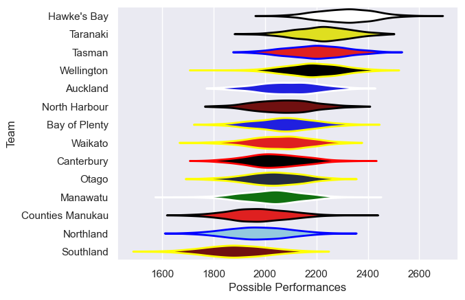

---  
title: "NPC 2021"  
date: 2025-07-29 6:00:00 -0500  
categories: model review projection  
layout: article  
aside:  
    toc: true  
---
# Current Team Rankings

# Standings

## Current Standings

| Club             |   Played |   Wins |   Point Differential |   Losing Bonus Points |   Try Bonus Points |   Competition Points |
|:-----------------|---------:|-------:|---------------------:|----------------------:|-------------------:|---------------------:|
| Taranaki         |       11 |      9 |                  133 |                     0 |                  3 |                   43 |
| Hawke's Bay      |       11 |      7 |                   77 |                     1 |                  7 |                   40 |
| Tasman           |       13 |      6 |                   59 |                     1 |                  4 |                   37 |
| Waikato          |       11 |      6 |                    0 |                     2 |                  6 |                   34 |
| Otago            |       13 |      4 |                    2 |                     2 |                  1 |                   29 |
| Canterbury       |       11 |      5 |                  -17 |                     3 |                  4 |                   29 |
| Wellington       |       10 |      3 |                   44 |                     4 |                  5 |                   25 |
| Manawatu         |       11 |      4 |                  -18 |                     1 |                  3 |                   24 |
| Bay of Plenty    |       10 |      3 |                  -30 |                     2 |                  6 |                   24 |
| Auckland         |       10 |      1 |                    6 |                     1 |                  1 |                   22 |
| North Harbour    |       10 |      1 |                   -5 |                     0 |                    |                   20 |
| Counties Manukau |       10 |      0 |                  -26 |                     0 |                    |                   16 |
| Southland        |       11 |      1 |                 -100 |                     2 |                  1 |                   13 |
| Northland        |       10 |      1 |                 -125 |                     1 |                  3 |                   12 |

# Completed Match Review

| Model | Percent Correct Predictions | Spread Error |
| ------ | ------ | ------ |
| Club Level | 42.1% | 11.1 |
| Player Level: Lineup | nan% | nan |
| Player Level: Minutes | nan% | nan |

