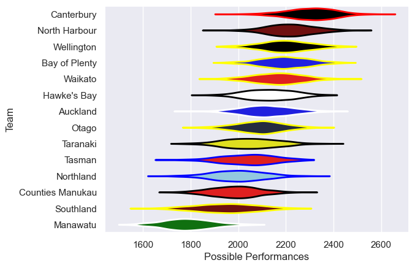

---  
title: "NPC 2022"  
date: 2025-07-29 6:00:00 -0500  
categories: model review projection  
layout: article  
aside:  
    toc: true  
---
# Current Team Rankings

# Standings

## Current Standings

| Club             |   Played |   Wins |   Point Differential |   Losing Bonus Points |   Try Bonus Points |   Competition Points |
|:-----------------|---------:|-------:|---------------------:|----------------------:|-------------------:|---------------------:|
| Canterbury       |       13 |     11 |                  194 |                     1 |                  9 |                   54 |
| Wellington       |       13 |     11 |                  109 |                     0 |                  7 |                   51 |
| Bay of Plenty    |       12 |      7 |                   86 |                     4 |                  6 |                   38 |
| Waikato          |       11 |      7 |                   86 |                     2 |                  5 |                   37 |
| Auckland         |       12 |      7 |                   15 |                     2 |                  4 |                   34 |
| North Harbour    |       11 |      6 |                  142 |                     2 |                  7 |                   33 |
| Hawke's Bay      |       11 |      5 |                   53 |                     5 |                  5 |                   32 |
| Northland        |       11 |      6 |                  -60 |                     2 |                  2 |                   28 |
| Otago            |       10 |      5 |                   -7 |                     4 |                  3 |                   27 |
| Tasman           |       10 |      4 |                    0 |                     3 |                  5 |                   24 |
| Counties Manukau |       10 |      3 |                  -79 |                     3 |                  5 |                   20 |
| Taranaki         |       10 |      3 |                  -77 |                     2 |                  1 |                   15 |
| Southland        |       10 |      1 |                 -201 |                     3 |                  2 |                    9 |
| Manawatu         |       10 |      0 |                 -261 |                     0 |                  5 |                    5 |

# Completed Match Review

| Model | Percent Correct Predictions | Spread Error |
| ------ | ------ | ------ |
| Club Level | 67.5% | 13.9 |
| Player Level: Lineup | nan% | nan |
| Player Level: Minutes | nan% | nan |

