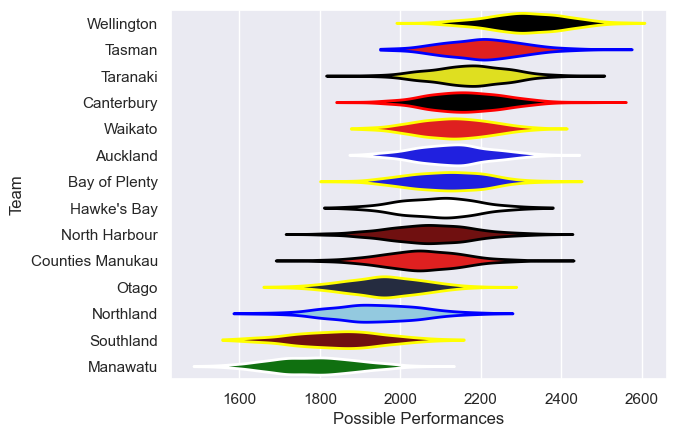

---  
title: "NPC 2023 Status"  
date: 2025-07-28 6:00:00 -0500  
categories: model review projection  
layout: article  
aside:  
    toc: true  
---
# Current Team Rankings

# Standings

## Current Standings

| Club             |   Played |   Wins |   Point Differential |   Losing Bonus Points |   Try Bonus Points |   Competition Points |
|:-----------------|---------:|-------:|---------------------:|----------------------:|-------------------:|---------------------:|
| Taranaki         |       13 |     10 |                  109 |                     2 |                  9 |                   51 |
| Wellington       |       12 |     10 |                  154 |                     2 |                  7 |                   49 |
| Hawke's Bay      |       13 |      9 |                   48 |                     2 |                  6 |                   44 |
| Canterbury       |       12 |      7 |                   78 |                     5 |                 10 |                   43 |
| Bay of Plenty    |       11 |      7 |                   34 |                     1 |                  7 |                   36 |
| Auckland         |       11 |      6 |                   43 |                     3 |                  8 |                   35 |
| Waikato          |       11 |      5 |                   25 |                     3 |                  8 |                   31 |
| Tasman           |       11 |      6 |                    8 |                     2 |                  5 |                   31 |
| Counties Manukau |       10 |      4 |                  -36 |                     1 |                  7 |                   24 |
| North Harbour    |       10 |      4 |                  -23 |                     3 |                  3 |                   22 |
| Otago            |       10 |      3 |                  -81 |                     2 |                  4 |                   18 |
| Northland        |       10 |      2 |                  -39 |                     3 |                  4 |                   17 |
| Manawatu         |       10 |      2 |                 -224 |                     0 |                  4 |                   12 |
| Southland        |       10 |      1 |                  -96 |                     1 |                  2 |                    9 |

# Completed Match Review

| Model | Percent Correct Predictions | Spread Error |
| ------ | ------ | ------ |
| Club Level | 70.1% | 12.0 |
| Player Level: Lineup | nan% | nan |
| Player Level: Minutes | nan% | nan |

