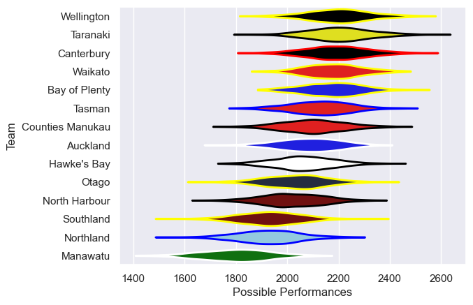

---  
title: "NPC 2025"  
date: 2025-10-23 6:00:00 -0500  
categories: model review projection  
layout: article  
aside:  
    toc: true  
---
# Team Rankings

# Standings

## Current Standings

| Club             |   Played |   Wins |   Point Differential |   Losing Bonus Points |   Try Bonus Points |   Competition Points |
|:-----------------|---------:|-------:|---------------------:|----------------------:|-------------------:|---------------------:|
| Otago            |       12 |     10 |                  117 |                     2 |                  8 |                   50 |
| Canterbury       |       12 |     10 |                  190 |                     1 |                  6 |                   49 |
| Bay of Plenty    |       12 |      8 |                  138 |                     2 |                  6 |                   40 |
| Hawke's Bay      |       12 |      8 |                   86 |                     1 |                  5 |                   38 |
| Taranaki         |       11 |      6 |                   75 |                     2 |                  7 |                   33 |
| Tasman           |       11 |      5 |                   14 |                     2 |                  8 |                   30 |
| Waikato          |       11 |      6 |                  -60 |                     1 |                  5 |                   30 |
| Counties Manukau |       11 |      5 |                    9 |                     1 |                  7 |                   28 |
| Northland        |       10 |      5 |                  -12 |                     1 |                  3 |                   26 |
| Wellington       |       10 |      3 |                  -16 |                     2 |                  7 |                   21 |
| Southland        |       10 |      3 |                 -155 |                     2 |                  4 |                   18 |
| Manawatu         |       10 |      3 |                 -156 |                     1 |                  5 |                   18 |
| Auckland         |       10 |      2 |                 -126 |                     2 |                  5 |                   15 |
| North Harbour    |       10 |      1 |                 -104 |                     3 |                  4 |                   11 |

## Projected Remaining Table

| Club       |   To Play |   Projected Wins |   Projected Differential |   Projected Losing Bonus Points | Projected Try Bonus Points   |   Projected Competition Points |
|:-----------|----------:|-----------------:|-------------------------:|--------------------------------:|:-----------------------------|-------------------------------:|
| Canterbury |         1 |            0.626 |                    3.645 |                           0.188 |                              |                          2.774 |
| Otago      |         1 |            0.333 |                   -3.645 |                           0.28  |                              |                          1.694 |

## Projected Total Table

| Club             |   Played |   Wins |   Point Differential |   Losing Bonus Points |   Try Bonus Points |   Competition Points |
|:-----------------|---------:|-------:|---------------------:|----------------------:|-------------------:|---------------------:|
| Canterbury       |       13 | 10.626 |              193.645 |                 1.188 |                  6 |               51.774 |
| Otago            |       13 | 10.333 |              113.355 |                 2.28  |                  8 |               51.694 |
| Bay of Plenty    |       12 |  8     |              138     |                 2     |                  6 |               40     |
| Hawke's Bay      |       12 |  8     |               86     |                 1     |                  5 |               38     |
| Taranaki         |       11 |  6     |               75     |                 2     |                  7 |               33     |
| Tasman           |       11 |  5     |               14     |                 2     |                  8 |               30     |
| Waikato          |       11 |  6     |              -60     |                 1     |                  5 |               30     |
| Counties Manukau |       11 |  5     |                9     |                 1     |                  7 |               28     |
| Northland        |       10 |  5     |              -12     |                 1     |                  3 |               26     |
| Wellington       |       10 |  3     |              -16     |                 2     |                  7 |               21     |
| Southland        |       10 |  3     |             -155     |                 2     |                  4 |               18     |
| Manawatu         |       10 |  3     |             -156     |                 1     |                  5 |               18     |
| Auckland         |       10 |  2     |             -126     |                 2     |                  5 |               15     |
| North Harbour    |       10 |  1     |             -104     |                 3     |                  4 |               11     |

# Completed Match Review

| Model | Percent Correct Predictions | Spread Error |
| ------ | ------ | ------ |
| Club Level | 68.8% | 15.3 |
| Player Level: Lineup | nan% | nan |
| Player Level: Minutes | nan% | nan |

# Future Predictions

## Week 13

### Canterbury V Otago on 2025/10/25

Average Margin: Canterbury by 3.6

