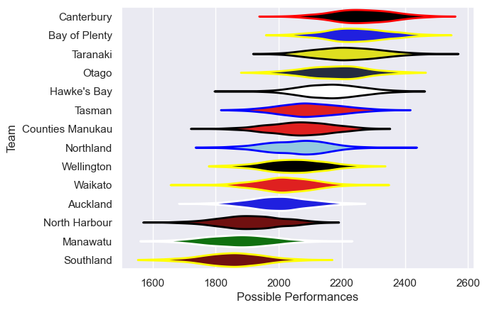

---  
title: "NPC 2025"  
date: 2025-09-22 6:00:00 -0500  
categories: model review projection  
layout: article  
aside:  
    toc: true  
---
# Team Rankings

# Standings

## Current Standings

| Club             |   Played |   Wins |   Point Differential |   Losing Bonus Points |   Try Bonus Points |   Competition Points |
|:-----------------|---------:|-------:|---------------------:|----------------------:|-------------------:|---------------------:|
| Canterbury       |        8 |      7 |                  138 |                     1 |                  5 |                   34 |
| Otago            |        8 |      6 |                   41 |                     2 |                  5 |                   31 |
| Taranaki         |        8 |      5 |                   90 |                     2 |                  6 |                   28 |
| Bay of Plenty    |        8 |      5 |                   99 |                     2 |                  4 |                   26 |
| Hawke's Bay      |        8 |      5 |                   51 |                     1 |                  3 |                   24 |
| Tasman           |        8 |      4 |                   25 |                     2 |                  6 |                   24 |
| Waikato          |        8 |      5 |                  -27 |                     0 |                  4 |                   24 |
| Northland        |        8 |      5 |                   -6 |                     0 |                  3 |                   23 |
| Wellington       |        8 |      3 |                   10 |                     1 |                  6 |                   19 |
| Counties Manukau |        8 |      3 |                  -15 |                     1 |                  5 |                   18 |
| Manawatu         |        8 |      3 |                 -104 |                     1 |                  4 |                   17 |
| Southland        |        8 |      3 |                 -137 |                     1 |                  3 |                   16 |
| Auckland         |        8 |      2 |                  -75 |                     2 |                  4 |                   14 |
| North Harbour    |        8 |      0 |                  -90 |                     3 |                  3 |                    6 |

## Projected Remaining Table

| Club             |   To Play |   Projected Wins |   Projected Differential |   Projected Losing Bonus Points | Projected Try Bonus Points   |   Projected Competition Points |
|:-----------------|----------:|-----------------:|-------------------------:|--------------------------------:|:-----------------------------|-------------------------------:|
| Canterbury       |         2 |            1.323 |                    9.901 |                           0.334 |                              |                          5.796 |
| Hawke's Bay      |         2 |            1.295 |                   10.193 |                           0.352 |                              |                          5.702 |
| Otago            |         2 |            1.283 |                   11.035 |                           0.327 |                              |                          5.633 |
| Bay of Plenty    |         2 |            1.264 |                    9.254 |                           0.356 |                              |                          5.564 |
| Tasman           |         2 |            1.21  |                    6.765 |                           0.36  |                              |                          5.414 |
| Counties Manukau |         2 |            1.007 |                    2.617 |                           0.422 |                              |                          4.638 |
| Taranaki         |         2 |            0.978 |                    1     |                           0.422 |                              |                          4.484 |
| Waikato          |         2 |            0.834 |                   -5.352 |                           0.4   |                              |                          3.886 |
| North Harbour    |         2 |            0.823 |                   -6.411 |                           0.363 |                              |                          3.809 |
| Southland        |         2 |            0.713 |                   -6.303 |                           0.516 |                              |                          3.562 |
| Northland        |         2 |            0.673 |                   -7.319 |                           0.525 |                              |                          3.409 |
| Wellington       |         2 |            0.681 |                   -7.484 |                           0.481 |                              |                          3.379 |
| Auckland         |         2 |            0.666 |                   -8.552 |                           0.484 |                              |                          3.312 |
| Manawatu         |         2 |            0.64  |                   -9.344 |                           0.457 |                              |                          3.211 |

## Projected Total Table

| Club             |   Played |   Wins |   Point Differential |   Losing Bonus Points |   Try Bonus Points |   Competition Points |
|:-----------------|---------:|-------:|---------------------:|----------------------:|-------------------:|---------------------:|
| Canterbury       |       10 |  8.323 |              147.901 |                 1.334 |                  5 |               39.796 |
| Otago            |       10 |  7.283 |               52.035 |                 2.327 |                  5 |               36.633 |
| Taranaki         |       10 |  5.978 |               91     |                 2.422 |                  6 |               32.484 |
| Bay of Plenty    |       10 |  6.264 |              108.254 |                 2.356 |                  4 |               31.564 |
| Hawke's Bay      |       10 |  6.295 |               61.193 |                 1.352 |                  3 |               29.702 |
| Tasman           |       10 |  5.21  |               31.765 |                 2.36  |                  6 |               29.414 |
| Waikato          |       10 |  5.834 |              -32.352 |                 0.4   |                  4 |               27.886 |
| Northland        |       10 |  5.673 |              -13.319 |                 0.525 |                  3 |               26.409 |
| Counties Manukau |       10 |  4.007 |              -12.383 |                 1.422 |                  5 |               22.638 |
| Wellington       |       10 |  3.681 |                2.516 |                 1.481 |                  6 |               22.379 |
| Manawatu         |       10 |  3.64  |             -113.344 |                 1.457 |                  4 |               20.211 |
| Southland        |       10 |  3.713 |             -143.303 |                 1.516 |                  3 |               19.562 |
| Auckland         |       10 |  2.666 |              -83.552 |                 2.484 |                  4 |               17.312 |
| North Harbour    |       10 |  0.823 |              -96.411 |                 3.363 |                  3 |                9.809 |

# Completed Match Review

| Model | Percent Correct Predictions | Spread Error |
| ------ | ------ | ------ |
| Club Level | 60.0% | 15.4 |
| Player Level: Lineup | nan% | nan |
| Player Level: Minutes | nan% | nan |

# Future Predictions

## Week 9

### Hawke's Bay V Auckland on 2025/09/25

Average Margin: Hawke's Bay by 6.9

### Otago V North Harbour on 2025/09/26

Average Margin: Otago by 9.3

### Taranaki V Wellington on 2025/09/26

Average Margin: Taranaki by 5.8

### Southland V Tasman on 2025/09/26

Average Margin: Tasman by 3.4

### Counties Manukau V Manawatu on 2025/09/27

Average Margin: Counties Manukau by 6.0

### Bay of Plenty V Waikato on 2025/09/27

Average Margin: Bay of Plenty by 7.6

### Northland V Canterbury on 2025/09/27

Average Margin: Canterbury by 5.1

## Week 10

### Waikato V Northland on 2025/10/03

Average Margin: Waikato by 2.2

### North Harbour V Southland on 2025/10/03

Average Margin: North Harbour by 2.9

### Wellington V Bay of Plenty on 2025/10/03

Average Margin: Bay of Plenty by 1.7

### Auckland V Otago on 2025/10/03

Average Margin: Otago by 1.7

### Manawatu V Hawke's Bay on 2025/10/04

Average Margin: Hawke's Bay by 3.3

### Canterbury V Taranaki on 2025/10/04

Average Margin: Canterbury by 4.8

### Tasman V Counties Manukau on 2025/10/04

Average Margin: Tasman by 3.4

