# Team Rankings

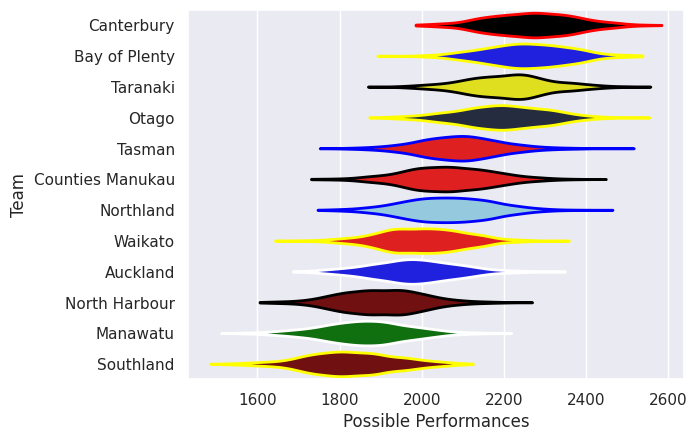
# Standings

## Projected Remaining Table

| Club             |   To Play |   Projected Wins |   Projected Differential |   Projected Losing Bonus Points | Projected Try Bonus Points   |   Projected Competition Points |
|:-----------------|----------:|-----------------:|-------------------------:|--------------------------------:|:-----------------------------|-------------------------------:|
| Canterbury       |         1 |            0.972 |                   21.765 |                           0.02  |                              |                          3.916 |
| Otago            |         1 |            0.913 |                   16.647 |                           0.048 |                              |                          3.732 |
| Northland        |         1 |            0.865 |                   14.362 |                           0.076 |                              |                          3.576 |
| Tasman           |         1 |            0.851 |                   12.835 |                           0.088 |                              |                          3.522 |
| Bay of Plenty    |         1 |            0.682 |                    5.742 |                           0.164 |                              |                          2.956 |
| Counties Manukau |         1 |            0.552 |                    1.939 |                           0.205 |                              |                          2.505 |
| Taranaki         |         1 |            0.402 |                   -1.939 |                           0.235 |                              |                          1.935 |
| Waikato          |         1 |            0.286 |                   -5.742 |                           0.241 |                              |                          1.449 |
| North Harbour    |         1 |            0.134 |                  -12.835 |                           0.185 |                              |                          0.751 |
| Manawatu         |         1 |            0.115 |                  -14.362 |                           0.152 |                              |                          0.652 |
| Southland        |         1 |            0.071 |                  -16.647 |                           0.132 |                              |                          0.448 |
| Auckland         |         1 |            0.024 |                  -21.765 |                           0.074 |                              |                          0.178 |

## Projected Total Table

| Club             |   Played |   Wins |   Point Differential |   Losing Bonus Points | Try Bonus Points   |   Competition Points |
|:-----------------|---------:|-------:|---------------------:|----------------------:|:-------------------|---------------------:|
| Canterbury       |        1 |  0.972 |               21.765 |                 0.02  |                    |                3.916 |
| Otago            |        1 |  0.913 |               16.647 |                 0.048 |                    |                3.732 |
| Northland        |        1 |  0.865 |               14.362 |                 0.076 |                    |                3.576 |
| Tasman           |        1 |  0.851 |               12.835 |                 0.088 |                    |                3.522 |
| Bay of Plenty    |        1 |  0.682 |                5.742 |                 0.164 |                    |                2.956 |
| Counties Manukau |        1 |  0.552 |                1.939 |                 0.205 |                    |                2.505 |
| Taranaki         |        1 |  0.402 |               -1.939 |                 0.235 |                    |                1.935 |
| Waikato          |        1 |  0.286 |               -5.742 |                 0.241 |                    |                1.449 |
| North Harbour    |        1 |  0.134 |              -12.835 |                 0.185 |                    |                0.751 |
| Manawatu         |        1 |  0.115 |              -14.362 |                 0.152 |                    |                0.652 |
| Southland        |        1 |  0.071 |              -16.647 |                 0.132 |                    |                0.448 |
| Auckland         |        1 |  0.024 |              -21.765 |                 0.074 |                    |                0.178 |

# Future Predictions

## Week 1

### Waikato V Bay of Plenty on 2026/07/30

Average Margin: Bay of Plenty by 5.7

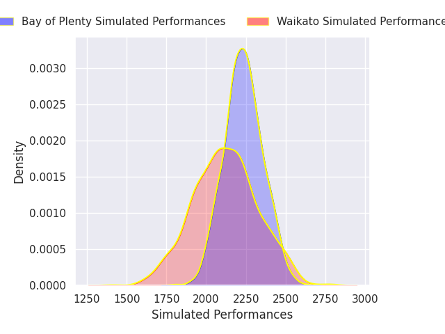
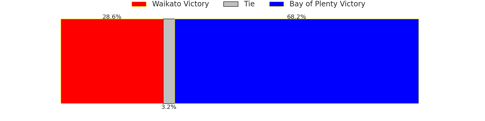
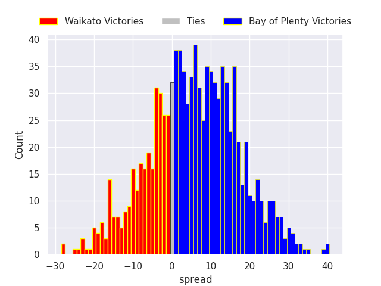

### Tasman V North Harbour on 2026/07/31

Average Margin: Tasman by 12.8

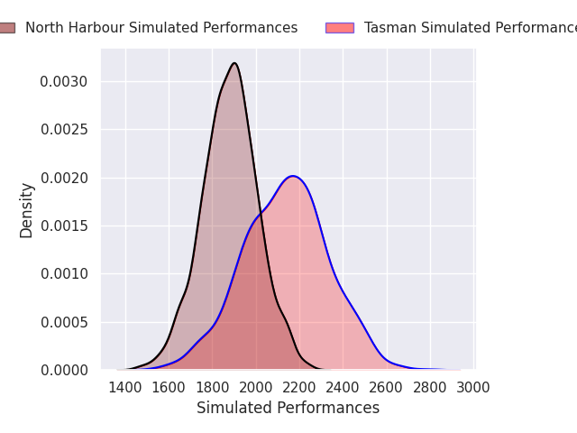
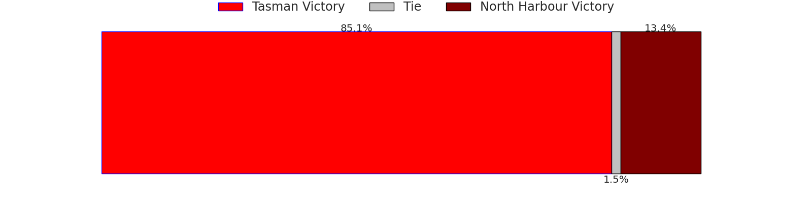
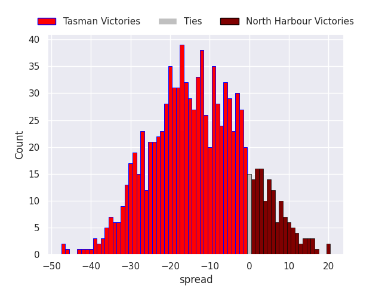

### Counties Manukau V Taranaki on 2026/07/31

Average Margin: Counties Manukau by 1.9

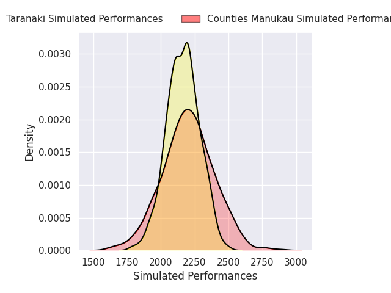
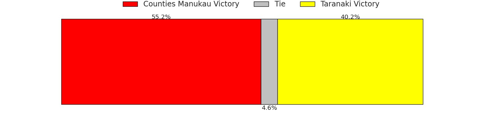
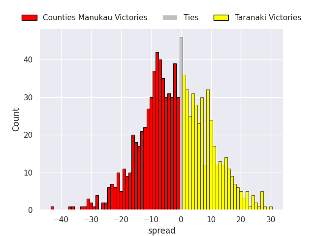

### Southland V Otago on 2026/08/01

Average Margin: Otago by 16.6

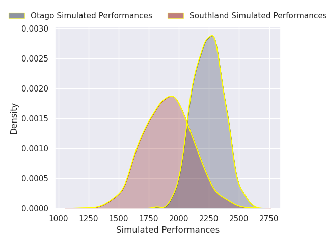
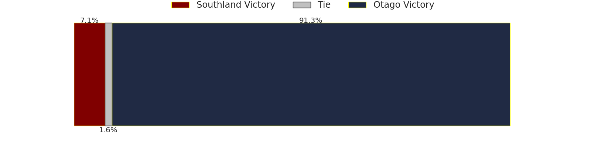
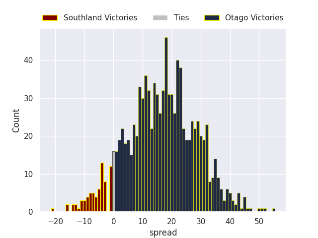

### Canterbury V Auckland on 2026/08/01

Average Margin: Canterbury by 21.8

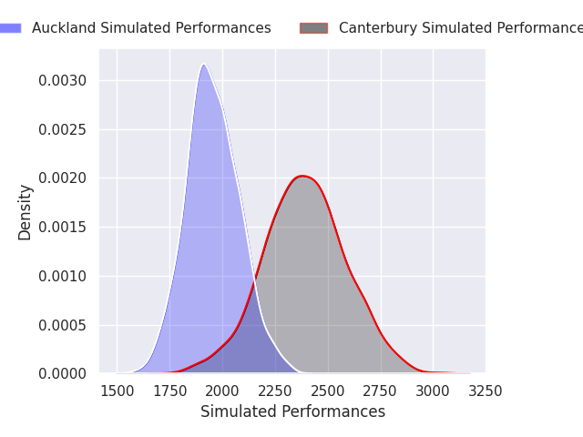
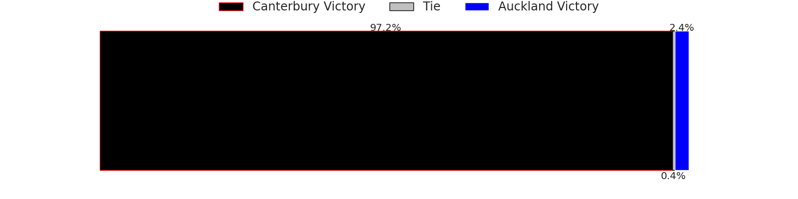
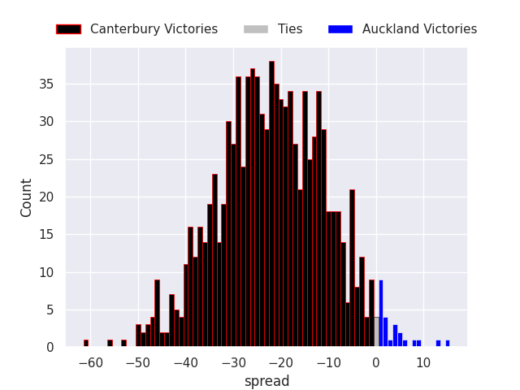

### Northland V Manawatu on 2026/08/01

Average Margin: Northland by 14.4

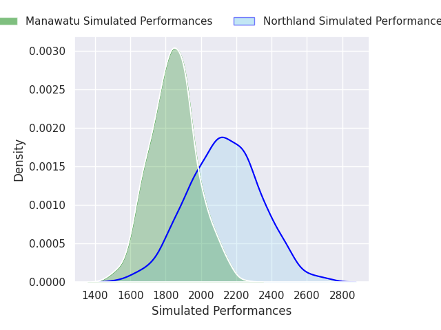
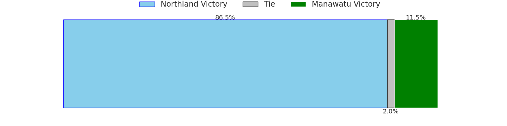
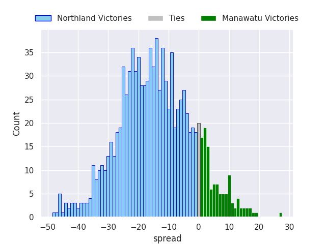

