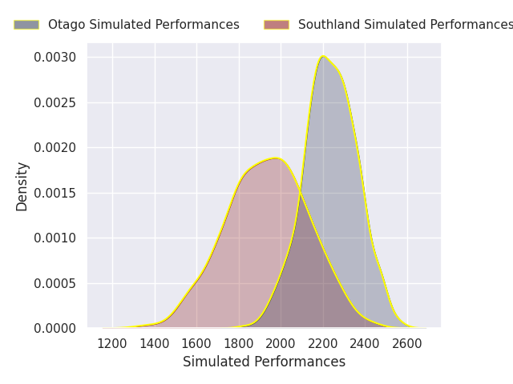
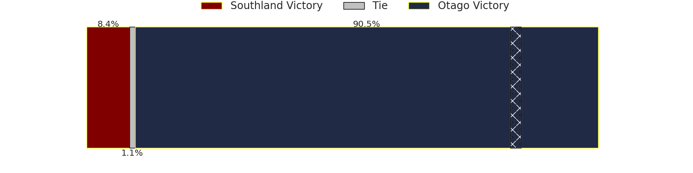
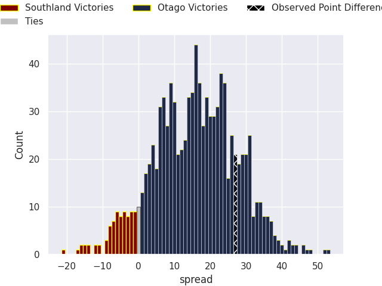
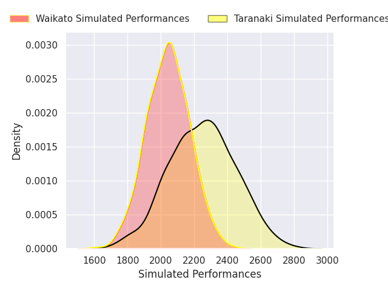
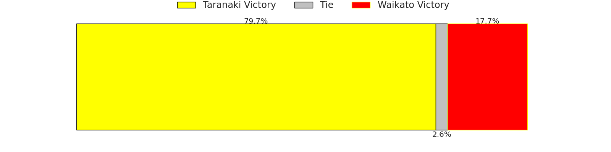
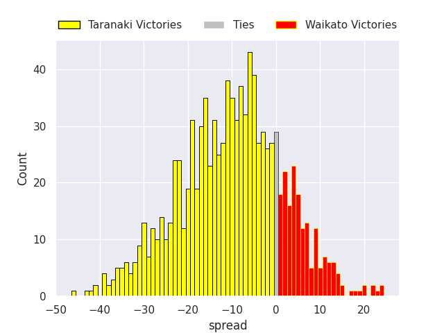
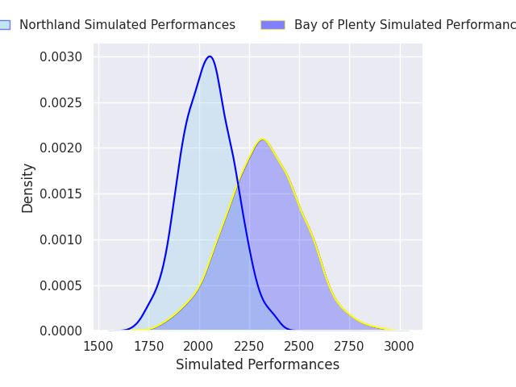
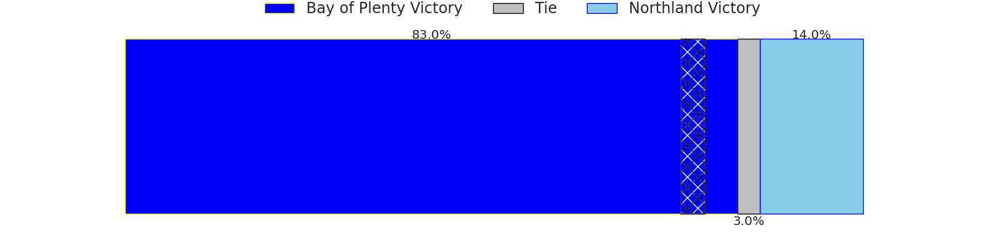
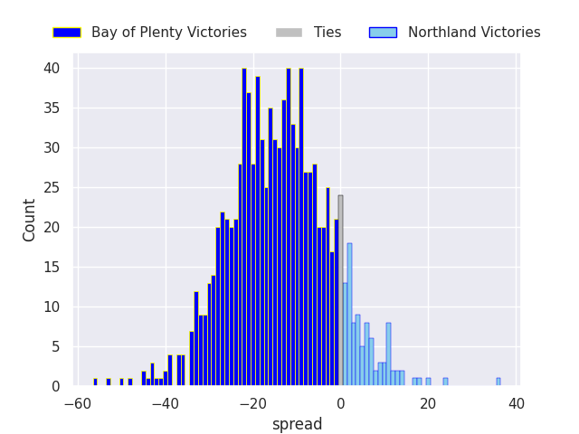

# Team Rankings

# Standings

## Projected Remaining Table

| Club             |   To Play |   Projected Wins |   Projected Differential |   Projected Losing Bonus Points | Projected Try Bonus Points   |   Projected Competition Points |
|:-----------------|----------:|-----------------:|-------------------------:|--------------------------------:|:-----------------------------|-------------------------------:|
| Canterbury       |         8 |            6.441 |                   96.334 |                           0.813 |                              |                         26.851 |
| Hawke's Bay      |         8 |            5.915 |                   76.279 |                           0.962 |                              |                         24.966 |
| Bay of Plenty    |         8 |            5.58  |                   57.039 |                           1.171 |                              |                         23.913 |
| Otago            |         7 |            5.568 |                   80.899 |                           0.76  |                              |                         23.31  |
| Counties Manukau |         7 |            3.801 |                   14.106 |                           1.428 |                              |                         17.114 |
| Northland        |         8 |            3.65  |                  -11.061 |                           1.415 |                              |                         16.449 |
| Taranaki         |         7 |            3.611 |                   12.935 |                           1.288 |                              |                         16.132 |
| Tasman           |         7 |            3.425 |                    2.394 |                           1.245 |                              |                         15.279 |
| Waikato          |         7 |            2.986 |                  -13.58  |                           1.318 |                              |                         13.618 |
| Wellington       |         7 |            2.961 |                  -18.461 |                           1.252 |                              |                         13.518 |
| Auckland         |         8 |            2.457 |                  -54.234 |                           1.475 |                              |                         11.691 |
| Manawatu         |         8 |            1.739 |                  -87.057 |                           1.286 |                              |                          8.494 |
| North Harbour    |         7 |            1.567 |                  -67.598 |                           1.276 |                              |                          7.896 |
| Southland        |         7 |            1.051 |                  -87.995 |                           1.146 |                              |                          5.604 |

## Projected Total Table

| Club             |   Played |   Wins |   Point Differential |   Losing Bonus Points | Try Bonus Points   |   Competition Points |
|:-----------------|---------:|-------:|---------------------:|----------------------:|:-------------------|---------------------:|
| Canterbury       |        8 |  6.441 |               96.334 |                 0.813 |                    |               26.851 |
| Hawke's Bay      |        8 |  5.915 |               76.279 |                 0.962 |                    |               24.966 |
| Bay of Plenty    |        8 |  5.58  |               57.039 |                 1.171 |                    |               23.913 |
| Otago            |        7 |  5.568 |               80.899 |                 0.76  |                    |               23.31  |
| Counties Manukau |        7 |  3.801 |               14.106 |                 1.428 |                    |               17.114 |
| Northland        |        8 |  3.65  |              -11.061 |                 1.415 |                    |               16.449 |
| Taranaki         |        7 |  3.611 |               12.935 |                 1.288 |                    |               16.132 |
| Tasman           |        7 |  3.425 |                2.394 |                 1.245 |                    |               15.279 |
| Waikato          |        7 |  2.986 |              -13.58  |                 1.318 |                    |               13.618 |
| Wellington       |        7 |  2.961 |              -18.461 |                 1.252 |                    |               13.518 |
| Auckland         |        8 |  2.457 |              -54.234 |                 1.475 |                    |               11.691 |
| Manawatu         |        8 |  1.739 |              -87.057 |                 1.286 |                    |                8.494 |
| North Harbour    |        7 |  1.567 |              -67.598 |                 1.276 |                    |                7.896 |
| Southland        |        7 |  1.051 |              -87.995 |                 1.146 |                    |                5.604 |

# Future Predictions

## Week 1

### Waikato V Bay of Plenty on 2026/07/30

Average Margin: Bay of Plenty by 5.7

### Tasman V North Harbour on 2026/07/31

Average Margin: Tasman by 12.4

### Counties Manukau V Taranaki on 2026/07/31

Average Margin: Counties Manukau by 1.8

### Canterbury V Auckland on 2026/08/01

Average Margin: Canterbury by 21.6

### Northland V Manawatu on 2026/08/01

Average Margin: Northland by 14.5

### Southland V Otago on 2026/08/01

Average Margin: Otago by 16.3

### Wellington V Hawke's Bay on 2026/08/02

Average Margin: Hawke's Bay by 4.4

## Week 2

### North Harbour V Counties Manukau on 2026/08/06

Average Margin: Counties Manukau by 8.2

### Taranaki V Waikato on 2026/08/07

Average Margin: Taranaki by 10.4

### Auckland V Wellington on 2026/08/07

Average Margin: Wellington by 0.9

### Hawke's Bay V Tasman on 2026/08/08

Average Margin: Hawke's Bay by 11.7

### Bay of Plenty V Northland on 2026/08/08

Average Margin: Bay of Plenty by 14.2

### Otago V Canterbury on 2026/08/08

Average Margin: Otago by 1.2

### Manawatu V Southland on 2026/08/09

Average Margin: Manawatu by 4.0

## Week 3

### Wellington V North Harbour on 2026/08/13

Average Margin: Wellington by 11.8

### Northland V Taranaki on 2026/08/14

Average Margin: Taranaki by 1.3

### Canterbury V Bay of Plenty on 2026/08/14

Average Margin: Canterbury by 7.8

### Manawatu V Otago on 2026/08/15

Average Margin: Otago by 16.1

### Southland V Waikato on 2026/08/15

Average Margin: Waikato by 6.9

### Auckland V Hawke's Bay on 2026/08/15

Average Margin: Hawke's Bay by 8.7

### Counties Manukau V Tasman on 2026/08/16

Average Margin: Counties Manukau by 8.4

## Week 4

### Canterbury V Northland on 2026/08/20

Average Margin: Canterbury by 16.7

### Hawke's Bay V Manawatu on 2026/08/21

Average Margin: Hawke's Bay by 22.5

### Tasman V Southland on 2026/08/21

Average Margin: Tasman by 14.3

### Bay of Plenty V Taranaki on 2026/08/22

Average Margin: Bay of Plenty by 8.8

### Waikato V Counties Manukau on 2026/08/22

Average Margin: Waikato by 0.7

### North Harbour V Auckland on 2026/08/22

Average Margin: Auckland by 0.1

### Otago V Wellington on 2026/08/23

Average Margin: Otago by 15.2

## Week 5

### Southland V Hawke's Bay on 2026/08/27

Average Margin: Hawke's Bay by 13.6

### Taranaki V Canterbury on 2026/08/28

Average Margin: Canterbury by 2.8

### Auckland V Bay of Plenty on 2026/08/28

Average Margin: Bay of Plenty by 10.2

### Manawatu V North Harbour on 2026/08/29

Average Margin: Manawatu by 1.6

### Otago V Waikato on 2026/08/29

Average Margin: Otago by 14.8

### Wellington V Counties Manukau on 2026/08/29

Average Margin: Wellington by 0.8

### Northland V Tasman on 2026/08/30

Average Margin: Northland by 5.2

## Week 6

### Northland V Waikato on 2026/09/12

Average Margin: Northland by 4.0

### Hawke's Bay V North Harbour on 2026/09/12

Average Margin: Hawke's Bay by 17.8

### Canterbury V Wellington on 2026/09/12

Average Margin: Canterbury by 16.4

### Southland V Bay of Plenty on 2026/09/13

Average Margin: Bay of Plenty by 14.2

## Week 7

### Counties Manukau V Otago on 2026/09/17

Average Margin: Otago by 1.3

### Tasman V Auckland on 2026/09/18

Average Margin: Tasman by 6.1

### Bay of Plenty V Hawke's Bay on 2026/09/18

Average Margin: Bay of Plenty by 6.6

### Waikato V Manawatu on 2026/09/19

Average Margin: Waikato by 13.6

### Wellington V Northland on 2026/09/19

Average Margin: Wellington by 4.0

### North Harbour V Canterbury on 2026/09/19

Average Margin: Canterbury by 15.7

### Taranaki V Southland on 2026/09/20

Average Margin: Taranaki by 18.6

## Week 8

### Tasman V Bay of Plenty on 2026/09/24

Average Margin: Bay of Plenty by 5.2

### Northland V Counties Manukau on 2026/09/25

Average Margin: Northland by 1.4

### Auckland V Manawatu on 2026/09/25

Average Margin: Auckland by 9.3

### Hawke's Bay V Taranaki on 2026/09/27

Average Margin: Hawke's Bay by 4.0

## Week 9

### Otago V Auckland on 2026/10/01

Average Margin: Otago by 16.1

### Manawatu V Canterbury on 2026/10/02

Average Margin: Canterbury by 16.6

