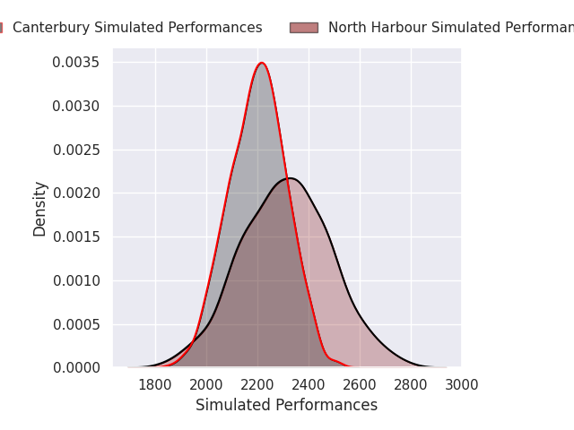
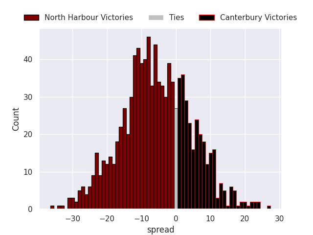

# Team Rankings

# Standings

## Current Standings

| Club             |   Played |   Wins |   Point Differential |   Losing Bonus Points |   Try Bonus Points |   Competition Points |
|:-----------------|---------:|-------:|---------------------:|----------------------:|-------------------:|---------------------:|
| Hawke's Bay      |        7 |      6 |                  124 |                     1 |                  7 |                   32 |
| North Harbour    |        7 |      5 |                  105 |                     2 |                  7 |                   29 |
| Northland        |        7 |      5 |                  101 |                     1 |                  6 |                   27 |
| Otago            |        7 |      5 |                   82 |                     1 |                  6 |                   27 |
| Canterbury       |        7 |      5 |                   47 |                     0 |                  5 |                   25 |
| Tasman           |        7 |      4 |                   -5 |                     0 |                  5 |                   21 |
| Manawatu         |        7 |      4 |                  -47 |                     1 |                  3 |                   20 |
| Waikato          |        7 |      3 |                    6 |                     2 |                  5 |                   19 |
| Taranaki         |        7 |      3 |                   -9 |                     3 |                  4 |                   19 |
| Bay of Plenty    |        7 |      3 |                  -55 |                     1 |                  4 |                   17 |
| Auckland         |        7 |      2 |                  -34 |                     2 |                  4 |                   14 |
| Southland        |        7 |      2 |                  -63 |                     1 |                  4 |                   13 |
| Counties Manukau |        7 |      2 |                  -79 |                     0 |                  4 |                   12 |
| Wellington       |        7 |      0 |                 -173 |                     1 |                  4 |                    5 |

## Projected Remaining Table

| Club             |   To Play |   Projected Wins |   Projected Differential |   Projected Losing Bonus Points | Projected Try Bonus Points   |   Projected Competition Points |
|:-----------------|----------:|-----------------:|-------------------------:|--------------------------------:|:-----------------------------|-------------------------------:|
| Northland        |         3 |            2.786 |                   52.936 |                           0.144 |                              |                         11.348 |
| Waikato          |         3 |            2.384 |                   27.806 |                           0.38  |                              |                         10.056 |
| Hawke's Bay      |         3 |            2.354 |                   26.476 |                           0.376 |                              |                          9.948 |
| North Harbour    |         3 |            2.105 |                   18.013 |                           0.514 |                              |                          9.122 |
| Otago            |         3 |            2.011 |                   19.644 |                           0.422 |                              |                          8.606 |
| Taranaki         |         3 |            2.007 |                   22.763 |                           0.335 |                              |                          8.471 |
| Canterbury       |         3 |            1.831 |                   15.343 |                           0.514 |                              |                          7.988 |
| Tasman           |         3 |            1.682 |                    6.068 |                           0.584 |                              |                          7.508 |
| Manawatu         |         3 |            0.974 |                  -13.958 |                           0.73  |                              |                          4.822 |
| Auckland         |         3 |            0.863 |                  -20.536 |                           0.636 |                              |                          4.252 |
| Bay of Plenty    |         3 |            0.684 |                  -21.501 |                           0.756 |                              |                          3.684 |
| Counties Manukau |         3 |            0.383 |                  -38.859 |                           0.57  |                              |                          2.214 |
| Southland        |         3 |            0.288 |                  -42.273 |                           0.488 |                              |                          1.726 |
| Wellington       |         3 |            0.164 |                  -51.922 |                           0.385 |                              |                          1.089 |

## Projected Total Table

| Club             |   Played |   Wins |   Point Differential |   Losing Bonus Points |   Try Bonus Points |   Competition Points |
|:-----------------|---------:|-------:|---------------------:|----------------------:|-------------------:|---------------------:|
| Hawke's Bay      |       10 |  8.354 |              150.476 |                 1.376 |                  7 |               41.948 |
| Northland        |       10 |  7.786 |              153.936 |                 1.144 |                  6 |               38.348 |
| North Harbour    |       10 |  7.105 |              123.013 |                 2.514 |                  7 |               38.122 |
| Otago            |       10 |  7.011 |              101.644 |                 1.422 |                  6 |               35.606 |
| Canterbury       |       10 |  6.831 |               62.343 |                 0.514 |                  5 |               32.988 |
| Waikato          |       10 |  5.384 |               33.806 |                 2.38  |                  5 |               29.056 |
| Tasman           |       10 |  5.682 |                1.068 |                 0.584 |                  5 |               28.508 |
| Taranaki         |       10 |  5.007 |               13.763 |                 3.335 |                  4 |               27.471 |
| Manawatu         |       10 |  4.974 |              -60.958 |                 1.73  |                  3 |               24.822 |
| Bay of Plenty    |       10 |  3.684 |              -76.501 |                 1.756 |                  4 |               20.684 |
| Auckland         |       10 |  2.863 |              -54.536 |                 2.636 |                  4 |               18.252 |
| Southland        |       10 |  2.288 |             -105.273 |                 1.488 |                  4 |               14.726 |
| Counties Manukau |       10 |  2.383 |             -117.859 |                 0.57  |                  4 |               14.214 |
| Wellington       |       10 |  0.164 |             -224.922 |                 1.385 |                  4 |                6.089 |

# Completed Match Review

| Model | Percent Correct Predictions | Spread Error |
| ------ | ------ | ------ |
| Club Level | 65.7% | 13.8 |
| Player Level: Lineup | nan% | nan |
| Player Level: Minutes | nan% | nan |

# Future Predictions

## Week 8

### Counties Manukau V Otago on 2026/09/17

Average Margin: Otago by 9.0

### Tasman V Auckland on 2026/09/18

Average Margin: Tasman by 6.5

### Wellington V Northland on 2026/09/19

Average Margin: Northland by 20.3

### Bay of Plenty V Hawke's Bay on 2026/09/19

Average Margin: Hawke's Bay by 7.4

### Waikato V Manawatu on 2026/09/19

Average Margin: Waikato by 8.3

### Taranaki V Southland on 2026/09/20

Average Margin: Taranaki by 13.1

### North Harbour V Canterbury on 2026/09/20

Average Margin: North Harbour by 5.6

## Week 9

### Tasman V Bay of Plenty on 2026/09/24

Average Margin: Tasman by 6.8

### Northland V Counties Manukau on 2026/09/25

Average Margin: Northland by 20.5

### Auckland V Manawatu on 2026/09/25

Average Margin: Auckland by 1.8

### Canterbury V Southland on 2026/09/26

Average Margin: Canterbury by 17.0

### North Harbour V Otago on 2026/09/26

Average Margin: North Harbour by 5.2

### Wellington V Waikato on 2026/09/26

Average Margin: Waikato by 12.3

### Hawke's Bay V Taranaki on 2026/09/27

Average Margin: Hawke's Bay by 9.7

## Week 10

### Otago V Auckland on 2026/10/01

Average Margin: Otago by 15.8

### Manawatu V Canterbury on 2026/10/02

Average Margin: Canterbury by 3.9

### Southland V Northland on 2026/10/02

Average Margin: Northland by 12.2

### Taranaki V Wellington on 2026/10/03

Average Margin: Taranaki by 19.3

### Counties Manukau V Hawke's Bay on 2026/10/03

Average Margin: Hawke's Bay by 9.4

### Waikato V Tasman on 2026/10/03

Average Margin: Waikato by 7.2

### Bay of Plenty V North Harbour on 2026/10/04

Average Margin: North Harbour by 7.2

