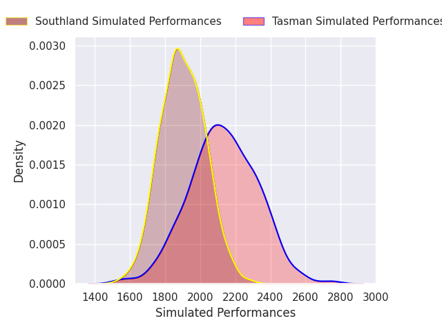
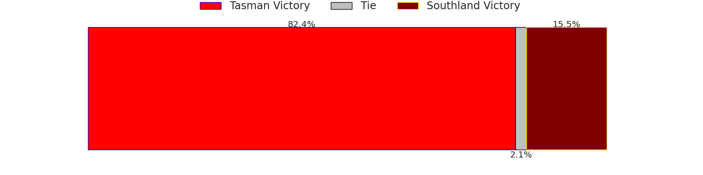
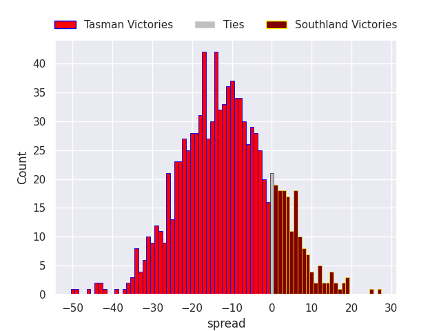
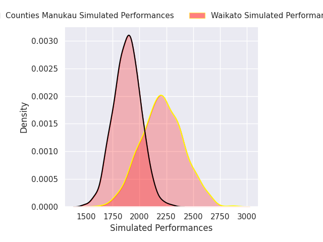
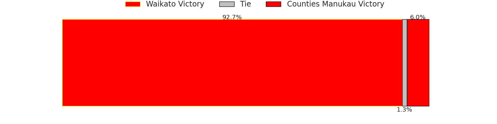
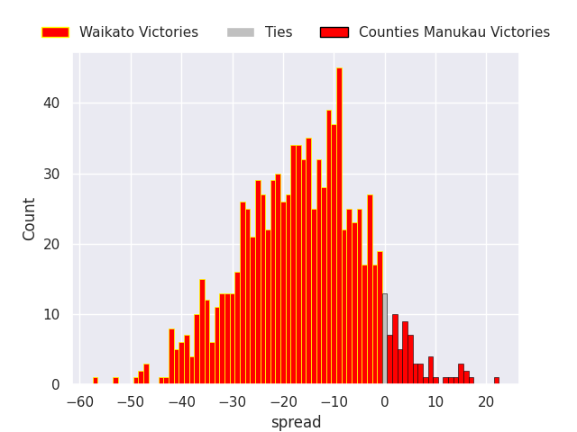

# Team Rankings

# Standings

## Current Standings

| Club             |   Played |   Wins |   Point Differential |   Losing Bonus Points |   Try Bonus Points |   Competition Points |
|:-----------------|---------:|-------:|---------------------:|----------------------:|-------------------:|---------------------:|
| Northland        |        4 |      3 |                   89 |                     1 |                  4 |                   17 |
| Hawke's Bay      |        3 |      3 |                   63 |                     0 |                  3 |                   15 |
| Canterbury       |        4 |      3 |                   -8 |                     0 |                  2 |                   14 |
| North Harbour    |        3 |      2 |                   78 |                     1 |                  3 |                   12 |
| Waikato          |        3 |      2 |                   17 |                     1 |                  3 |                   12 |
| Otago            |        3 |      2 |                   25 |                     1 |                  2 |                   11 |
| Tasman           |        3 |      2 |                  -14 |                     0 |                  2 |                   10 |
| Bay of Plenty    |        3 |      1 |                  -14 |                     1 |                  3 |                    8 |
| Auckland         |        3 |      1 |                  -17 |                     1 |                  3 |                    8 |
| Southland        |        3 |      1 |                  -27 |                     1 |                  2 |                    7 |
| Manawatu         |        3 |      1 |                  -27 |                     1 |                  1 |                    6 |
| Taranaki         |        3 |      1 |                  -33 |                     1 |                  1 |                    6 |
| Wellington       |        3 |      0 |                  -62 |                     1 |                  2 |                    3 |
| Counties Manukau |        3 |      0 |                  -70 |                     0 |                  1 |                    1 |

## Projected Remaining Table

| Club             |   To Play |   Projected Wins |   Projected Differential |   Projected Losing Bonus Points | Projected Try Bonus Points   |   Projected Competition Points |
|:-----------------|----------:|-----------------:|-------------------------:|--------------------------------:|:-----------------------------|-------------------------------:|
| Hawke's Bay      |         7 |            5.678 |                   85.136 |                           0.689 |                              |                         23.659 |
| Northland        |         6 |            5.216 |                   89.626 |                           0.454 |                              |                         21.472 |
| Otago            |         7 |            4.836 |                   51.62  |                           0.936 |                              |                         20.65  |
| Bay of Plenty    |         7 |            4.722 |                   44.662 |                           1.139 |                              |                         20.437 |
| Waikato          |         7 |            4.279 |                   33.104 |                           1.011 |                              |                         18.501 |
| Taranaki         |         7 |            4.01  |                   19.243 |                           1.098 |                              |                         17.462 |
| Canterbury       |         6 |            3.754 |                   31.171 |                           0.956 |                              |                         16.3   |
| North Harbour    |         7 |            3.321 |                   -2.147 |                           1.42  |                              |                         15.08  |
| Tasman           |         7 |            3.315 |                   -3.199 |                           1.157 |                              |                         14.823 |
| Auckland         |         7 |            2.736 |                  -20.918 |                           1.312 |                              |                         12.682 |
| Counties Manukau |         7 |            1.569 |                  -70.379 |                           1.28  |                              |                          7.878 |
| Southland        |         7 |            1.184 |                  -78.386 |                           1.329 |                              |                          6.365 |
| Wellington       |         7 |            1.173 |                  -88.599 |                           1.118 |                              |                          6.052 |
| Manawatu         |         7 |            1.068 |                  -90.934 |                           1.231 |                              |                          5.769 |

## Projected Total Table

| Club             |   Played |   Wins |   Point Differential |   Losing Bonus Points |   Try Bonus Points |   Competition Points |
|:-----------------|---------:|-------:|---------------------:|----------------------:|-------------------:|---------------------:|
| Hawke's Bay      |       10 |  8.678 |              148.136 |                 0.689 |                  3 |               38.659 |
| Northland        |       10 |  8.216 |              178.626 |                 1.454 |                  4 |               38.472 |
| Otago            |       10 |  6.836 |               76.62  |                 1.936 |                  2 |               31.65  |
| Waikato          |       10 |  6.279 |               50.104 |                 2.011 |                  3 |               30.501 |
| Canterbury       |       10 |  6.754 |               23.171 |                 0.956 |                  2 |               30.3   |
| Bay of Plenty    |       10 |  5.722 |               30.662 |                 2.139 |                  3 |               28.437 |
| North Harbour    |       10 |  5.321 |               75.853 |                 2.42  |                  3 |               27.08  |
| Tasman           |       10 |  5.315 |              -17.199 |                 1.157 |                  2 |               24.823 |
| Taranaki         |       10 |  5.01  |              -13.757 |                 2.098 |                  1 |               23.462 |
| Auckland         |       10 |  3.736 |              -37.918 |                 2.312 |                  3 |               20.682 |
| Southland        |       10 |  2.184 |             -105.386 |                 2.329 |                  2 |               13.365 |
| Manawatu         |       10 |  2.068 |             -117.934 |                 2.231 |                  1 |               11.769 |
| Wellington       |       10 |  1.173 |             -150.599 |                 2.118 |                  2 |                9.052 |
| Counties Manukau |       10 |  1.569 |             -140.379 |                 1.28  |                  1 |                8.878 |

# Completed Match Review

| Model | Percent Correct Predictions | Spread Error |
| ------ | ------ | ------ |
| Club Level | 72.9% | 11.3 |
| Player Level: Lineup | nan% | nan |
| Player Level: Minutes | nan% | nan |

# Future Predictions

## Week 5

### Hawke's Bay V Manawatu on 2026/08/21

Average Margin: Hawke's Bay by 23.8

### Tasman V Southland on 2026/08/22

Average Margin: Tasman by 11.5

### Bay of Plenty V Taranaki on 2026/08/22

Average Margin: Bay of Plenty by 8.4

### North Harbour V Auckland on 2026/08/22

Average Margin: North Harbour by 9.6

### Waikato V Counties Manukau on 2026/08/23

Average Margin: Waikato by 16.4

### Otago V Wellington on 2026/08/23

Average Margin: Otago by 20.3

## Week 6

### Southland V Hawke's Bay on 2026/08/27

Average Margin: Hawke's Bay by 15.6

### Auckland V Bay of Plenty on 2026/08/28

Average Margin: Bay of Plenty by 4.3

### Taranaki V Canterbury on 2026/08/28

Average Margin: Taranaki by 0.8

### Wellington V Counties Manukau on 2026/08/29

Average Margin: Wellington by 2.0

### Otago V Waikato on 2026/08/29

Average Margin: Otago by 7.5

### Manawatu V North Harbour on 2026/08/29

Average Margin: North Harbour by 8.4

### Northland V Tasman on 2026/08/30

Average Margin: Northland by 16.6

## Week 7

### Taranaki V Auckland on 2026/09/03

Average Margin: Taranaki by 7.7

### Hawke's Bay V Otago on 2026/09/04

Average Margin: Hawke's Bay by 7.6

### Bay of Plenty V Manawatu on 2026/09/04

Average Margin: Bay of Plenty by 18.4

### Tasman V Wellington on 2026/09/05

Average Margin: Tasman by 13.1

### Counties Manukau V Southland on 2026/09/05

Average Margin: Counties Manukau by 3.5

### Waikato V Canterbury on 2026/09/05

Average Margin: Waikato by 3.7

### North Harbour V Northland on 2026/09/06

Average Margin: Northland by 4.8

## Week 8

### Manawatu V Taranaki on 2026/09/10

Average Margin: Taranaki by 6.4

### Auckland V Counties Manukau on 2026/09/11

Average Margin: Auckland by 9.7

### Otago V Tasman on 2026/09/11

Average Margin: Otago by 9.8

### Canterbury V Wellington on 2026/09/12

Average Margin: Canterbury by 16.3

### Northland V Waikato on 2026/09/12

Average Margin: Northland by 12.8

### Hawke's Bay V North Harbour on 2026/09/12

Average Margin: Hawke's Bay by 11.8

### Southland V Bay of Plenty on 2026/09/13

Average Margin: Bay of Plenty by 7.6

## Week 9

### Counties Manukau V Otago on 2026/09/17

Average Margin: Otago by 9.1

### Tasman V Auckland on 2026/09/18

Average Margin: Tasman by 6.6

### Bay of Plenty V Hawke's Bay on 2026/09/18

Average Margin: Hawke's Bay by 0.8

### North Harbour V Canterbury on 2026/09/19

Average Margin: North Harbour by 2.0

### Wellington V Northland on 2026/09/19

Average Margin: Northland by 18.2

### Waikato V Manawatu on 2026/09/19

Average Margin: Waikato by 16.7

### Taranaki V Southland on 2026/09/20

Average Margin: Taranaki by 12.8

## Week 10

### Tasman V Bay of Plenty on 2026/09/24

Average Margin: Bay of Plenty by 1.2

### Northland V Counties Manukau on 2026/09/25

Average Margin: Northland by 23.9

### Auckland V Manawatu on 2026/09/25

Average Margin: Auckland by 10.1

### Wellington V Waikato on 2026/09/26

Average Margin: Waikato by 9.8

### Canterbury V Southland on 2026/09/26

Average Margin: Canterbury by 14.2

### North Harbour V Otago on 2026/09/26

Average Margin: North Harbour by 0.2

### Hawke's Bay V Taranaki on 2026/09/27

Average Margin: Hawke's Bay by 12.9

## Week 11

### Otago V Auckland on 2026/10/01

Average Margin: Otago by 12.6

### Manawatu V Canterbury on 2026/10/02

Average Margin: Canterbury by 7.1

### Southland V Northland on 2026/10/02

Average Margin: Northland by 13.2

### Counties Manukau V Hawke's Bay on 2026/10/03

Average Margin: Hawke's Bay by 12.7

### Waikato V Tasman on 2026/10/03

Average Margin: Waikato by 6.8

### Taranaki V Wellington on 2026/10/03

Average Margin: Taranaki by 13.0

### Bay of Plenty V North Harbour on 2026/10/04

Average Margin: Bay of Plenty by 5.6

