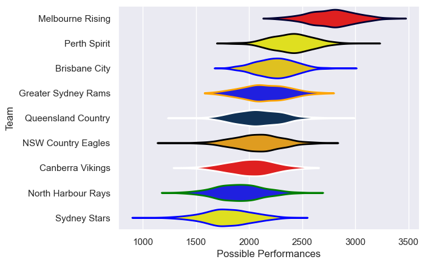

---  
title: "National Rugby Championship 2014"  
date: 2025-07-29 6:00:00 -0500  
categories: model review projection  
layout: article  
aside:  
    toc: true  
---
# Current Team Rankings

# Standings

## Current Standings

| Club                |   Played |   Wins |   Point Differential |   Losing Bonus Points |   Try Bonus Points |   Competition Points |
|:--------------------|---------:|-------:|---------------------:|----------------------:|-------------------:|---------------------:|
| Brisbane City       |       10 |      8 |                   55 |                     0 |                  5 |                   37 |
| Melbourne Rising    |        9 |      8 |                  199 |                     0 |                  4 |                   36 |
| NSW Country Eagles  |       10 |      7 |                   45 |                     1 |                  3 |                   32 |
| Perth Spirit        |       10 |      4 |                   47 |                     3 |                  2 |                   21 |
| Canberra Vikings    |        8 |      2 |                  -28 |                     2 |                  2 |                   16 |
| North Harbour Rays  |        8 |      2 |                  -87 |                     0 |                  3 |                   15 |
| Greater Sydney Rams |        8 |      3 |                  -11 |                     0 |                    |                   14 |
| Queensland Country  |        8 |      2 |                  -73 |                     2 |                  1 |                   11 |
| Sydney Stars        |        9 |      1 |                 -147 |                     2 |                  3 |                   11 |

# Completed Match Review

| Model | Percent Correct Predictions | Spread Error |
| ------ | ------ | ------ |
| Club Level | 60.0% | 18.1 |
| Player Level: Lineup | nan% | nan |
| Player Level: Minutes | nan% | nan |

