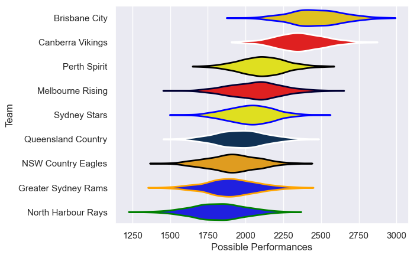

---  
title: "National Rugby Championship 2015 Status"  
date: 2025-07-28 6:00:00 -0500  
categories: model review projection  
layout: article  
aside:  
    toc: true  
---
# Current Team Rankings

# Standings

## Current Standings

| Club                |   Played |   Wins |   Point Differential |   Losing Bonus Points |   Try Bonus Points |   Competition Points |
|:--------------------|---------:|-------:|---------------------:|----------------------:|-------------------:|---------------------:|
| Brisbane City       |       10 |     10 |                  252 |                     0 |                  3 |                   43 |
| Canberra Vikings    |       10 |      8 |                  204 |                     1 |                  3 |                   36 |
| Melbourne Rising    |        9 |      5 |                  -47 |                     0 |                  3 |                   23 |
| Sydney Stars        |        9 |      4 |                  -88 |                     1 |                  2 |                   19 |
| NSW Country Eagles  |        8 |      4 |                  -35 |                     1 |                    |                   17 |
| Perth Spirit        |        8 |      3 |                    5 |                     2 |                    |                   14 |
| North Harbour Rays  |        8 |      2 |                  -64 |                     2 |                  2 |                   12 |
| Queensland Country  |        8 |      2 |                 -106 |                     0 |                  1 |                    9 |
| Greater Sydney Rams |        8 |      1 |                 -121 |                     3 |                  1 |                    8 |

# Completed Match Review

| Model | Percent Correct Predictions | Spread Error |
| ------ | ------ | ------ |
| Club Level | 69.2% | 15.8 |
| Player Level: Lineup | nan% | nan |
| Player Level: Minutes | nan% | nan |

