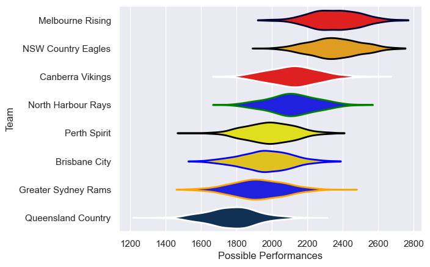

---  
title: "National Rugby Championship 2016"  
date: 2025-07-29 6:00:00 -0500  
categories: model review projection  
layout: article  
aside:  
    toc: true  
---
# Current Team Rankings

# Standings

## Current Standings

| Club                |   Played |   Wins |   Point Differential |   Losing Bonus Points | Try Bonus Points   |   Competition Points |
|:--------------------|---------:|-------:|---------------------:|----------------------:|:-------------------|---------------------:|
| NSW Country Eagles  |        9 |      7 |                  110 |                     2 |                    |                   30 |
| Perth Spirit        |        9 |      7 |                   62 |                     0 |                    |                   28 |
| North Harbour Rays  |        8 |      6 |                   66 |                     0 |                    |                   24 |
| Melbourne Rising    |        8 |      3 |                  -28 |                     3 |                    |                   15 |
| Canberra Vikings    |        7 |      3 |                  -20 |                     1 |                    |                   13 |
| Greater Sydney Rams |        7 |      2 |                   -2 |                     3 |                    |                   11 |
| Brisbane City       |        7 |      2 |                  -90 |                     1 |                    |                    9 |
| Queensland Country  |        7 |      1 |                  -98 |                     2 |                    |                    6 |

# Completed Match Review

| Model | Percent Correct Predictions | Spread Error |
| ------ | ------ | ------ |
| Club Level | 58.1% | 22.3 |
| Player Level: Lineup | nan% | nan |
| Player Level: Minutes | nan% | nan |

