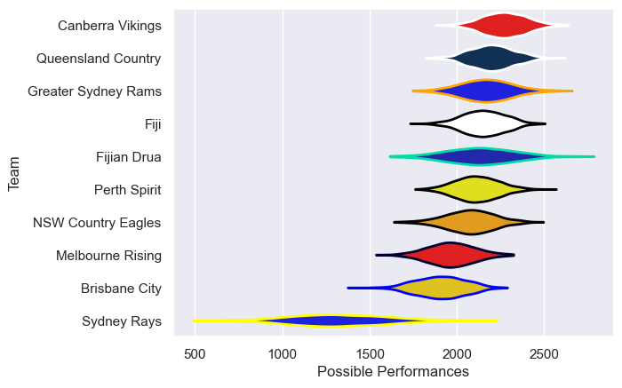

---  
title: "National Rugby Championship 2017"  
date: 2025-07-29 6:00:00 -0500  
categories: model review projection  
layout: article  
aside:  
    toc: true  
---
# Current Team Rankings

# Standings

## Current Standings

| Club                |   Played |   Wins |   Point Differential |   Losing Bonus Points |   Try Bonus Points |   Competition Points |
|:--------------------|---------:|-------:|---------------------:|----------------------:|-------------------:|---------------------:|
| Queensland Country  |       10 |      8 |                  162 |                     1 |                  1 |                   34 |
| Canberra Vikings    |       10 |      7 |                  158 |                     2 |                  1 |                   31 |
| Perth Spirit        |        9 |      4 |                   27 |                     3 |                    |                   19 |
| NSW Country Eagles  |        8 |      4 |                    2 |                     1 |                    |                   19 |
| Fijian Drua         |        8 |      4 |                   16 |                     2 |                    |                   18 |
| Brisbane City       |        8 |      4 |                  -10 |                     0 |                    |                   18 |
| Greater Sydney Rams |        8 |      3 |                  -69 |                     0 |                    |                   12 |
| Sydney Rays         |        8 |      3 |                  -84 |                     0 |                    |                   12 |
| Melbourne Rising    |        8 |      1 |                 -166 |                     0 |                    |                    4 |
| Fiji                |        1 |      0 |                  -36 |                     0 |                    |                    0 |

# Completed Match Review

| Model | Percent Correct Predictions | Spread Error |
| ------ | ------ | ------ |
| Club Level | 53.8% | 21.2 |
| Player Level: Lineup | nan% | nan |
| Player Level: Minutes | nan% | nan |

