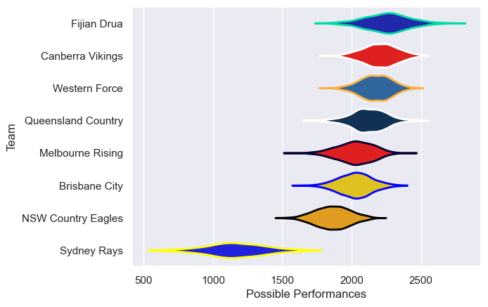

---  
title: "National Rugby Championship 2018"  
date: 2025-07-29 6:00:00 -0500  
categories: model review projection  
layout: article  
aside:  
    toc: true  
---
# Current Team Rankings

# Standings

## Current Standings

| Club               |   Played |   Wins |   Point Differential |   Losing Bonus Points |   Try Bonus Points |   Competition Points |
|:-------------------|---------:|-------:|---------------------:|----------------------:|-------------------:|---------------------:|
| Fijian Drua        |        9 |      8 |                  125 |                     0 |                  1 |                   33 |
| Queensland Country |        9 |      6 |                   99 |                     1 |                  1 |                   26 |
| Canberra Vikings   |        8 |      5 |                   45 |                     2 |                    |                   22 |
| Western Force      |        7 |      4 |                   13 |                     1 |                    |                   17 |
| Brisbane City      |        7 |      4 |                  -40 |                     1 |                    |                   17 |
| Melbourne Rising   |        7 |      2 |                   47 |                     3 |                    |                   11 |
| NSW Country Eagles |        7 |      1 |                 -140 |                     2 |                    |                    6 |
| Sydney Rays        |        6 |      0 |                 -149 |                     1 |                    |                    1 |

# Completed Match Review

| Model | Percent Correct Predictions | Spread Error |
| ------ | ------ | ------ |
| Club Level | 66.7% | 18.0 |
| Player Level: Lineup | nan% | nan |
| Player Level: Minutes | nan% | nan |

