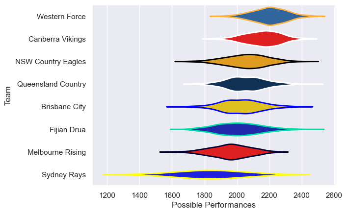

---  
title: "National Rugby Championship 2019 Status"  
date: 2025-07-28 6:00:00 -0500  
categories: model review projection  
layout: article  
aside:  
    toc: true  
---
# Current Team Rankings

# Standings

## Current Standings

| Club               |   Played |   Wins |   Point Differential |   Losing Bonus Points |   Try Bonus Points |   Competition Points |
|:-------------------|---------:|-------:|---------------------:|----------------------:|-------------------:|---------------------:|
| Western Force      |        9 |      8 |                  114 |                     0 |                  9 |                   41 |
| Canberra Vikings   |        9 |      6 |                  -10 |                     0 |                  7 |                   31 |
| Brisbane City      |        8 |      3 |                   11 |                     3 |                  8 |                   25 |
| Fijian Drua        |        8 |      3 |                   16 |                     1 |                  5 |                   22 |
| NSW Country Eagles |        7 |      3 |                    9 |                     2 |                  4 |                   20 |
| Queensland Country |        7 |      3 |                  -30 |                     2 |                  4 |                   18 |
| Melbourne Rising   |        7 |      2 |                   -5 |                     2 |                  3 |                   13 |
| Sydney Rays        |        7 |      1 |                 -105 |                     1 |                  7 |                   12 |

# Completed Match Review

| Model | Percent Correct Predictions | Spread Error |
| ------ | ------ | ------ |
| Club Level | 71.0% | 15.2 |
| Player Level: Lineup | nan% | nan |
| Player Level: Minutes | nan% | nan |

