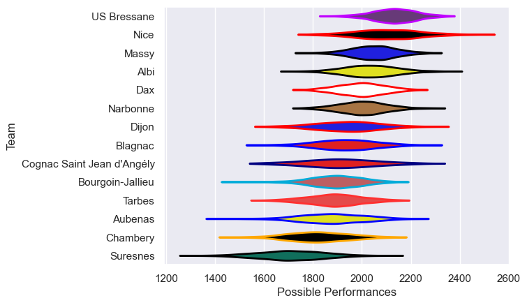

---  
title: "Nationale 20/21"  
date: 2025-07-29 6:00:00 -0500  
categories: model review projection  
layout: article  
aside:  
    toc: true  
---
# Current Team Rankings

# Standings

## Current Standings

| Club                       |   Played |   Wins |   Point Differential |   Losing Bonus Points | Try Bonus Points   |   Competition Points |
|:---------------------------|---------:|-------:|---------------------:|----------------------:|:-------------------|---------------------:|
| US Bressane                |       22 |     18 |                  208 |                     3 |                    |                   75 |
| Nice                       |       19 |     13 |                  185 |                     4 |                    |                   60 |
| Narbonne                   |       22 |     14 |                   77 |                     3 |                    |                   59 |
| Albi                       |       21 |     12 |                   82 |                     6 |                    |                   56 |
| Massy                      |       20 |     10 |                   97 |                     7 |                    |                   49 |
| Dax                        |       20 |     11 |                  -13 |                     5 |                    |                   49 |
| Tarbes                     |       20 |      9 |                  -71 |                     3 |                    |                   43 |
| Cognac Saint Jean d'Angély |       18 |      8 |                  -16 |                     5 |                    |                   39 |
| Bourgoin-Jallieu           |       19 |      7 |                  -24 |                     8 |                    |                   36 |
| Dijon                      |       20 |      7 |                  -60 |                     6 |                    |                   36 |
| Blagnac                    |       19 |      8 |                  -64 |                     4 |                    |                   36 |
| Chambery                   |       19 |      6 |                  -72 |                     6 |                    |                   32 |
| Suresnes                   |       19 |      6 |                 -155 |                     5 |                    |                   29 |
| Aubenas                    |       20 |      5 |                 -174 |                     6 |                    |                   28 |

# Completed Match Review

| Model | Percent Correct Predictions | Spread Error |
| ------ | ------ | ------ |
| Club Level | 61.2% | 11.1 |
| Player Level: Lineup | nan% | nan |
| Player Level: Minutes | nan% | nan |

