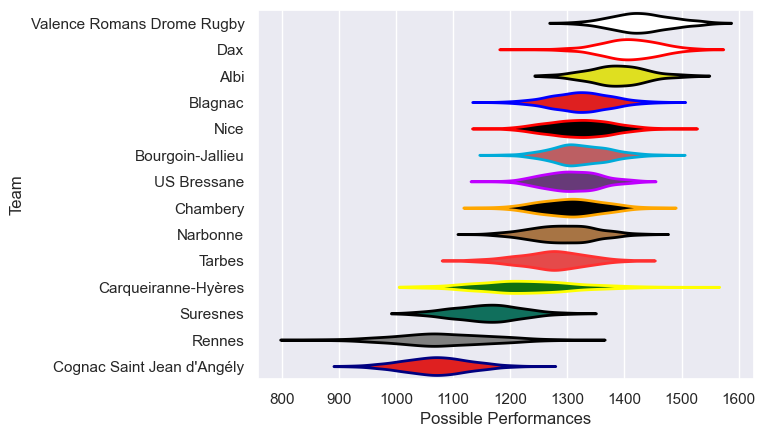
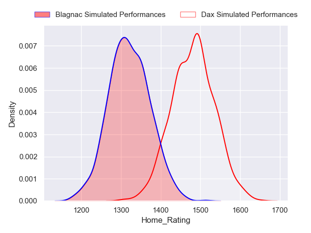
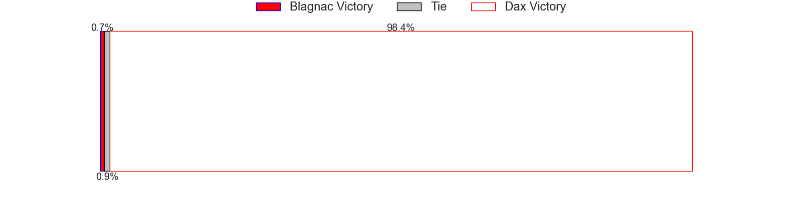
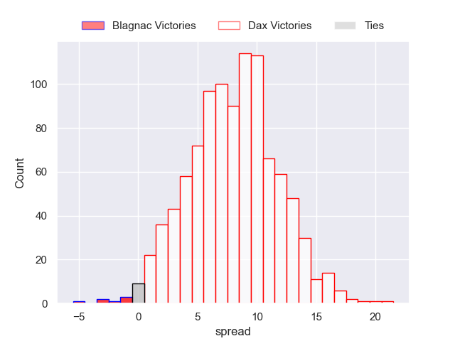

---  
title: "Nationale 2022 Status"  
date: 2023-05-19 6:00:00 -0500  
categories: model review projection  
layout: article  
aside:  
    toc: true  
---
# Current Team Rankings

# Standings

## Current Standings

| Club                       |   Played |   Wins |   Point Differential |   Losing Bonus Points |   Try Bonus Points |   Competition Points |
|:---------------------------|---------:|-------:|---------------------:|----------------------:|-------------------:|---------------------:|
| Dax                        |       27 |     22 |                  300 |                     2 |                 11 |                  101 |
| Valence Romans Drome Rugby |       27 |     18 |                  303 |                     7 |                nan |                   90 |
| Albi                       |       28 |     19 |                  222 |                     4 |                  6 |                   88 |
| Blagnac                    |       28 |     19 |                   59 |                     3 |                  4 |                   83 |
| Bourgoin-Jallieu           |       27 |     17 |                   62 |                     3 |                  2 |                   73 |
| US Bressane                |       27 |     15 |                   29 |                     5 |                  6 |                   71 |
| Narbonne                   |       26 |     14 |                   25 |                     5 |                  6 |                   69 |
| Nice                       |       26 |     13 |                   63 |                     9 |                  5 |                   66 |
| Chambery                   |       26 |     13 |                   67 |                     6 |                  5 |                   63 |
| Tarbes                     |       26 |     13 |                   -2 |                     6 |                  4 |                   62 |
| Suresnes                   |       26 |      9 |                 -257 |                     3 |                  3 |                   44 |
| Carqueiranne-Hyères        |       26 |      8 |                 -111 |                     7 |                  4 |                   43 |
| Rennes                     |       26 |      4 |                 -298 |                     6 |                  2 |                   24 |
| Cognac Saint Jean d'Angély |       26 |      0 |                 -462 |                     9 |                nan |                    9 |

## Projected Remaining Table

| Club                       |   Matches Remaining |   Wins |   Point Differential |   Losing Bonus Points |   Try Bonus Points |   Competition Points |
|:---------------------------|--------------------:|-------:|---------------------:|----------------------:|-------------------:|---------------------:|
| Dax                        |                   1 |    1   |                  7.5 |                   0   |                1   |                  4.9 |
| Valence Romans Drome Rugby |                   1 |    0.9 |                  5.1 |                   0.1 |                0.9 |                  4.7 |
| Albi                       |                   1 |    0.1 |                 -5.1 |                   0.6 |                0.1 |                  0.9 |
| Blagnac                    |                   1 |    0   |                 -7.5 |                   0.4 |                0   |                  0.4 |

## Projected Total Table

| Club                       |   Total Matches |   Wins |   Point Differential |   Losing Bonus Points |   Try Bonus Points |   Competition Points |
|:---------------------------|----------------:|-------:|---------------------:|----------------------:|-------------------:|---------------------:|
| Dax                        |              28 |   23   |                307.5 |                   2   |               12   |                105.9 |
| Valence Romans Drome Rugby |              28 |   18.9 |                308.1 |                   7.1 |                0.9 |                 94.7 |
| Albi                       |              29 |   19.1 |                216.9 |                   4.6 |                6.1 |                 88.9 |
| Blagnac                    |              29 |   19   |                 51.5 |                   3.4 |                4   |                 83.4 |
| Bourgoin-Jallieu           |              27 |   17   |                 62   |                   3   |                2   |                 73   |
| US Bressane                |              27 |   15   |                 29   |                   5   |                6   |                 71   |
| Narbonne                   |              26 |   14   |                 25   |                   5   |                6   |                 69   |
| Nice                       |              26 |   13   |                 63   |                   9   |                5   |                 66   |
| Chambery                   |              26 |   13   |                 67   |                   6   |                5   |                 63   |
| Tarbes                     |              26 |   13   |                 -2   |                   6   |                4   |                 62   |
| Suresnes                   |              26 |    9   |               -257   |                   3   |                3   |                 44   |
| Carqueiranne-Hyères        |              26 |    8   |               -111   |                   7   |                4   |                 43   |
| Rennes                     |              26 |    4   |               -298   |                   6   |                2   |                 24   |
| Cognac Saint Jean d'Angély |              26 |    0   |               -462   |                   9   |                0   |                  9   |

# Completed Match Review

| Model | Percent Correct Predictions | Spread Error |
| ------ | ------ | ------ |
| Club Level | 68.8% | 10.4 |
| Player Level: Lineup | 67.6% | 11.8 |
| Player Level: Minutes | 68.6% | 12.0 |

# Future Predictions

## Week 29

### Dax V Blagnac on 2023/05/20

Average Margin: Dax by 8.0

### Valence Romans Drome Rugby V Albi on 2023/05/20

Average Margin: Valence Romans Drome Rugby by 5.6

