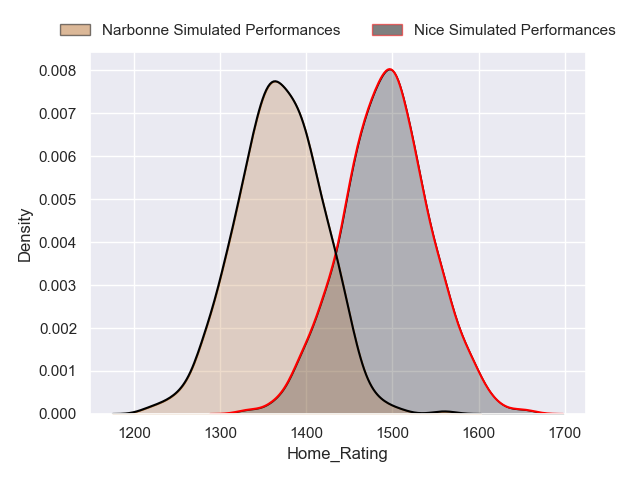
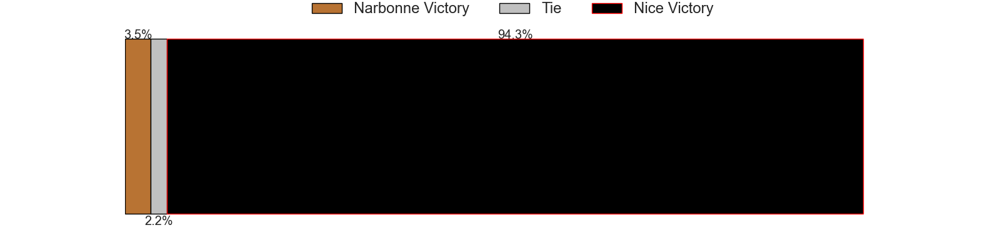
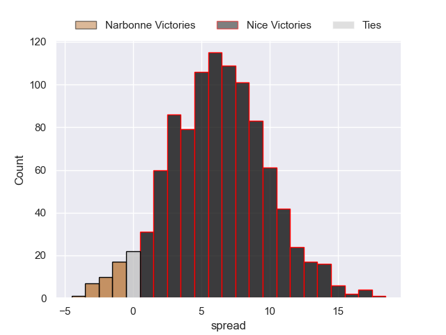
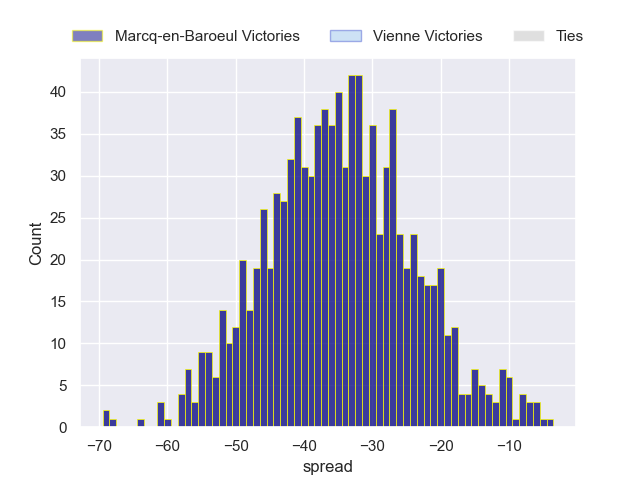

---  
title: "Nationale 2023 Status"  
date: 2024-05-17 6:00:00 -0500  
categories: model review projection  
layout: article  
aside:  
    toc: true  
---
# Current Team Rankings

# Standings

## Current Standings

| Club                |   Played |   Wins |   Point Differential |   Losing Bonus Points |   Try Bonus Points |   Competition Points |
|:--------------------|---------:|-------:|---------------------:|----------------------:|-------------------:|---------------------:|
| Narbonne            |       28 |     20 |                  169 |                     6 |                  8 |                   94 |
| Nice                |       27 |     19 |                  346 |                     4 |                nan |                   93 |
| Carcassonne         |       29 |     19 |                  212 |                     5 |                nan |                   88 |
| Albi                |       27 |     17 |                  205 |                     8 |                nan |                   82 |
| Suresnes            |       28 |     17 |                   40 |                     3 |                nan |                   76 |
| Chambery            |       27 |     16 |                  123 |                     5 |                nan |                   75 |
| Périgueux           |       26 |     14 |                  124 |                     6 |                nan |                   70 |
| Bourgoin-Jallieu    |       26 |     13 |                   10 |                     6 |                nan |                   64 |
| US Bressane         |       26 |     11 |                   30 |                    11 |                nan |                   61 |
| Massy               |       26 |     11 |                   14 |                    10 |                nan |                   56 |
| Carqueiranne-Hyères |       26 |     11 |                 -123 |                     4 |                  2 |                   52 |
| Tarbes              |       26 |      9 |                 -186 |                     9 |                  1 |                   46 |
| Blagnac             |       26 |      4 |                 -412 |                     2 |                nan |                   23 |
| Vienne              |       26 |      3 |                 -552 |                     3 |                nan |                   15 |

## Projected Remaining Table

| Club             |   Matches Remaining |   Wins |   Point Differential |   Losing Bonus Points |   Try Bonus Points |   Competition Points |
|:-----------------|--------------------:|-------:|---------------------:|----------------------:|-------------------:|---------------------:|
| Marcq-en-Baroeul |                   1 |      1 |             33.0452  |                   0   |                0.9 |                  4.9 |
| Nice             |                   1 |      1 |              6.92876 |                   0   |                0.4 |                  4.3 |
| Narbonne         |                   1 |      0 |             -6.92876 |                   0.5 |                0.1 |                  0.8 |
| Vienne           |                   1 |      0 |            -33.0452  |                   0   |                0.1 |                  0.1 |

## Projected Total Table

| Club                |   Total Matches |   Wins |   Point Differential |   Losing Bonus Points |   Try Bonus Points |   Competition Points |
|:--------------------|----------------:|-------:|---------------------:|----------------------:|-------------------:|---------------------:|
| Nice                |              28 |     20 |             352.929  |                   4   |                0.4 |                 97.3 |
| Narbonne            |              29 |     20 |             162.071  |                   6.5 |                8.1 |                 94.8 |
| Carcassonne         |              29 |     19 |             212      |                   5   |                0   |                 88   |
| Albi                |              27 |     17 |             205      |                   8   |                0   |                 82   |
| Suresnes            |              28 |     17 |              40      |                   3   |                0   |                 76   |
| Chambery            |              27 |     16 |             123      |                   5   |                0   |                 75   |
| Périgueux           |              26 |     14 |             124      |                   6   |                0   |                 70   |
| Bourgoin-Jallieu    |              26 |     13 |              10      |                   6   |                0   |                 64   |
| US Bressane         |              26 |     11 |              30      |                  11   |                0   |                 61   |
| Massy               |              26 |     11 |              14      |                  10   |                0   |                 56   |
| Carqueiranne-Hyères |              26 |     11 |            -123      |                   4   |                2   |                 52   |
| Tarbes              |              26 |      9 |            -186      |                   9   |                1   |                 46   |
| Blagnac             |              26 |      4 |            -412      |                   2   |                0   |                 23   |
| Vienne              |              27 |      3 |            -585.045  |                   3   |                0.1 |                 15.1 |
| Marcq-en-Baroeul    |               1 |      1 |              33.0452 |                   0   |                0.9 |                  4.9 |

# Completed Match Review

| Model | Percent Correct Predictions | Spread Error |
| ------ | ------ | ------ |
| Club Level | 74.9% | 12.5 |
| Player Level: Lineup | 69.5% | 12.3 |
| Player Level: Minutes | 68.4% | 13.2 |

# Future Predictions

## Week 30

### Nice V Narbonne on 2024/05/18

Average Margin: Nice by 6.9

Average Scoreline: 30-23

### Vienne V Marcq-en-Baroeul on 2024/05/19

Average Margin: Marcq-en-Baroeul by 33.0

Average Scoreline: 46-12

