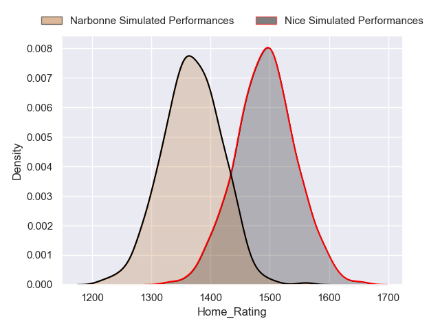
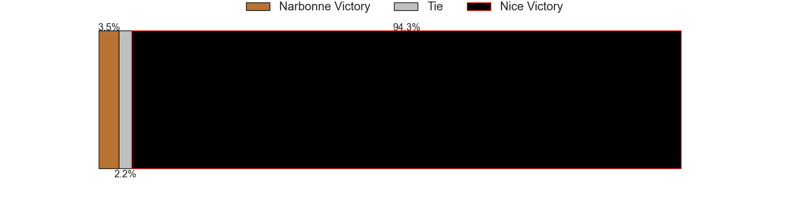
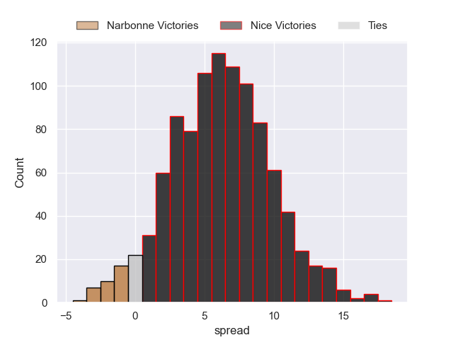
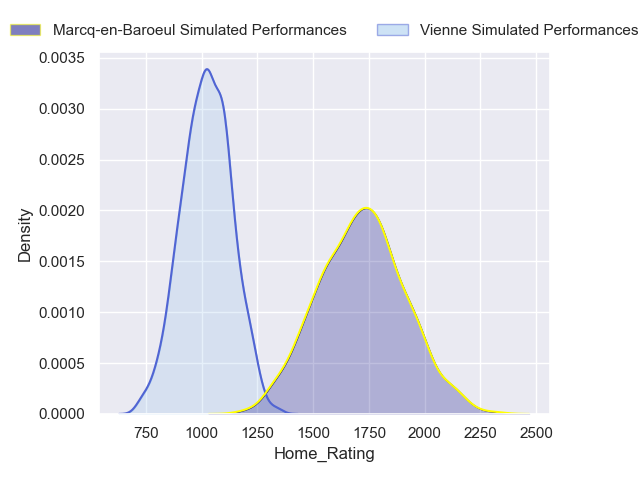
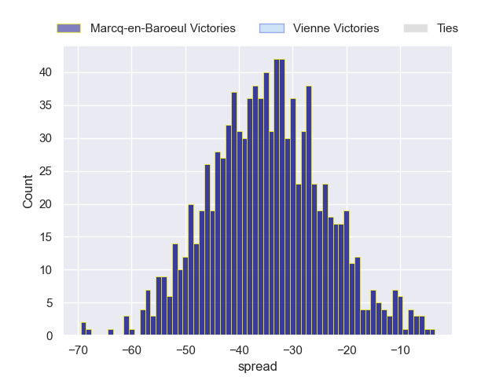

---  
title: "Nationale 2023 Status"  
date: 2024-05-13 6:00:00 -0500  
categories: model review projection  
layout: article  
aside:  
    toc: true  
---
# Current Team Rankings

# Standings

## Current Standings

| Club                |   Played |   Wins |   Point Differential |   Losing Bonus Points |   Try Bonus Points |   Competition Points |
|:--------------------|---------:|-------:|---------------------:|----------------------:|-------------------:|---------------------:|
| Narbonne            |       28 |     20 |                  179 |                     6 |                  8 |                   94 |
| Nice                |       27 |     18 |                  313 |                     4 |                nan |                   89 |
| Carcassonne         |       29 |     18 |                  186 |                     6 |                nan |                   85 |
| Albi                |       27 |     17 |                  205 |                     8 |                nan |                   82 |
| Suresnes            |       28 |     17 |                   40 |                     3 |                nan |                   76 |
| Chambery            |       27 |     15 |                   96 |                     6 |                nan |                   72 |
| Périgueux           |       26 |     14 |                  100 |                     6 |                nan |                   70 |
| Bourgoin-Jallieu    |       26 |     13 |                    6 |                     6 |                nan |                   64 |
| US Bressane         |       26 |     11 |                   30 |                    11 |                nan |                   61 |
| Massy               |       26 |     12 |                   42 |                     9 |                nan |                   59 |
| Carqueiranne-Hyères |       26 |     11 |                 -123 |                     4 |                  2 |                   52 |
| Tarbes              |       26 |     10 |                 -136 |                     9 |                  1 |                   50 |
| Blagnac             |       26 |      5 |                 -386 |                     4 |                nan |                   29 |
| Vienne              |       26 |      3 |                 -552 |                     3 |                nan |                   15 |

## Projected Remaining Table

| Club             |   Matches Remaining |   Wins |   Point Differential |   Losing Bonus Points |   Try Bonus Points |   Competition Points |
|:-----------------|--------------------:|-------:|---------------------:|----------------------:|-------------------:|---------------------:|
| Marcq-en-Baroeul |                   1 |      1 |             34.7366  |                   0   |                0.8 |                  4.8 |
| Nice             |                   1 |      1 |              6.20851 |                   0   |                0.4 |                  4.3 |
| Narbonne         |                   1 |      0 |             -6.20851 |                   0.5 |                0.2 |                  0.9 |
| Vienne           |                   1 |      0 |            -34.7366  |                   0   |                0.2 |                  0.2 |

## Projected Total Table

| Club                |   Total Matches |   Wins |   Point Differential |   Losing Bonus Points |   Try Bonus Points |   Competition Points |
|:--------------------|----------------:|-------:|---------------------:|----------------------:|-------------------:|---------------------:|
| Narbonne            |              29 |     20 |             172.791  |                   6.5 |                8.2 |                 94.9 |
| Nice                |              28 |     19 |             319.209  |                   4   |                0.4 |                 93.3 |
| Carcassonne         |              29 |     18 |             186      |                   6   |                0   |                 85   |
| Albi                |              27 |     17 |             205      |                   8   |                0   |                 82   |
| Suresnes            |              28 |     17 |              40      |                   3   |                0   |                 76   |
| Chambery            |              27 |     15 |              96      |                   6   |                0   |                 72   |
| Périgueux           |              26 |     14 |             100      |                   6   |                0   |                 70   |
| Bourgoin-Jallieu    |              26 |     13 |               6      |                   6   |                0   |                 64   |
| US Bressane         |              26 |     11 |              30      |                  11   |                0   |                 61   |
| Massy               |              26 |     12 |              42      |                   9   |                0   |                 59   |
| Carqueiranne-Hyères |              26 |     11 |            -123      |                   4   |                2   |                 52   |
| Tarbes              |              26 |     10 |            -136      |                   9   |                1   |                 50   |
| Blagnac             |              26 |      5 |            -386      |                   4   |                0   |                 29   |
| Vienne              |              27 |      3 |            -586.737  |                   3   |                0.2 |                 15.2 |
| Marcq-en-Baroeul    |               1 |      1 |              34.7366 |                   0   |                0.8 |                  4.8 |

# Completed Match Review

| Model | Percent Correct Predictions | Spread Error |
| ------ | ------ | ------ |
| Club Level | 72.2% | 12.3 |
| Player Level: Lineup | 69.5% | 12.9 |
| Player Level: Minutes | 68.4% | 15.4 |

# Future Predictions

## Week 30

### Nice V Narbonne on 2024/05/18

Average Margin: Nice by 6.2

Average Scoreline: 30-24

### Vienne V Marcq-en-Baroeul on 2024/05/19

Average Margin: Marcq-en-Baroeul by 34.7

Average Scoreline: 38-4

