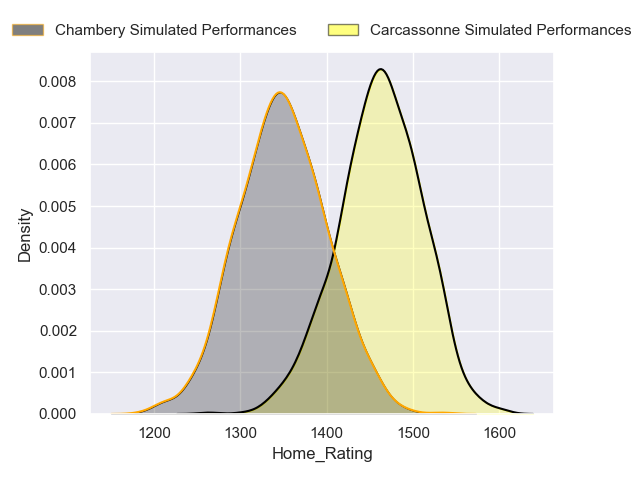
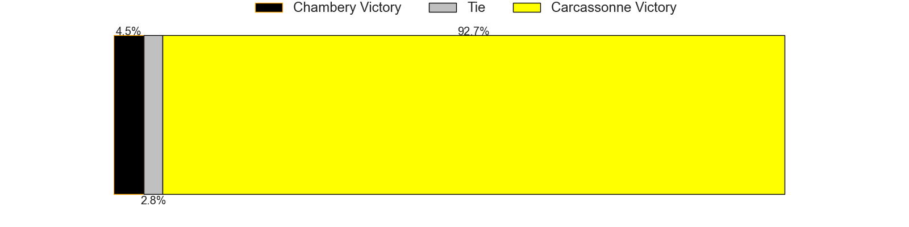
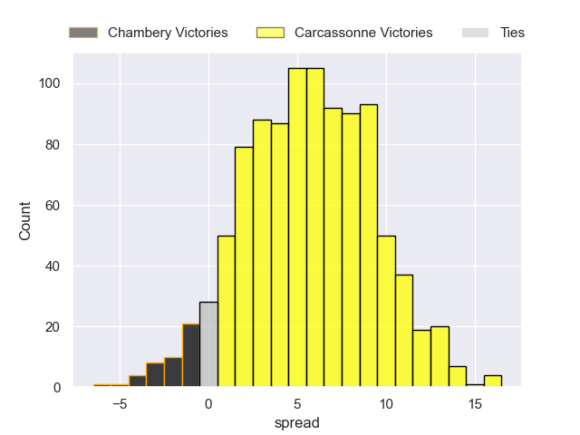
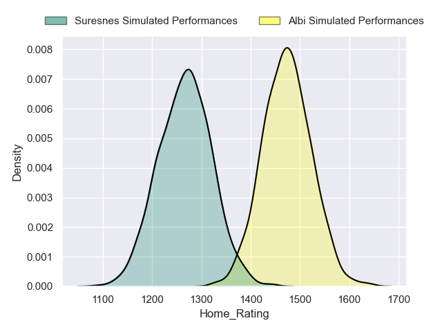
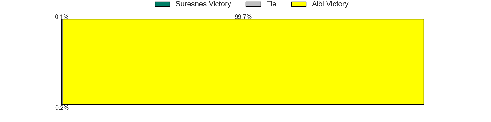
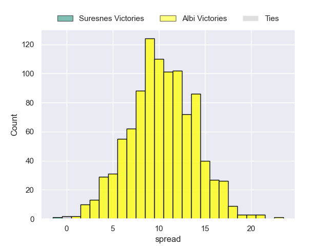

---  
title: "Nationale 2023 Status"  
date: 2024-04-29 6:00:00 -0500  
categories: model review projection  
layout: article  
aside:  
    toc: true  
---
# Current Team Rankings

# Standings

## Current Standings

| Club                |   Played |   Wins |   Point Differential |   Losing Bonus Points |   Try Bonus Points |   Competition Points |
|:--------------------|---------:|-------:|---------------------:|----------------------:|-------------------:|---------------------:|
| Narbonne            |       27 |     19 |                  166 |                     6 |                  8 |                   90 |
| Nice                |       26 |     17 |                  291 |                     4 |                nan |                   84 |
| Albi                |       26 |     17 |                  208 |                     7 |                nan |                   81 |
| Carcassonne         |       27 |     17 |                  180 |                     5 |                nan |                   80 |
| Chambery            |       26 |     16 |                  132 |                     5 |                nan |                   75 |
| Suresnes            |       26 |     16 |                   47 |                     3 |                nan |                   72 |
| Périgueux           |       26 |     14 |                  124 |                     6 |                nan |                   70 |
| Bourgoin-Jallieu    |       26 |     13 |                   24 |                     6 |                nan |                   64 |
| US Bressane         |       26 |     11 |                   43 |                    11 |                nan |                   61 |
| Massy               |       26 |     11 |                   14 |                    10 |                nan |                   56 |
| Carqueiranne-Hyères |       26 |     12 |                  -92 |                     3 |                  2 |                   55 |
| Tarbes              |       26 |      9 |                 -186 |                     9 |                  1 |                   46 |
| Blagnac             |       26 |      5 |                 -399 |                     2 |                nan |                   27 |
| Vienne              |       26 |      3 |                 -552 |                     3 |                nan |                   15 |

## Projected Remaining Table

| Club        |   Matches Remaining |   Wins |   Point Differential |   Losing Bonus Points |   Try Bonus Points |   Competition Points |
|:------------|--------------------:|-------:|---------------------:|----------------------:|-------------------:|---------------------:|
| Albi        |                   1 |    1   |              10.3474 |                   0   |                0.4 |                  4.4 |
| Carcassonne |                   1 |    0.9 |               5.6575 |                   0.1 |                0.2 |                  4   |
| Chambery    |                   1 |    0.1 |              -5.6575 |                   0.6 |                0.3 |                  1.1 |
| Suresnes    |                   1 |    0   |             -10.3474 |                   0.2 |                0.2 |                  0.4 |

## Projected Total Table

| Club                |   Total Matches |   Wins |   Point Differential |   Losing Bonus Points |   Try Bonus Points |   Competition Points |
|:--------------------|----------------:|-------:|---------------------:|----------------------:|-------------------:|---------------------:|
| Narbonne            |              27 |   19   |             166      |                   6   |                8   |                 90   |
| Albi                |              27 |   18   |             218.347  |                   7   |                0.4 |                 85.4 |
| Nice                |              26 |   17   |             291      |                   4   |                0   |                 84   |
| Carcassonne         |              28 |   17.9 |             185.657  |                   5.1 |                0.2 |                 84   |
| Chambery            |              27 |   16.1 |             126.343  |                   5.6 |                0.3 |                 76.1 |
| Suresnes            |              27 |   16   |              36.6526 |                   3.2 |                0.2 |                 72.4 |
| Périgueux           |              26 |   14   |             124      |                   6   |                0   |                 70   |
| Bourgoin-Jallieu    |              26 |   13   |              24      |                   6   |                0   |                 64   |
| US Bressane         |              26 |   11   |              43      |                  11   |                0   |                 61   |
| Massy               |              26 |   11   |              14      |                  10   |                0   |                 56   |
| Carqueiranne-Hyères |              26 |   12   |             -92      |                   3   |                2   |                 55   |
| Tarbes              |              26 |    9   |            -186      |                   9   |                1   |                 46   |
| Blagnac             |              26 |    5   |            -399      |                   2   |                0   |                 27   |
| Vienne              |              26 |    3   |            -552      |                   3   |                0   |                 15   |

# Completed Match Review

| Model | Percent Correct Predictions | Spread Error |
| ------ | ------ | ------ |
| Club Level | 76.0% | 12.7 |
| Player Level: Lineup | 69.4% | 13.5 |
| Player Level: Minutes | 68.2% | 15.7 |

# Future Predictions

## Week 28

### Carcassonne V Chambery on 2024/05/04

Average Margin: Carcassonne by 5.7

Average Scoreline: 22-16

### Albi V Suresnes on 2024/05/04

Average Margin: Albi by 10.3

Average Scoreline: 25-15

