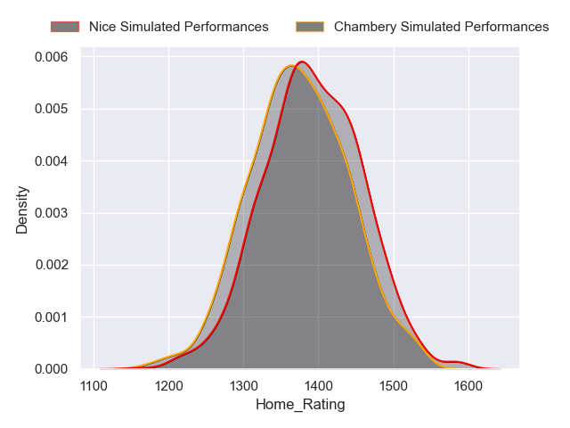
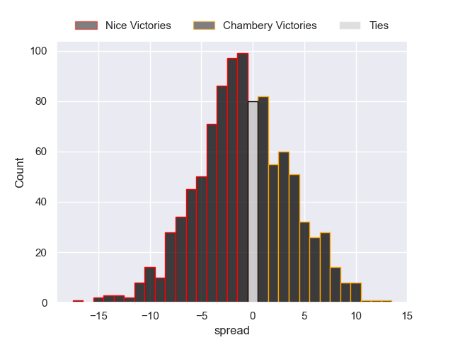
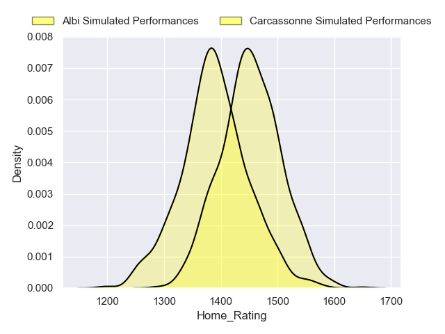
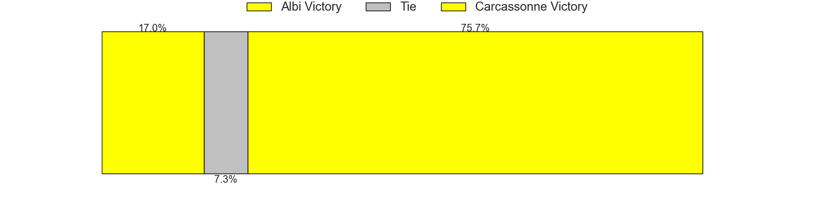
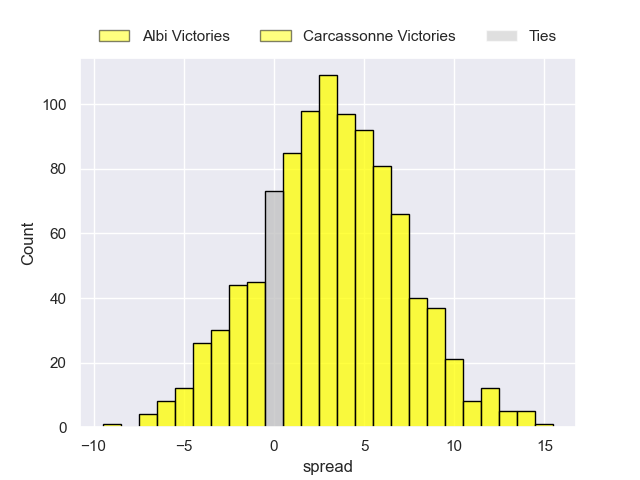

---  
title: "Nationale 2023 Status"  
date: 2023-10-20 6:00:00 -0500  
categories: model review projection  
layout: article  
aside:  
    toc: true  
---
# Current Team Rankings

# Standings

## Current Standings

| Club                |   Played |   Wins |   Point Differential |   Losing Bonus Points |   Try Bonus Points |   Competition Points |
|:--------------------|---------:|-------:|---------------------:|----------------------:|-------------------:|---------------------:|
| Albi                |        6 |      5 |                   71 |                     0 |                  2 |                   22 |
| Narbonne            |        6 |      5 |                   26 |                     1 |                  0 |                   21 |
| Nice                |        6 |      4 |                   97 |                     1 |                  3 |                   20 |
| Périgueux           |        6 |      4 |                   51 |                     1 |                  1 |                   18 |
| Carcassonne         |        6 |      4 |                   -3 |                     1 |                  0 |                   17 |
| Blagnac             |        6 |      3 |                   13 |                     1 |                  2 |                   15 |
| Chambery            |        6 |      2 |                    5 |                     2 |                  1 |                   13 |
| Bourgoin-Jallieu    |        6 |      3 |                    1 |                     1 |                  0 |                   13 |
| Suresnes            |        6 |      3 |                   -9 |                     1 |                  0 |                   13 |
| Tarbes              |        6 |      3 |                  -47 |                     1 |                  0 |                   13 |
| Carqueiranne-Hyères |        6 |      2 |                  -13 |                     2 |                  0 |                   12 |
| Massy               |        6 |      2 |                  -12 |                     3 |                  0 |                   11 |
| US Bressane         |        6 |      1 |                  -21 |                     3 |                  0 |                    7 |
| Vienne              |        6 |      0 |                 -159 |                     0 |                  0 |                    0 |

## Projected Remaining Table

| Club                |   Matches Remaining |   Wins |   Point Differential |   Losing Bonus Points |   Try Bonus Points |   Competition Points |
|:--------------------|--------------------:|-------:|---------------------:|----------------------:|-------------------:|---------------------:|
| Carcassonne         |                  19 |   14.9 |                117   |                   3.6 |               14.2 |                 77.5 |
| Nice                |                  19 |   14.2 |                 93.7 |                   4.2 |               13.5 |                 74.4 |
| Albi                |                  19 |   13.8 |                 86.8 |                   4.6 |               13.1 |                 73.1 |
| Narbonne            |                  19 |   11.3 |                 56   |                   6   |               10.6 |                 61.9 |
| Blagnac             |                  19 |   10.6 |                 28.9 |                   6.1 |               10   |                 58.5 |
| Chambery            |                  19 |   10.4 |                 38.3 |                   6.3 |                9.7 |                 57.7 |
| Bourgoin-Jallieu    |                  19 |   10.4 |                 27.7 |                   6.3 |                9.4 |                 57.2 |
| Périgueux           |                  19 |   10.4 |                 27   |                   5.5 |                9.8 |                 57   |
| Massy               |                  19 |    9.6 |                 23.4 |                   7   |                8.9 |                 54.3 |
| US Bressane         |                  19 |    7.9 |                -17.6 |                   7.8 |                7.4 |                 46.6 |
| Tarbes              |                  19 |    7.4 |                -21.6 |                   7.5 |                6.9 |                 43.9 |
| Carqueiranne-Hyères |                  19 |    6.2 |                -41.1 |                   7.1 |                5.8 |                 37.5 |
| Suresnes            |                  19 |    5.4 |                -52.5 |                   7.3 |                5.1 |                 34.1 |
| Vienne              |                  19 |    0.5 |               -367.7 |                   1.6 |                0.6 |                  4.3 |

## Projected Total Table

| Club                |   Total Matches |   Wins |   Point Differential |   Losing Bonus Points |   Try Bonus Points |   Competition Points |
|:--------------------|----------------:|-------:|---------------------:|----------------------:|-------------------:|---------------------:|
| Albi                |              25 |   18.8 |                157.8 |                   4.6 |               15.1 |                 95.1 |
| Carcassonne         |              25 |   18.9 |                114   |                   4.6 |               14.2 |                 94.5 |
| Nice                |              25 |   18.2 |                190.7 |                   5.2 |               16.5 |                 94.4 |
| Narbonne            |              25 |   16.3 |                 82   |                   7   |               10.6 |                 82.9 |
| Périgueux           |              25 |   14.4 |                 78   |                   6.5 |               10.8 |                 75   |
| Blagnac             |              25 |   13.6 |                 41.9 |                   7.1 |               12   |                 73.5 |
| Chambery            |              25 |   12.4 |                 43.3 |                   8.3 |               10.7 |                 70.7 |
| Bourgoin-Jallieu    |              25 |   13.4 |                 28.7 |                   7.3 |                9.4 |                 70.2 |
| Massy               |              25 |   11.6 |                 11.4 |                  10   |                8.9 |                 65.3 |
| Tarbes              |              25 |   10.4 |                -68.6 |                   8.5 |                6.9 |                 56.9 |
| US Bressane         |              25 |    8.9 |                -38.6 |                  10.8 |                7.4 |                 53.6 |
| Carqueiranne-Hyères |              25 |    8.2 |                -54.1 |                   9.1 |                5.8 |                 49.5 |
| Suresnes            |              25 |    8.4 |                -61.5 |                   8.3 |                5.1 |                 47.1 |
| Vienne              |              25 |    0.5 |               -526.7 |                   1.6 |                0.6 |                  4.3 |

# Completed Match Review

| Model | Percent Correct Predictions | Spread Error |
| ------ | ------ | ------ |
| Club Level | 76.2% | 9.6 |
| Player Level: Lineup | 71.4% | 10.8 |
| Player Level: Minutes | 71.4% | 10.9 |

# Future Predictions

## Week 18

### Chambery V Nice on 2023/10/20

Average Margin: Nice by 0.9

### Carcassonne V Albi on 2023/10/20

Average Margin: Carcassonne by 3.2

### Tarbes V US Bressane on 2023/10/21

Average Margin: Tarbes by 2.7

### Massy V Blagnac on 2023/10/21

Average Margin: Massy by 2.7

### Suresnes V Bourgoin-Jallieu on 2023/10/21

Average Margin: Bourgoin-Jallieu by 1.7

### Carqueiranne-Hyères V Périgueux on 2023/10/21

Average Margin: Périgueux by 1.1

### Narbonne V Vienne on 2023/10/21

Average Margin: Narbonne by 25.9

## Week 19

### US Bressane V Blagnac on 2023/11/03

Average Margin: US Bressane by 1.1

### Bourgoin-Jallieu V Chambery on 2023/11/04

Average Margin: Bourgoin-Jallieu by 3.5

### Tarbes V Narbonne on 2023/11/04

Average Margin: Tarbes by 0.4

### Vienne V Carqueiranne-Hyères on 2023/11/04

Average Margin: Carqueiranne-Hyères by 14.3

### Nice V Massy on 2023/11/04

Average Margin: Nice by 7.3

### Périgueux V Carcassonne on 2023/11/04

Average Margin: Périgueux by 0.2

### Suresnes V Albi on 2023/11/04

Average Margin: Albi by 5.8

## Week 20

### US Bressane V Narbonne on 2023/11/10

Average Margin: US Bressane by 1.1

### Chambery V Albi on 2023/11/10

Average Margin: Albi by 0.7

### Carcassonne V Vienne on 2023/11/10

Average Margin: Carcassonne by 28.2

### Suresnes V Périgueux on 2023/11/11

Average Margin: Périgueux by 2.0

### Bourgoin-Jallieu V Massy on 2023/11/11

Average Margin: Bourgoin-Jallieu by 3.6

### Blagnac V Nice on 2023/11/11

Average Margin: Blagnac by 0.1

### Carqueiranne-Hyères V Tarbes on 2023/11/11

Average Margin: Carqueiranne-Hyères by 1.5

## Week 21

### Albi V Massy on 2023/11/17

Average Margin: Albi by 7.5

### Tarbes V Carcassonne on 2023/11/18

Average Margin: Carcassonne by 2.5

### Narbonne V Carqueiranne-Hyères on 2023/11/18

Average Margin: Narbonne by 7.6

### Vienne V Suresnes on 2023/11/18

Average Margin: Suresnes by 13.5

### Bourgoin-Jallieu V Blagnac on 2023/11/18

Average Margin: Bourgoin-Jallieu by 2.8

### Nice V US Bressane on 2023/11/18

Average Margin: Nice by 8.7

### Périgueux V Chambery on 2023/11/18

Average Margin: Périgueux by 4.1

## Week 22

### Carcassonne V Narbonne on 2023/12/01

Average Margin: Carcassonne by 6.6

### Massy V Périgueux on 2023/12/01

Average Margin: Massy by 3.0

### Chambery V Vienne on 2023/12/01

Average Margin: Chambery by 23.1

### Nice V Bourgoin-Jallieu on 2023/12/02

Average Margin: Nice by 6.8

### Carqueiranne-Hyères V US Bressane on 2023/12/02

Average Margin: Carqueiranne-Hyères by 1.3

### Suresnes V Tarbes on 2023/12/02

Average Margin: Suresnes by 0.4

### Blagnac V Albi on 2023/12/02

Average Margin: Albi by 0.2

## Week 23

### Albi V Nice on 2023/12/08

Average Margin: Albi by 3.6

### US Bressane V Bourgoin-Jallieu on 2023/12/08

Average Margin: US Bressane by 1.5

### Chambery V Tarbes on 2023/12/08

Average Margin: Chambery by 5.3

### Carcassonne V Carqueiranne-Hyères on 2023/12/08

Average Margin: Carcassonne by 11.3

### Narbonne V Suresnes on 2023/12/09

Average Margin: Narbonne by 8.8

### Vienne V Massy on 2023/12/09

Average Margin: Massy by 17.0

### Blagnac V Périgueux on 2023/12/09

Average Margin: Blagnac by 3.8

## Week 24

### Vienne V Blagnac on 2023/12/16

Average Margin: Blagnac by 17.4

### Suresnes V Carqueiranne-Hyères on 2023/12/16

Average Margin: Suresnes by 2.1

### Chambery V Narbonne on 2023/12/16

Average Margin: Chambery by 2.7

### Périgueux V Nice on 2023/12/16

Average Margin: Nice by 0.4

### Tarbes V Massy on 2023/12/16

Average Margin: Tarbes by 1.1

### Albi V Bourgoin-Jallieu on 2023/12/16

Average Margin: Albi by 7.0

### Carcassonne V US Bressane on 2023/12/16

Average Margin: Carcassonne by 8.5

## Week 7

### US Bressane V Albi on 2024/01/15

Average Margin: Albi by 2.3

### Narbonne V Massy on 2024/01/15

Average Margin: Narbonne by 4.0

### Suresnes V Carcassonne on 2024/01/15

Average Margin: Carcassonne by 5.3

### Blagnac V Tarbes on 2024/01/15

Average Margin: Blagnac by 6.2

### Nice V Vienne on 2024/01/15

Average Margin: Nice by 26.4

### Bourgoin-Jallieu V Périgueux on 2024/01/15

Average Margin: Bourgoin-Jallieu by 3.1

### Chambery V Carqueiranne-Hyères on 2024/01/15

Average Margin: Chambery by 7.4

### Bourgoin-Jallieu V Vienne on 2024/01/20

Average Margin: Bourgoin-Jallieu by 22.6

### Chambery V Carcassonne on 2024/01/20

Average Margin: Carcassonne by 0.5

### Périgueux V Albi on 2024/01/20

Average Margin: Albi by 0.3

### Blagnac V Narbonne on 2024/01/20

Average Margin: Blagnac by 3.4

### Carqueiranne-Hyères V Massy on 2024/01/20

Average Margin: Massy by 0.2

### Nice V Tarbes on 2024/01/20

Average Margin: Nice by 9.1

### Suresnes V US Bressane on 2024/01/20

Average Margin: Suresnes by 0.1

## Week 8

### Bourgoin-Jallieu V Tarbes on 2024/01/27

Average Margin: Bourgoin-Jallieu by 5.8

### US Bressane V Périgueux on 2024/01/27

Average Margin: US Bressane by 1.3

### Chambery V Suresnes on 2024/01/27

Average Margin: Chambery by 8.3

### Nice V Narbonne on 2024/01/27

Average Margin: Nice by 6.5

### Blagnac V Carqueiranne-Hyères on 2024/01/27

Average Margin: Blagnac by 7.8

### Albi V Vienne on 2024/01/27

Average Margin: Albi by 27.1

### Massy V Carcassonne on 2024/01/27

Average Margin: Carcassonne by 0.4

## Week 9

### Bourgoin-Jallieu V Narbonne on 2024/02/03

Average Margin: Bourgoin-Jallieu by 3.0

### Nice V Carqueiranne-Hyères on 2024/02/03

Average Margin: Nice by 10.7

### US Bressane V Chambery on 2024/02/03

Average Margin: US Bressane by 1.8

### Suresnes V Massy on 2024/02/03

Average Margin: Massy by 1.5

### Carcassonne V Blagnac on 2024/02/03

Average Margin: Carcassonne by 6.6

### Vienne V Périgueux on 2024/02/03

Average Margin: Périgueux by 15.8

### Tarbes V Albi on 2024/02/03

Average Margin: Albi by 2.8

## Week 10

### Massy V Chambery on 2024/02/10

Average Margin: Massy by 3.5

### Vienne V US Bressane on 2024/02/10

Average Margin: US Bressane by 13.4

### Carcassonne V Nice on 2024/02/10

Average Margin: Carcassonne by 3.3

### Blagnac V Suresnes on 2024/02/10

Average Margin: Blagnac by 8.9

### Périgueux V Tarbes on 2024/02/10

Average Margin: Périgueux by 5.9

### Carqueiranne-Hyères V Bourgoin-Jallieu on 2024/02/10

Average Margin: Bourgoin-Jallieu by 0.5

### Narbonne V Albi on 2024/02/10

Average Margin: Albi by 0.2

## Week 11

### Suresnes V Nice on 2024/02/17

Average Margin: Nice by 5.2

### Massy V US Bressane on 2024/02/17

Average Margin: Massy by 4.8

### Carcassonne V Bourgoin-Jallieu on 2024/02/17

Average Margin: Carcassonne by 7.0

### Tarbes V Vienne on 2024/02/17

Average Margin: Tarbes by 20.0

### Chambery V Blagnac on 2024/02/17

Average Margin: Chambery by 2.4

### Carqueiranne-Hyères V Albi on 2024/02/17

Average Margin: Albi by 4.7

### Narbonne V Périgueux on 2024/02/17

Average Margin: Narbonne by 3.5

## Week 12

### Nice V Chambery on 2024/03/02

Average Margin: Nice by 7.2

### Bourgoin-Jallieu V Suresnes on 2024/03/02

Average Margin: Bourgoin-Jallieu by 8.5

### Blagnac V Massy on 2024/03/02

Average Margin: Blagnac by 4.1

### Vienne V Narbonne on 2024/03/02

Average Margin: Narbonne by 15.2

### Albi V Carcassonne on 2024/03/02

Average Margin: Albi by 3.7

### Périgueux V Carqueiranne-Hyères on 2024/03/02

Average Margin: Périgueux by 7.4

### US Bressane V Tarbes on 2024/03/02

Average Margin: US Bressane by 3.9

## Week 13

### Narbonne V Tarbes on 2024/03/09

Average Margin: Narbonne by 6.1

### Carcassonne V Périgueux on 2024/03/09

Average Margin: Carcassonne by 6.4

### Massy V Nice on 2024/03/09

Average Margin: Nice by 0.5

### Blagnac V US Bressane on 2024/03/09

Average Margin: Blagnac by 5.9

### Carqueiranne-Hyères V Vienne on 2024/03/09

Average Margin: Carqueiranne-Hyères by 17.5

### Albi V Suresnes on 2024/03/09

Average Margin: Albi by 12.2

### Chambery V Bourgoin-Jallieu on 2024/03/09

Average Margin: Chambery by 3.0

## Week 14

### Nice V Blagnac on 2024/03/23

Average Margin: Nice by 6.4

### Tarbes V Carqueiranne-Hyères on 2024/03/23

Average Margin: Tarbes by 5.0

### Vienne V Carcassonne on 2024/03/23

Average Margin: Carcassonne by 18.9

### Albi V Chambery on 2024/03/23

Average Margin: Albi by 7.7

### Périgueux V Suresnes on 2024/03/23

Average Margin: Périgueux by 8.9

### Narbonne V US Bressane on 2024/03/23

Average Margin: Narbonne by 5.7

### Massy V Bourgoin-Jallieu on 2024/03/23

Average Margin: Massy by 3.1

## Week 15

### Carqueiranne-Hyères V Narbonne on 2024/03/30

Average Margin: Narbonne by 1.1

### Blagnac V Bourgoin-Jallieu on 2024/03/30

Average Margin: Blagnac by 3.9

### Massy V Albi on 2024/03/30

Average Margin: Albi by 0.8

### Carcassonne V Tarbes on 2024/03/30

Average Margin: Carcassonne by 8.9

### Chambery V Périgueux on 2024/03/30

Average Margin: Chambery by 3.1

### Suresnes V Vienne on 2024/03/30

Average Margin: Suresnes by 16.5

### US Bressane V Nice on 2024/03/30

Average Margin: Nice by 2.0

## Week 16

### US Bressane V Carqueiranne-Hyères on 2024/04/06

Average Margin: US Bressane by 5.5

### Albi V Blagnac on 2024/04/06

Average Margin: Albi by 6.8

### Narbonne V Carcassonne on 2024/04/06

Average Margin: Narbonne by 0.2

### Tarbes V Suresnes on 2024/04/06

Average Margin: Tarbes by 6.0

### Bourgoin-Jallieu V Nice on 2024/04/06

Average Margin: Nice by 0.1

### Périgueux V Massy on 2024/04/06

Average Margin: Périgueux by 3.6

### Vienne V Chambery on 2024/04/06

Average Margin: Chambery by 14.4

## Week 17

### Nice V Albi on 2024/04/27

Average Margin: Nice by 3.0

### Suresnes V Narbonne on 2024/04/27

Average Margin: Narbonne by 2.2

### Bourgoin-Jallieu V US Bressane on 2024/04/27

Average Margin: Bourgoin-Jallieu by 5.4

### Tarbes V Chambery on 2024/04/27

Average Margin: Tarbes by 1.3

### Carqueiranne-Hyères V Carcassonne on 2024/04/27

Average Margin: Carcassonne by 3.8

### Périgueux V Blagnac on 2024/04/27

Average Margin: Périgueux by 3.2

### Massy V Vienne on 2024/04/27

Average Margin: Massy by 20.8

