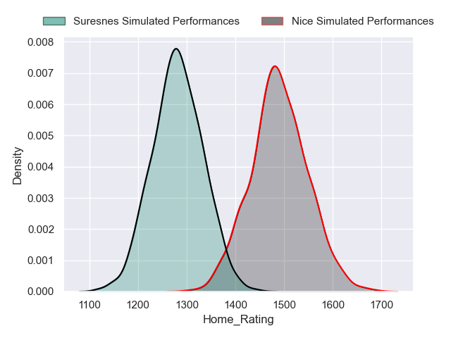
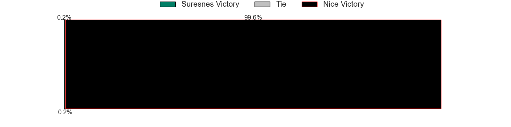
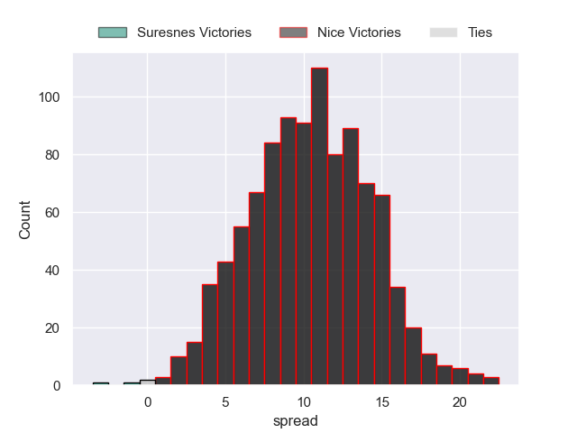
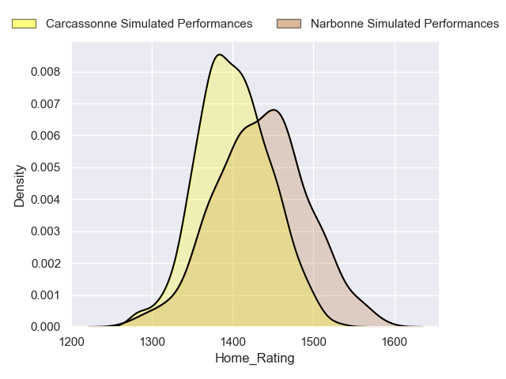
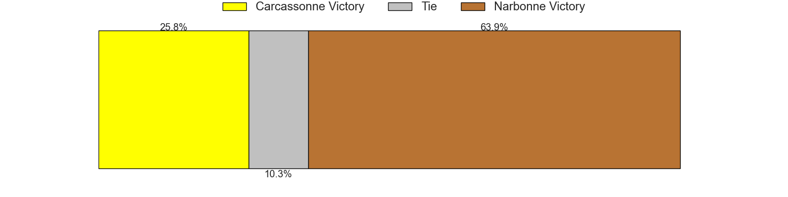
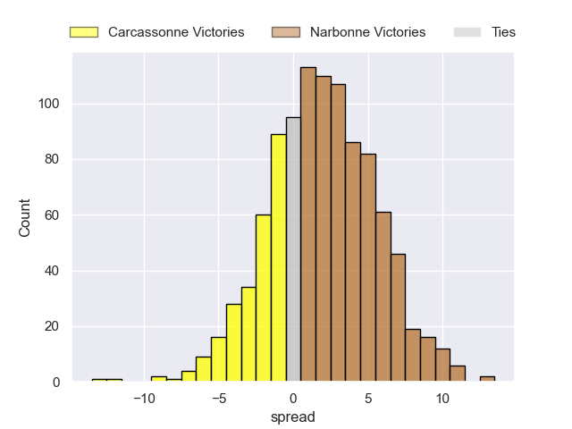

---  
title: "Nationale 2023 Status"  
date: 2024-05-10 6:00:00 -0500  
categories: model review projection  
layout: article  
aside:  
    toc: true  
---
# Current Team Rankings

# Standings

## Current Standings

| Club                |   Played |   Wins |   Point Differential |   Losing Bonus Points |   Try Bonus Points |   Competition Points |
|:--------------------|---------:|-------:|---------------------:|----------------------:|-------------------:|---------------------:|
| Narbonne            |       27 |     19 |                  166 |                     6 |                  8 |                   90 |
| Carcassonne         |       28 |     19 |                  215 |                     4 |                nan |                   87 |
| Nice                |       26 |     17 |                  291 |                     4 |                nan |                   84 |
| Albi                |       27 |     17 |                  229 |                     8 |                nan |                   82 |
| Suresnes            |       27 |     17 |                   62 |                     3 |                nan |                   76 |
| Chambery            |       27 |     15 |                   96 |                     6 |                nan |                   72 |
| Périgueux           |       26 |     14 |                  124 |                     6 |                nan |                   70 |
| Bourgoin-Jallieu    |       26 |     13 |                   24 |                     6 |                nan |                   64 |
| US Bressane         |       26 |     11 |                   30 |                    11 |                nan |                   61 |
| Massy               |       26 |     11 |                   14 |                    10 |                nan |                   56 |
| Carqueiranne-Hyères |       26 |     12 |                  -77 |                     4 |                  2 |                   56 |
| Tarbes              |       26 |     10 |                 -136 |                     9 |                  1 |                   50 |
| Blagnac             |       26 |      4 |                 -486 |                     1 |                nan |                   22 |
| Vienne              |       26 |      3 |                 -552 |                     3 |                nan |                   15 |

## Projected Remaining Table

| Club        |   Matches Remaining |   Wins |   Point Differential |   Losing Bonus Points |   Try Bonus Points |   Competition Points |
|:------------|--------------------:|-------:|---------------------:|----------------------:|-------------------:|---------------------:|
| Nice        |                   1 |    1   |              10.4083 |                   0   |                0.6 |                  4.6 |
| Narbonne    |                   1 |    0.7 |               1.9702 |                   0.3 |                0.3 |                  3.4 |
| Carcassonne |                   1 |    0.3 |              -1.9702 |                   0.6 |                0.1 |                  2   |
| Suresnes    |                   1 |    0   |             -10.4083 |                   0.2 |                0.2 |                  0.4 |

## Projected Total Table

| Club                |   Total Matches |   Wins |   Point Differential |   Losing Bonus Points |   Try Bonus Points |   Competition Points |
|:--------------------|----------------:|-------:|---------------------:|----------------------:|-------------------:|---------------------:|
| Narbonne            |              28 |   19.7 |             167.97   |                   6.3 |                8.3 |                 93.4 |
| Carcassonne         |              29 |   19.3 |             213.03   |                   4.6 |                0.1 |                 89   |
| Nice                |              27 |   18   |             301.408  |                   4   |                0.6 |                 88.6 |
| Albi                |              27 |   17   |             229      |                   8   |                0   |                 82   |
| Suresnes            |              28 |   17   |              51.5917 |                   3.2 |                0.2 |                 76.4 |
| Chambery            |              27 |   15   |              96      |                   6   |                0   |                 72   |
| Périgueux           |              26 |   14   |             124      |                   6   |                0   |                 70   |
| Bourgoin-Jallieu    |              26 |   13   |              24      |                   6   |                0   |                 64   |
| US Bressane         |              26 |   11   |              30      |                  11   |                0   |                 61   |
| Massy               |              26 |   11   |              14      |                  10   |                0   |                 56   |
| Carqueiranne-Hyères |              26 |   12   |             -77      |                   4   |                2   |                 56   |
| Tarbes              |              26 |   10   |            -136      |                   9   |                1   |                 50   |
| Blagnac             |              26 |    4   |            -486      |                   1   |                0   |                 22   |
| Vienne              |              26 |    3   |            -552      |                   3   |                0   |                 15   |

# Completed Match Review

| Model | Percent Correct Predictions | Spread Error |
| ------ | ------ | ------ |
| Club Level | 73.5% | 12.7 |
| Player Level: Lineup | 69.1% | 12.1 |
| Player Level: Minutes | 68.0% | 13.1 |

# Future Predictions

## Week 29

### Nice V Suresnes on 2024/05/11

Average Margin: Nice by 10.4

Average Scoreline: 28-17

### Narbonne V Carcassonne on 2024/05/11

Average Margin: Narbonne by 2.0

Average Scoreline: 23-22

