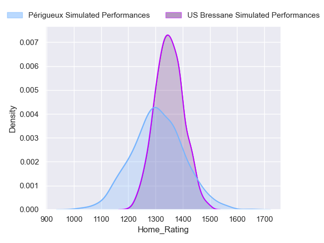
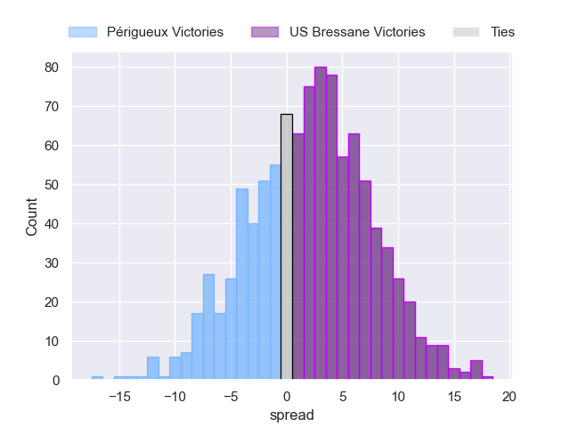
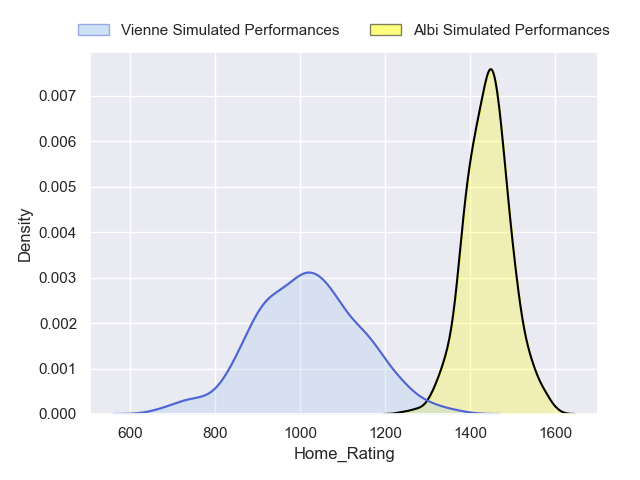
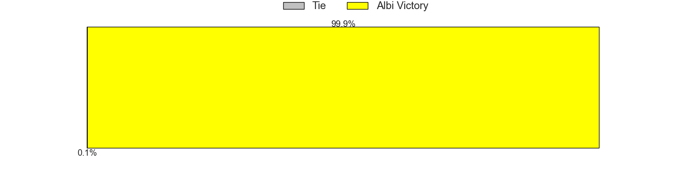
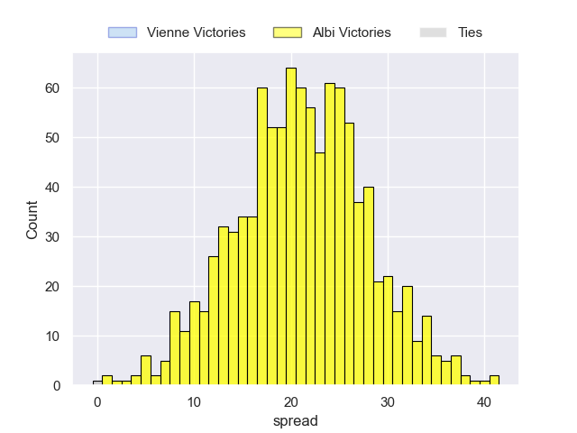
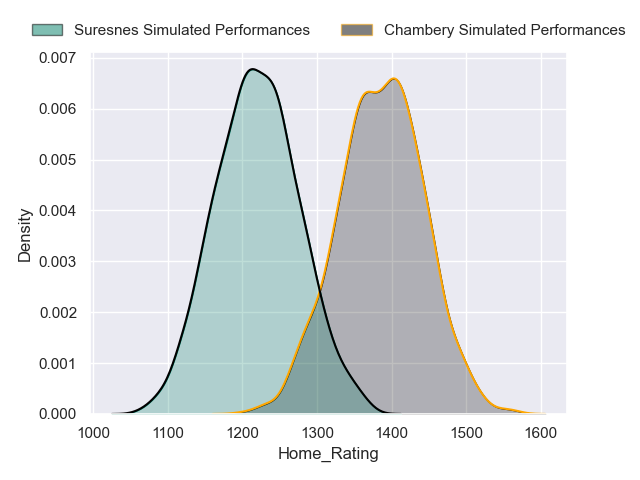
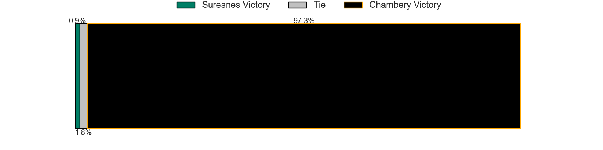
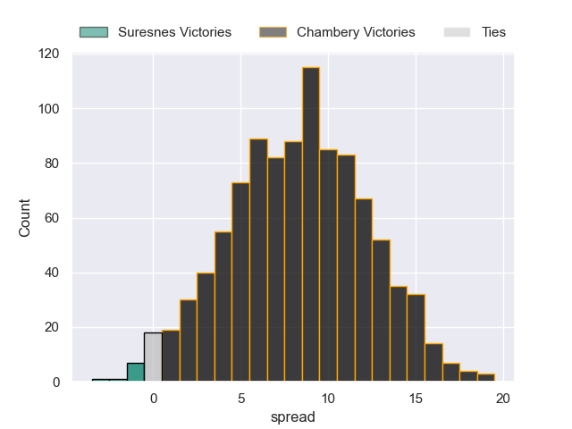

---  
title: "Nationale 2023 Status"  
date: 2024-01-22 6:00:00 -0500  
categories: model review projection  
layout: article  
aside:  
    toc: true  
---
# Current Team Rankings

# Standings

## Current Standings

| Club                |   Played |   Wins |   Point Differential |   Losing Bonus Points |   Try Bonus Points |   Competition Points |
|:--------------------|---------:|-------:|---------------------:|----------------------:|-------------------:|---------------------:|
| Nice                |       17 |     11 |                  219 |                     2 |                  9 |                   57 |
| Narbonne            |       16 |     12 |                  126 |                     4 |                  4 |                   56 |
| Albi                |       16 |     10 |                   87 |                     5 |                  3 |                   48 |
| Carcassonne         |       16 |     10 |                   74 |                     3 |                  2 |                   47 |
| Chambery            |       16 |     10 |                   46 |                     3 |                  2 |                   45 |
| Suresnes            |       16 |     10 |                  -20 |                     1 |                  2 |                   43 |
| Bourgoin-Jallieu    |       16 |      8 |                   39 |                     5 |                  2 |                   41 |
| Périgueux           |       16 |      9 |                   26 |                     4 |                  1 |                   41 |
| Blagnac             |       15 |      7 |                   12 |                     4 |                  4 |                   36 |
| Carqueiranne-Hyères |       16 |      7 |                  -44 |                     3 |                  1 |                   34 |
| US Bressane         |       17 |      5 |                  -59 |                     8 |                  1 |                   29 |
| Tarbes              |       16 |      6 |                 -131 |                     5 |                  0 |                   29 |
| Massy               |       16 |      4 |                  -54 |                     9 |                  0 |                   25 |
| Vienne              |       15 |      1 |                 -321 |                     2 |                  0 |                    6 |

## Projected Remaining Table

| Club                |   Matches Remaining |   Wins |   Point Differential |   Losing Bonus Points |   Try Bonus Points |   Competition Points |
|:--------------------|--------------------:|-------:|---------------------:|----------------------:|-------------------:|---------------------:|
| Nice                |                  10 |    7.6 |             38.7335  |                   2.2 |                4.4 |                 37.1 |
| Narbonne            |                  10 |    7.5 |             44.5304  |                   2.1 |                4.9 |                 37   |
| Albi                |                  10 |    7.2 |             46.9412  |                   2.4 |                3.8 |                 34.9 |
| Carcassonne         |                  10 |    7.4 |             45.1504  |                   2.4 |                2.1 |                 33.9 |
| Blagnac             |                  11 |    6   |              7.70973 |                   3.1 |                4.6 |                 31.6 |
| Périgueux           |                  10 |    5.9 |             18.8633  |                   2.6 |                4.6 |                 30.9 |
| Massy               |                  10 |    5.5 |             15.9992  |                   3.9 |                4.2 |                 30.1 |
| Chambery            |                  10 |    5.7 |             14.3059  |                   3.2 |                3.8 |                 29.7 |
| Bourgoin-Jallieu    |                  10 |    5.3 |             10.2423  |                   3.9 |                3   |                 28.1 |
| US Bressane         |                  10 |    4.6 |             -1.20766 |                   3.8 |                5   |                 27.2 |
| Tarbes              |                  10 |    3.3 |            -26.2774  |                   3.3 |                4.4 |                 20.9 |
| Carqueiranne-Hyères |                  10 |    2.9 |            -23.4148  |                   4.6 |                3.4 |                 19.5 |
| Suresnes            |                  10 |    1.9 |            -45.1224  |                   4   |                3.8 |                 15.4 |
| Vienne              |                  11 |    0.3 |           -146.454   |                   1.8 |                2.5 |                  5.5 |

## Projected Total Table

| Club                |   Total Matches |   Wins |   Point Differential |   Losing Bonus Points |   Try Bonus Points |   Competition Points |
|:--------------------|----------------:|-------:|---------------------:|----------------------:|-------------------:|---------------------:|
| Nice                |              27 |   18.6 |             257.734  |                   4.2 |               13.4 |                 94.1 |
| Narbonne            |              26 |   19.5 |             170.53   |                   6.1 |                8.9 |                 93   |
| Albi                |              26 |   17.2 |             133.941  |                   7.4 |                6.8 |                 82.9 |
| Carcassonne         |              26 |   17.4 |             119.15   |                   5.4 |                4.1 |                 80.9 |
| Chambery            |              26 |   15.7 |              60.3059 |                   6.2 |                5.8 |                 74.7 |
| Périgueux           |              26 |   14.9 |              44.8633 |                   6.6 |                5.6 |                 71.9 |
| Bourgoin-Jallieu    |              26 |   13.3 |              49.2423 |                   8.9 |                5   |                 69.1 |
| Blagnac             |              26 |   13   |              19.7097 |                   7.1 |                8.6 |                 67.6 |
| Suresnes            |              26 |   11.9 |             -65.1224 |                   5   |                5.8 |                 58.4 |
| US Bressane         |              27 |    9.6 |             -60.2077 |                  11.8 |                6   |                 56.2 |
| Massy               |              26 |    9.5 |             -38.0008 |                  12.9 |                4.2 |                 55.1 |
| Carqueiranne-Hyères |              26 |    9.9 |             -67.4148 |                   7.6 |                4.4 |                 53.5 |
| Tarbes              |              26 |    9.3 |            -157.277  |                   8.3 |                4.4 |                 49.9 |
| Vienne              |              26 |    1.3 |            -467.454  |                   3.8 |                2.5 |                 11.5 |

# Completed Match Review

| Model | Percent Correct Predictions | Spread Error |
| ------ | ------ | ------ |
| Club Level | 73.0% | 8.3 |
| Player Level: Lineup | 73.9% | 8.2 |
| Player Level: Minutes | 73.0% | 8.3 |

# Future Predictions

## Week 18

### US Bressane V Périgueux on 2024/01/26

Average Margin: US Bressane by 2.1

Average Scoreline: 29-27

### Albi V Vienne on 2024/01/26

Average Margin: Albi by 21.1

Average Scoreline: 32-11

### Chambery V Suresnes on 2024/01/26

Average Margin: Chambery by 8.3

Average Scoreline: 31-23

### Nice V Narbonne on 2024/01/27

Average Margin: Nice by 4.5

Average Scoreline: 26-21

### Massy V Carcassonne on 2024/01/27

Average Margin: Carcassonne by 0.7

Average Scoreline: 32-31

### Bourgoin-Jallieu V Tarbes on 2024/01/27

Average Margin: Bourgoin-Jallieu by 8.2

Average Scoreline: 23-15

### Blagnac V Carqueiranne-Hyères on 2024/01/27

Average Margin: Blagnac by 6.4

Average Scoreline: 20-13

## Week 19

### US Bressane V Chambery on 2024/02/03

Average Margin: US Bressane by 1.2

Average Scoreline: 27-26

### Nice V Carqueiranne-Hyères on 2024/02/03

Average Margin: Nice by 10.4

Average Scoreline: 29-18

### Carcassonne V Blagnac on 2024/02/03

Average Margin: Carcassonne by 6.9

Average Scoreline: 25-19

### Vienne V Périgueux on 2024/02/03

Average Margin: Périgueux by 10.9

Average Scoreline: 28-17

### Suresnes V Massy on 2024/02/03

Average Margin: Massy by 0.7

Average Scoreline: 27-27

### Bourgoin-Jallieu V Narbonne on 2024/02/03

Average Margin: Bourgoin-Jallieu by 1.2

Average Scoreline: 28-27

### Tarbes V Albi on 2024/02/03

Average Margin: Albi by 3.6

Average Scoreline: 28-25

## Week 20

### Carqueiranne-Hyères V Bourgoin-Jallieu on 2024/02/10

Average Margin: Bourgoin-Jallieu by 0.2

Average Scoreline: 33-33

### Vienne V US Bressane on 2024/02/10

Average Margin: US Bressane by 9.9

Average Scoreline: 30-20

### Carcassonne V Nice on 2024/02/10

Average Margin: Carcassonne by 2.9

Average Scoreline: 27-24

### Massy V Chambery on 2024/02/10

Average Margin: Massy by 2.3

Average Scoreline: 31-29

### Narbonne V Albi on 2024/02/10

Average Margin: Narbonne by 3.2

Average Scoreline: 30-27

### Périgueux V Tarbes on 2024/02/10

Average Margin: Périgueux by 7.1

Average Scoreline: 26-19

### Blagnac V Suresnes on 2024/02/10

Average Margin: Blagnac by 7.9

Average Scoreline: 28-20

## Week 21

### Carcassonne V Bourgoin-Jallieu on 2024/02/17

Average Margin: Carcassonne by 6.2

Average Scoreline: 25-19

### Tarbes V Vienne on 2024/02/17

Average Margin: Tarbes by 13.5

Average Scoreline: 29-16

### Chambery V Blagnac on 2024/02/17

Average Margin: Chambery by 3.9

Average Scoreline: 25-21

### Narbonne V Périgueux on 2024/02/17

Average Margin: Narbonne by 6.6

Average Scoreline: 24-18

### Suresnes V Nice on 2024/02/17

Average Margin: Nice by 5.1

Average Scoreline: 27-22

### Massy V US Bressane on 2024/02/17

Average Margin: Massy by 4.4

Average Scoreline: 22-18

### Carqueiranne-Hyères V Albi on 2024/02/17

Average Margin: Albi by 2.4

Average Scoreline: 31-29

## Week 22

### US Bressane V Tarbes on 2024/03/02

Average Margin: US Bressane by 5.6

Average Scoreline: 27-22

### Bourgoin-Jallieu V Suresnes on 2024/03/02

Average Margin: Bourgoin-Jallieu by 8.7

Average Scoreline: 26-17

### Albi V Carcassonne on 2024/03/02

Average Margin: Albi by 3.2

Average Scoreline: 26-23

### Blagnac V Massy on 2024/03/02

Average Margin: Blagnac by 3.9

Average Scoreline: 22-18

### Périgueux V Carqueiranne-Hyères on 2024/03/02

Average Margin: Périgueux by 6.0

Average Scoreline: 25-19

### Nice V Chambery on 2024/03/02

Average Margin: Nice by 7.0

Average Scoreline: 29-22

### Vienne V Narbonne on 2024/03/02

Average Margin: Narbonne by 13.3

Average Scoreline: 31-17

## Week 23

### Chambery V Bourgoin-Jallieu on 2024/03/09

Average Margin: Chambery by 3.0

Average Scoreline: 29-26

### Carqueiranne-Hyères V Vienne on 2024/03/09

Average Margin: Carqueiranne-Hyères by 14.4

Average Scoreline: 27-13

### Albi V Suresnes on 2024/03/09

Average Margin: Albi by 11.0

Average Scoreline: 26-15

### Blagnac V US Bressane on 2024/03/09

Average Margin: Blagnac by 4.7

Average Scoreline: 24-19

### Narbonne V Tarbes on 2024/03/09

Average Margin: Narbonne by 10.1

Average Scoreline: 27-17

### Carcassonne V Périgueux on 2024/03/09

Average Margin: Carcassonne by 6.8

Average Scoreline: 26-19

### Massy V Nice on 2024/03/09

Average Margin: Nice by 1.2

Average Scoreline: 25-24

## Week 24

### Albi V Chambery on 2024/03/23

Average Margin: Albi by 6.2

Average Scoreline: 27-21

### Périgueux V Suresnes on 2024/03/23

Average Margin: Périgueux by 7.9

Average Scoreline: 23-15

### Narbonne V US Bressane on 2024/03/23

Average Margin: Narbonne by 7.8

Average Scoreline: 28-20

### Massy V Bourgoin-Jallieu on 2024/03/23

Average Margin: Massy by 1.9

Average Scoreline: 29-27

### Nice V Blagnac on 2024/03/23

Average Margin: Nice by 7.4

Average Scoreline: 25-17

### Tarbes V Carqueiranne-Hyères on 2024/03/23

Average Margin: Tarbes by 2.4

Average Scoreline: 29-26

### Vienne V Carcassonne on 2024/03/23

Average Margin: Carcassonne by 14.0

Average Scoreline: 35-21

## Week 25

### US Bressane V Nice on 2024/03/30

Average Margin: Nice by 2.1

Average Scoreline: 28-26

### Massy V Albi on 2024/03/30

Average Margin: Albi by 0.3

Average Scoreline: 26-26

### Blagnac V Bourgoin-Jallieu on 2024/03/30

Average Margin: Blagnac by 2.7

Average Scoreline: 27-25

### Suresnes V Vienne on 2024/03/30

Average Margin: Suresnes by 12.6

Average Scoreline: 24-11

### Chambery V Périgueux on 2024/03/30

Average Margin: Chambery by 4.2

Average Scoreline: 24-20

### Carcassonne V Tarbes on 2024/03/30

Average Margin: Carcassonne by 10.7

Average Scoreline: 29-18

### Carqueiranne-Hyères V Narbonne on 2024/03/30

Average Margin: Narbonne by 2.5

Average Scoreline: 32-29

## Week 26

### Narbonne V Carcassonne on 2024/04/06

Average Margin: Narbonne by 2.8

Average Scoreline: 31-28

### Albi V Blagnac on 2024/04/06

Average Margin: Albi by 6.6

Average Scoreline: 22-16

### Bourgoin-Jallieu V Nice on 2024/04/06

Average Margin: Bourgoin-Jallieu by 0.1

Average Scoreline: 25-25

### Tarbes V Suresnes on 2024/04/06

Average Margin: Tarbes by 4.1

Average Scoreline: 25-21

### Vienne V Chambery on 2024/04/06

Average Margin: Chambery by 10.5

Average Scoreline: 30-20

### Périgueux V Massy on 2024/04/06

Average Margin: Périgueux by 3.7

Average Scoreline: 26-22

### US Bressane V Carqueiranne-Hyères on 2024/04/06

Average Margin: US Bressane by 4.7

Average Scoreline: 24-19

## Week 27

### Vienne V Blagnac on 2024/04/13

Average Margin: Blagnac by 10.1

Average Scoreline: 30-20

## Week 28

### Carqueiranne-Hyères V Carcassonne on 2024/04/27

Average Margin: Carcassonne by 2.8

Average Scoreline: 30-27

### Périgueux V Blagnac on 2024/04/27

Average Margin: Périgueux by 3.1

Average Scoreline: 25-22

### Tarbes V Chambery on 2024/04/27

Average Margin: Chambery by 1.0

Average Scoreline: 28-27

### Massy V Vienne on 2024/04/27

Average Margin: Massy by 16.2

Average Scoreline: 26-10

### Nice V Albi on 2024/04/27

Average Margin: Nice by 4.2

Average Scoreline: 23-18

### Suresnes V Narbonne on 2024/04/27

Average Margin: Narbonne by 4.0

Average Scoreline: 29-25

### Bourgoin-Jallieu V US Bressane on 2024/04/27

Average Margin: Bourgoin-Jallieu by 5.6

Average Scoreline: 25-19

