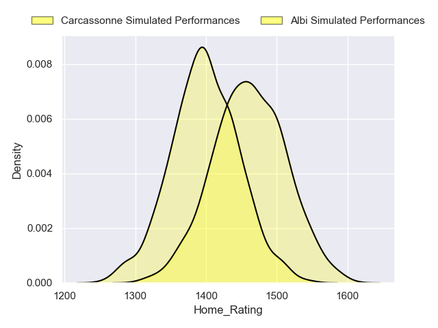
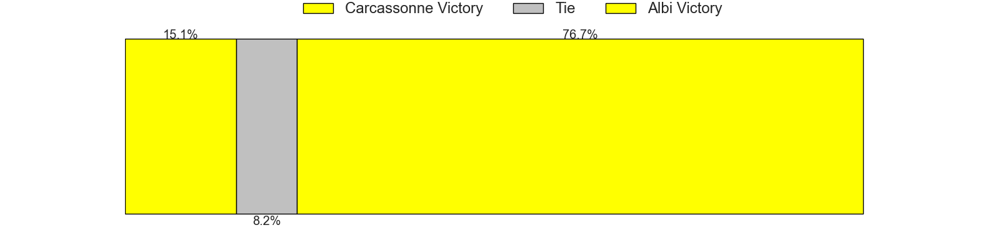
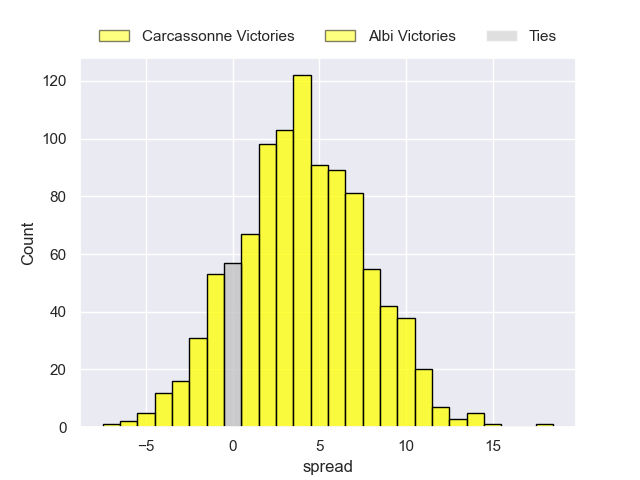
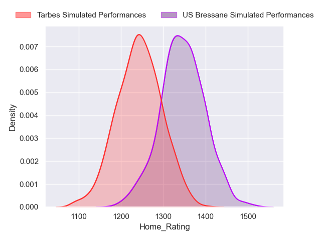
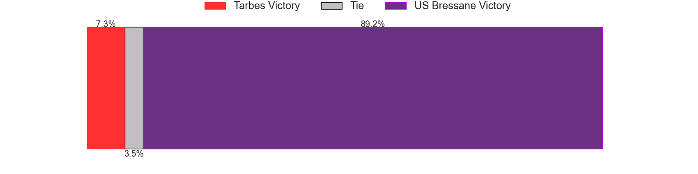
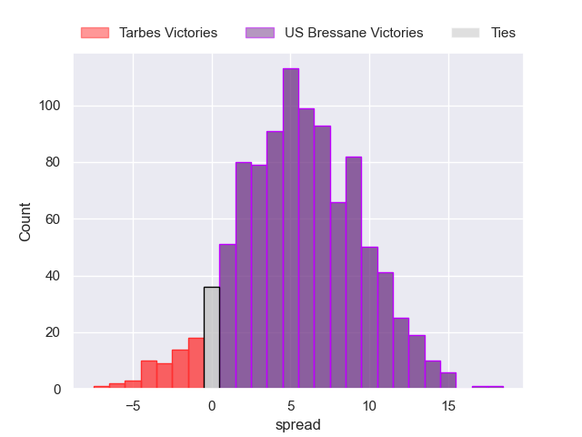

---  
title: "Nationale 2023 Status"  
date: 2024-02-27 6:00:00 -0500  
categories: model review projection  
layout: article  
aside:  
    toc: true  
---
# Current Team Rankings

# Standings

## Current Standings

| Club                |   Played |   Wins |   Point Differential |   Losing Bonus Points |   Try Bonus Points |   Competition Points |
|:--------------------|---------:|-------:|---------------------:|----------------------:|-------------------:|---------------------:|
| Nice                |       20 |     14 |                  270 |                     3 |                  8 |                   69 |
| Narbonne            |       20 |     14 |                  125 |                     4 |                  6 |                   66 |
| Albi                |       20 |     12 |                  160 |                     7 |                  5 |                   60 |
| Suresnes            |       20 |     14 |                   16 |                     1 |                nan |                   60 |
| Carcassonne         |       20 |     12 |                   90 |                     4 |                nan |                   56 |
| Chambery            |       20 |     12 |                   78 |                     3 |                nan |                   53 |
| Périgueux           |       20 |     10 |                   52 |                     5 |                  3 |                   50 |
| Bourgoin-Jallieu    |       20 |     10 |                   40 |                     6 |                  2 |                   50 |
| Carqueiranne-Hyères |       20 |     10 |                  -32 |                     2 |                  1 |                   45 |
| Massy               |       20 |      8 |                  -15 |                     9 |                  0 |                   41 |
| US Bressane         |       20 |      7 |                  -18 |                     9 |                  2 |                   41 |
| Tarbes              |       20 |      8 |                 -116 |                     6 |                  1 |                   39 |
| Blagnac             |       19 |      3 |                 -292 |                     2 |                nan |                   19 |
| Vienne              |       19 |      2 |                 -358 |                     3 |                  0 |                   11 |

## Projected Remaining Table

| Club                |   Matches Remaining |   Wins |   Point Differential |   Losing Bonus Points |   Try Bonus Points |   Competition Points |
|:--------------------|--------------------:|-------:|---------------------:|----------------------:|-------------------:|---------------------:|
| Nice                |                   6 |    5.2 |             36.5312  |                   0.8 |                3   |                 24.6 |
| Narbonne            |                   6 |    5   |             37.988   |                   0.9 |                2.9 |                 23.9 |
| Albi                |                   6 |    4.5 |             29.6002  |                   1.2 |                1.6 |                 20.7 |
| Carcassonne         |                   6 |    3.9 |             27.4994  |                   1.7 |                1.9 |                 19.4 |
| Périgueux           |                   6 |    3.8 |             13.7712  |                   1.5 |                2.1 |                 18.7 |
| Bourgoin-Jallieu    |                   6 |    3.6 |             10.5177  |                   2.1 |                1.6 |                 18.2 |
| Massy               |                   6 |    3.3 |             15.5803  |                   2.3 |                2.3 |                 17.9 |
| Chambery            |                   6 |    3.1 |              4.01076 |                   1.7 |                2.1 |                 16.2 |
| US Bressane         |                   6 |    2.6 |             -6.7291  |                   2.3 |                2.4 |                 14.9 |
| Carqueiranne-Hyères |                   6 |    2.4 |              4.24895 |                   2.8 |                2.4 |                 14.7 |
| Tarbes              |                   6 |    2   |            -20.6581  |                   2.1 |                2.1 |                 12   |
| Suresnes            |                   6 |    1.7 |             -9.97816 |                   2.4 |                2.3 |                 11.4 |
| Blagnac             |                   6 |    0.8 |            -43.9289  |                   2.2 |                2.1 |                  7.7 |
| Vienne              |                   6 |    0.2 |            -98.4534  |                   0.7 |                0.6 |                  1.9 |

## Projected Total Table

| Club                |   Total Matches |   Wins |   Point Differential |   Losing Bonus Points |   Try Bonus Points |   Competition Points |
|:--------------------|----------------:|-------:|---------------------:|----------------------:|-------------------:|---------------------:|
| Nice                |              26 |   19.2 |           306.531    |                   3.8 |               11   |                 93.6 |
| Narbonne            |              26 |   19   |           162.988    |                   4.9 |                8.9 |                 89.9 |
| Albi                |              26 |   16.5 |           189.6      |                   8.2 |                6.6 |                 80.7 |
| Carcassonne         |              26 |   15.9 |           117.499    |                   5.7 |                1.9 |                 75.4 |
| Suresnes            |              26 |   15.7 |             6.02184  |                   3.4 |                2.3 |                 71.4 |
| Chambery            |              26 |   15.1 |            82.0108   |                   4.7 |                2.1 |                 69.2 |
| Périgueux           |              26 |   13.8 |            65.7712   |                   6.5 |                5.1 |                 68.7 |
| Bourgoin-Jallieu    |              26 |   13.6 |            50.5177   |                   8.1 |                3.6 |                 68.2 |
| Carqueiranne-Hyères |              26 |   12.4 |           -27.7511   |                   4.8 |                3.4 |                 59.7 |
| Massy               |              26 |   11.3 |             0.580307 |                  11.3 |                2.3 |                 58.9 |
| US Bressane         |              26 |    9.6 |           -24.7291   |                  11.3 |                4.4 |                 55.9 |
| Tarbes              |              26 |   10   |          -136.658    |                   8.1 |                3.1 |                 51   |
| Blagnac             |              25 |    3.8 |          -335.929    |                   4.2 |                2.1 |                 26.7 |
| Vienne              |              25 |    2.2 |          -456.453    |                   3.7 |                0.6 |                 12.9 |

# Completed Match Review

| Model | Percent Correct Predictions | Spread Error |
| ------ | ------ | ------ |
| Club Level | 74.8% | 12.0 |
| Player Level: Lineup | 66.2% | 11.9 |
| Player Level: Minutes | 69.1% | 11.8 |

# Future Predictions

## Week 21

### Albi V Carcassonne on 2024/03/01

Average Margin: Albi by 4.0

Average Scoreline: 19-15

### US Bressane V Tarbes on 2024/03/01

Average Margin: US Bressane by 5.5

Average Scoreline: 31-26

### Bourgoin-Jallieu V Suresnes on 2024/03/02

Average Margin: Bourgoin-Jallieu by 7.0

Average Scoreline: 23-16

### Nice V Chambery on 2024/03/02

Average Margin: Nice by 8.6

Average Scoreline: 24-15

### Blagnac V Massy on 2024/03/02

Average Margin: Massy by 2.4

Average Scoreline: 25-23

### Périgueux V Carqueiranne-Hyères on 2024/03/02

Average Margin: Périgueux by 5.2

Average Scoreline: 19-13

### Vienne V Narbonne on 2024/03/02

Average Margin: Narbonne by 15.8

Average Scoreline: 24-8

## Week 22

### Albi V Suresnes on 2024/03/08

Average Margin: Albi by 10.0

Average Scoreline: 24-14

### Carcassonne V Périgueux on 2024/03/08

Average Margin: Carcassonne by 6.2

Average Scoreline: 18-12

### Massy V Nice on 2024/03/08

Average Margin: Nice by 2.7

Average Scoreline: 23-20

### Narbonne V Tarbes on 2024/03/09

Average Margin: Narbonne by 9.3

Average Scoreline: 32-22

### Blagnac V US Bressane on 2024/03/09

Average Margin: US Bressane by 0.9

Average Scoreline: 30-29

### Carqueiranne-Hyères V Vienne on 2024/03/09

Average Margin: Carqueiranne-Hyères by 18.1

Average Scoreline: 22-4

### Chambery V Bourgoin-Jallieu on 2024/03/09

Average Margin: Chambery by 2.7

Average Scoreline: 29-27

## Week 23

### Albi V Chambery on 2024/03/22

Average Margin: Albi by 6.8

Average Scoreline: 22-16

### Nice V Blagnac on 2024/03/23

Average Margin: Nice by 14.9

Average Scoreline: 30-15

### Massy V Bourgoin-Jallieu on 2024/03/23

Average Margin: Massy by 2.0

Average Scoreline: 23-21

### Vienne V Carcassonne on 2024/03/23

Average Margin: Carcassonne by 16.2

Average Scoreline: 23-7

### Tarbes V Carqueiranne-Hyères on 2024/03/23

Average Margin: Tarbes by 1.9

Average Scoreline: 26-24

### Périgueux V Suresnes on 2024/03/23

Average Margin: Périgueux by 6.3

Average Scoreline: 23-17

### Narbonne V US Bressane on 2024/03/23

Average Margin: Narbonne by 7.3

Average Scoreline: 31-24

## Week 24

### US Bressane V Nice on 2024/03/29

Average Margin: Nice by 3.9

Average Scoreline: 26-22

### Massy V Albi on 2024/03/29

Average Margin: Albi by 0.7

Average Scoreline: 21-20

### Carcassonne V Tarbes on 2024/03/29

Average Margin: Carcassonne by 10.1

Average Scoreline: 28-18

### Carqueiranne-Hyères V Narbonne on 2024/03/30

Average Margin: Narbonne by 1.1

Average Scoreline: 21-20

### Blagnac V Bourgoin-Jallieu on 2024/03/30

Average Margin: Bourgoin-Jallieu by 3.6

Average Scoreline: 28-25

### Chambery V Périgueux on 2024/03/30

Average Margin: Chambery by 3.9

Average Scoreline: 21-17

### Suresnes V Vienne on 2024/03/30

Average Margin: Suresnes by 17.7

Average Scoreline: 24-6

## Week 25

### Albi V Blagnac on 2024/04/05

Average Margin: Albi by 13.1

Average Scoreline: 33-20

### US Bressane V Carqueiranne-Hyères on 2024/04/05

Average Margin: US Bressane by 3.9

Average Scoreline: 26-22

### Tarbes V Suresnes on 2024/04/06

Average Margin: Tarbes by 2.5

Average Scoreline: 27-24

### Bourgoin-Jallieu V Nice on 2024/04/06

Average Margin: Nice by 1.3

Average Scoreline: 22-20

### Narbonne V Carcassonne on 2024/04/06

Average Margin: Narbonne by 2.7

Average Scoreline: 25-22

### Vienne V Chambery on 2024/04/06

Average Margin: Chambery by 12.6

Average Scoreline: 24-11

### Périgueux V Massy on 2024/04/06

Average Margin: Périgueux by 3.4

Average Scoreline: 22-18

## Week 26

### Périgueux V Blagnac on 2024/04/27

Average Margin: Périgueux by 9.0

Average Scoreline: 22-13

### Nice V Albi on 2024/04/27

Average Margin: Nice by 5.1

Average Scoreline: 22-17

### Bourgoin-Jallieu V US Bressane on 2024/04/27

Average Margin: Bourgoin-Jallieu by 5.8

Average Scoreline: 24-19

### Carqueiranne-Hyères V Carcassonne on 2024/04/27

Average Margin: Carcassonne by 1.7

Average Scoreline: 23-22

### Tarbes V Chambery on 2024/04/27

Average Margin: Chambery by 0.3

Average Scoreline: 27-26

### Massy V Vienne on 2024/04/27

Average Margin: Massy by 18.0

Average Scoreline: 25-7

### Suresnes V Narbonne on 2024/04/27

Average Margin: Narbonne by 1.8

Average Scoreline: 31-29

