---  
title: "Nationale 2023 Status"  
date: 2024-03-07 6:00:00 -0500  
categories: model review projection  
layout: article  
aside:  
    toc: true  
---
# Current Team Rankings

# Standings

## Current Standings

| Club                |   Played |   Wins |   Point Differential |   Losing Bonus Points |   Try Bonus Points |   Competition Points |
|:--------------------|---------:|-------:|---------------------:|----------------------:|-------------------:|---------------------:|
| Nice                |       21 |     15 |                  275 |                     3 |                  8 |                   73 |
| Narbonne            |       21 |     15 |                  153 |                     4 |                  7 |                   71 |
| Albi                |       21 |     13 |                  178 |                     7 |                  5 |                   64 |
| Suresnes            |       21 |     14 |                   21 |                     2 |                nan |                   61 |
| Carcassonne         |       21 |     13 |                   98 |                     3 |                nan |                   59 |
| Bourgoin-Jallieu    |       21 |     11 |                   47 |                     6 |                  3 |                   55 |
| Chambery            |       21 |     11 |                   46 |                     5 |                nan |                   51 |
| Périgueux           |       20 |     10 |                   52 |                     5 |                  3 |                   50 |
| Carqueiranne-Hyères |       20 |     11 |                   14 |                     2 |                  1 |                   49 |
| Massy               |       21 |      9 |                   10 |                     9 |                nan |                   45 |
| US Bressane         |       21 |      8 |                  -16 |                     9 |                  2 |                   45 |
| Tarbes              |       21 |      8 |                 -118 |                     7 |                  1 |                   40 |
| Blagnac             |       20 |      3 |                 -312 |                     2 |                nan |                   19 |
| Vienne              |       20 |      1 |                 -448 |                     3 |                  0 |                    7 |

## Projected Remaining Table

| Club                |   Matches Remaining |   Wins |   Point Differential |   Losing Bonus Points |   Try Bonus Points |   Competition Points |
|:--------------------|--------------------:|-------:|---------------------:|----------------------:|-------------------:|---------------------:|
| Nice                |                   5 |    4   |             25.6111  |                   1   |                2.7 |                 19.6 |
| Narbonne            |                   5 |    3.9 |             20.4099  |                   1   |                2.7 |                 19.4 |
| Périgueux           |                   6 |    3.7 |             11.4774  |                   1.5 |                2.2 |                 18.4 |
| Albi                |                   5 |    3.6 |             26.937   |                   1.1 |                2.4 |                 17.8 |
| Carcassonne         |                   5 |    3.6 |             30.0594  |                   1.2 |                1.8 |                 17.5 |
| Carqueiranne-Hyères |                   6 |    3.1 |             14.2823  |                   2.5 |                2.2 |                 16.9 |
| Chambery            |                   5 |    3   |             11.1202  |                   1.4 |                2   |                 15.4 |
| Massy               |                   5 |    2.9 |             18.6586  |                   1.8 |                1.5 |                 15   |
| Bourgoin-Jallieu    |                   5 |    2.6 |              3.18062 |                   2   |                1.7 |                 14.3 |
| US Bressane         |                   5 |    1.7 |            -12.2219  |                   2.2 |                2   |                 11   |
| Suresnes            |                   5 |    1.7 |             -1.84156 |                   2   |                2   |                 10.8 |
| Tarbes              |                   5 |    1.8 |            -16.0393  |                   1.6 |                1.7 |                 10.5 |
| Blagnac             |                   6 |    1.2 |            -41.6215  |                   1.7 |                2.1 |                  8.6 |
| Vienne              |                   6 |    0.2 |            -90.0122  |                   0.8 |                1   |                  2.6 |

## Projected Total Table

| Club                |   Total Matches |   Wins |   Point Differential |   Losing Bonus Points |   Try Bonus Points |   Competition Points |
|:--------------------|----------------:|-------:|---------------------:|----------------------:|-------------------:|---------------------:|
| Nice                |              26 |   19   |             300.611  |                   4   |               10.7 |                 92.6 |
| Narbonne            |              26 |   18.9 |             173.41   |                   5   |                9.7 |                 90.4 |
| Albi                |              26 |   16.6 |             204.937  |                   8.1 |                7.4 |                 81.8 |
| Carcassonne         |              26 |   16.6 |             128.059  |                   4.2 |                1.8 |                 76.5 |
| Suresnes            |              26 |   15.7 |              19.1584 |                   4   |                2   |                 71.8 |
| Bourgoin-Jallieu    |              26 |   13.6 |              50.1806 |                   8   |                4.7 |                 69.3 |
| Périgueux           |              26 |   13.7 |              63.4774 |                   6.5 |                5.2 |                 68.4 |
| Chambery            |              26 |   14   |              57.1202 |                   6.4 |                2   |                 66.4 |
| Carqueiranne-Hyères |              26 |   14.1 |              28.2823 |                   4.5 |                3.2 |                 65.9 |
| Massy               |              26 |   11.9 |              28.6586 |                  10.8 |                1.5 |                 60   |
| US Bressane         |              26 |    9.7 |             -28.2219 |                  11.2 |                4   |                 56   |
| Tarbes              |              26 |    9.8 |            -134.039  |                   8.6 |                2.7 |                 50.5 |
| Blagnac             |              26 |    4.2 |            -353.622  |                   3.7 |                2.1 |                 27.6 |
| Vienne              |              26 |    1.2 |            -538.012  |                   3.8 |                1   |                  9.6 |

# Completed Match Review

| Model | Percent Correct Predictions | Spread Error |
| ------ | ------ | ------ |
| Club Level | 77.9% | 9.6 |
| Player Level: Lineup | 67.4% | 11.7 |
| Player Level: Minutes | 70.2% | 11.8 |

# Future Predictions

## Week 22

### Albi V Suresnes on 2024/03/08

Average Margin: Albi by 9.4

Average Scoreline: 25-16

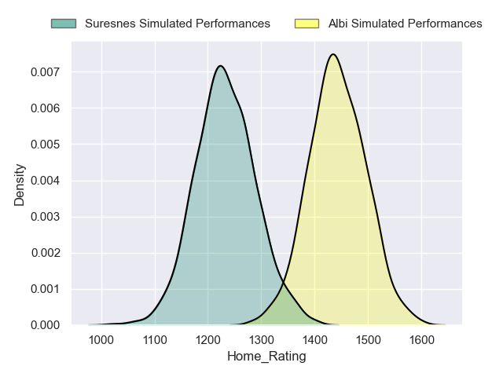
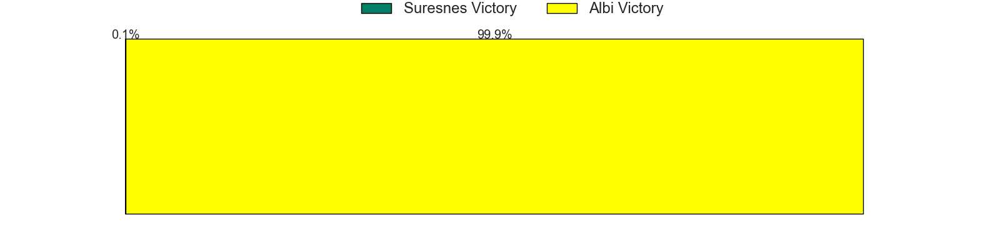
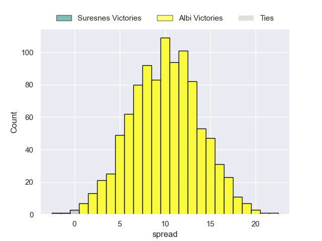

### Carcassonne V Périgueux on 2024/03/08

Average Margin: Carcassonne by 7.0

Average Scoreline: 21-14

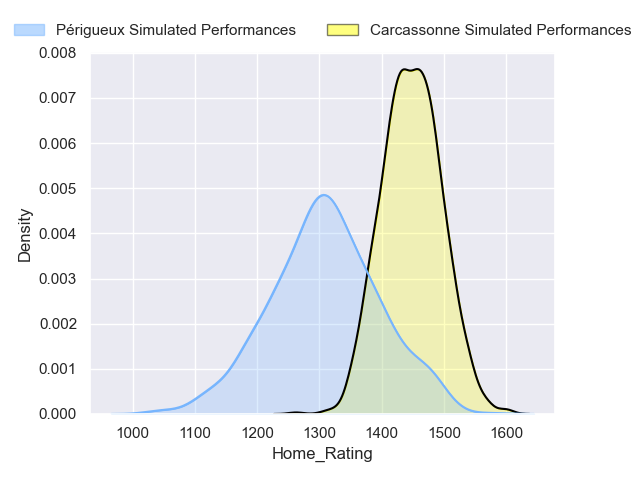
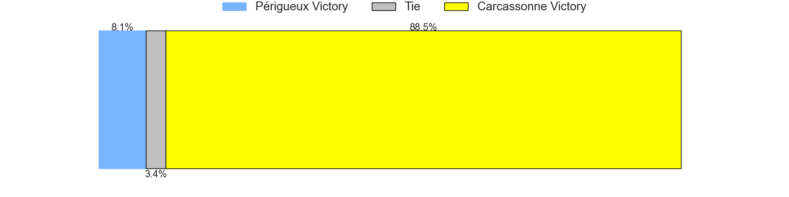
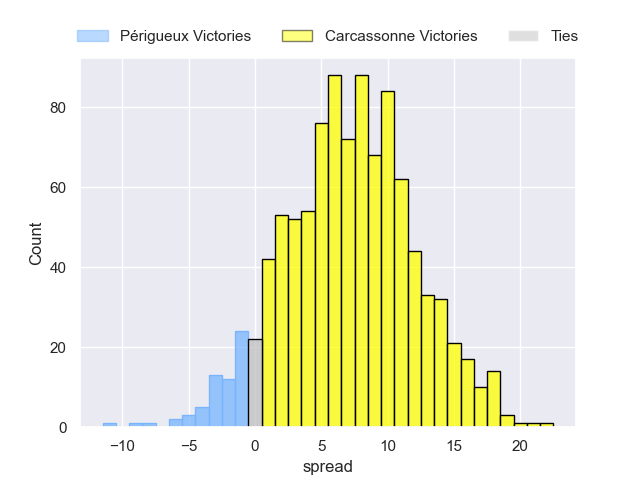

### Massy V Nice on 2024/03/08

Average Margin: Nice by 1.3

Average Scoreline: 23-22

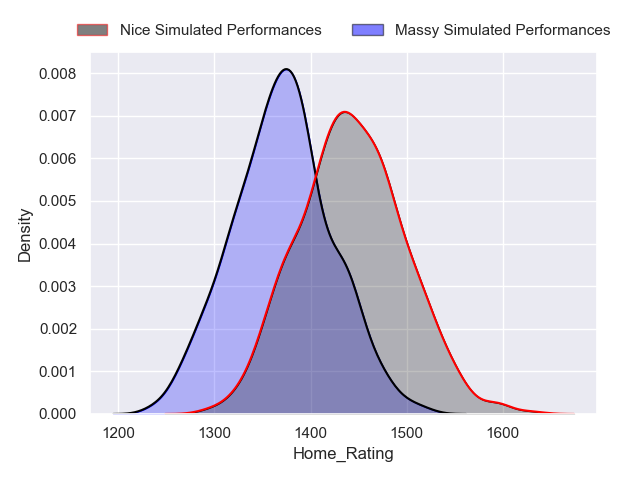
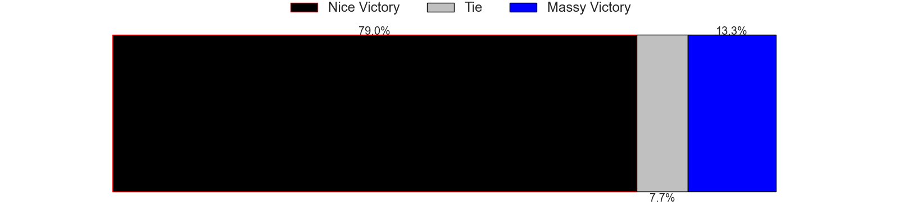
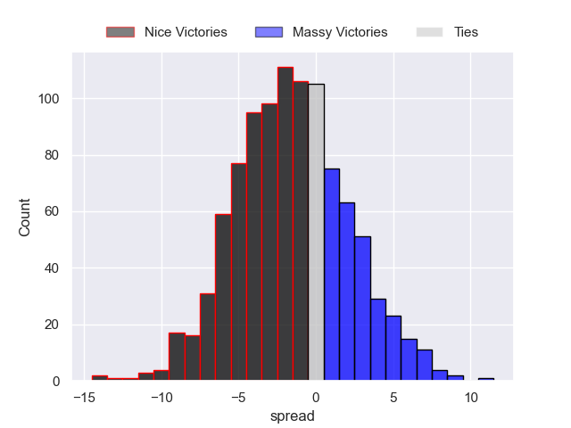

### Chambery V Bourgoin-Jallieu on 2024/03/09

Average Margin: Chambery by 2.7

Average Scoreline: 26-23

### Narbonne V Tarbes on 2024/03/09

Average Margin: Narbonne by 8.9

Average Scoreline: 29-20

### Blagnac V US Bressane on 2024/03/09

Average Margin: US Bressane by 2.2

Average Scoreline: 26-24

### Carqueiranne-Hyères V Vienne on 2024/03/09

Average Margin: Carqueiranne-Hyères by 19.3

Average Scoreline: 27-8

## Week 23

### Albi V Chambery on 2024/03/22

Average Margin: Albi by 7.4

Average Scoreline: 26-19

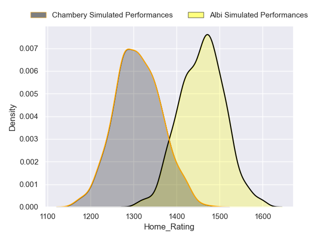

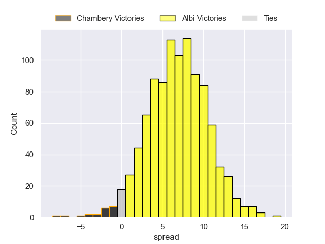

### Narbonne V US Bressane on 2024/03/23

Average Margin: Narbonne by 7.5

Average Scoreline: 26-19

### Tarbes V Carqueiranne-Hyères on 2024/03/23

Average Margin: Tarbes by 0.2

Average Scoreline: 23-23

### Périgueux V Suresnes on 2024/03/23

Average Margin: Périgueux by 5.6

Average Scoreline: 23-17

### Vienne V Carcassonne on 2024/03/23

Average Margin: Carcassonne by 15.9

Average Scoreline: 24-8

### Massy V Bourgoin-Jallieu on 2024/03/23

Average Margin: Massy by 3.1

Average Scoreline: 26-23

### Nice V Blagnac on 2024/03/23

Average Margin: Nice by 15.5

Average Scoreline: 30-14

## Week 24

### US Bressane V Nice on 2024/03/29

Average Margin: Nice by 3.2

Average Scoreline: 29-26

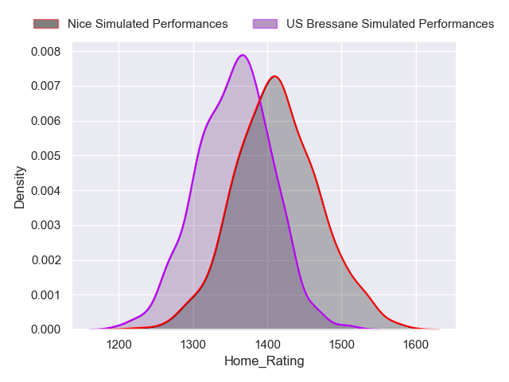
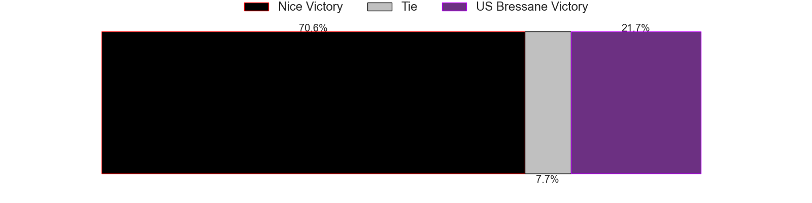
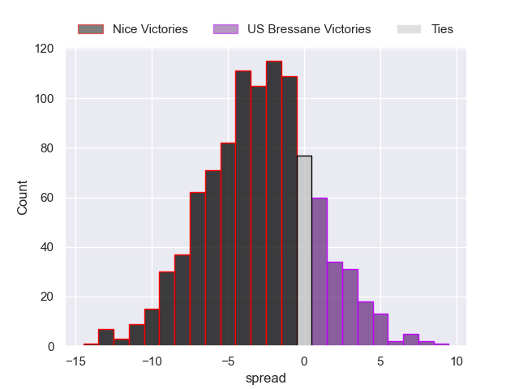

### Massy V Albi on 2024/03/29

Average Margin: Albi by 0.2

Average Scoreline: 21-21

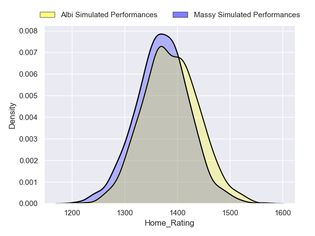

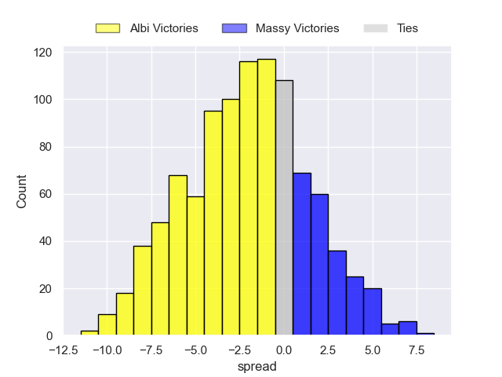

### Carcassonne V Tarbes on 2024/03/29

Average Margin: Carcassonne by 9.9

Average Scoreline: 29-19

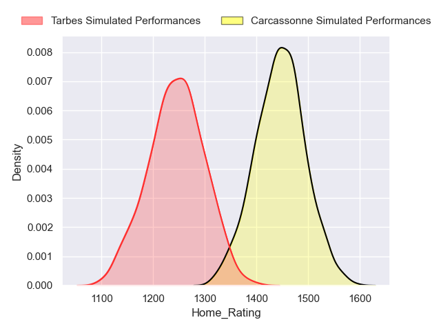
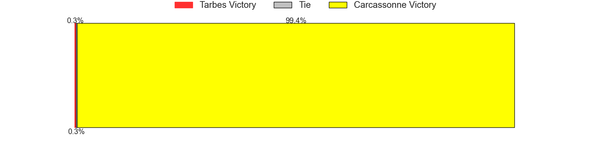
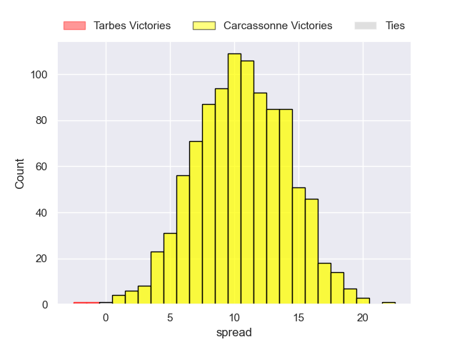

### Blagnac V Bourgoin-Jallieu on 2024/03/30

Average Margin: Bourgoin-Jallieu by 4.5

Average Scoreline: 26-22

### Chambery V Périgueux on 2024/03/30

Average Margin: Chambery by 3.6

Average Scoreline: 19-15

### Carqueiranne-Hyères V Narbonne on 2024/03/30

Average Margin: Carqueiranne-Hyères by 0.4

Average Scoreline: 23-23

### Suresnes V Vienne on 2024/03/30

Average Margin: Suresnes by 17.2

Average Scoreline: 27-10

## Week 25

### US Bressane V Carqueiranne-Hyères on 2024/04/05

Average Margin: US Bressane by 1.8

Average Scoreline: 22-20

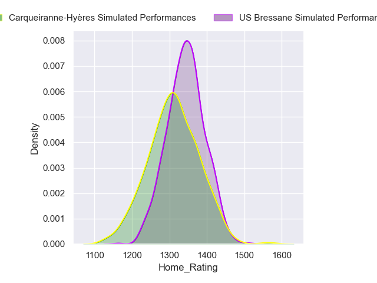
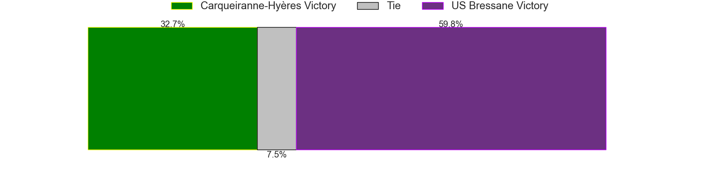
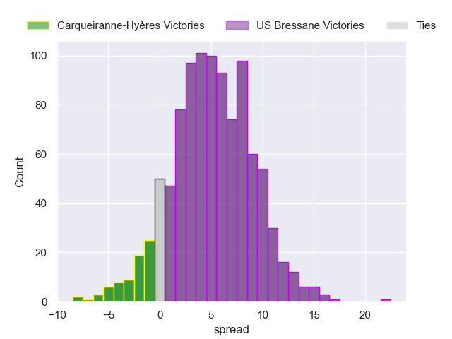

### Albi V Blagnac on 2024/04/05

Average Margin: Albi by 14.4

Average Scoreline: 30-16

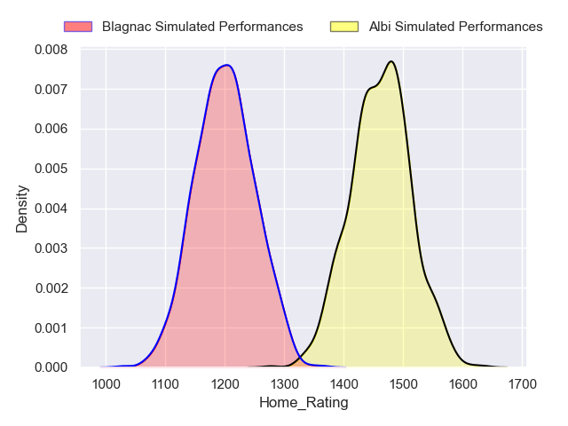
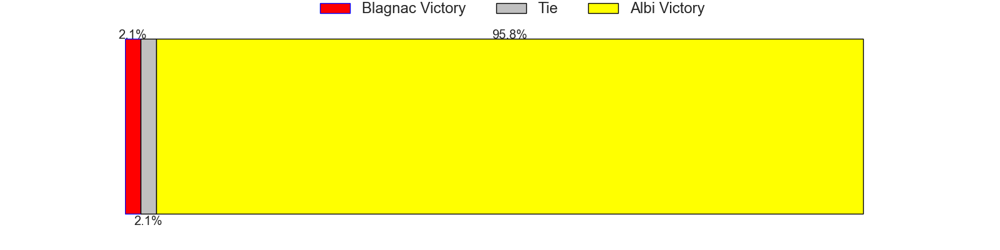
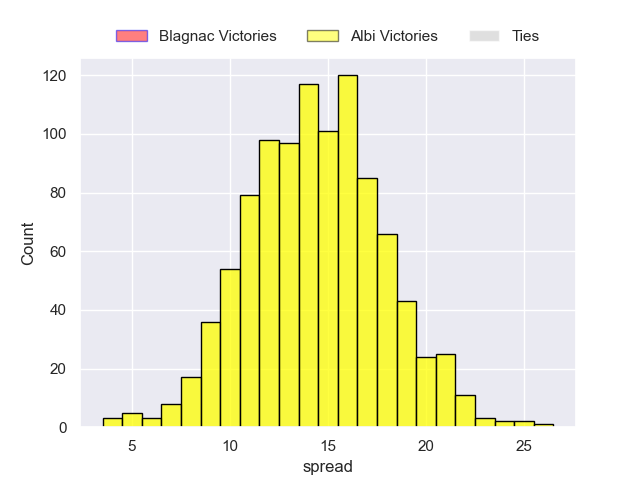

### Vienne V Chambery on 2024/04/06

Average Margin: Chambery by 12.4

Average Scoreline: 22-10

### Périgueux V Massy on 2024/04/06

Average Margin: Périgueux by 2.8

Average Scoreline: 22-19

### Bourgoin-Jallieu V Nice on 2024/04/06

Average Margin: Nice by 1.1

Average Scoreline: 21-19

### Tarbes V Suresnes on 2024/04/06

Average Margin: Tarbes by 2.4

Average Scoreline: 28-26

### Narbonne V Carcassonne on 2024/04/06

Average Margin: Narbonne by 2.7

Average Scoreline: 26-23

## Week 26

### Périgueux V Carqueiranne-Hyères on 2024/04/13

Average Margin: Périgueux by 3.3

Average Scoreline: 19-16

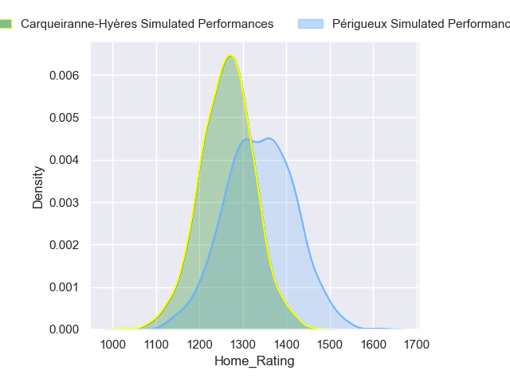
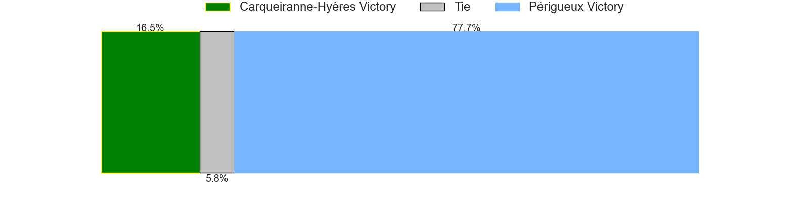
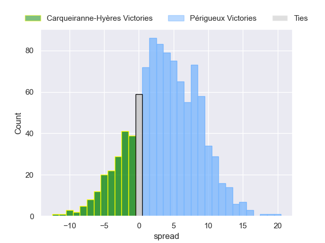

### Vienne V Blagnac on 2024/04/13

Average Margin: Blagnac by 5.3

Average Scoreline: 23-18

## Week 27

### Massy V Vienne on 2024/04/27

Average Margin: Massy by 19.9

Average Scoreline: 25-5

### Périgueux V Blagnac on 2024/04/27

Average Margin: Périgueux by 10.2

Average Scoreline: 24-14

### Carqueiranne-Hyères V Carcassonne on 2024/04/27

Average Margin: Carcassonne by 0.0

Average Scoreline: 24-24

### Bourgoin-Jallieu V US Bressane on 2024/04/27

Average Margin: Bourgoin-Jallieu by 5.6

Average Scoreline: 24-18

### Nice V Albi on 2024/04/27

Average Margin: Nice by 4.6

Average Scoreline: 19-14

### Tarbes V Chambery on 2024/04/27

Average Margin: Tarbes by 0.1

Average Scoreline: 29-29

### Suresnes V Narbonne on 2024/04/27

Average Margin: Narbonne by 1.7

Average Scoreline: 19-18

