---  
title: "Nationale 2023 Status"  
date: 2024-01-29 6:00:00 -0500  
categories: model review projection  
layout: article  
aside:  
    toc: true  
---
# Current Team Rankings

# Standings

## Current Standings

| Club                |   Played |   Wins |   Point Differential |   Losing Bonus Points |   Try Bonus Points |   Competition Points |
|:--------------------|---------:|-------:|---------------------:|----------------------:|-------------------:|---------------------:|
| Nice                |       18 |     12 |                  233 |                     2 |                  9 |                   61 |
| Narbonne            |       17 |     12 |                  112 |                     4 |                  4 |                   56 |
| Albi                |       17 |     11 |                  141 |                     5 |                  4 |                   53 |
| Carcassonne         |       17 |     10 |                   72 |                     4 |                  2 |                   48 |
| Suresnes            |       17 |     11 |                  -16 |                     1 |                  3 |                   48 |
| Chambery            |       17 |     10 |                   42 |                     4 |                  2 |                   46 |
| Bourgoin-Jallieu    |       17 |      9 |                   49 |                     5 |                  2 |                   45 |
| Périgueux           |       17 |      9 |                   26 |                     4 |                  1 |                   43 |
| Blagnac             |       16 |      8 |                   29 |                     3 |                  5 |                   40 |
| Carqueiranne-Hyères |       17 |      7 |                  -65 |                     3 |                  1 |                   34 |
| US Bressane         |       18 |      5 |                  -59 |                     8 |                  1 |                   31 |
| Tarbes              |       17 |      6 |                 -137 |                     6 |                  0 |                   30 |
| Massy               |       17 |      5 |                  -52 |                     9 |                  0 |                   29 |
| Vienne              |       16 |      1 |                 -375 |                     2 |                  0 |                    6 |

## Projected Remaining Table

| Club                |   Matches Remaining |   Wins |   Point Differential |   Losing Bonus Points |   Try Bonus Points |   Competition Points |
|:--------------------|--------------------:|-------:|---------------------:|----------------------:|-------------------:|---------------------:|
| Narbonne            |                   9 |    7.2 |            46.0591   |                   1.7 |                3.8 |                 34.3 |
| Nice                |                   9 |    6.9 |            37.4211   |                   1.9 |                3.4 |                 33   |
| Carcassonne         |                   9 |    6.8 |            44.553    |                   1.9 |                1.8 |                 31.1 |
| Albi                |                   9 |    6.3 |            27.4567   |                   2.3 |                1.9 |                 29.4 |
| Périgueux           |                   9 |    5.7 |            25.4652   |                   2.1 |                3.3 |                 28.4 |
| Massy               |                   9 |    5   |            17.1085   |                   3.4 |                3   |                 26.5 |
| Blagnac             |                  10 |    5   |             3.52756  |                   3.1 |                3   |                 26.3 |
| Chambery            |                   9 |    4.3 |             0.203756 |                   3.3 |                3.1 |                 23.7 |
| Bourgoin-Jallieu    |                   9 |    4.5 |             2.94808  |                   3.8 |                1.4 |                 22.9 |
| US Bressane         |                   9 |    3.9 |            -3.93477  |                   3.5 |                2.6 |                 21.6 |
| Tarbes              |                   9 |    3.4 |           -15.8913   |                   2.9 |                3.5 |                 19.8 |
| Carqueiranne-Hyères |                   9 |    2.5 |           -21.584    |                   4.1 |                3.2 |                 17.3 |
| Suresnes            |                   9 |    2.1 |           -30.6415   |                   3.8 |                3.1 |                 15.3 |
| Vienne              |                  10 |    0.3 |          -132.691    |                   1.5 |                1.8 |                  4.3 |

## Projected Total Table

| Club                |   Total Matches |   Wins |   Point Differential |   Losing Bonus Points |   Try Bonus Points |   Competition Points |
|:--------------------|----------------:|-------:|---------------------:|----------------------:|-------------------:|---------------------:|
| Nice                |              27 |   18.9 |             270.421  |                   3.9 |               12.4 |                 94   |
| Narbonne            |              26 |   19.2 |             158.059  |                   5.7 |                7.8 |                 90.3 |
| Albi                |              26 |   17.3 |             168.457  |                   7.3 |                5.9 |                 82.4 |
| Carcassonne         |              26 |   16.8 |             116.553  |                   5.9 |                3.8 |                 79.1 |
| Périgueux           |              26 |   14.7 |              51.4652 |                   6.1 |                4.3 |                 71.4 |
| Chambery            |              26 |   14.3 |              42.2038 |                   7.3 |                5.1 |                 69.7 |
| Bourgoin-Jallieu    |              26 |   13.5 |              51.9481 |                   8.8 |                3.4 |                 67.9 |
| Blagnac             |              26 |   13   |              32.5276 |                   6.1 |                8   |                 66.3 |
| Suresnes            |              26 |   13.1 |             -46.6415 |                   4.8 |                6.1 |                 63.3 |
| Massy               |              26 |   10   |             -34.8915 |                  12.4 |                3   |                 55.5 |
| US Bressane         |              27 |    8.9 |             -62.9348 |                  11.5 |                3.6 |                 52.6 |
| Carqueiranne-Hyères |              26 |    9.5 |             -86.584  |                   7.1 |                4.2 |                 51.3 |
| Tarbes              |              26 |    9.4 |            -152.891  |                   8.9 |                3.5 |                 49.8 |
| Vienne              |              26 |    1.3 |            -507.691  |                   3.5 |                1.8 |                 10.3 |

# Completed Match Review

| Model | Percent Correct Predictions | Spread Error |
| ------ | ------ | ------ |
| Club Level | 72.9% | 8.5 |
| Player Level: Lineup | 74.6% | 8.3 |
| Player Level: Minutes | 73.7% | 8.3 |

# Future Predictions

## Week 19

### US Bressane V Chambery on 2024/02/09

Average Margin: US Bressane by 1.7

Average Scoreline: 25-23

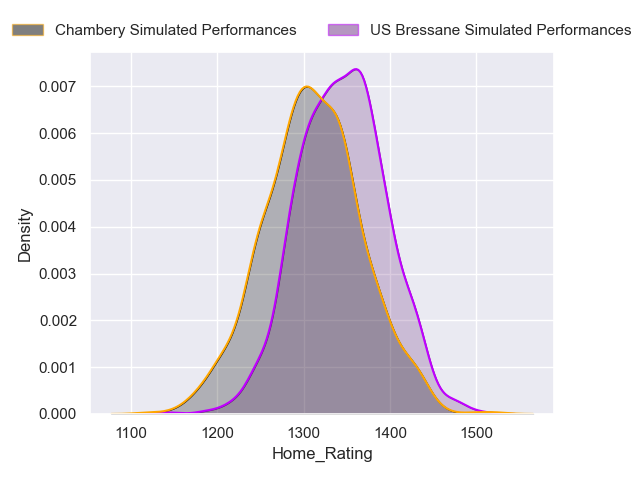

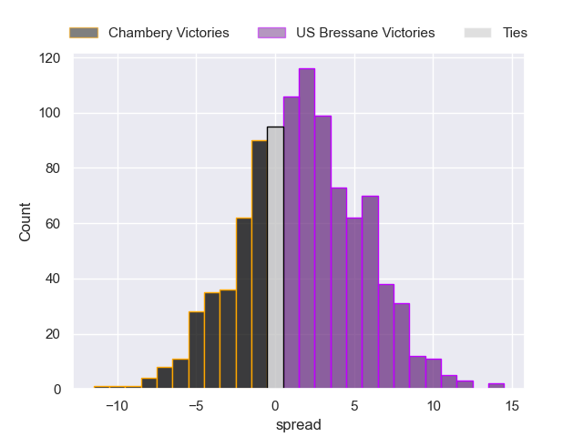

### Tarbes V Albi on 2024/02/09

Average Margin: Albi by 3.8

Average Scoreline: 21-17

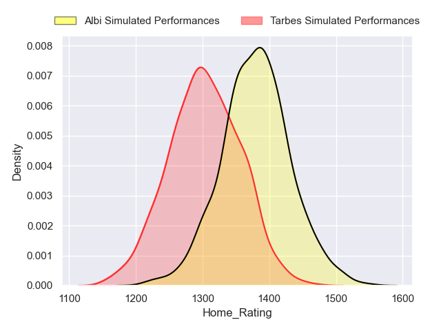
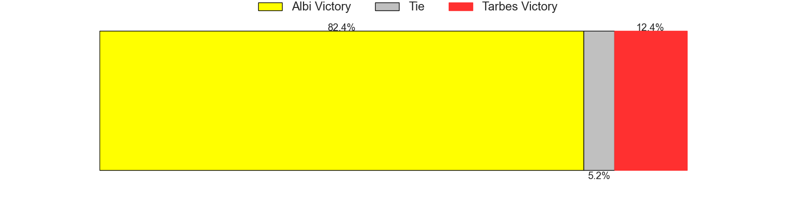
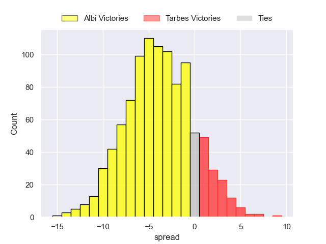

### Carcassonne V Blagnac on 2024/02/09

Average Margin: Carcassonne by 6.6

Average Scoreline: 26-19

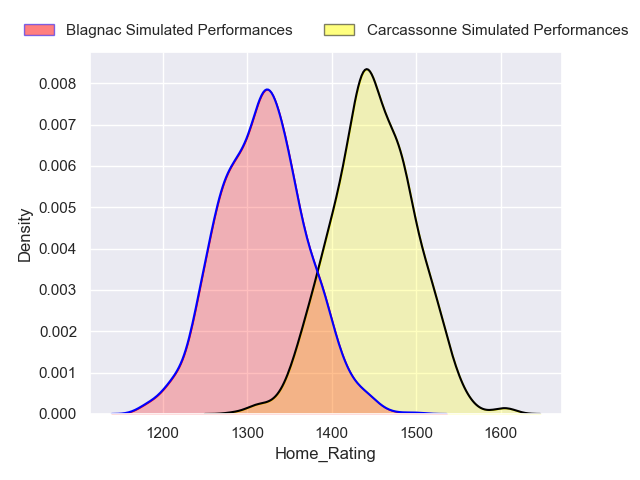
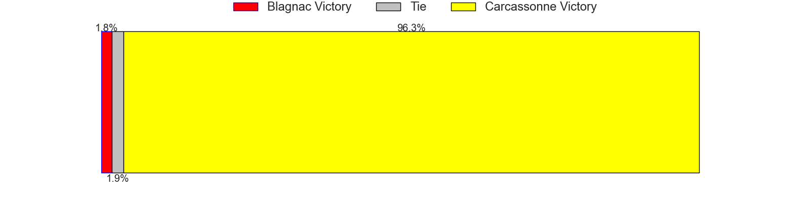
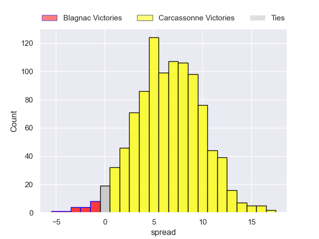

### Vienne V Périgueux on 2024/02/10

Average Margin: Périgueux by 12.3

Average Scoreline: 23-11

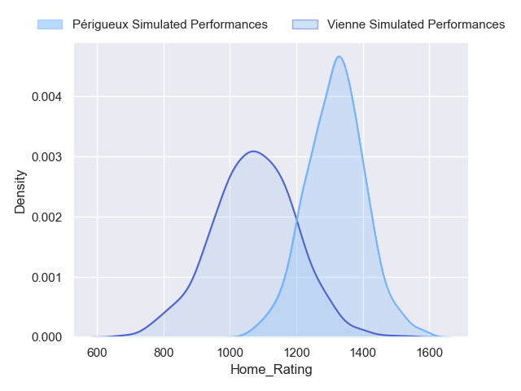
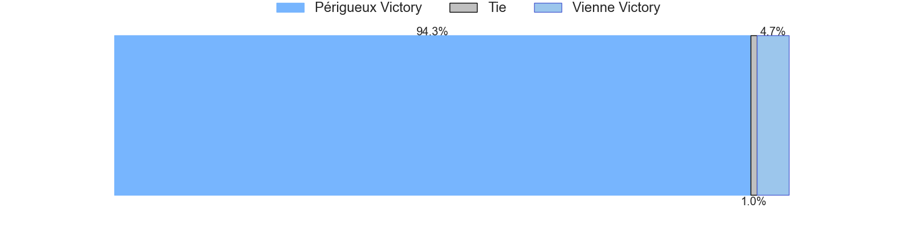
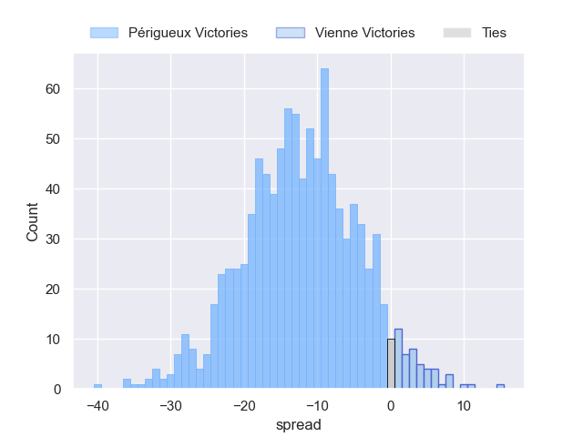

### Nice V Carqueiranne-Hyères on 2024/02/10

Average Margin: Nice by 11.1

Average Scoreline: 29-18

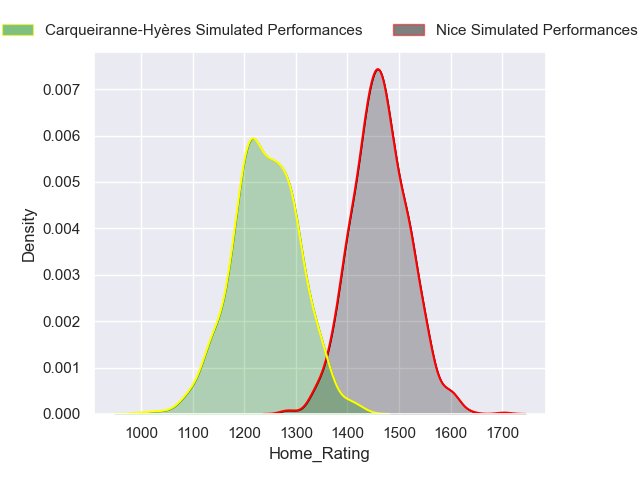
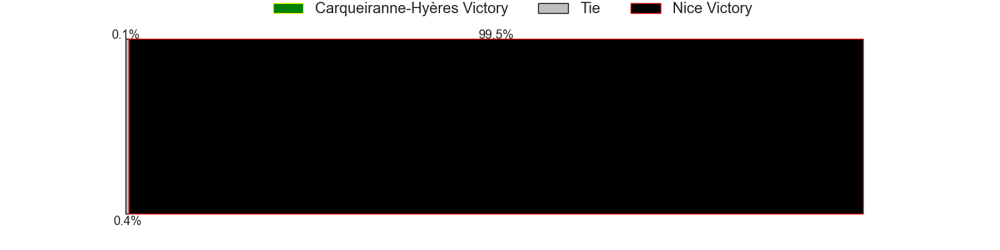
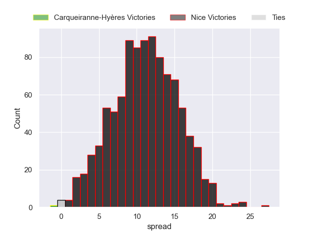

### Bourgoin-Jallieu V Narbonne on 2024/02/10

Average Margin: Bourgoin-Jallieu by 1.6

Average Scoreline: 23-21

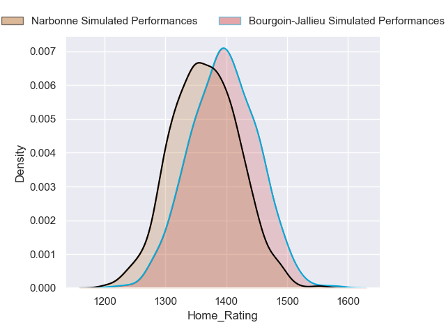
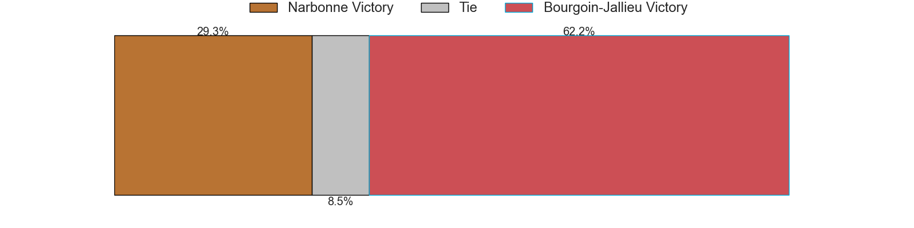
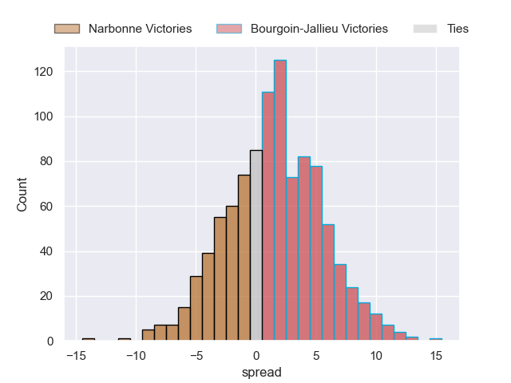

### Suresnes V Massy on 2024/02/10

Average Margin: Massy by 0.2

Average Scoreline: 29-29

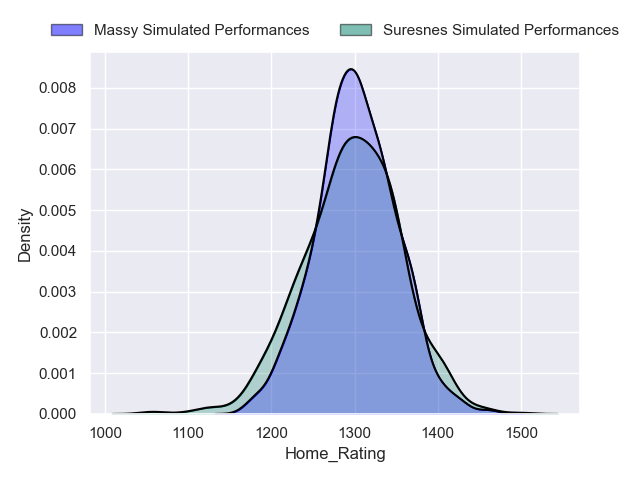

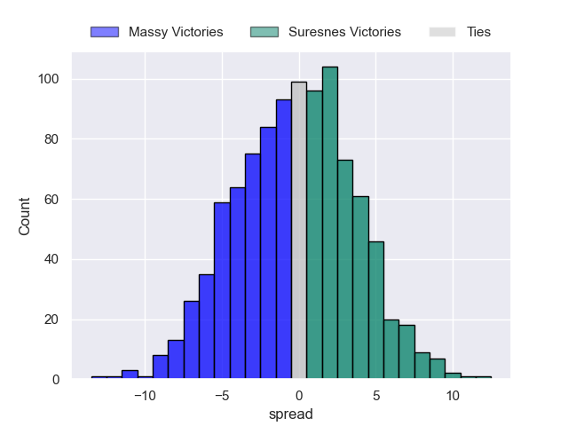

## Week 20

### Massy V Chambery on 2024/02/16

Average Margin: Massy by 3.1

Average Scoreline: 28-25

### Carcassonne V Nice on 2024/02/16

Average Margin: Carcassonne by 2.7

Average Scoreline: 23-21

### Narbonne V Albi on 2024/02/17

Average Margin: Narbonne by 2.8

Average Scoreline: 27-24

### Carqueiranne-Hyères V Bourgoin-Jallieu on 2024/02/17

Average Margin: Bourgoin-Jallieu by 0.9

Average Scoreline: 20-20

### Vienne V US Bressane on 2024/02/17

Average Margin: US Bressane by 10.1

Average Scoreline: 24-14

### Périgueux V Tarbes on 2024/02/17

Average Margin: Périgueux by 7.2

Average Scoreline: 25-18

### Blagnac V Suresnes on 2024/02/17

Average Margin: Blagnac by 7.3

Average Scoreline: 31-24

## Week 21

### Carcassonne V Bourgoin-Jallieu on 2024/02/23

Average Margin: Carcassonne by 5.9

Average Scoreline: 22-16

### Narbonne V Périgueux on 2024/02/24

Average Margin: Narbonne by 5.6

Average Scoreline: 27-22

### Chambery V Blagnac on 2024/02/24

Average Margin: Chambery by 3.1

Average Scoreline: 28-24

### Massy V US Bressane on 2024/02/24

Average Margin: Massy by 4.6

Average Scoreline: 26-22

### Carqueiranne-Hyères V Albi on 2024/02/24

Average Margin: Albi by 3.3

Average Scoreline: 23-19

### Suresnes V Nice on 2024/02/24

Average Margin: Nice by 4.9

Average Scoreline: 25-20

### Tarbes V Vienne on 2024/02/24

Average Margin: Tarbes by 14.5

Average Scoreline: 30-15

## Week 22

### Albi V Carcassonne on 2024/03/01

Average Margin: Albi by 3.2

Average Scoreline: 21-18

### US Bressane V Tarbes on 2024/03/01

Average Margin: US Bressane by 5.5

Average Scoreline: 27-22

### Bourgoin-Jallieu V Suresnes on 2024/03/02

Average Margin: Bourgoin-Jallieu by 8.1

Average Scoreline: 28-20

### Nice V Chambery on 2024/03/02

Average Margin: Nice by 7.9

Average Scoreline: 25-17

### Blagnac V Massy on 2024/03/02

Average Margin: Blagnac by 4.1

Average Scoreline: 26-22

### Périgueux V Carqueiranne-Hyères on 2024/03/02

Average Margin: Périgueux by 6.8

Average Scoreline: 25-18

### Vienne V Narbonne on 2024/03/02

Average Margin: Narbonne by 13.5

Average Scoreline: 27-14

## Week 23

### Massy V Nice on 2024/03/08

Average Margin: Nice by 1.4

Average Scoreline: 22-21

### Albi V Suresnes on 2024/03/08

Average Margin: Albi by 10.5

Average Scoreline: 30-19

### Carcassonne V Périgueux on 2024/03/08

Average Margin: Carcassonne by 6.5

Average Scoreline: 23-16

### Narbonne V Tarbes on 2024/03/09

Average Margin: Narbonne by 9.6

Average Scoreline: 29-19

### Chambery V Bourgoin-Jallieu on 2024/03/09

Average Margin: Chambery by 2.7

Average Scoreline: 22-19

### Blagnac V US Bressane on 2024/03/09

Average Margin: Blagnac by 5.5

Average Scoreline: 28-23

### Carqueiranne-Hyères V Vienne on 2024/03/09

Average Margin: Carqueiranne-Hyères by 14.8

Average Scoreline: 28-13

## Week 24

### Albi V Chambery on 2024/03/22

Average Margin: Albi by 6.8

Average Scoreline: 27-20

### Périgueux V Suresnes on 2024/03/23

Average Margin: Périgueux by 7.1

Average Scoreline: 26-19

### Narbonne V US Bressane on 2024/03/23

Average Margin: Narbonne by 7.7

Average Scoreline: 28-20

### Nice V Blagnac on 2024/03/23

Average Margin: Nice by 7.6

Average Scoreline: 25-17

### Massy V Bourgoin-Jallieu on 2024/03/23

Average Margin: Massy by 2.1

Average Scoreline: 22-20

### Vienne V Carcassonne on 2024/03/23

Average Margin: Carcassonne by 14.7

Average Scoreline: 28-13

### Tarbes V Carqueiranne-Hyères on 2024/03/23

Average Margin: Tarbes by 3.0

Average Scoreline: 28-25

## Week 25

### Massy V Albi on 2024/03/29

Average Margin: Albi by 0.4

Average Scoreline: 19-19

### US Bressane V Nice on 2024/03/29

Average Margin: Nice by 2.7

Average Scoreline: 24-22

### Carcassonne V Tarbes on 2024/03/29

Average Margin: Carcassonne by 10.5

Average Scoreline: 29-19

### Chambery V Périgueux on 2024/03/30

Average Margin: Chambery by 3.0

Average Scoreline: 23-20

### Blagnac V Bourgoin-Jallieu on 2024/03/30

Average Margin: Blagnac by 2.7

Average Scoreline: 24-21

### Carqueiranne-Hyères V Narbonne on 2024/03/30

Average Margin: Narbonne by 2.7

Average Scoreline: 23-20

### Suresnes V Vienne on 2024/03/30

Average Margin: Suresnes by 14.1

Average Scoreline: 30-16

## Week 26

### Albi V Blagnac on 2024/04/05

Average Margin: Albi by 6.5

Average Scoreline: 25-19

### US Bressane V Carqueiranne-Hyères on 2024/04/05

Average Margin: US Bressane by 5.1

Average Scoreline: 27-22

### Bourgoin-Jallieu V Nice on 2024/04/06

Average Margin: Nice by 0.2

Average Scoreline: 21-21

### Narbonne V Carcassonne on 2024/04/06

Average Margin: Narbonne by 2.5

Average Scoreline: 28-25

### Périgueux V Massy on 2024/04/06

Average Margin: Périgueux by 4.0

Average Scoreline: 24-21

### Vienne V Chambery on 2024/04/06

Average Margin: Chambery by 10.8

Average Scoreline: 23-12

### Tarbes V Suresnes on 2024/04/06

Average Margin: Tarbes by 3.3

Average Scoreline: 27-24

## Week 27

### Vienne V Blagnac on 2024/04/13

Average Margin: Blagnac by 10.9

Average Scoreline: 26-15

## Week 28

### Périgueux V Blagnac on 2024/04/27

Average Margin: Périgueux by 3.2

Average Scoreline: 24-21

### Carqueiranne-Hyères V Carcassonne on 2024/04/27

Average Margin: Carcassonne by 3.5

Average Scoreline: 25-21

### Nice V Albi on 2024/04/27

Average Margin: Nice by 4.3

Average Scoreline: 21-16

### Massy V Vienne on 2024/04/27

Average Margin: Massy by 16.9

Average Scoreline: 28-11

### Tarbes V Chambery on 2024/04/27

Average Margin: Chambery by 0.2

Average Scoreline: 22-22

### Bourgoin-Jallieu V US Bressane on 2024/04/27

Average Margin: Bourgoin-Jallieu by 6.0

Average Scoreline: 28-22

### Suresnes V Narbonne on 2024/04/27

Average Margin: Narbonne by 3.2

Average Scoreline: 24-21

