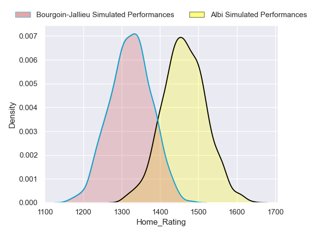
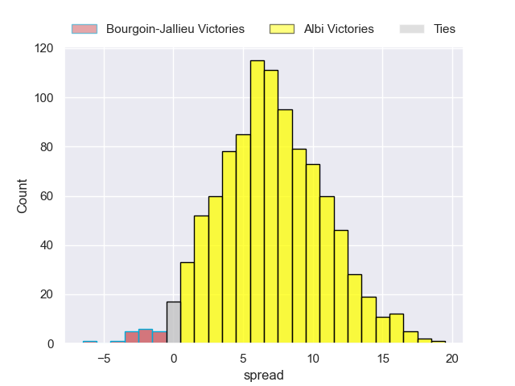
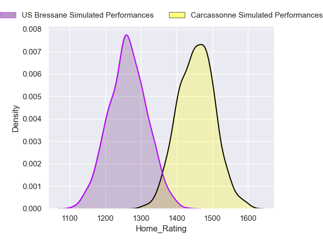
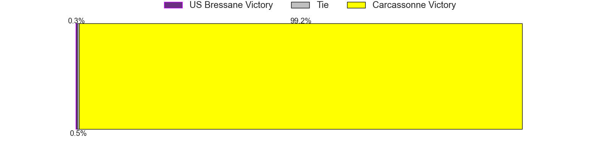
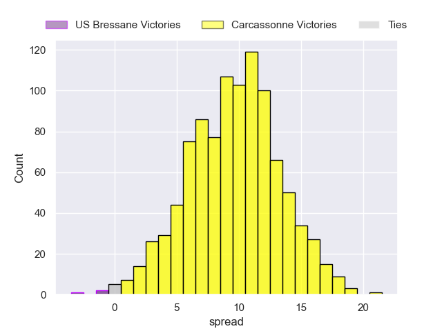
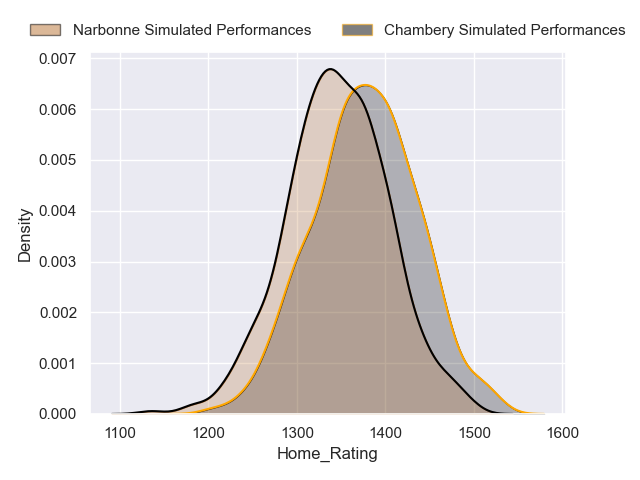
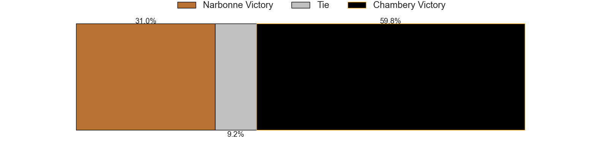
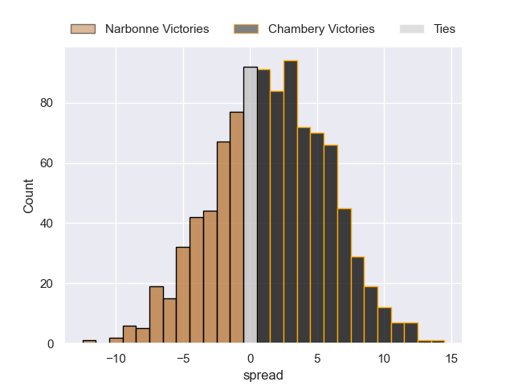
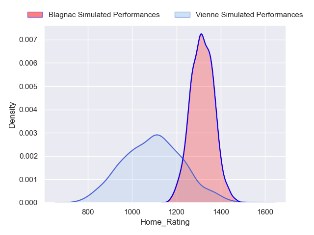
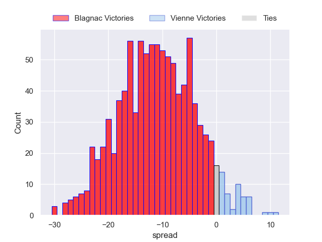

---  
title: "Nationale 2023 Status"  
date: 2023-12-11 6:00:00 -0500  
categories: model review projection  
layout: article  
aside:  
    toc: true  
---
# Current Team Rankings

# Standings

## Current Standings

| Club                |   Played |   Wins |   Point Differential |   Losing Bonus Points |   Try Bonus Points |   Competition Points |
|:--------------------|---------:|-------:|---------------------:|----------------------:|-------------------:|---------------------:|
| Narbonne            |       13 |     10 |                   77 |                     3 |                  2 |                   45 |
| Nice                |       14 |      8 |                  137 |                     2 |                  6 |                   42 |
| Albi                |       13 |      9 |                   97 |                     3 |                  3 |                   42 |
| Carcassonne         |       13 |      9 |                   71 |                     2 |                  2 |                   40 |
| Périgueux           |       13 |      8 |                   52 |                     3 |                  1 |                   36 |
| Chambery            |       13 |      7 |                   14 |                     3 |                  1 |                   34 |
| Suresnes            |       13 |      8 |                  -16 |                     1 |                  1 |                   34 |
| Bourgoin-Jallieu    |       13 |      6 |                    9 |                     4 |                  1 |                   31 |
| Blagnac             |       13 |      6 |                    5 |                     4 |                  3 |                   31 |
| Carqueiranne-Hyères |       13 |      6 |                  -26 |                     2 |                  1 |                   29 |
| Tarbes              |       13 |      5 |                  -79 |                     5 |                  0 |                   25 |
| Massy               |       13 |      4 |                   -1 |                     8 |                  0 |                   24 |
| US Bressane         |       14 |      3 |                  -65 |                     7 |                  0 |                   19 |
| Vienne              |       13 |      1 |                 -275 |                     2 |                  0 |                    6 |

## Projected Remaining Table

| Club                |   Matches Remaining |   Wins |   Point Differential |   Losing Bonus Points |   Try Bonus Points |   Competition Points |
|:--------------------|--------------------:|-------:|---------------------:|----------------------:|-------------------:|---------------------:|
| Carcassonne         |                  13 |   10   |              61.9032 |                   2.8 |                9.5 |                 52.1 |
| Nice                |                  13 |    9.9 |              65.4846 |                   2.7 |                9.4 |                 51.8 |
| Albi                |                  13 |    9.9 |              64.3198 |                   2.8 |                9.3 |                 51.6 |
| Narbonne            |                  13 |    8.2 |              30.1608 |                   4.2 |                7.6 |                 44.5 |
| Massy               |                  13 |    7.4 |              21.5054 |                   4.9 |                6.8 |                 41.3 |
| Blagnac             |                  13 |    7.6 |              19.8448 |                   3.6 |                7.3 |                 41.3 |
| Chambery            |                  13 |    7.3 |              14.1537 |                   4.3 |                6.8 |                 40.3 |
| Bourgoin-Jallieu    |                  13 |    7.1 |              22.1602 |                   4.4 |                6.6 |                 39.3 |
| Périgueux           |                  13 |    7.1 |              15.7028 |                   3.9 |                6.7 |                 39.2 |
| US Bressane         |                  13 |    4.8 |             -23.3519 |                   5.3 |                4.5 |                 29   |
| Tarbes              |                  13 |    4.1 |             -37.3704 |                   4.7 |                3.9 |                 24.8 |
| Carqueiranne-Hyères |                  13 |    3.7 |             -32.4149 |                   6.1 |                3.5 |                 24.5 |
| Suresnes            |                  13 |    3.5 |             -42.289  |                   5.4 |                3.3 |                 22.8 |
| Vienne              |                  13 |    0.5 |            -179.809  |                   2.1 |                0.4 |                  4.3 |

## Projected Total Table

| Club                |   Total Matches |   Wins |   Point Differential |   Losing Bonus Points |   Try Bonus Points |   Competition Points |
|:--------------------|----------------:|-------:|---------------------:|----------------------:|-------------------:|---------------------:|
| Nice                |              27 |   17.9 |             202.485  |                   4.7 |               15.4 |                 93.8 |
| Albi                |              26 |   18.9 |             161.32   |                   5.8 |               12.3 |                 93.6 |
| Carcassonne         |              26 |   19   |             132.903  |                   4.8 |               11.5 |                 92.1 |
| Narbonne            |              26 |   18.2 |             107.161  |                   7.2 |                9.6 |                 89.5 |
| Périgueux           |              26 |   15.1 |              67.7028 |                   6.9 |                7.7 |                 75.2 |
| Chambery            |              26 |   14.3 |              28.1537 |                   7.3 |                7.8 |                 74.3 |
| Blagnac             |              26 |   13.6 |              24.8448 |                   7.6 |               10.3 |                 72.3 |
| Bourgoin-Jallieu    |              26 |   13.1 |              31.1602 |                   8.4 |                7.6 |                 70.3 |
| Massy               |              26 |   11.4 |              20.5054 |                  12.9 |                6.8 |                 65.3 |
| Suresnes            |              26 |   11.5 |             -58.289  |                   6.4 |                4.3 |                 56.8 |
| Carqueiranne-Hyères |              26 |    9.7 |             -58.4149 |                   8.1 |                4.5 |                 53.5 |
| Tarbes              |              26 |    9.1 |            -116.37   |                   9.7 |                3.9 |                 49.8 |
| US Bressane         |              27 |    7.8 |             -88.3519 |                  12.3 |                4.5 |                 48   |
| Vienne              |              26 |    1.5 |            -454.809  |                   4.1 |                0.4 |                 10.3 |

# Completed Match Review

| Model | Percent Correct Predictions | Spread Error |
| ------ | ------ | ------ |
| Club Level | 73.6% | 8.0 |
| Player Level: Lineup | 67.0% | 9.3 |
| Player Level: Minutes | 65.9% | 9.3 |

# Future Predictions

## Week 15

### Albi V Bourgoin-Jallieu on 2023/12/15

Average Margin: Albi by 7.0

### Carcassonne V US Bressane on 2023/12/15

Average Margin: Carcassonne by 9.6

### Chambery V Narbonne on 2023/12/15

Average Margin: Chambery by 1.6

### Nice V Périgueux on 2023/12/16

Average Margin: Nice by 5.8

### Suresnes V Carqueiranne-Hyères on 2023/12/16

Average Margin: Suresnes by 2.0

### Tarbes V Massy on 2023/12/16

Average Margin: Massy by 0.5

### Vienne V Blagnac on 2023/12/17

Average Margin: Blagnac by 11.0

## Week 16

### US Bressane V Albi on 2024/01/13

Average Margin: Albi by 2.9

### Bourgoin-Jallieu V Périgueux on 2024/01/13

Average Margin: Bourgoin-Jallieu by 3.3

### Chambery V Carqueiranne-Hyères on 2024/01/13

Average Margin: Chambery by 6.4

### Nice V Vienne on 2024/01/13

Average Margin: Nice by 20.4

### Suresnes V Carcassonne on 2024/01/13

Average Margin: Carcassonne by 4.7

### Narbonne V Massy on 2024/01/13

Average Margin: Narbonne by 4.3

### Blagnac V Tarbes on 2024/01/13

Average Margin: Blagnac by 7.2

## Week 17

### Suresnes V US Bressane on 2024/01/20

Average Margin: Suresnes by 1.6

### Nice V Tarbes on 2024/01/20

Average Margin: Nice by 9.8

### Carqueiranne-Hyères V Massy on 2024/01/20

Average Margin: Massy by 0.0

### Bourgoin-Jallieu V Vienne on 2024/01/20

Average Margin: Bourgoin-Jallieu by 17.9

### Périgueux V Albi on 2024/01/20

Average Margin: Albi by 0.2

### Blagnac V Narbonne on 2024/01/20

Average Margin: Blagnac by 2.1

### Chambery V Carcassonne on 2024/01/20

Average Margin: Carcassonne by 0.5

## Week 18

### US Bressane V Périgueux on 2024/01/27

Average Margin: US Bressane by 0.4

### Nice V Narbonne on 2024/01/27

Average Margin: Nice by 4.8

### Albi V Vienne on 2024/01/27

Average Margin: Albi by 21.2

### Bourgoin-Jallieu V Tarbes on 2024/01/27

Average Margin: Bourgoin-Jallieu by 7.1

### Massy V Carcassonne on 2024/01/27

Average Margin: Carcassonne by 0.1

### Blagnac V Carqueiranne-Hyères on 2024/01/27

Average Margin: Blagnac by 6.4

### Chambery V Suresnes on 2024/01/27

Average Margin: Chambery by 7.3

## Week 19

### Bourgoin-Jallieu V Narbonne on 2024/02/03

Average Margin: Bourgoin-Jallieu by 2.2

### Carcassonne V Blagnac on 2024/02/03

Average Margin: Carcassonne by 6.8

### Suresnes V Massy on 2024/02/03

Average Margin: Massy by 1.1

### Nice V Carqueiranne-Hyères on 2024/02/03

Average Margin: Nice by 9.2

### Vienne V Périgueux on 2024/02/03

Average Margin: Périgueux by 10.4

### Tarbes V Albi on 2024/02/03

Average Margin: Albi by 3.7

### US Bressane V Chambery on 2024/02/03

Average Margin: US Bressane by 1.1

## Week 20

### Périgueux V Tarbes on 2024/02/10

Average Margin: Périgueux by 7.1

### Vienne V US Bressane on 2024/02/10

Average Margin: US Bressane by 7.9

### Carqueiranne-Hyères V Bourgoin-Jallieu on 2024/02/10

Average Margin: Bourgoin-Jallieu by 0.1

### Carcassonne V Nice on 2024/02/10

Average Margin: Carcassonne by 4.2

### Blagnac V Suresnes on 2024/02/10

Average Margin: Blagnac by 7.8

### Massy V Chambery on 2024/02/10

Average Margin: Massy by 3.9

### Narbonne V Albi on 2024/02/10

Average Margin: Narbonne by 1.1

## Week 21

### Carcassonne V Bourgoin-Jallieu on 2024/02/17

Average Margin: Carcassonne by 6.7

### Carqueiranne-Hyères V Albi on 2024/02/17

Average Margin: Albi by 3.5

### Tarbes V Vienne on 2024/02/17

Average Margin: Tarbes by 13.9

### Chambery V Blagnac on 2024/02/17

Average Margin: Chambery by 2.9

### Massy V US Bressane on 2024/02/17

Average Margin: Massy by 6.1

### Suresnes V Nice on 2024/02/17

Average Margin: Nice by 3.9

### Narbonne V Périgueux on 2024/02/17

Average Margin: Narbonne by 4.4

## Week 22

### Blagnac V Massy on 2024/03/02

Average Margin: Blagnac by 3.1

### Albi V Carcassonne on 2024/03/02

Average Margin: Albi by 3.4

### Périgueux V Carqueiranne-Hyères on 2024/03/02

Average Margin: Périgueux by 6.9

### US Bressane V Tarbes on 2024/03/02

Average Margin: US Bressane by 4.5

### Vienne V Narbonne on 2024/03/02

Average Margin: Narbonne by 11.0

### Nice V Chambery on 2024/03/02

Average Margin: Nice by 6.5

### Bourgoin-Jallieu V Suresnes on 2024/03/02

Average Margin: Bourgoin-Jallieu by 7.8

## Week 23

### Carqueiranne-Hyères V Vienne on 2024/03/09

Average Margin: Carqueiranne-Hyères by 13.7

### Carcassonne V Périgueux on 2024/03/09

Average Margin: Carcassonne by 6.4

### Narbonne V Tarbes on 2024/03/09

Average Margin: Narbonne by 8.2

### Chambery V Bourgoin-Jallieu on 2024/03/09

Average Margin: Chambery by 2.8

### Massy V Nice on 2024/03/09

Average Margin: Massy by 0.7

### Blagnac V US Bressane on 2024/03/09

Average Margin: Blagnac by 5.9

### Albi V Suresnes on 2024/03/09

Average Margin: Albi by 11.5

## Week 24

### Tarbes V Carqueiranne-Hyères on 2024/03/23

Average Margin: Tarbes by 3.0

### Massy V Bourgoin-Jallieu on 2024/03/23

Average Margin: Massy by 3.5

### Albi V Chambery on 2024/03/23

Average Margin: Albi by 7.3

### Nice V Blagnac on 2024/03/23

Average Margin: Nice by 6.4

### Périgueux V Suresnes on 2024/03/23

Average Margin: Périgueux by 7.9

### Vienne V Carcassonne on 2024/03/23

Average Margin: Carcassonne by 13.5

### Narbonne V US Bressane on 2024/03/23

Average Margin: Narbonne by 7.1

## Week 25

### Blagnac V Bourgoin-Jallieu on 2024/03/30

Average Margin: Blagnac by 3.2

### US Bressane V Nice on 2024/03/30

Average Margin: Nice by 2.1

### Carcassonne V Tarbes on 2024/03/30

Average Margin: Carcassonne by 10.3

### Suresnes V Vienne on 2024/03/30

Average Margin: Suresnes by 12.7

### Massy V Albi on 2024/03/30

Average Margin: Albi by 0.1

### Chambery V Périgueux on 2024/03/30

Average Margin: Chambery by 3.0

### Carqueiranne-Hyères V Narbonne on 2024/03/30

Average Margin: Narbonne by 1.1

## Week 26

### Narbonne V Carcassonne on 2024/04/06

Average Margin: Narbonne by 1.2

### Périgueux V Massy on 2024/04/06

Average Margin: Périgueux by 3.3

### Tarbes V Suresnes on 2024/04/06

Average Margin: Tarbes by 4.2

### Vienne V Chambery on 2024/04/06

Average Margin: Chambery by 9.4

### US Bressane V Carqueiranne-Hyères on 2024/04/06

Average Margin: US Bressane by 4.0

### Bourgoin-Jallieu V Nice on 2024/04/06

Average Margin: Bourgoin-Jallieu by 0.8

### Albi V Blagnac on 2024/04/06

Average Margin: Albi by 7.0

## Week 27

### Périgueux V Blagnac on 2024/04/27

Average Margin: Périgueux by 3.6

### Bourgoin-Jallieu V US Bressane on 2024/04/27

Average Margin: Bourgoin-Jallieu by 6.1

### Nice V Albi on 2024/04/27

Average Margin: Nice by 2.5

### Suresnes V Narbonne on 2024/04/27

Average Margin: Narbonne by 2.3

### Tarbes V Chambery on 2024/04/27

Average Margin: Chambery by 0.1

### Massy V Vienne on 2024/04/27

Average Margin: Massy by 16.7

### Carqueiranne-Hyères V Carcassonne on 2024/04/27

Average Margin: Carcassonne by 3.6

