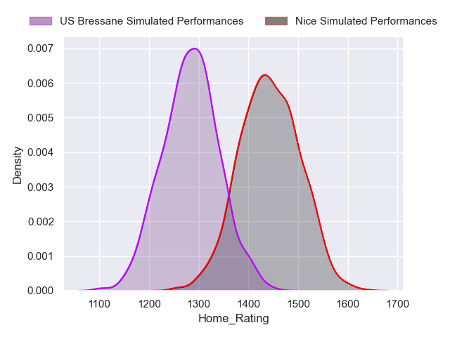
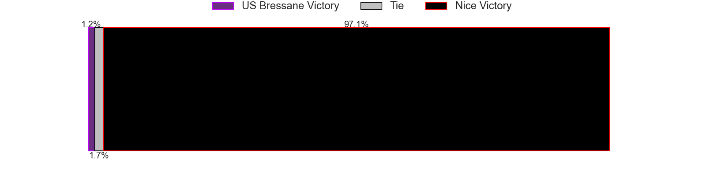
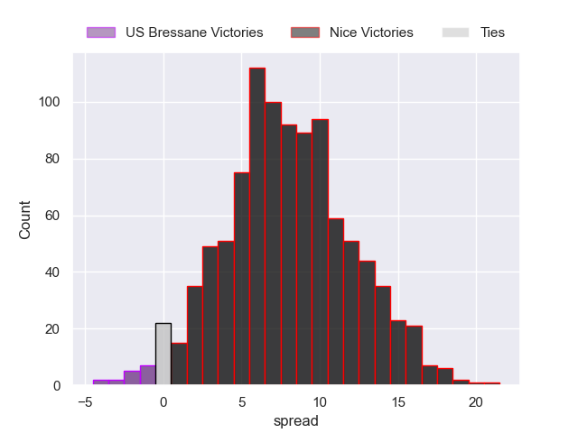

---  
title: "Nationale 2023 Status"  
date: 2023-11-13 6:00:00 -0500  
categories: model review projection  
layout: article  
aside:  
    toc: true  
---
# Current Team Rankings

# Standings

## Current Standings

| Club                |   Played |   Wins |   Point Differential |   Losing Bonus Points |   Try Bonus Points |   Competition Points |
|:--------------------|---------:|-------:|---------------------:|----------------------:|-------------------:|---------------------:|
| Narbonne            |       10 |      7 |                   48 |                     3 |                  1 |                   32 |
| Nice                |       10 |      6 |                  105 |                     2 |                  4 |                   30 |
| Albi                |       10 |      6 |                   79 |                     3 |                  3 |                   30 |
| Carcassonne         |       10 |      7 |                   50 |                     1 |                  1 |                   30 |
| Périgueux           |       10 |      6 |                   57 |                     3 |                  1 |                   28 |
| Blagnac             |       10 |      6 |                   14 |                     1 |                  2 |                   27 |
| Chambery            |       10 |      5 |                   11 |                     3 |                  1 |                   26 |
| Carqueiranne-Hyères |       10 |      5 |                    2 |                     2 |                  1 |                   25 |
| Suresnes            |       10 |      6 |                  -17 |                     1 |                  0 |                   25 |
| Tarbes              |       10 |      5 |                  -62 |                     2 |                  0 |                   22 |
| Bourgoin-Jallieu    |       10 |      4 |                   -5 |                     4 |                  0 |                   20 |
| US Bressane         |       10 |      3 |                  -13 |                     5 |                  0 |                   17 |
| Massy               |       10 |      2 |                  -21 |                     7 |                  0 |                   15 |
| Vienne              |       10 |      1 |                 -248 |                     1 |                  0 |                    5 |

## Projected Remaining Table

| Club                |   Matches Remaining |   Wins |   Point Differential |   Losing Bonus Points |   Try Bonus Points |   Competition Points |
|:--------------------|--------------------:|-------:|---------------------:|----------------------:|-------------------:|---------------------:|
| Carcassonne         |                  16 |   12.8 |                 84.1 |                   2.9 |               12.2 |                 66.4 |
| Albi                |                  16 |   11.9 |                 72.3 |                   3.8 |               11.3 |                 62.5 |
| Nice                |                  16 |   11.7 |                 70.9 |                   3.6 |               11.2 |                 61.6 |
| Chambery            |                  16 |   10.2 |                 51   |                   4.4 |                9.7 |                 55.1 |
| Blagnac             |                  16 |    9.6 |                 30.2 |                   4.6 |                9.1 |                 52.1 |
| Narbonne            |                  16 |    9.5 |                 29.7 |                   5.1 |                8.9 |                 52.1 |
| Massy               |                  16 |    8.9 |                 28.3 |                   5.7 |                8.2 |                 49.6 |
| Périgueux           |                  16 |    8   |                  5.6 |                   5.2 |                7.5 |                 44.9 |
| Bourgoin-Jallieu    |                  16 |    7.3 |                  2.6 |                   6   |                6.6 |                 41.9 |
| US Bressane         |                  16 |    6.6 |                -16.4 |                   6.5 |                6.3 |                 39.2 |
| Carqueiranne-Hyères |                  16 |    5.3 |                -33.5 |                   6.7 |                5   |                 33   |
| Suresnes            |                  16 |    5   |                -40   |                   6.2 |                4.8 |                 30.8 |
| Tarbes              |                  16 |    4.6 |                -45.7 |                   6.6 |                4.4 |                 29.3 |
| Vienne              |                  16 |    0.6 |               -240.2 |                   2.1 |                0.6 |                  4.9 |

## Projected Total Table

| Club                |   Total Matches |   Wins |   Point Differential |   Losing Bonus Points |   Try Bonus Points |   Competition Points |
|:--------------------|----------------:|-------:|---------------------:|----------------------:|-------------------:|---------------------:|
| Carcassonne         |              26 |   19.8 |                134.1 |                   3.9 |               13.2 |                 96.4 |
| Albi                |              26 |   17.9 |                151.3 |                   6.8 |               14.3 |                 92.5 |
| Nice                |              26 |   17.7 |                175.9 |                   5.6 |               15.2 |                 91.6 |
| Narbonne            |              26 |   16.5 |                 77.7 |                   8.1 |                9.9 |                 84.1 |
| Chambery            |              26 |   15.2 |                 62   |                   7.4 |               10.7 |                 81.1 |
| Blagnac             |              26 |   15.6 |                 44.2 |                   5.6 |               11.1 |                 79.1 |
| Périgueux           |              26 |   14   |                 62.6 |                   8.2 |                8.5 |                 72.9 |
| Massy               |              26 |   10.9 |                  7.3 |                  12.7 |                8.2 |                 64.6 |
| Bourgoin-Jallieu    |              26 |   11.3 |                 -2.4 |                  10   |                6.6 |                 61.9 |
| Carqueiranne-Hyères |              26 |   10.3 |                -31.5 |                   8.7 |                6   |                 58   |
| US Bressane         |              26 |    9.6 |                -29.4 |                  11.5 |                6.3 |                 56.2 |
| Suresnes            |              26 |   11   |                -57   |                   7.2 |                4.8 |                 55.8 |
| Tarbes              |              26 |    9.6 |               -107.7 |                   8.6 |                4.4 |                 51.3 |
| Vienne              |              26 |    1.6 |               -488.2 |                   3.1 |                0.6 |                  9.9 |

# Completed Match Review

| Model | Percent Correct Predictions | Spread Error |
| ------ | ------ | ------ |
| Club Level | 72.9% | 8.5 |
| Player Level: Lineup | 65.7% | 10.0 |
| Player Level: Minutes | 64.3% | 10.0 |

# Future Predictions

## Week 11

### Albi V Massy on 2023/11/17

Average Margin: Albi by 6.9

### Périgueux V Chambery on 2023/11/18

Average Margin: Périgueux by 2.5

### Bourgoin-Jallieu V Blagnac on 2023/11/18

Average Margin: Bourgoin-Jallieu by 2.0

### Tarbes V Carcassonne on 2023/11/18

Average Margin: Carcassonne by 3.9

### Vienne V Suresnes on 2023/11/18

Average Margin: Suresnes by 8.8

### Narbonne V Carqueiranne-Hyères on 2023/11/18

Average Margin: Narbonne by 6.3

### Nice V US Bressane on 2023/11/19

Average Margin: Nice by 7.9

## Week 12

### Massy V Périgueux on 2023/12/01

Average Margin: Massy by 3.9

### Carcassonne V Narbonne on 2023/12/01

Average Margin: Carcassonne by 6.6

### Chambery V Vienne on 2023/12/01

Average Margin: Chambery by 20.3

### Nice V Bourgoin-Jallieu on 2023/12/02

Average Margin: Nice by 7.1

### Suresnes V Tarbes on 2023/12/02

Average Margin: Suresnes by 2.4

### Carqueiranne-Hyères V US Bressane on 2023/12/02

Average Margin: Carqueiranne-Hyères by 2.6

### Blagnac V Albi on 2023/12/02

Average Margin: Blagnac by 0.4

## Week 13

### US Bressane V Bourgoin-Jallieu on 2023/12/08

Average Margin: US Bressane by 2.3

### Carcassonne V Carqueiranne-Hyères on 2023/12/08

Average Margin: Carcassonne by 9.3

### Albi V Nice on 2023/12/08

Average Margin: Albi by 3.9

### Chambery V Tarbes on 2023/12/08

Average Margin: Chambery by 7.4

### Narbonne V Suresnes on 2023/12/09

Average Margin: Narbonne by 8.4

### Vienne V Massy on 2023/12/09

Average Margin: Massy by 12.6

### Blagnac V Périgueux on 2023/12/09

Average Margin: Blagnac by 4.5

## Week 14

### Périgueux V Nice on 2023/12/16

Average Margin: Nice by 0.3

### Albi V Bourgoin-Jallieu on 2023/12/16

Average Margin: Albi by 7.6

### Chambery V Narbonne on 2023/12/16

Average Margin: Chambery by 3.0

### Carcassonne V US Bressane on 2023/12/16

Average Margin: Carcassonne by 8.6

### Vienne V Blagnac on 2023/12/16

Average Margin: Blagnac by 13.5

### Suresnes V Carqueiranne-Hyères on 2023/12/16

Average Margin: Suresnes by 1.4

### Tarbes V Massy on 2023/12/16

Average Margin: Tarbes by 0.1

## Week 15

### Blagnac V Tarbes on 2024/01/15

Average Margin: Blagnac by 7.1

### Nice V Vienne on 2024/01/15

Average Margin: Nice by 22.0

### Suresnes V Carcassonne on 2024/01/15

Average Margin: Carcassonne by 4.9

### US Bressane V Albi on 2024/01/15

Average Margin: Albi by 1.7

### Narbonne V Massy on 2024/01/15

Average Margin: Narbonne by 4.0

### Chambery V Carqueiranne-Hyères on 2024/01/15

Average Margin: Chambery by 6.4

### Bourgoin-Jallieu V Périgueux on 2024/01/15

Average Margin: Bourgoin-Jallieu by 3.2

### Nice V Tarbes on 2024/01/20

Average Margin: Nice by 9.4

### Carqueiranne-Hyères V Massy on 2024/01/20

Average Margin: Carqueiranne-Hyères by 0.8

### Blagnac V Narbonne on 2024/01/20

Average Margin: Blagnac by 3.4

### Suresnes V US Bressane on 2024/01/20

Average Margin: Suresnes by 0.5

### Bourgoin-Jallieu V Vienne on 2024/01/20

Average Margin: Bourgoin-Jallieu by 18.4

### Périgueux V Albi on 2024/01/20

Average Margin: Albi by 0.4

### Chambery V Carcassonne on 2024/01/20

Average Margin: Chambery by 0.2

## Week 16

### Nice V Narbonne on 2024/01/27

Average Margin: Nice by 5.4

### Blagnac V Carqueiranne-Hyères on 2024/01/27

Average Margin: Blagnac by 6.3

### Bourgoin-Jallieu V Tarbes on 2024/01/27

Average Margin: Bourgoin-Jallieu by 6.1

### US Bressane V Périgueux on 2024/01/27

Average Margin: US Bressane by 2.6

### Massy V Carcassonne on 2024/01/27

Average Margin: Carcassonne by 0.4

### Albi V Vienne on 2024/01/27

Average Margin: Albi by 22.8

### Chambery V Suresnes on 2024/01/27

Average Margin: Chambery by 8.4

## Week 17

### Bourgoin-Jallieu V Narbonne on 2024/02/03

Average Margin: Bourgoin-Jallieu by 1.8

### Vienne V Périgueux on 2024/02/03

Average Margin: Périgueux by 11.5

### Carcassonne V Blagnac on 2024/02/03

Average Margin: Carcassonne by 6.6

### US Bressane V Chambery on 2024/02/03

Average Margin: US Bressane by 1.3

### Tarbes V Albi on 2024/02/03

Average Margin: Albi by 3.5

### Suresnes V Massy on 2024/02/03

Average Margin: Massy by 1.1

### Nice V Carqueiranne-Hyères on 2024/02/03

Average Margin: Nice by 8.6

## Week 18

### Vienne V US Bressane on 2024/02/10

Average Margin: US Bressane by 10.4

### Massy V Chambery on 2024/02/10

Average Margin: Massy by 2.9

### Blagnac V Suresnes on 2024/02/10

Average Margin: Blagnac by 8.2

### Carcassonne V Nice on 2024/02/10

Average Margin: Carcassonne by 4.3

### Carqueiranne-Hyères V Bourgoin-Jallieu on 2024/02/10

Average Margin: Carqueiranne-Hyères by 1.8

### Narbonne V Albi on 2024/02/10

Average Margin: Narbonne by 0.4

### Périgueux V Tarbes on 2024/02/10

Average Margin: Périgueux by 5.6

## Week 19

### Massy V US Bressane on 2024/02/17

Average Margin: Massy by 5.0

### Tarbes V Vienne on 2024/02/17

Average Margin: Tarbes by 15.0

### Carqueiranne-Hyères V Albi on 2024/02/17

Average Margin: Albi by 2.4

### Narbonne V Périgueux on 2024/02/17

Average Margin: Narbonne by 4.4

### Suresnes V Nice on 2024/02/17

Average Margin: Nice by 4.0

### Carcassonne V Bourgoin-Jallieu on 2024/02/17

Average Margin: Carcassonne by 7.7

### Chambery V Blagnac on 2024/02/17

Average Margin: Chambery by 3.4

## Week 20

### Vienne V Narbonne on 2024/03/02

Average Margin: Narbonne by 11.9

### US Bressane V Tarbes on 2024/03/02

Average Margin: US Bressane by 5.0

### Albi V Carcassonne on 2024/03/02

Average Margin: Albi by 3.0

### Bourgoin-Jallieu V Suresnes on 2024/03/02

Average Margin: Bourgoin-Jallieu by 6.9

### Nice V Chambery on 2024/03/02

Average Margin: Nice by 5.5

### Blagnac V Massy on 2024/03/02

Average Margin: Blagnac by 3.8

### Périgueux V Carqueiranne-Hyères on 2024/03/02

Average Margin: Périgueux by 5.2

## Week 21

### Narbonne V Tarbes on 2024/03/09

Average Margin: Narbonne by 7.3

### Carcassonne V Périgueux on 2024/03/09

Average Margin: Carcassonne by 7.8

### Carqueiranne-Hyères V Vienne on 2024/03/09

Average Margin: Carqueiranne-Hyères by 16.1

### Blagnac V US Bressane on 2024/03/09

Average Margin: Blagnac by 5.4

### Albi V Suresnes on 2024/03/09

Average Margin: Albi by 11.2

### Chambery V Bourgoin-Jallieu on 2024/03/09

Average Margin: Chambery by 4.6

### Massy V Nice on 2024/03/09

Average Margin: Massy by 0.4

## Week 22

### Tarbes V Carqueiranne-Hyères on 2024/03/23

Average Margin: Tarbes by 2.5

### Nice V Blagnac on 2024/03/23

Average Margin: Nice by 5.9

### Albi V Chambery on 2024/03/23

Average Margin: Albi by 6.3

### Narbonne V US Bressane on 2024/03/23

Average Margin: Narbonne by 5.6

### Massy V Bourgoin-Jallieu on 2024/03/23

Average Margin: Massy by 4.2

### Vienne V Carcassonne on 2024/03/23

Average Margin: Carcassonne by 15.0

### Périgueux V Suresnes on 2024/03/23

Average Margin: Périgueux by 7.3

## Week 23

### Massy V Albi on 2024/03/30

Average Margin: Albi by 0.3

### Suresnes V Vienne on 2024/03/30

Average Margin: Suresnes by 13.3

### Blagnac V Bourgoin-Jallieu on 2024/03/30

Average Margin: Blagnac by 4.5

### Carcassonne V Tarbes on 2024/03/30

Average Margin: Carcassonne by 10.3

### Chambery V Périgueux on 2024/03/30

Average Margin: Chambery by 4.4

### Carqueiranne-Hyères V Narbonne on 2024/03/30

Average Margin: Carqueiranne-Hyères by 0.1

### US Bressane V Nice on 2024/03/30

Average Margin: Nice by 0.9

## Week 24

### Narbonne V Carcassonne on 2024/04/06

Average Margin: Narbonne by 0.3

### Albi V Blagnac on 2024/04/06

Average Margin: Albi by 6.3

### Tarbes V Suresnes on 2024/04/06

Average Margin: Tarbes by 4.6

### Vienne V Chambery on 2024/04/06

Average Margin: Chambery by 11.4

### US Bressane V Carqueiranne-Hyères on 2024/04/06

Average Margin: US Bressane by 4.1

### Bourgoin-Jallieu V Nice on 2024/04/06

Average Margin: Nice by 0.1

### Périgueux V Massy on 2024/04/06

Average Margin: Périgueux by 2.9

## Week 25

### Nice V Albi on 2024/04/27

Average Margin: Nice by 2.8

### Massy V Vienne on 2024/04/27

Average Margin: Massy by 17.7

### Carqueiranne-Hyères V Carcassonne on 2024/04/27

Average Margin: Carcassonne by 2.6

### Tarbes V Chambery on 2024/04/27

Average Margin: Chambery by 0.5

### Périgueux V Blagnac on 2024/04/27

Average Margin: Périgueux by 2.3

### Bourgoin-Jallieu V US Bressane on 2024/04/27

Average Margin: Bourgoin-Jallieu by 4.3

### Suresnes V Narbonne on 2024/04/27

Average Margin: Narbonne by 1.8

