---  
title: "Nationale 2023 Status"  
date: 2023-11-01 6:00:00 -0500  
categories: model review projection  
layout: article  
aside:  
    toc: true  
---
# Current Team Rankings

# Standings

## Current Standings

| Club                |   Played |   Wins |   Point Differential |   Losing Bonus Points |   Try Bonus Points |   Competition Points |
|:--------------------|---------:|-------:|---------------------:|----------------------:|-------------------:|---------------------:|
| Albi                |        8 |      6 |                   85 |                     1 |                  3 |                   28 |
| Narbonne            |        8 |      6 |                   52 |                     2 |                  1 |                   27 |
| Nice                |        8 |      5 |                  111 |                     2 |                  4 |                   26 |
| Carcassonne         |        8 |      6 |                   10 |                     1 |                  0 |                   25 |
| Périgueux           |        8 |      5 |                   50 |                     2 |                  1 |                   23 |
| Blagnac             |        8 |      5 |                   18 |                     1 |                  2 |                   23 |
| Chambery            |        8 |      3 |                    7 |                     3 |                  1 |                   18 |
| Tarbes              |        8 |      4 |                  -45 |                     2 |                  0 |                   18 |
| Suresnes            |        8 |      4 |                  -25 |                     1 |                  0 |                   17 |
| Carqueiranne-Hyères |        8 |      3 |                  -27 |                     2 |                  0 |                   16 |
| Bourgoin-Jallieu    |        8 |      3 |                   -7 |                     3 |                  0 |                   15 |
| Massy               |        8 |      2 |                  -16 |                     5 |                  0 |                   13 |
| US Bressane         |        8 |      2 |                  -24 |                     4 |                  0 |                   12 |
| Vienne              |        8 |      1 |                 -189 |                     0 |                  0 |                    4 |

## Projected Remaining Table

| Club                |   Matches Remaining |   Wins |   Point Differential |   Losing Bonus Points |   Try Bonus Points |   Competition Points |
|:--------------------|--------------------:|-------:|---------------------:|----------------------:|-------------------:|---------------------:|
| Carcassonne         |                  18 |   14.7 |                118.2 |                   3   |               14   |                 75.7 |
| Albi                |                  18 |   13.7 |                 87.2 |                   3.9 |               13   |                 71.6 |
| Nice                |                  18 |   13.7 |                 90.5 |                   3.6 |               13   |                 71.4 |
| Narbonne            |                  18 |   10.6 |                 32.5 |                   5.7 |                9.9 |                 58.2 |
| Chambery            |                  18 |   10.6 |                 42.2 |                   5.5 |               10   |                 58.1 |
| Blagnac             |                  18 |   10.6 |                 32.7 |                   5.4 |               10   |                 57.7 |
| Massy               |                  18 |    9.1 |                 14.9 |                   6.5 |                8.5 |                 51.4 |
| Bourgoin-Jallieu    |                  18 |    9.2 |                 11.3 |                   6   |                8.3 |                 51.1 |
| US Bressane         |                  18 |    7.7 |                -17.1 |                   7   |                7.2 |                 45   |
| Périgueux           |                  18 |    7.4 |                -29.3 |                   5.8 |                6.9 |                 42.5 |
| Carqueiranne-Hyères |                  18 |    6.2 |                -36.3 |                   6.8 |                5.8 |                 37.6 |
| Tarbes              |                  18 |    6   |                -40.9 |                   7.1 |                5.6 |                 36.8 |
| Suresnes            |                  18 |    5.2 |                -57.4 |                   6.8 |                4.9 |                 32.4 |
| Vienne              |                  18 |    1.2 |               -249.3 |                   2.9 |                1.2 |                  9.1 |

## Projected Total Table

| Club                |   Total Matches |   Wins |   Point Differential |   Losing Bonus Points |   Try Bonus Points |   Competition Points |
|:--------------------|----------------:|-------:|---------------------:|----------------------:|-------------------:|---------------------:|
| Carcassonne         |              26 |   20.7 |                128.2 |                   4   |               14   |                100.7 |
| Albi                |              26 |   19.7 |                172.2 |                   4.9 |               16   |                 99.6 |
| Nice                |              26 |   18.7 |                201.5 |                   5.6 |               17   |                 97.4 |
| Narbonne            |              26 |   16.6 |                 84.5 |                   7.7 |               10.9 |                 85.2 |
| Blagnac             |              26 |   15.6 |                 50.7 |                   6.4 |               12   |                 80.7 |
| Chambery            |              26 |   13.6 |                 49.2 |                   8.5 |               11   |                 76.1 |
| Bourgoin-Jallieu    |              26 |   12.2 |                  4.3 |                   9   |                8.3 |                 66.1 |
| Périgueux           |              26 |   12.4 |                 20.7 |                   7.8 |                7.9 |                 65.5 |
| Massy               |              26 |   11.1 |                 -1.1 |                  11.5 |                8.5 |                 64.4 |
| US Bressane         |              26 |    9.7 |                -41.1 |                  11   |                7.2 |                 57   |
| Tarbes              |              26 |   10   |                -85.9 |                   9.1 |                5.6 |                 54.8 |
| Carqueiranne-Hyères |              26 |    9.2 |                -63.3 |                   8.8 |                5.8 |                 53.6 |
| Suresnes            |              26 |    9.2 |                -82.4 |                   7.8 |                4.9 |                 49.4 |
| Vienne              |              26 |    2.2 |               -438.3 |                   2.9 |                1.2 |                 13.1 |

# Completed Match Review

| Model | Percent Correct Predictions | Spread Error |
| ------ | ------ | ------ |
| Club Level | 73.2% | 8.6 |
| Player Level: Lineup | 69.6% | 9.6 |
| Player Level: Minutes | 67.9% | 9.6 |

# Future Predictions

## Week 20

### US Bressane V Blagnac on 2023/11/03

Average Margin: US Bressane by 1.0

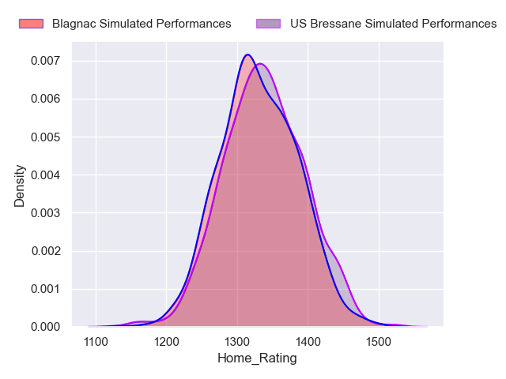
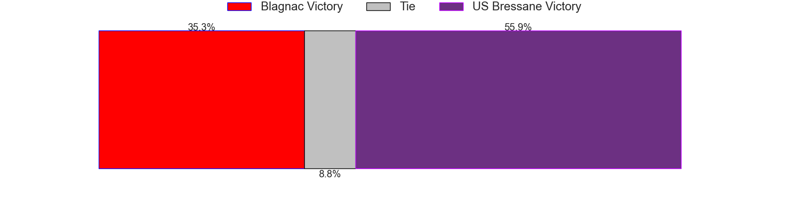
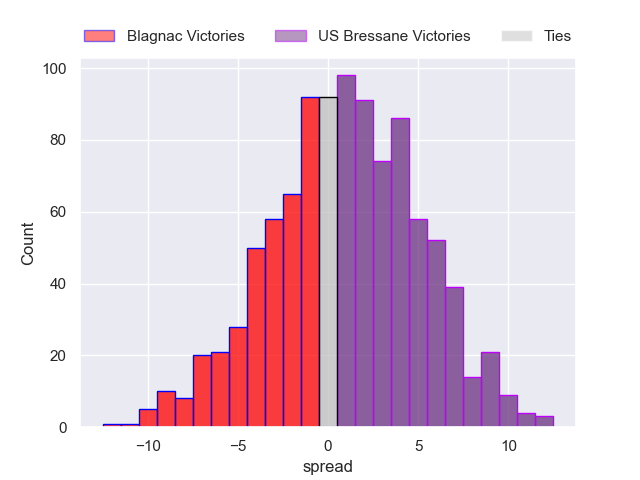

### Périgueux V Carcassonne on 2023/11/04

Average Margin: Carcassonne by 3.5

### Nice V Massy on 2023/11/04

Average Margin: Nice by 7.3

### Tarbes V Narbonne on 2023/11/04

Average Margin: Narbonne by 0.6

### Vienne V Carqueiranne-Hyères on 2023/11/04

Average Margin: Carqueiranne-Hyères by 9.2

### Bourgoin-Jallieu V Chambery on 2023/11/04

Average Margin: Bourgoin-Jallieu by 2.6

### Suresnes V Albi on 2023/11/04

Average Margin: Albi by 5.8

## Week 21

### US Bressane V Narbonne on 2023/11/10

Average Margin: US Bressane by 0.8

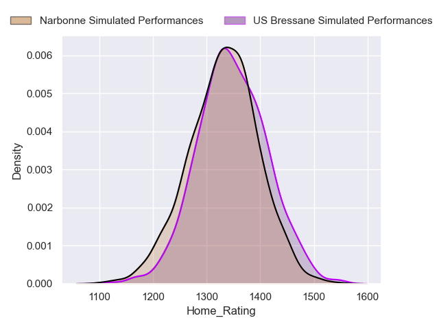

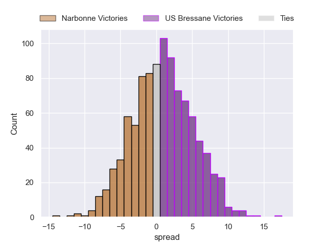

### Carcassonne V Vienne on 2023/11/10

Average Margin: Carcassonne by 23.4

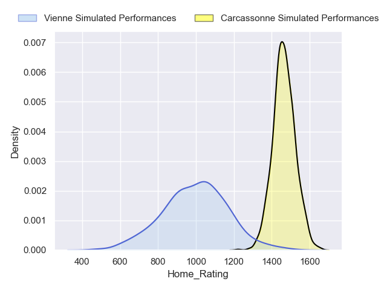
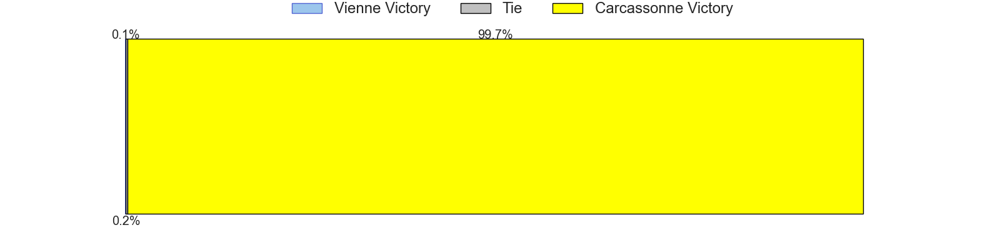
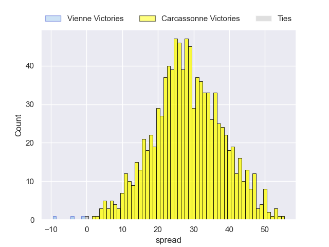

### Chambery V Albi on 2023/11/10

Average Margin: Albi by 0.2

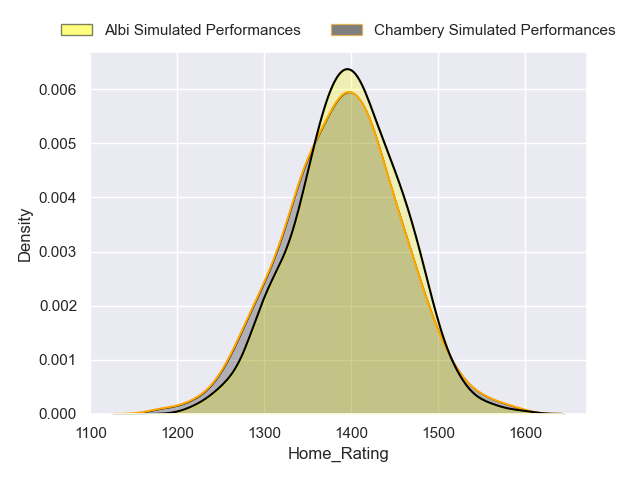

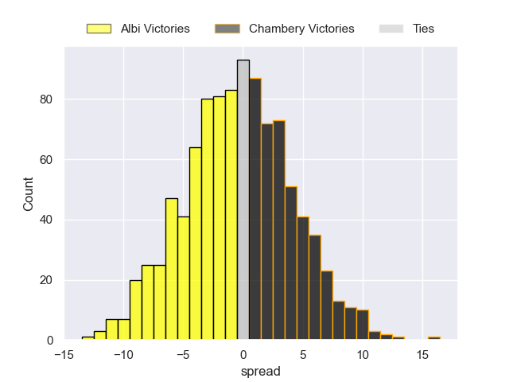

### Blagnac V Nice on 2023/11/11

Average Margin: Blagnac by 0.5

### Bourgoin-Jallieu V Massy on 2023/11/11

Average Margin: Bourgoin-Jallieu by 3.2

### Suresnes V Périgueux on 2023/11/11

Average Margin: Suresnes by 0.7

### Carqueiranne-Hyères V Tarbes on 2023/11/11

Average Margin: Carqueiranne-Hyères by 3.0

## Week 22

### Albi V Massy on 2023/11/17

Average Margin: Albi by 7.9

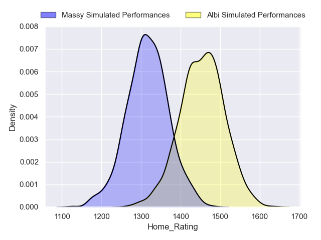
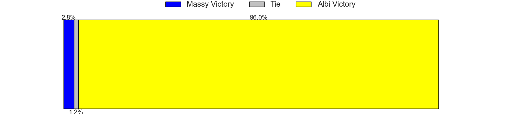
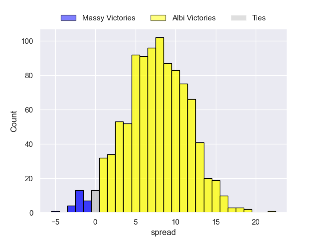

### Nice V US Bressane on 2023/11/18

Average Margin: Nice by 8.9

### Bourgoin-Jallieu V Blagnac on 2023/11/18

Average Margin: Bourgoin-Jallieu by 2.3

### Vienne V Suresnes on 2023/11/18

Average Margin: Suresnes by 7.2

### Narbonne V Carqueiranne-Hyères on 2023/11/18

Average Margin: Narbonne by 7.5

### Tarbes V Carcassonne on 2023/11/18

Average Margin: Carcassonne by 3.6

### Périgueux V Chambery on 2023/11/18

Average Margin: Périgueux by 0.6

## Week 23

### Chambery V Vienne on 2023/12/01

Average Margin: Chambery by 18.7

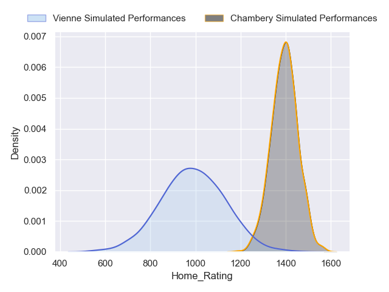
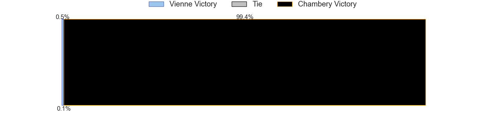
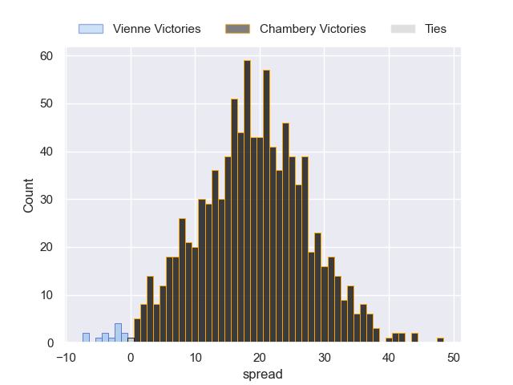

### Carcassonne V Narbonne on 2023/12/01

Average Margin: Carcassonne by 6.6

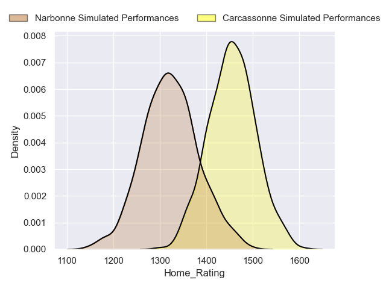
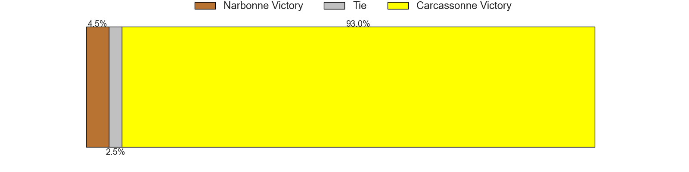
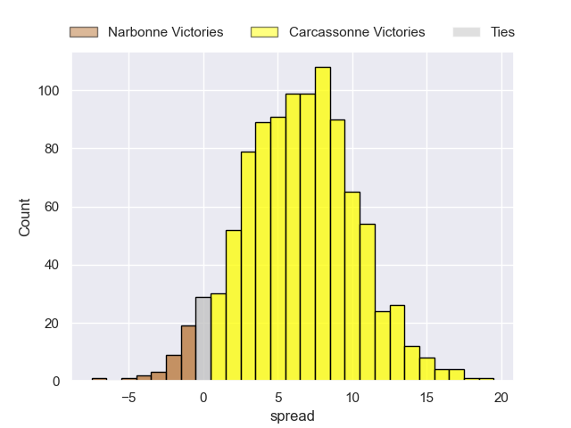

### Massy V Périgueux on 2023/12/01

Average Margin: Massy by 5.8

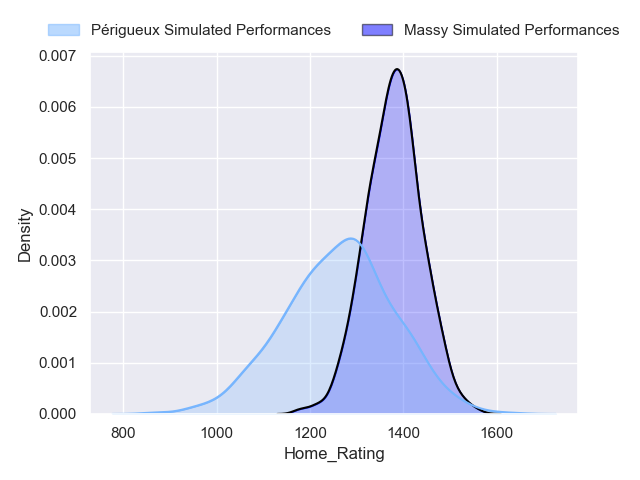
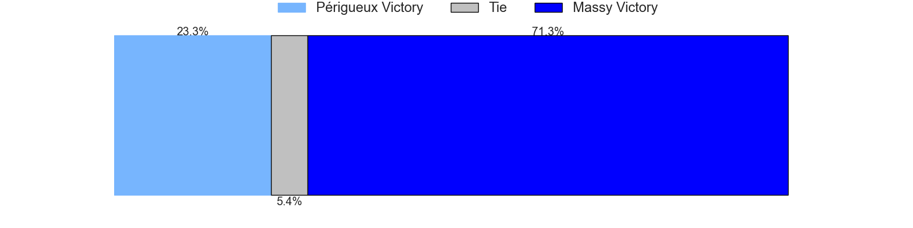
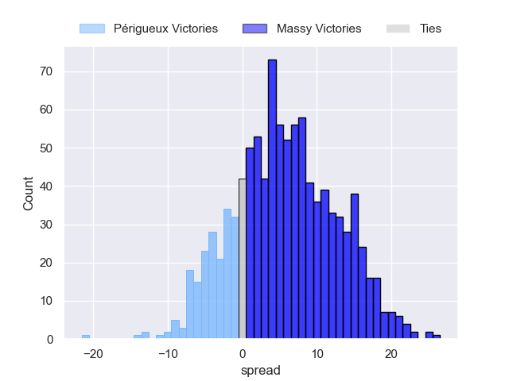

### Nice V Bourgoin-Jallieu on 2023/12/02

Average Margin: Nice by 7.6

### Blagnac V Albi on 2023/12/02

Average Margin: Albi by 0.3

### Carqueiranne-Hyères V US Bressane on 2023/12/02

Average Margin: Carqueiranne-Hyères by 2.0

### Suresnes V Tarbes on 2023/12/02

Average Margin: Suresnes by 1.4

## Week 24

### Carcassonne V Carqueiranne-Hyères on 2023/12/08

Average Margin: Carcassonne by 11.0

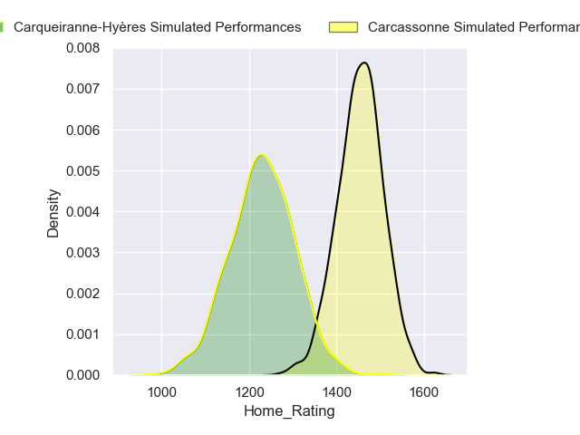
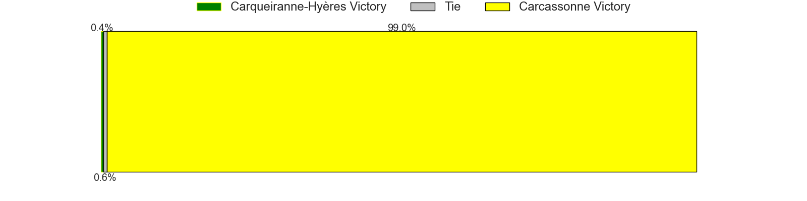
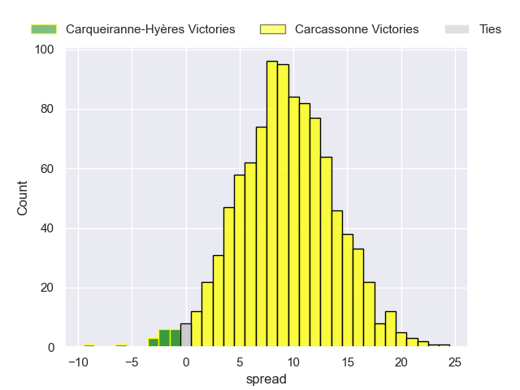

### Chambery V Tarbes on 2023/12/08

Average Margin: Chambery by 6.0

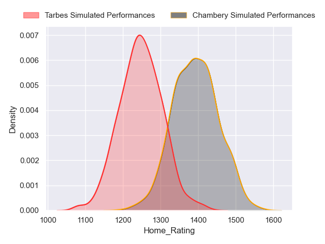
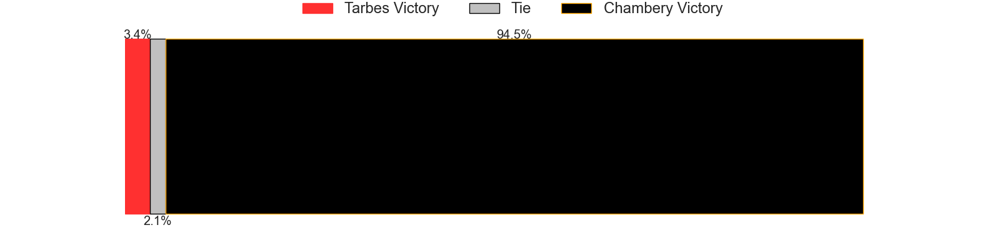
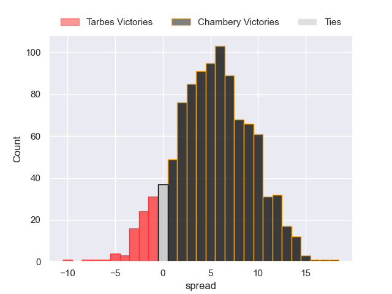

### US Bressane V Bourgoin-Jallieu on 2023/12/08

Average Margin: US Bressane by 2.2

### Albi V Nice on 2023/12/08

Average Margin: Albi by 4.0

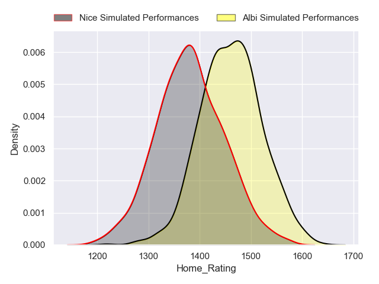
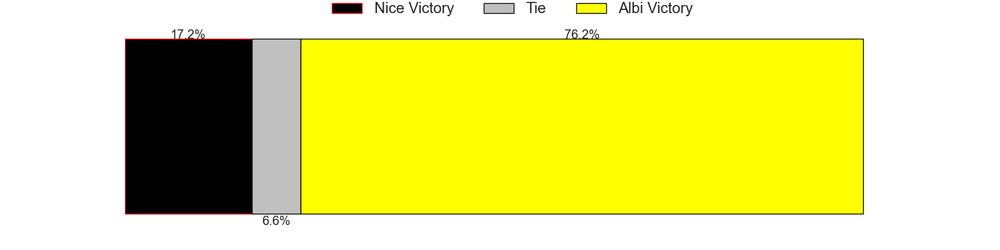
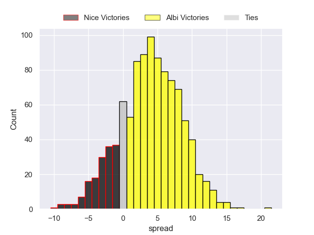

### Narbonne V Suresnes on 2023/12/09

Average Margin: Narbonne by 9.1

### Vienne V Massy on 2023/12/09

Average Margin: Massy by 11.2

### Blagnac V Périgueux on 2023/12/09

Average Margin: Blagnac by 6.5

## Week 25

### Carcassonne V US Bressane on 2023/12/16

Average Margin: Carcassonne by 9.1

### Vienne V Blagnac on 2023/12/16

Average Margin: Blagnac by 12.0

### Albi V Bourgoin-Jallieu on 2023/12/16

Average Margin: Albi by 7.8

### Périgueux V Nice on 2023/12/16

Average Margin: Nice by 3.0

### Chambery V Narbonne on 2023/12/16

Average Margin: Chambery by 2.9

### Suresnes V Carqueiranne-Hyères on 2023/12/16

Average Margin: Suresnes by 1.3

### Tarbes V Massy on 2023/12/16

Average Margin: Tarbes by 0.7

## Week 9

### Blagnac V Tarbes on 2024/01/15

Average Margin: Blagnac by 7.1

### Chambery V Carqueiranne-Hyères on 2024/01/15

Average Margin: Chambery by 6.6

### Bourgoin-Jallieu V Périgueux on 2024/01/15

Average Margin: Bourgoin-Jallieu by 5.4

### US Bressane V Albi on 2024/01/15

Average Margin: Albi by 2.4

### Narbonne V Massy on 2024/01/15

Average Margin: Narbonne by 4.3

### Suresnes V Carcassonne on 2024/01/15

Average Margin: Carcassonne by 5.9

### Nice V Vienne on 2024/01/15

Average Margin: Nice by 21.4

### Nice V Tarbes on 2024/01/20

Average Margin: Nice by 10.0

### Carqueiranne-Hyères V Massy on 2024/01/20

Average Margin: Carqueiranne-Hyères by 0.1

### Chambery V Carcassonne on 2024/01/20

Average Margin: Carcassonne by 0.5

### Périgueux V Albi on 2024/01/20

Average Margin: Albi by 3.2

### Bourgoin-Jallieu V Vienne on 2024/01/20

Average Margin: Bourgoin-Jallieu by 17.1

### Blagnac V Narbonne on 2024/01/20

Average Margin: Blagnac by 3.2

### Suresnes V US Bressane on 2024/01/20

Average Margin: US Bressane by 0.3

## Week 10

### Chambery V Suresnes on 2024/01/27

Average Margin: Chambery by 8.4

### Massy V Carcassonne on 2024/01/27

Average Margin: Carcassonne by 1.1

### Bourgoin-Jallieu V Tarbes on 2024/01/27

Average Margin: Bourgoin-Jallieu by 5.6

### Blagnac V Carqueiranne-Hyères on 2024/01/27

Average Margin: Blagnac by 7.4

### US Bressane V Périgueux on 2024/01/27

Average Margin: US Bressane by 4.1

### Albi V Vienne on 2024/01/27

Average Margin: Albi by 22.0

### Nice V Narbonne on 2024/01/27

Average Margin: Nice by 6.1

## Week 11

### Tarbes V Albi on 2024/02/03

Average Margin: Albi by 3.4

### Carcassonne V Blagnac on 2024/02/03

Average Margin: Carcassonne by 6.7

### Vienne V Périgueux on 2024/02/03

Average Margin: Périgueux by 7.7

### Bourgoin-Jallieu V Narbonne on 2024/02/03

Average Margin: Bourgoin-Jallieu by 2.0

### Nice V Carqueiranne-Hyères on 2024/02/03

Average Margin: Nice by 10.0

### US Bressane V Chambery on 2024/02/03

Average Margin: US Bressane by 1.4

### Suresnes V Massy on 2024/02/03

Average Margin: Massy by 1.6

## Week 12

### Vienne V US Bressane on 2024/02/10

Average Margin: US Bressane by 8.8

### Narbonne V Albi on 2024/02/10

Average Margin: Narbonne by 0.1

### Périgueux V Tarbes on 2024/02/10

Average Margin: Périgueux by 4.1

### Carcassonne V Nice on 2024/02/10

Average Margin: Carcassonne by 3.8

### Blagnac V Suresnes on 2024/02/10

Average Margin: Blagnac by 9.1

### Massy V Chambery on 2024/02/10

Average Margin: Massy by 3.2

### Carqueiranne-Hyères V Bourgoin-Jallieu on 2024/02/10

Average Margin: Carqueiranne-Hyères by 0.5

## Week 13

### Carqueiranne-Hyères V Albi on 2024/02/17

Average Margin: Albi by 3.8

### Narbonne V Périgueux on 2024/02/17

Average Margin: Narbonne by 6.4

### Chambery V Blagnac on 2024/02/17

Average Margin: Chambery by 2.9

### Tarbes V Vienne on 2024/02/17

Average Margin: Tarbes by 14.6

### Carcassonne V Bourgoin-Jallieu on 2024/02/17

Average Margin: Carcassonne by 8.1

### Massy V US Bressane on 2024/02/17

Average Margin: Massy by 4.9

### Suresnes V Nice on 2024/02/17

Average Margin: Nice by 5.5

## Week 14

### Bourgoin-Jallieu V Suresnes on 2024/03/02

Average Margin: Bourgoin-Jallieu by 7.9

### Nice V Chambery on 2024/03/02

Average Margin: Nice by 6.9

### Blagnac V Massy on 2024/03/02

Average Margin: Blagnac by 4.1

### Vienne V Narbonne on 2024/03/02

Average Margin: Narbonne by 10.6

### Albi V Carcassonne on 2024/03/02

Average Margin: Albi by 3.3

### US Bressane V Tarbes on 2024/03/02

Average Margin: US Bressane by 4.3

### Périgueux V Carqueiranne-Hyères on 2024/03/02

Average Margin: Périgueux by 4.1

## Week 15

### Massy V Nice on 2024/03/09

Average Margin: Nice by 0.5

### Carqueiranne-Hyères V Vienne on 2024/03/09

Average Margin: Carqueiranne-Hyères by 13.6

### Albi V Suresnes on 2024/03/09

Average Margin: Albi by 12.4

### Chambery V Bourgoin-Jallieu on 2024/03/09

Average Margin: Chambery by 4.3

### Narbonne V Tarbes on 2024/03/09

Average Margin: Narbonne by 7.1

### Carcassonne V Périgueux on 2024/03/09

Average Margin: Carcassonne by 9.9

### Blagnac V US Bressane on 2024/03/09

Average Margin: Blagnac by 5.5

## Week 16

### Vienne V Carcassonne on 2024/03/23

Average Margin: Carcassonne by 14.3

### Massy V Bourgoin-Jallieu on 2024/03/23

Average Margin: Massy by 3.7

### Tarbes V Carqueiranne-Hyères on 2024/03/23

Average Margin: Tarbes by 3.8

### Albi V Chambery on 2024/03/23

Average Margin: Albi by 7.1

### Périgueux V Suresnes on 2024/03/23

Average Margin: Périgueux by 6.4

### Narbonne V US Bressane on 2024/03/23

Average Margin: Narbonne by 5.8

### Nice V Blagnac on 2024/03/23

Average Margin: Nice by 6.2

## Week 17

### Carqueiranne-Hyères V Narbonne on 2024/03/30

Average Margin: Narbonne by 0.6

### US Bressane V Nice on 2024/03/30

Average Margin: Nice by 2.1

### Blagnac V Bourgoin-Jallieu on 2024/03/30

Average Margin: Blagnac by 4.3

### Suresnes V Vienne on 2024/03/30

Average Margin: Suresnes by 11.7

### Carcassonne V Tarbes on 2024/03/30

Average Margin: Carcassonne by 10.4

### Chambery V Périgueux on 2024/03/30

Average Margin: Chambery by 5.8

### Massy V Albi on 2024/03/30

Average Margin: Albi by 0.9

## Week 18

### Vienne V Chambery on 2024/04/06

Average Margin: Chambery by 10.1

### Narbonne V Carcassonne on 2024/04/06

Average Margin: Carcassonne by 0.1

### Périgueux V Massy on 2024/04/06

Average Margin: Périgueux by 1.4

### Bourgoin-Jallieu V Nice on 2024/04/06

Average Margin: Nice by 0.7

### US Bressane V Carqueiranne-Hyères on 2024/04/06

Average Margin: US Bressane by 4.8

### Tarbes V Suresnes on 2024/04/06

Average Margin: Tarbes by 5.5

### Albi V Blagnac on 2024/04/06

Average Margin: Albi by 6.5

## Week 19

### Nice V Albi on 2024/04/27

Average Margin: Nice by 3.2

### Suresnes V Narbonne on 2024/04/27

Average Margin: Narbonne by 2.5

### Bourgoin-Jallieu V US Bressane on 2024/04/27

Average Margin: Bourgoin-Jallieu by 4.6

### Tarbes V Chambery on 2024/04/27

Average Margin: Tarbes by 0.6

### Massy V Vienne on 2024/04/27

Average Margin: Massy by 16.1

### Carqueiranne-Hyères V Carcassonne on 2024/04/27

Average Margin: Carcassonne by 4.2

### Périgueux V Blagnac on 2024/04/27

Average Margin: Périgueux by 0.6

