---  
title: "Nationale 2023 Status"  
date: 2023-11-29 6:00:00 -0500  
categories: model review projection  
layout: article  
aside:  
    toc: true  
---
# Current Team Rankings

# Standings

## Current Standings

| Club                |   Played |   Wins |   Point Differential |   Losing Bonus Points |   Try Bonus Points |   Competition Points |
|:--------------------|---------:|-------:|---------------------:|----------------------:|-------------------:|---------------------:|
| Nice                |       12 |      8 |                  147 |                     2 |                  6 |                   40 |
| Narbonne            |       11 |      8 |                   62 |                     3 |                  1 |                   36 |
| Albi                |       11 |      7 |                   86 |                     3 |                  3 |                   34 |
| Carcassonne         |       11 |      8 |                   56 |                     1 |                  1 |                   34 |
| Périgueux           |       11 |      7 |                   75 |                     3 |                  1 |                   32 |
| Suresnes            |       11 |      7 |                   -8 |                     1 |                  1 |                   30 |
| Blagnac             |       11 |      6 |                    3 |                     1 |                  3 |                   28 |
| Chambery            |       11 |      5 |                   -7 |                     3 |                  1 |                   26 |
| Bourgoin-Jallieu    |       11 |      5 |                    6 |                     4 |                  1 |                   25 |
| Carqueiranne-Hyères |       11 |      5 |                  -12 |                     2 |                  1 |                   25 |
| Tarbes              |       11 |      5 |                  -68 |                     3 |                  0 |                   23 |
| US Bressane         |       12 |      3 |                  -55 |                     5 |                  0 |                   17 |
| Massy               |       11 |      2 |                  -28 |                     8 |                  0 |                   16 |
| Vienne              |       11 |      1 |                 -257 |                     1 |                  0 |                    5 |

## Projected Remaining Table

| Club                |   Matches Remaining |   Wins |   Point Differential |   Losing Bonus Points |   Try Bonus Points |   Competition Points |
|:--------------------|--------------------:|-------:|---------------------:|----------------------:|-------------------:|---------------------:|
| Carcassonne         |                  15 |   12   |             82.4168  |                   2.8 |               11.4 |                 62.2 |
| Nice                |                  15 |   11   |             72.7085  |                   3.4 |               10.5 |                 57.8 |
| Albi                |                  15 |   10.8 |             64.2791  |                   3.7 |               10.1 |                 56.9 |
| Chambery            |                  15 |    9.4 |             46.0807  |                   4.3 |                8.8 |                 50.6 |
| Périgueux           |                  15 |    9.3 |             40.7086  |                   4.2 |                8.8 |                 50.2 |
| Massy               |                  15 |    8.7 |             34.4592  |                   5.3 |                8.1 |                 48.2 |
| Narbonne            |                  15 |    8.7 |             26.0225  |                   5   |                8.1 |                 47.7 |
| Blagnac             |                  15 |    8.8 |             24.3843  |                   4.1 |                8.3 |                 47.6 |
| Bourgoin-Jallieu    |                  15 |    6.9 |              4.79004 |                   5.7 |                6.1 |                 39.3 |
| US Bressane         |                  15 |    5.9 |            -19.3039  |                   6.3 |                5.4 |                 35.1 |
| Carqueiranne-Hyères |                  15 |    4.9 |            -33.5893  |                   6.2 |                4.5 |                 30.3 |
| Tarbes              |                  15 |    4.3 |            -46.4895  |                   5.7 |                4   |                 27   |
| Suresnes            |                  15 |    4.1 |            -48.9419  |                   6   |                3.9 |                 26.4 |
| Vienne              |                  15 |    0.3 |           -247.525   |                   1.5 |                0.4 |                  3.1 |

## Projected Total Table

| Club                |   Total Matches |   Wins |   Point Differential |   Losing Bonus Points |   Try Bonus Points |   Competition Points |
|:--------------------|----------------:|-------:|---------------------:|----------------------:|-------------------:|---------------------:|
| Nice                |              27 |   19   |            219.709   |                   5.4 |               16.5 |                 97.8 |
| Carcassonne         |              26 |   20   |            138.417   |                   3.8 |               12.4 |                 96.2 |
| Albi                |              26 |   17.8 |            150.279   |                   6.7 |               13.1 |                 90.9 |
| Narbonne            |              26 |   16.7 |             88.0225  |                   8   |                9.1 |                 83.7 |
| Périgueux           |              26 |   16.3 |            115.709   |                   7.2 |                9.8 |                 82.2 |
| Chambery            |              26 |   14.4 |             39.0807  |                   7.3 |                9.8 |                 76.6 |
| Blagnac             |              26 |   14.8 |             27.3843  |                   5.1 |               11.3 |                 75.6 |
| Bourgoin-Jallieu    |              26 |   11.9 |             10.79    |                   9.7 |                7.1 |                 64.3 |
| Massy               |              26 |   10.7 |              6.45924 |                  13.3 |                8.1 |                 64.2 |
| Suresnes            |              26 |   11.1 |            -56.9419  |                   7   |                4.9 |                 56.4 |
| Carqueiranne-Hyères |              26 |    9.9 |            -45.5893  |                   8.2 |                5.5 |                 55.3 |
| US Bressane         |              27 |    8.9 |            -74.3039  |                  11.3 |                5.4 |                 52.1 |
| Tarbes              |              26 |    9.3 |           -114.489   |                   8.7 |                4   |                 50   |
| Vienne              |              26 |    1.3 |           -504.525   |                   2.5 |                0.4 |                  8.1 |

# Completed Match Review

| Model | Percent Correct Predictions | Spread Error |
| ------ | ------ | ------ |
| Club Level | 75.3% | 8.3 |
| Player Level: Lineup | 67.5% | 9.8 |
| Player Level: Minutes | 66.2% | 9.7 |

# Future Predictions

## Week 13

### Chambery V Vienne on 2023/12/01

Average Margin: Chambery by 21.0

### Massy V Périgueux on 2023/12/01

Average Margin: Massy by 1.3

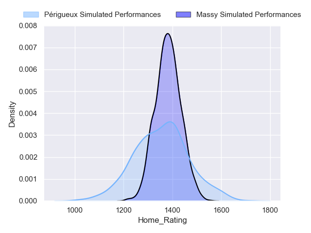

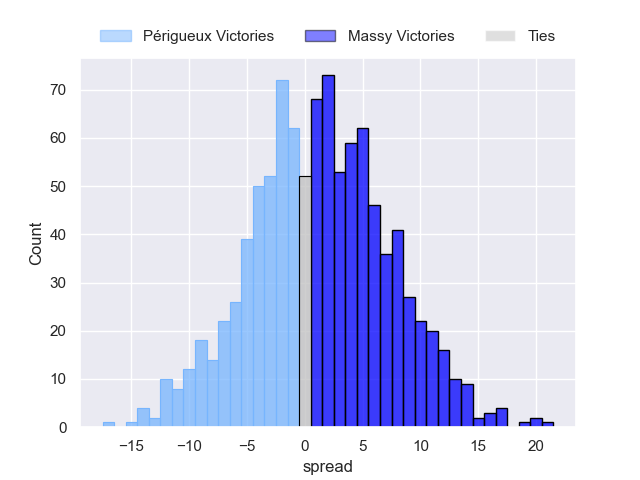

### Carcassonne V Narbonne on 2023/12/01

Average Margin: Carcassonne by 6.4

### Suresnes V Tarbes on 2023/12/02

Average Margin: Suresnes by 2.5

### Blagnac V Albi on 2023/12/02

Average Margin: Albi by 0.0

### Nice V Bourgoin-Jallieu on 2023/12/02

Average Margin: Nice by 7.3

### Carqueiranne-Hyères V US Bressane on 2023/12/02

Average Margin: Carqueiranne-Hyères by 2.8

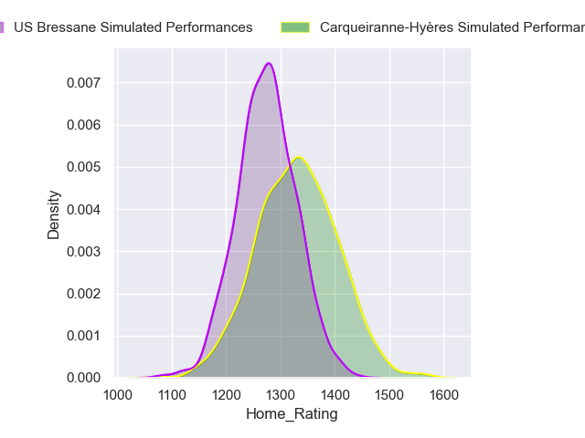
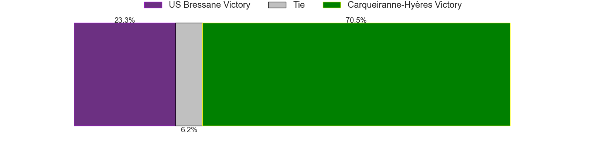
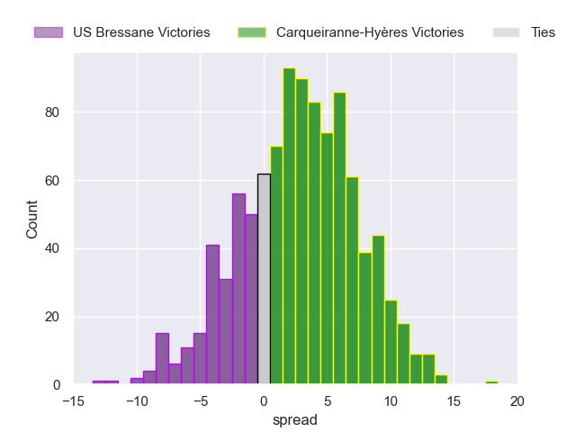

## Week 14

### Albi V Nice on 2023/12/08

Average Margin: Albi by 3.2

### US Bressane V Bourgoin-Jallieu on 2023/12/08

Average Margin: US Bressane by 1.7

### Chambery V Tarbes on 2023/12/08

Average Margin: Chambery by 6.9

### Carcassonne V Carqueiranne-Hyères on 2023/12/08

Average Margin: Carcassonne by 9.9

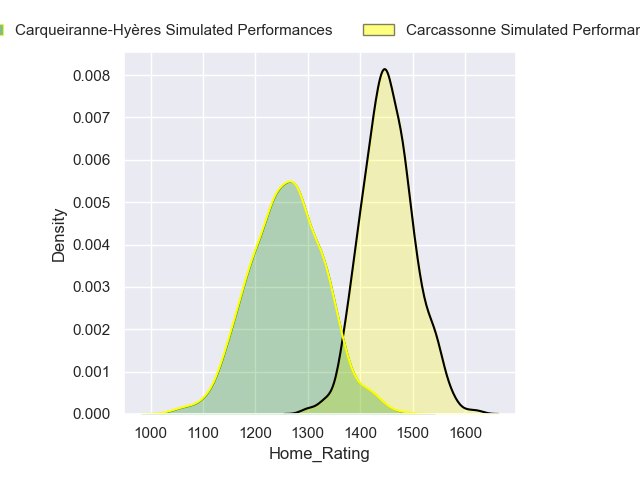
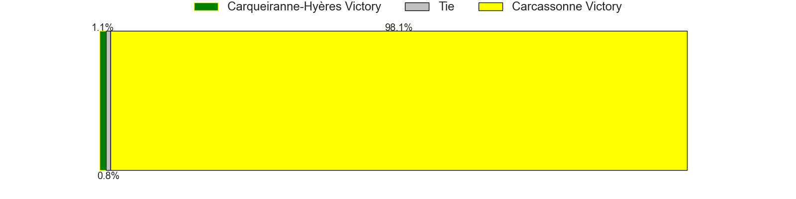
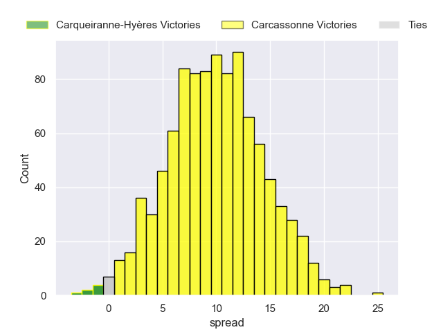

### Narbonne V Suresnes on 2023/12/09

Average Margin: Narbonne by 8.8

### Vienne V Massy on 2023/12/09

Average Margin: Massy by 13.8

### Blagnac V Périgueux on 2023/12/09

Average Margin: Blagnac by 1.7

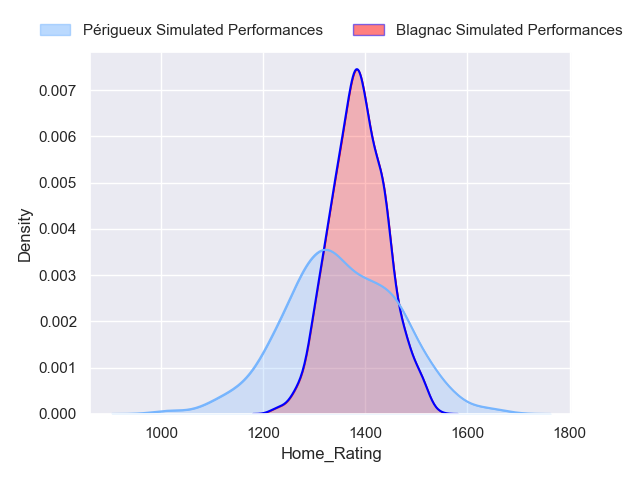
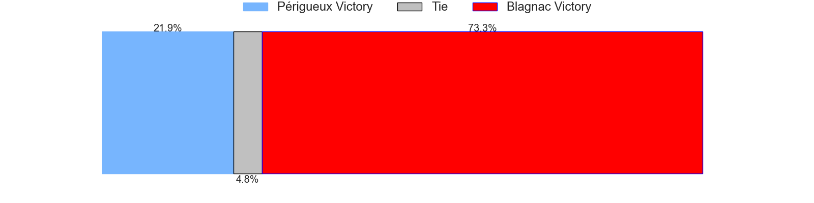
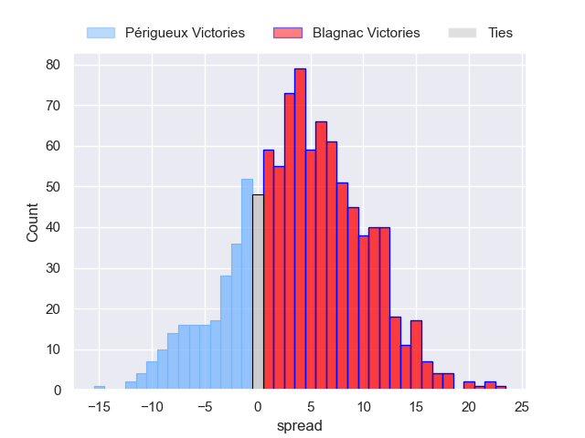

## Week 15

### Carcassonne V US Bressane on 2023/12/16

Average Margin: Carcassonne by 9.4

### Vienne V Blagnac on 2023/12/16

Average Margin: Blagnac by 13.8

### Périgueux V Nice on 2023/12/16

Average Margin: Périgueux by 1.7

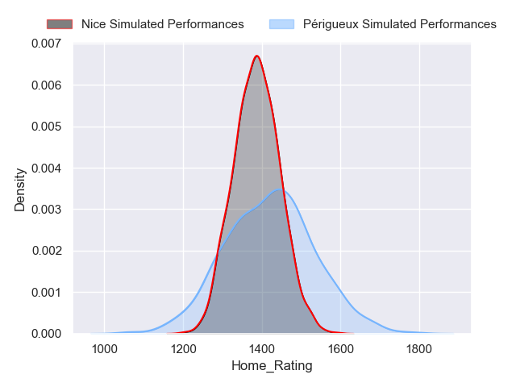

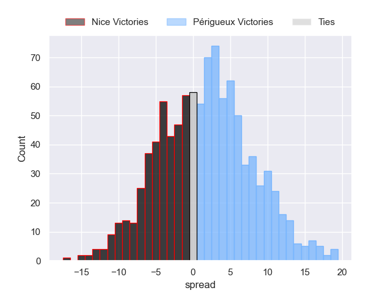

### Suresnes V Carqueiranne-Hyères on 2023/12/16

Average Margin: Suresnes by 1.6

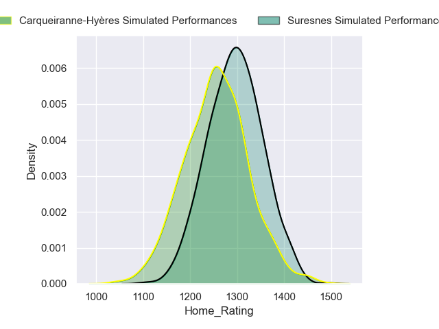
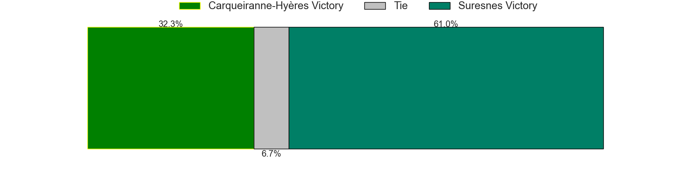
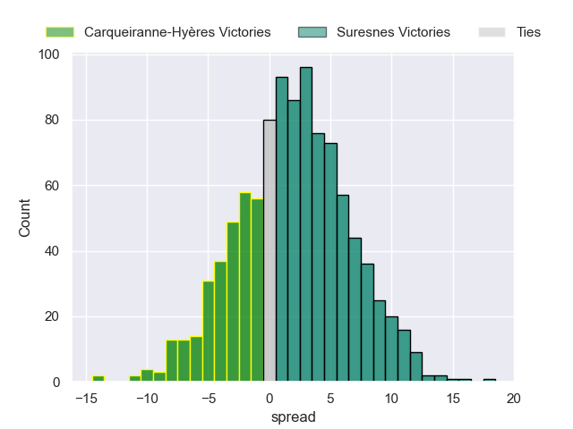

### Albi V Bourgoin-Jallieu on 2023/12/16

Average Margin: Albi by 7.3

### Tarbes V Massy on 2023/12/16

Average Margin: Massy by 0.2

### Chambery V Narbonne on 2023/12/16

Average Margin: Chambery by 2.6

## Week 16

### Chambery V Carqueiranne-Hyères on 2024/01/15

Average Margin: Chambery by 6.0

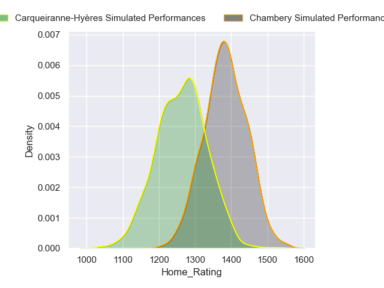
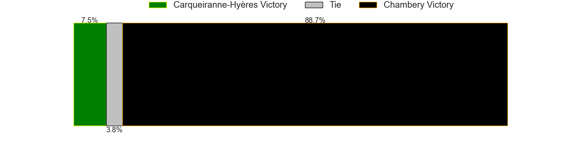
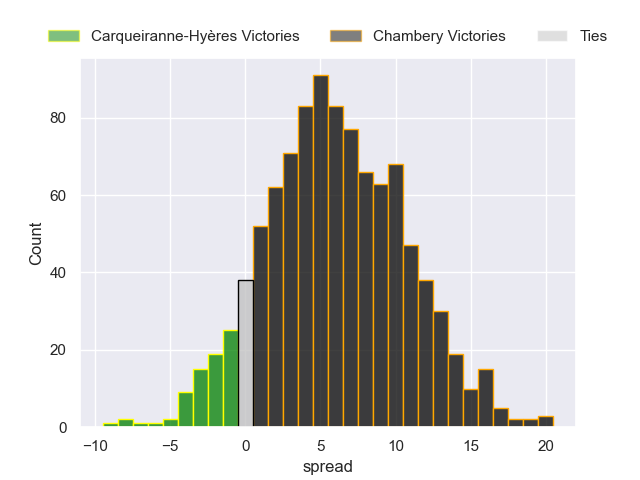

### Blagnac V Tarbes on 2024/01/15

Average Margin: Blagnac by 7.3

### Suresnes V Carcassonne on 2024/01/15

Average Margin: Carcassonne by 5.1

### Bourgoin-Jallieu V Périgueux on 2024/01/15

Average Margin: Bourgoin-Jallieu by 1.1

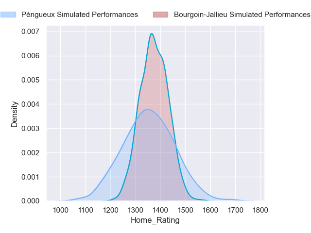

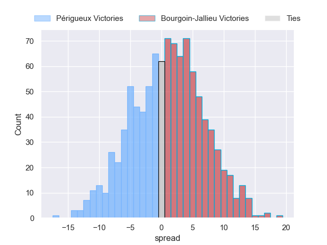

### Nice V Vienne on 2024/01/15

Average Margin: Nice by 23.7

### Narbonne V Massy on 2024/01/15

Average Margin: Narbonne by 4.1

### US Bressane V Albi on 2024/01/15

Average Margin: Albi by 2.5

### Carqueiranne-Hyères V Massy on 2024/01/20

Average Margin: Carqueiranne-Hyères by 0.7

### Bourgoin-Jallieu V Vienne on 2024/01/20

Average Margin: Bourgoin-Jallieu by 19.5

### Chambery V Carcassonne on 2024/01/20

Average Margin: Carcassonne by 0.4

### Suresnes V US Bressane on 2024/01/20

Average Margin: Suresnes by 1.2

### Périgueux V Albi on 2024/01/20

Average Margin: Périgueux by 1.7

### Blagnac V Narbonne on 2024/01/20

Average Margin: Blagnac by 2.6

### Nice V Tarbes on 2024/01/20

Average Margin: Nice by 10.5

## Week 17

### Albi V Vienne on 2024/01/27

Average Margin: Albi by 23.6

### Massy V Carcassonne on 2024/01/27

Average Margin: Carcassonne by 0.3

### Nice V Narbonne on 2024/01/27

Average Margin: Nice by 5.8

### US Bressane V Périgueux on 2024/01/27

Average Margin: Périgueux by 0.6

### Blagnac V Carqueiranne-Hyères on 2024/01/27

Average Margin: Blagnac by 6.6

### Bourgoin-Jallieu V Tarbes on 2024/01/27

Average Margin: Bourgoin-Jallieu by 6.4

### Chambery V Suresnes on 2024/01/27

Average Margin: Chambery by 7.8

## Week 18

### Suresnes V Massy on 2024/02/03

Average Margin: Massy by 1.0

### Carcassonne V Blagnac on 2024/02/03

Average Margin: Carcassonne by 6.9

### Tarbes V Albi on 2024/02/03

Average Margin: Albi by 3.5

### Bourgoin-Jallieu V Narbonne on 2024/02/03

Average Margin: Bourgoin-Jallieu by 2.1

### US Bressane V Chambery on 2024/02/03

Average Margin: US Bressane by 1.1

### Nice V Carqueiranne-Hyères on 2024/02/03

Average Margin: Nice by 9.6

### Vienne V Périgueux on 2024/02/03

Average Margin: Périgueux by 14.1

## Week 19

### Massy V Chambery on 2024/02/10

Average Margin: Massy by 3.5

### Carqueiranne-Hyères V Bourgoin-Jallieu on 2024/02/10

Average Margin: Carqueiranne-Hyères by 1.0

### Blagnac V Suresnes on 2024/02/10

Average Margin: Blagnac by 8.0

### Vienne V US Bressane on 2024/02/10

Average Margin: US Bressane by 10.8

### Carcassonne V Nice on 2024/02/10

Average Margin: Carcassonne by 3.6

### Périgueux V Tarbes on 2024/02/10

Average Margin: Périgueux by 9.0

### Narbonne V Albi on 2024/02/10

Average Margin: Narbonne by 0.8

## Week 20

### Carqueiranne-Hyères V Albi on 2024/02/17

Average Margin: Albi by 2.9

### Narbonne V Périgueux on 2024/02/17

Average Margin: Narbonne by 2.4

### Chambery V Blagnac on 2024/02/17

Average Margin: Chambery by 3.0

### Carcassonne V Bourgoin-Jallieu on 2024/02/17

Average Margin: Carcassonne by 7.6

### Tarbes V Vienne on 2024/02/17

Average Margin: Tarbes by 16.1

### Suresnes V Nice on 2024/02/17

Average Margin: Nice by 4.4

### Massy V US Bressane on 2024/02/17

Average Margin: Massy by 5.6

## Week 21

### Bourgoin-Jallieu V Suresnes on 2024/03/02

Average Margin: Bourgoin-Jallieu by 7.3

### Périgueux V Carqueiranne-Hyères on 2024/03/02

Average Margin: Périgueux by 8.0

### Nice V Chambery on 2024/03/02

Average Margin: Nice by 6.9

### Blagnac V Massy on 2024/03/02

Average Margin: Blagnac by 3.4

### US Bressane V Tarbes on 2024/03/02

Average Margin: US Bressane by 4.8

### Albi V Carcassonne on 2024/03/02

Average Margin: Albi by 2.8

### Vienne V Narbonne on 2024/03/02

Average Margin: Narbonne by 13.2

## Week 22

### Carqueiranne-Hyères V Vienne on 2024/03/09

Average Margin: Carqueiranne-Hyères by 16.4

### Chambery V Bourgoin-Jallieu on 2024/03/09

Average Margin: Chambery by 3.8

### Massy V Nice on 2024/03/09

Average Margin: Massy by 0.1

### Carcassonne V Périgueux on 2024/03/09

Average Margin: Carcassonne by 5.5

### Narbonne V Tarbes on 2024/03/09

Average Margin: Narbonne by 7.8

### Blagnac V US Bressane on 2024/03/09

Average Margin: Blagnac by 5.7

### Albi V Suresnes on 2024/03/09

Average Margin: Albi by 11.1

## Week 23

### Tarbes V Carqueiranne-Hyères on 2024/03/23

Average Margin: Tarbes by 2.7

### Albi V Chambery on 2024/03/23

Average Margin: Albi by 6.7

### Périgueux V Suresnes on 2024/03/23

Average Margin: Périgueux by 9.4

### Narbonne V US Bressane on 2024/03/23

Average Margin: Narbonne by 6.3

### Vienne V Carcassonne on 2024/03/23

Average Margin: Carcassonne by 16.3

### Nice V Blagnac on 2024/03/23

Average Margin: Nice by 6.8

### Massy V Bourgoin-Jallieu on 2024/03/23

Average Margin: Massy by 3.7

## Week 24

### Carqueiranne-Hyères V Narbonne on 2024/03/30

Average Margin: Narbonne by 0.2

### US Bressane V Nice on 2024/03/30

Average Margin: Nice by 2.2

### Chambery V Périgueux on 2024/03/30

Average Margin: Chambery by 1.6

### Blagnac V Bourgoin-Jallieu on 2024/03/30

Average Margin: Blagnac by 3.8

### Suresnes V Vienne on 2024/03/30

Average Margin: Suresnes by 14.6

### Massy V Albi on 2024/03/30

Average Margin: Albi by 0.2

### Carcassonne V Tarbes on 2024/03/30

Average Margin: Carcassonne by 10.7

## Week 25

### Albi V Blagnac on 2024/04/06

Average Margin: Albi by 6.7

### Narbonne V Carcassonne on 2024/04/06

Average Margin: Narbonne by 0.4

### Vienne V Chambery on 2024/04/06

Average Margin: Chambery by 12.0

### Périgueux V Massy on 2024/04/06

Average Margin: Périgueux by 4.7

### Bourgoin-Jallieu V Nice on 2024/04/06

Average Margin: Nice by 0.4

### US Bressane V Carqueiranne-Hyères on 2024/04/06

Average Margin: US Bressane by 3.7

### Tarbes V Suresnes on 2024/04/06

Average Margin: Tarbes by 4.4

## Week 26

### Suresnes V Narbonne on 2024/04/27

Average Margin: Narbonne by 1.7

### Nice V Albi on 2024/04/27

Average Margin: Nice by 3.7

### Périgueux V Blagnac on 2024/04/27

Average Margin: Périgueux by 5.0

### Carqueiranne-Hyères V Carcassonne on 2024/04/27

Average Margin: Carcassonne by 3.3

### Tarbes V Chambery on 2024/04/27

Average Margin: Chambery by 0.1

### Bourgoin-Jallieu V US Bressane on 2024/04/27

Average Margin: Bourgoin-Jallieu by 5.0

### Massy V Vienne on 2024/04/27

Average Margin: Massy by 18.6

