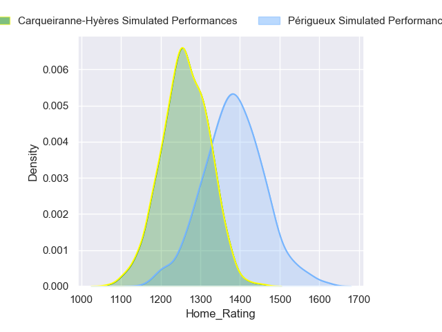
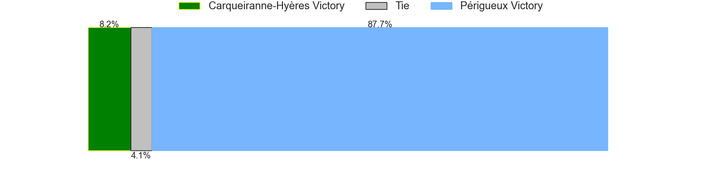
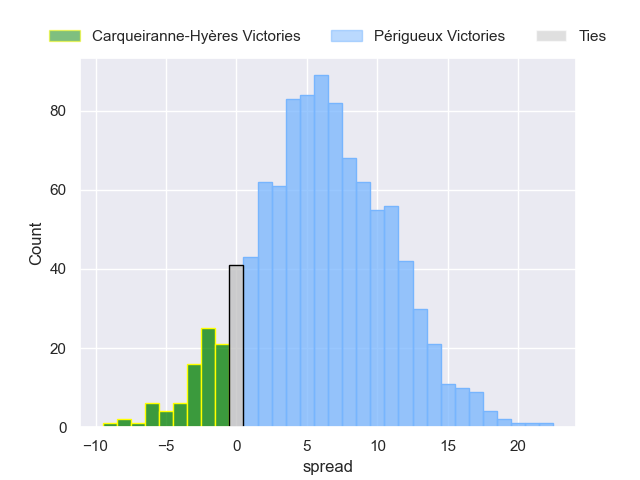

---  
title: "Nationale 2023 Status"  
date: 2024-04-15 6:00:00 -0500  
categories: model review projection  
layout: article  
aside:  
    toc: true  
---
# Current Team Rankings

# Standings

## Current Standings

| Club                |   Played |   Wins |   Point Differential |   Losing Bonus Points |   Try Bonus Points |   Competition Points |
|:--------------------|---------:|-------:|---------------------:|----------------------:|-------------------:|---------------------:|
| Narbonne            |       26 |     18 |                  158 |                     6 |                  7 |                   85 |
| Albi                |       25 |     17 |                  240 |                     7 |                nan |                   81 |
| Nice                |       25 |     16 |                  259 |                     4 |                nan |                   79 |
| Carcassonne         |       26 |     17 |                  187 |                     4 |                nan |                   78 |
| Suresnes            |       25 |     16 |                   70 |                     3 |                nan |                   72 |
| Chambery            |       25 |     14 |                   97 |                     6 |                nan |                   67 |
| Bourgoin-Jallieu    |       25 |     13 |                   37 |                     6 |                nan |                   64 |
| Périgueux           |       24 |     12 |                   51 |                     6 |                  5 |                   61 |
| US Bressane         |       25 |     10 |                    3 |                    11 |                nan |                   56 |
| Massy               |       25 |     11 |                   -3 |                     9 |                nan |                   54 |
| Carqueiranne-Hyères |       24 |     11 |                  -56 |                     4 |                  2 |                   52 |
| Tarbes              |       25 |      9 |                 -156 |                     9 |                  1 |                   46 |
| Blagnac             |       25 |      6 |                 -318 |                     1 |                nan |                   30 |
| Vienne              |       25 |      2 |                 -569 |                     3 |                nan |                   11 |

## Projected Remaining Table

| Club                |   Matches Remaining |   Wins |   Point Differential |   Losing Bonus Points |   Try Bonus Points |   Competition Points |
|:--------------------|--------------------:|-------:|---------------------:|----------------------:|-------------------:|---------------------:|
| Périgueux           |                   2 |    1.9 |            16.2487   |                   0.1 |                1   |                  8.7 |
| Massy               |                   1 |    1   |            19.7892   |                   0   |                0.8 |                  4.8 |
| Bourgoin-Jallieu    |                   1 |    0.9 |             4.51851  |                   0.1 |                0.5 |                  4.2 |
| Carcassonne         |                   1 |    0.8 |             3.2465   |                   0.2 |                0.4 |                  3.8 |
| Nice                |                   1 |    0.8 |             2.85954  |                   0.2 |                0.2 |                  3.6 |
| Chambery            |                   1 |    0.6 |             1.25454  |                   0.4 |                0.4 |                  3.2 |
| Narbonne            |                   1 |    0.6 |             0.642648 |                   0.4 |                0.4 |                  3.2 |
| Carqueiranne-Hyères |                   2 |    0.3 |            -9.32711  |                   1.1 |                0.6 |                  2.9 |
| Suresnes            |                   1 |    0.4 |            -0.642648 |                   0.6 |                0.2 |                  2.4 |
| Tarbes              |                   1 |    0.4 |            -1.25454  |                   0.6 |                0.2 |                  2.3 |
| Albi                |                   1 |    0.2 |            -2.85954  |                   0.7 |                0.2 |                  1.7 |
| US Bressane         |                   1 |    0.1 |            -4.51851  |                   0.7 |                0.2 |                  1.2 |
| Blagnac             |                   1 |    0   |           -10.1681   |                   0.2 |                0.2 |                  0.5 |
| Vienne              |                   1 |    0   |           -19.7892   |                   0   |                0.3 |                  0.3 |

## Projected Total Table

| Club                |   Total Matches |   Wins |   Point Differential |   Losing Bonus Points |   Try Bonus Points |   Competition Points |
|:--------------------|----------------:|-------:|---------------------:|----------------------:|-------------------:|---------------------:|
| Narbonne            |              27 |   18.6 |            158.643   |                   6.4 |                7.4 |                 88.2 |
| Albi                |              26 |   17.2 |            237.14    |                   7.7 |                0.2 |                 82.7 |
| Nice                |              26 |   16.8 |            261.86    |                   4.2 |                0.2 |                 82.6 |
| Carcassonne         |              27 |   17.8 |            190.246   |                   4.2 |                0.4 |                 81.8 |
| Suresnes            |              26 |   16.4 |             69.3574  |                   3.6 |                0.2 |                 74.4 |
| Chambery            |              26 |   14.6 |             98.2545  |                   6.4 |                0.4 |                 70.2 |
| Périgueux           |              26 |   13.9 |             67.2487  |                   6.1 |                6   |                 69.7 |
| Bourgoin-Jallieu    |              26 |   13.9 |             41.5185  |                   6.1 |                0.5 |                 68.2 |
| Massy               |              26 |   12   |             16.7892  |                   9   |                0.8 |                 58.8 |
| US Bressane         |              26 |   10.1 |             -1.51851 |                  11.7 |                0.2 |                 57.2 |
| Carqueiranne-Hyères |              26 |   11.3 |            -65.3271  |                   5.1 |                2.6 |                 54.9 |
| Tarbes              |              26 |    9.4 |           -157.255   |                   9.6 |                1.2 |                 48.3 |
| Blagnac             |              26 |    6   |           -328.168   |                   1.2 |                0.2 |                 30.5 |
| Vienne              |              26 |    2   |           -588.789   |                   3   |                0.3 |                 11.3 |

# Completed Match Review

| Model | Percent Correct Predictions | Spread Error |
| ------ | ------ | ------ |
| Club Level | 76.6% | 10.0 |
| Player Level: Lineup | 69.3% | 12.5 |
| Player Level: Minutes | 68.1% | 13.5 |

# Future Predictions

## Week 27

### Périgueux V Carqueiranne-Hyères on 2024/04/20

Average Margin: Périgueux by 6.1

Average Scoreline: 27-21

## Week 28

### Massy V Vienne on 2024/04/27

Average Margin: Massy by 19.8

Average Scoreline: 35-16

### Nice V Albi on 2024/04/27

Average Margin: Nice by 2.9

Average Scoreline: 22-20

### Bourgoin-Jallieu V US Bressane on 2024/04/27

Average Margin: Bourgoin-Jallieu by 4.5

Average Scoreline: 28-24

### Tarbes V Chambery on 2024/04/27

Average Margin: Chambery by 1.3

Average Scoreline: 26-24

### Suresnes V Narbonne on 2024/04/27

Average Margin: Narbonne by 0.6

Average Scoreline: 29-28

### Carqueiranne-Hyères V Carcassonne on 2024/04/27

Average Margin: Carcassonne by 3.2

Average Scoreline: 28-25

### Périgueux V Blagnac on 2024/04/27

Average Margin: Périgueux by 10.2

Average Scoreline: 31-21

