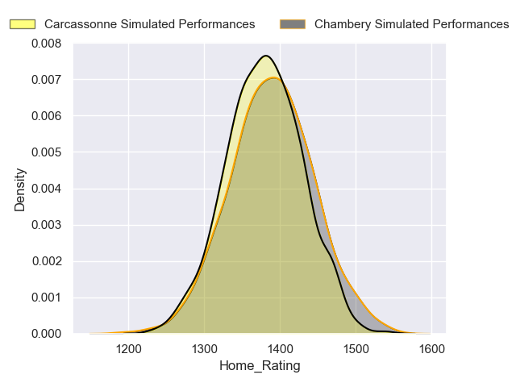
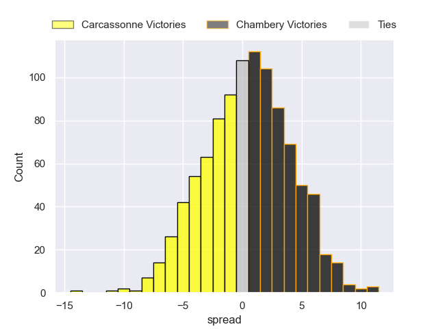

---  
title: "Nationale 2023 Status"  
date: 2024-01-15 6:00:00 -0500  
categories: model review projection  
layout: article  
aside:  
    toc: true  
---
# Current Team Rankings

# Standings

## Current Standings

| Club                |   Played |   Wins |   Point Differential |   Losing Bonus Points |   Try Bonus Points |   Competition Points |
|:--------------------|---------:|-------:|---------------------:|----------------------:|-------------------:|---------------------:|
| Nice                |       16 |     10 |                  185 |                     2 |                  8 |                   52 |
| Narbonne            |       15 |     11 |                  108 |                     4 |                  3 |                   51 |
| Albi                |       15 |     10 |                   94 |                     4 |                  3 |                   47 |
| Carcassonne         |       15 |     10 |                   74 |                     3 |                  2 |                   45 |
| Chambery            |       15 |      9 |                   46 |                     3 |                  2 |                   43 |
| Suresnes            |       15 |     10 |                  -11 |                     1 |                  1 |                   42 |
| Périgueux           |       15 |      8 |                   19 |                     4 |                  1 |                   37 |
| Blagnac             |       14 |      7 |                   30 |                     4 |                  4 |                   36 |
| Bourgoin-Jallieu    |       15 |      7 |                   15 |                     5 |                  1 |                   36 |
| Carqueiranne-Hyères |       15 |      6 |                  -54 |                     3 |                  1 |                   30 |
| Tarbes              |       15 |      6 |                  -97 |                     5 |                  0 |                   29 |
| Massy               |       15 |      4 |                  -44 |                     9 |                  0 |                   25 |
| US Bressane         |       16 |      4 |                  -68 |                     8 |                  0 |                   24 |
| Vienne              |       14 |      1 |                 -297 |                     2 |                  0 |                    6 |

## Projected Remaining Table

| Club                |   Matches Remaining |   Wins |   Point Differential |   Losing Bonus Points |   Try Bonus Points |   Competition Points |
|:--------------------|--------------------:|-------:|---------------------:|----------------------:|-------------------:|---------------------:|
| Nice                |                  11 |    8.4 |              45.3368 |                   2.3 |                5.2 |                 41.3 |
| Albi                |                  11 |    7.9 |              49.6902 |                   2.8 |                3.3 |                 37.7 |
| Carcassonne         |                  11 |    7.9 |              45.2562 |                   2.8 |                3.2 |                 37.7 |
| Narbonne            |                  11 |    7.4 |              34.6302 |                   3.1 |                4.6 |                 37.3 |
| Blagnac             |                  12 |    6.9 |              17.2897 |                   3.5 |                4.7 |                 35.7 |
| Bourgoin-Jallieu    |                  11 |    6.4 |              28.0374 |                   3.7 |                4.4 |                 33.7 |
| Massy               |                  11 |    6.2 |              18.6419 |                   4.2 |                3.9 |                 33   |
| Chambery            |                  11 |    6.2 |              13.9981 |                   3.8 |                4.2 |                 32.7 |
| Périgueux           |                  11 |    5.9 |               8.4067 |                   3.3 |                3.9 |                 30.9 |
| US Bressane         |                  11 |    4.7 |              -7.8196 |                   4.4 |                3.9 |                 27.3 |
| Tarbes              |                  11 |    3.5 |             -30.4911 |                   3.7 |                3.8 |                 21.7 |
| Carqueiranne-Hyères |                  11 |    3.2 |             -27.4935 |                   5   |                3.6 |                 21.2 |
| Suresnes            |                  11 |    2.8 |             -37.5936 |                   4.6 |                3.6 |                 19.5 |
| Vienne              |                  12 |    0.4 |            -157.889  |                   1.9 |                2.5 |                  6.2 |

## Projected Total Table

| Club                |   Total Matches |   Wins |   Point Differential |   Losing Bonus Points |   Try Bonus Points |   Competition Points |
|:--------------------|----------------:|-------:|---------------------:|----------------------:|-------------------:|---------------------:|
| Nice                |              27 |   18.4 |             230.337  |                   4.3 |               13.2 |                 93.3 |
| Narbonne            |              26 |   18.4 |             142.63   |                   7.1 |                7.6 |                 88.3 |
| Albi                |              26 |   17.9 |             143.69   |                   6.8 |                6.3 |                 84.7 |
| Carcassonne         |              26 |   17.9 |             119.256  |                   5.8 |                5.2 |                 82.7 |
| Chambery            |              26 |   15.2 |              59.9981 |                   6.8 |                6.2 |                 75.7 |
| Blagnac             |              26 |   13.9 |              47.2897 |                   7.5 |                8.7 |                 71.7 |
| Bourgoin-Jallieu    |              26 |   13.4 |              43.0374 |                   8.7 |                5.4 |                 69.7 |
| Périgueux           |              26 |   13.9 |              27.4067 |                   7.3 |                4.9 |                 67.9 |
| Suresnes            |              26 |   12.8 |             -48.5936 |                   5.6 |                4.6 |                 61.5 |
| Massy               |              26 |   10.2 |             -25.3581 |                  13.2 |                3.9 |                 58   |
| US Bressane         |              27 |    8.7 |             -75.8196 |                  12.4 |                3.9 |                 51.3 |
| Carqueiranne-Hyères |              26 |    9.2 |             -81.4935 |                   8   |                4.6 |                 51.2 |
| Tarbes              |              26 |    9.5 |            -127.491  |                   8.7 |                3.8 |                 50.7 |
| Vienne              |              26 |    1.4 |            -454.889  |                   3.9 |                2.5 |                 12.2 |

# Completed Match Review

| Model | Percent Correct Predictions | Spread Error |
| ------ | ------ | ------ |
| Club Level | 75.0% | 8.2 |
| Player Level: Lineup | 75.0% | 8.1 |
| Player Level: Minutes | 73.1% | 8.2 |

# Future Predictions

## Week 17

### Chambery V Carcassonne on 2024/01/19

Average Margin: Chambery by 0.5

Average Scoreline: 28-28

### Blagnac V Narbonne on 2024/01/20

Average Margin: Blagnac by 1.9

Average Scoreline: 25-23

### Périgueux V Albi on 2024/01/20

Average Margin: Albi by 1.2

Average Scoreline: 25-24

### Nice V Tarbes on 2024/01/20

Average Margin: Nice by 10.5

Average Scoreline: 35-25

### Bourgoin-Jallieu V Vienne on 2024/01/20

Average Margin: Bourgoin-Jallieu by 18.3

Average Scoreline: 20-2

### Carqueiranne-Hyères V Massy on 2024/01/20

Average Margin: Carqueiranne-Hyères by 0.1

Average Scoreline: 30-30

### Suresnes V US Bressane on 2024/01/20

Average Margin: Suresnes by 1.3

Average Scoreline: 33-31

## Week 18

### Blagnac V Carqueiranne-Hyères on 2024/01/27

Average Margin: Blagnac by 7.6

Average Scoreline: 27-20

### US Bressane V Périgueux on 2024/01/27

Average Margin: US Bressane by 2.2

Average Scoreline: 27-25

### Bourgoin-Jallieu V Tarbes on 2024/01/27

Average Margin: Bourgoin-Jallieu by 7.4

Average Scoreline: 30-22

### Albi V Vienne on 2024/01/27

Average Margin: Albi by 20.6

Average Scoreline: 32-11

### Massy V Carcassonne on 2024/01/27

Average Margin: Carcassonne by 0.4

Average Scoreline: 27-26

### Nice V Narbonne on 2024/01/27

Average Margin: Nice by 4.7

Average Scoreline: 29-24

### Chambery V Suresnes on 2024/01/27

Average Margin: Chambery by 7.8

Average Scoreline: 26-18

## Week 19

### Bourgoin-Jallieu V Narbonne on 2024/02/03

Average Margin: Bourgoin-Jallieu by 2.1

Average Scoreline: 27-25

### Suresnes V Massy on 2024/02/03

Average Margin: Massy by 0.3

Average Scoreline: 28-28

### Carcassonne V Blagnac on 2024/02/03

Average Margin: Carcassonne by 6.4

Average Scoreline: 26-20

### Nice V Carqueiranne-Hyères on 2024/02/03

Average Margin: Nice by 10.4

Average Scoreline: 30-19

### US Bressane V Chambery on 2024/02/03

Average Margin: US Bressane by 0.8

Average Scoreline: 29-28

### Tarbes V Albi on 2024/02/03

Average Margin: Albi by 3.5

Average Scoreline: 28-24

### Vienne V Périgueux on 2024/02/03

Average Margin: Périgueux by 9.3

Average Scoreline: 28-19

## Week 20

### Carcassonne V Nice on 2024/02/10

Average Margin: Carcassonne by 3.1

Average Scoreline: 24-21

### Carqueiranne-Hyères V Bourgoin-Jallieu on 2024/02/10

Average Margin: Bourgoin-Jallieu by 0.8

Average Scoreline: 31-31

### Narbonne V Albi on 2024/02/10

Average Margin: Narbonne by 1.8

Average Scoreline: 28-26

### Vienne V US Bressane on 2024/02/10

Average Margin: US Bressane by 8.2

Average Scoreline: 34-26

### Massy V Chambery on 2024/02/10

Average Margin: Massy by 2.6

Average Scoreline: 27-24

### Blagnac V Suresnes on 2024/02/10

Average Margin: Blagnac by 7.9

Average Scoreline: 30-22

### Périgueux V Tarbes on 2024/02/10

Average Margin: Périgueux by 5.7

Average Scoreline: 28-23

## Week 21

### Carcassonne V Bourgoin-Jallieu on 2024/02/17

Average Margin: Carcassonne by 6.3

Average Scoreline: 30-24

### Narbonne V Périgueux on 2024/02/17

Average Margin: Narbonne by 6.6

Average Scoreline: 24-18

### Carqueiranne-Hyères V Albi on 2024/02/17

Average Margin: Albi by 3.5

Average Scoreline: 28-24

### Chambery V Blagnac on 2024/02/17

Average Margin: Chambery by 3.2

Average Scoreline: 31-27

### Massy V US Bressane on 2024/02/17

Average Margin: Massy by 5.2

Average Scoreline: 27-22

### Tarbes V Vienne on 2024/02/17

Average Margin: Tarbes by 13.3

Average Scoreline: 30-16

### Suresnes V Nice on 2024/02/17

Average Margin: Nice by 4.0

Average Scoreline: 28-24

## Week 22

### Vienne V Narbonne on 2024/03/02

Average Margin: Narbonne by 12.2

Average Scoreline: 33-21

### US Bressane V Tarbes on 2024/03/02

Average Margin: US Bressane by 4.5

Average Scoreline: 33-29

### Albi V Carcassonne on 2024/03/02

Average Margin: Albi by 3.1

Average Scoreline: 29-26

### Nice V Chambery on 2024/03/02

Average Margin: Nice by 6.3

Average Scoreline: 31-24

### Périgueux V Carqueiranne-Hyères on 2024/03/02

Average Margin: Périgueux by 5.5

Average Scoreline: 24-18

### Blagnac V Massy on 2024/03/02

Average Margin: Blagnac by 4.1

Average Scoreline: 29-25

### Bourgoin-Jallieu V Suresnes on 2024/03/02

Average Margin: Bourgoin-Jallieu by 8.2

Average Scoreline: 26-18

## Week 23

### Carcassonne V Périgueux on 2024/03/09

Average Margin: Carcassonne by 7.8

Average Scoreline: 24-16

### Albi V Suresnes on 2024/03/09

Average Margin: Albi by 10.6

Average Scoreline: 28-17

### Narbonne V Tarbes on 2024/03/09

Average Margin: Narbonne by 8.8

Average Scoreline: 32-23

### Blagnac V US Bressane on 2024/03/09

Average Margin: Blagnac by 6.1

Average Scoreline: 30-23

### Massy V Nice on 2024/03/09

Average Margin: Nice by 0.6

Average Scoreline: 27-27

### Chambery V Bourgoin-Jallieu on 2024/03/09

Average Margin: Chambery by 3.1

Average Scoreline: 30-27

### Carqueiranne-Hyères V Vienne on 2024/03/09

Average Margin: Carqueiranne-Hyères by 13.7

Average Scoreline: 30-16

## Week 24

### Tarbes V Carqueiranne-Hyères on 2024/03/23

Average Margin: Tarbes by 3.4

Average Scoreline: 26-23

### Périgueux V Suresnes on 2024/03/23

Average Margin: Périgueux by 6.1

Average Scoreline: 27-21

### Narbonne V US Bressane on 2024/03/23

Average Margin: Narbonne by 7.4

Average Scoreline: 26-19

### Vienne V Carcassonne on 2024/03/23

Average Margin: Carcassonne by 13.1

Average Scoreline: 31-18

### Nice V Blagnac on 2024/03/23

Average Margin: Nice by 6.4

Average Scoreline: 28-21

### Massy V Bourgoin-Jallieu on 2024/03/23

Average Margin: Massy by 2.4

Average Scoreline: 29-27

### Albi V Chambery on 2024/03/23

Average Margin: Albi by 6.2

Average Scoreline: 26-19

## Week 25

### Carcassonne V Tarbes on 2024/03/30

Average Margin: Carcassonne by 10.3

Average Scoreline: 33-23

### Suresnes V Vienne on 2024/03/30

Average Margin: Suresnes by 12.6

Average Scoreline: 28-15

### Carqueiranne-Hyères V Narbonne on 2024/03/30

Average Margin: Narbonne by 2.0

Average Scoreline: 32-30

### Blagnac V Bourgoin-Jallieu on 2024/03/30

Average Margin: Blagnac by 3.3

Average Scoreline: 29-25

### Chambery V Périgueux on 2024/03/30

Average Margin: Chambery by 4.9

Average Scoreline: 21-16

### US Bressane V Nice on 2024/03/30

Average Margin: Nice by 2.4

Average Scoreline: 30-27

### Massy V Albi on 2024/03/30

Average Margin: Albi by 0.2

Average Scoreline: 23-23

## Week 26

### Albi V Blagnac on 2024/04/06

Average Margin: Albi by 6.2

Average Scoreline: 28-22

### US Bressane V Carqueiranne-Hyères on 2024/04/06

Average Margin: US Bressane by 4.7

Average Scoreline: 31-26

### Vienne V Chambery on 2024/04/06

Average Margin: Chambery by 10.2

Average Scoreline: 30-20

### Narbonne V Carcassonne on 2024/04/06

Average Margin: Narbonne by 1.8

Average Scoreline: 31-29

### Bourgoin-Jallieu V Nice on 2024/04/06

Average Margin: Bourgoin-Jallieu by 0.4

Average Scoreline: 24-23

### Périgueux V Massy on 2024/04/06

Average Margin: Périgueux by 2.7

Average Scoreline: 29-27

### Tarbes V Suresnes on 2024/04/06

Average Margin: Tarbes by 3.9

Average Scoreline: 25-21

## Week 27

### Vienne V Blagnac on 2024/04/13

Average Margin: Blagnac by 10.2

Average Scoreline: 30-20

## Week 28

### Massy V Vienne on 2024/04/27

Average Margin: Massy by 16.3

Average Scoreline: 32-16

### Périgueux V Blagnac on 2024/04/27

Average Margin: Périgueux by 1.7

Average Scoreline: 29-27

### Carqueiranne-Hyères V Carcassonne on 2024/04/27

Average Margin: Carcassonne by 3.4

Average Scoreline: 28-25

### Tarbes V Chambery on 2024/04/27

Average Margin: Chambery by 0.3

Average Scoreline: 25-25

### Bourgoin-Jallieu V US Bressane on 2024/04/27

Average Margin: Bourgoin-Jallieu by 5.9

Average Scoreline: 27-21

### Nice V Albi on 2024/04/27

Average Margin: Nice by 3.5

Average Scoreline: 23-20

### Suresnes V Narbonne on 2024/04/27

Average Margin: Narbonne by 2.7

Average Scoreline: 23-20

