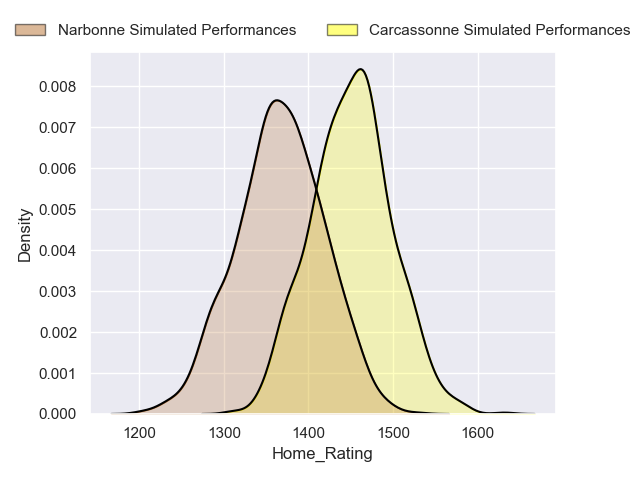
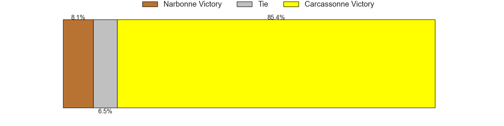
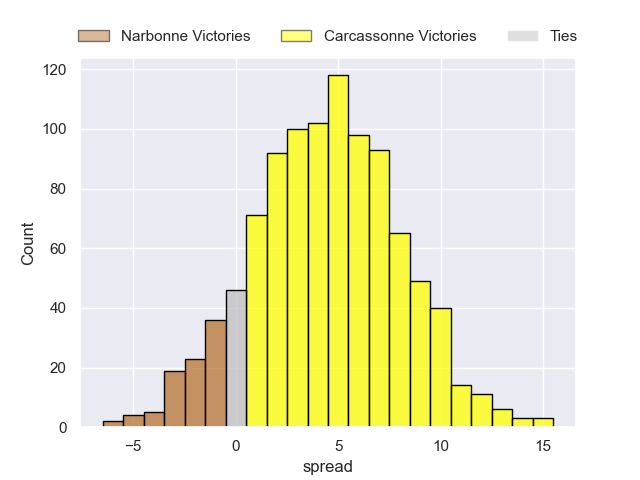

---  
title: "Nationale 2023 Status"  
date: 2024-03-11 6:00:00 -0500  
categories: model review projection  
layout: article  
aside:  
    toc: true  
---
# Current Team Rankings

# Standings

## Current Standings

| Club                |   Played |   Wins |   Point Differential |   Losing Bonus Points |   Try Bonus Points |   Competition Points |
|:--------------------|---------:|-------:|---------------------:|----------------------:|-------------------:|---------------------:|
| Nice                |       23 |     16 |                  290 |                     3 |                nan |                   77 |
| Narbonne            |       22 |     16 |                  157 |                     4 |                  7 |                   75 |
| Albi                |       22 |     14 |                  224 |                     7 |                  6 |                   69 |
| Carcassonne         |       22 |     14 |                  119 |                     3 |                nan |                   63 |
| Suresnes            |       22 |     14 |                  -13 |                     2 |                nan |                   61 |
| Bourgoin-Jallieu    |       23 |     12 |                   41 |                     6 |                nan |                   59 |
| Chambery            |       22 |     12 |                   77 |                     5 |                nan |                   56 |
| Carqueiranne-Hyères |       21 |     12 |                   38 |                     2 |                  2 |                   54 |
| Périgueux           |       21 |     10 |                   31 |                     5 |                  3 |                   50 |
| Massy               |       22 |     10 |                   20 |                     9 |                nan |                   49 |
| US Bressane         |       22 |      9 |                    9 |                     9 |                nan |                   49 |
| Tarbes              |       22 |      9 |                  -97 |                     8 |                  1 |                   45 |
| Blagnac             |       23 |      2 |                 -424 |                     2 |                nan |                   15 |
| Vienne              |       21 |      1 |                 -472 |                     3 |                  0 |                    7 |

## Projected Remaining Table

| Club                |   Matches Remaining |   Wins |   Point Differential |   Losing Bonus Points |   Try Bonus Points |   Competition Points |
|:--------------------|--------------------:|-------:|---------------------:|----------------------:|-------------------:|---------------------:|
| Carcassonne         |                   5 |    3.6 |            27.0462   |                   1.2 |                1.3 |                 17   |
| Narbonne            |                   5 |    2.9 |             6.38426  |                   1.8 |                1.8 |                 15.3 |
| Massy               |                   4 |    2.6 |            21.0334   |                   1.2 |                1   |                 12.6 |
| Carqueiranne-Hyères |                   5 |    2   |            -5.35894  |                   2.5 |                2   |                 12.6 |
| Périgueux           |                   4 |    2.4 |             5.38382  |                   1.2 |                1.7 |                 12.5 |
| Chambery            |                   4 |    2.3 |            10.0016   |                   1.1 |                1.4 |                 11.7 |
| Tarbes              |                   4 |    2   |            -3.47413  |                   1.2 |                1.4 |                 10.7 |
| Nice                |                   3 |    2.2 |             6.71691  |                   0.8 |                1   |                 10.5 |
| Suresnes            |                   4 |    1.6 |             5.31864  |                   1.7 |                2   |                 10.1 |
| Albi                |                   3 |    1.7 |             4.59502  |                   1.1 |                0.7 |                  8.6 |
| Bourgoin-Jallieu    |                   3 |    1.5 |             0.765263 |                   1.3 |                0.7 |                  7.9 |
| US Bressane         |                   4 |    1.1 |           -11.7062   |                   2   |                1.1 |                  7.5 |
| Vienne              |                   4 |    0   |           -66.7058   |                   0.2 |                0.7 |                  1   |

## Projected Total Table

| Club                |   Total Matches |   Wins |   Point Differential |   Losing Bonus Points |   Try Bonus Points |   Competition Points |
|:--------------------|----------------:|-------:|---------------------:|----------------------:|-------------------:|---------------------:|
| Narbonne            |              27 |   18.9 |            163.384   |                   5.8 |                8.8 |                 90.3 |
| Nice                |              26 |   18.2 |            296.717   |                   3.8 |                1   |                 87.5 |
| Carcassonne         |              27 |   17.6 |            146.046   |                   4.2 |                1.3 |                 80   |
| Albi                |              25 |   15.7 |            228.595   |                   8.1 |                6.7 |                 77.6 |
| Suresnes            |              26 |   15.6 |             -7.68136 |                   3.7 |                2   |                 71.1 |
| Chambery            |              26 |   14.3 |             87.0016  |                   6.1 |                1.4 |                 67.7 |
| Bourgoin-Jallieu    |              26 |   13.5 |             41.7653  |                   7.3 |                0.7 |                 66.9 |
| Carqueiranne-Hyères |              26 |   14   |             32.6411  |                   4.5 |                4   |                 66.6 |
| Périgueux           |              25 |   12.4 |             36.3838  |                   6.2 |                4.7 |                 62.5 |
| Massy               |              26 |   12.6 |             41.0334  |                  10.2 |                1   |                 61.6 |
| US Bressane         |              26 |   10.1 |             -2.70616 |                  11   |                1.1 |                 56.5 |
| Tarbes              |              26 |   11   |           -100.474   |                   9.2 |                2.4 |                 55.7 |
| Blagnac             |              23 |    2   |           -424       |                   2   |                0   |                 15   |
| Vienne              |              25 |    1   |           -538.706   |                   3.2 |                0.7 |                  8   |

# Completed Match Review

| Model | Percent Correct Predictions | Spread Error |
| ------ | ------ | ------ |
| Club Level | 76.6% | 9.7 |
| Player Level: Lineup | 68.7% | 11.9 |
| Player Level: Minutes | 71.4% | 11.9 |

# Future Predictions

## Week 24

### Albi V Chambery on 2024/03/22

Average Margin: Albi by 7.7

Average Scoreline: 21-13

### Massy V Bourgoin-Jallieu on 2024/03/23

Average Margin: Massy by 3.4

Average Scoreline: 23-20

### Narbonne V US Bressane on 2024/03/23

Average Margin: Narbonne by 6.9

Average Scoreline: 22-16

### Vienne V Carcassonne on 2024/03/23

Average Margin: Carcassonne by 16.3

Average Scoreline: 32-15

### Périgueux V Suresnes on 2024/03/23

Average Margin: Périgueux by 5.6

Average Scoreline: 19-13

### Tarbes V Carqueiranne-Hyères on 2024/03/23

Average Margin: Tarbes by 1.1

Average Scoreline: 28-27

## Week 25

### Carcassonne V Tarbes on 2024/03/29

Average Margin: Carcassonne by 9.0

Average Scoreline: 26-17

### US Bressane V Nice on 2024/03/29

Average Margin: Nice by 2.3

Average Scoreline: 27-25

### Massy V Albi on 2024/03/29

Average Margin: Albi by 0.5

Average Scoreline: 17-16

### Chambery V Périgueux on 2024/03/30

Average Margin: Chambery by 4.7

Average Scoreline: 18-13

### Suresnes V Vienne on 2024/03/30

Average Margin: Suresnes by 16.7

Average Scoreline: 28-12

### Carqueiranne-Hyères V Narbonne on 2024/03/30

Average Margin: Carqueiranne-Hyères by 0.8

Average Scoreline: 31-30

## Week 26

### US Bressane V Carqueiranne-Hyères on 2024/04/05

Average Margin: US Bressane by 2.5

Average Scoreline: 29-27

### Vienne V Chambery on 2024/04/06

Average Margin: Chambery by 13.5

Average Scoreline: 32-19

### Périgueux V Massy on 2024/04/06

Average Margin: Périgueux by 2.0

Average Scoreline: 20-18

### Bourgoin-Jallieu V Nice on 2024/04/06

Average Margin: Nice by 0.9

Average Scoreline: 25-25

### Narbonne V Carcassonne on 2024/04/06

Average Margin: Narbonne by 2.4

Average Scoreline: 22-19

### Tarbes V Suresnes on 2024/04/06

Average Margin: Tarbes by 3.8

Average Scoreline: 23-19

## Week 27

### Carcassonne V Narbonne on 2024/04/12

Average Margin: Carcassonne by 4.1

Average Scoreline: 21-17

### Périgueux V Carqueiranne-Hyères on 2024/04/13

Average Margin: Périgueux by 2.5

Average Scoreline: 26-23

## Week 28

### Tarbes V Chambery on 2024/04/27

Average Margin: Tarbes by 0.5

Average Scoreline: 26-26

### Suresnes V Narbonne on 2024/04/27

Average Margin: Narbonne by 2.0

Average Scoreline: 28-26

### Bourgoin-Jallieu V US Bressane on 2024/04/27

Average Margin: Bourgoin-Jallieu by 5.0

Average Scoreline: 18-13

### Massy V Vienne on 2024/04/27

Average Margin: Massy by 20.2

Average Scoreline: 27-7

### Carqueiranne-Hyères V Carcassonne on 2024/04/27

Average Margin: Carcassonne by 0.1

Average Scoreline: 20-20

### Nice V Albi on 2024/04/27

Average Margin: Nice by 3.6

Average Scoreline: 18-14

