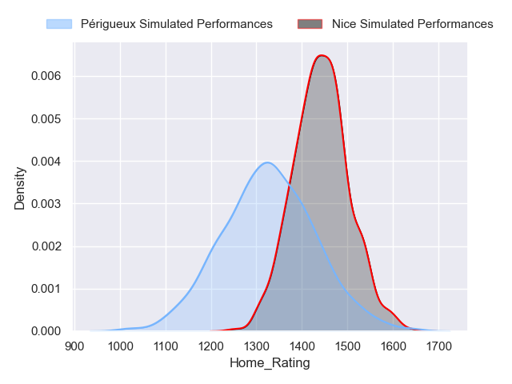
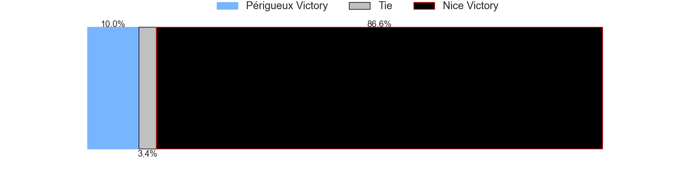
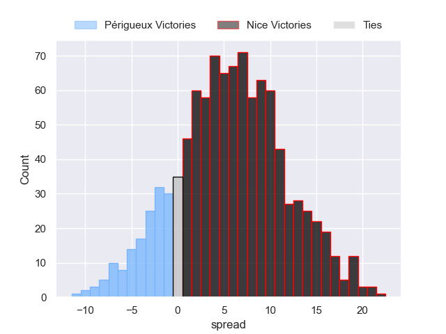

---  
title: "Nationale 2023 Status"  
date: 2023-12-05 6:00:00 -0500  
categories: model review projection  
layout: article  
aside:  
    toc: true  
---
# Current Team Rankings

# Standings

## Current Standings

| Club                |   Played |   Wins |   Point Differential |   Losing Bonus Points |   Try Bonus Points |   Competition Points |
|:--------------------|---------:|-------:|---------------------:|----------------------:|-------------------:|---------------------:|
| Nice                |       13 |      8 |                  147 |                     2 |                  6 |                   42 |
| Narbonne            |       12 |      9 |                   64 |                     3 |                  1 |                   40 |
| Albi                |       12 |      8 |                   87 |                     3 |                  3 |                   38 |
| Carcassonne         |       12 |      8 |                   54 |                     2 |                  1 |                   35 |
| Suresnes            |       12 |      8 |                   -3 |                     1 |                  1 |                   34 |
| Périgueux           |       12 |      7 |                   51 |                     3 |                  1 |                   32 |
| Chambery            |       12 |      6 |                    8 |                     3 |                  1 |                   30 |
| Blagnac             |       12 |      6 |                    2 |                     2 |                  3 |                   29 |
| Carqueiranne-Hyères |       12 |      6 |                   -9 |                     2 |                  1 |                   29 |
| Bourgoin-Jallieu    |       12 |      5 |                    6 |                     4 |                  1 |                   27 |
| Tarbes              |       12 |      5 |                  -73 |                     4 |                  0 |                   24 |
| Massy               |       12 |      3 |                   -4 |                     8 |                  0 |                   20 |
| US Bressane         |       13 |      3 |                  -58 |                     6 |                  0 |                   18 |
| Vienne              |       12 |      1 |                 -272 |                     1 |                  0 |                    5 |

## Projected Remaining Table

| Club                |   Matches Remaining |   Wins |   Point Differential |   Losing Bonus Points |   Try Bonus Points |   Competition Points |
|:--------------------|--------------------:|-------:|---------------------:|----------------------:|-------------------:|---------------------:|
| Carcassonne         |                  14 |   10.9 |             71.4244  |                   2.9 |               10.3 |                 56.6 |
| Albi                |                  14 |   10.5 |             68.2014  |                   3.2 |               10   |                 55.2 |
| Nice                |                  14 |   10.3 |             67.4444  |                   3.3 |                9.7 |                 54.1 |
| Narbonne            |                  14 |    9.2 |             40.6578  |                   4.1 |                8.6 |                 49.5 |
| Massy               |                  14 |    8.7 |             40.885   |                   4.7 |                8.1 |                 47.6 |
| Chambery            |                  14 |    8.4 |             24.909   |                   4.3 |                7.9 |                 45.7 |
| Blagnac             |                  14 |    8.4 |             25.4656  |                   3.8 |                8   |                 45.2 |
| Bourgoin-Jallieu    |                  14 |    7.1 |             18.0453  |                   5.1 |                6.6 |                 40.3 |
| Périgueux           |                  14 |    6.9 |              2.68911 |                   4.4 |                6.5 |                 38.7 |
| US Bressane         |                  14 |    5.8 |            -14.6113  |                   5.7 |                5.4 |                 34.1 |
| Carqueiranne-Hyères |                  14 |    4   |            -35.4223  |                   6.3 |                3.6 |                 26.2 |
| Tarbes              |                  14 |    4   |            -43.9145  |                   5.3 |                3.7 |                 25   |
| Suresnes            |                  14 |    3.5 |            -48.037   |                   5.9 |                3.2 |                 23.1 |
| Vienne              |                  14 |    0.3 |           -217.737   |                   1.7 |                0.3 |                  3.3 |

## Projected Total Table

| Club                |   Total Matches |   Wins |   Point Differential |   Losing Bonus Points |   Try Bonus Points |   Competition Points |
|:--------------------|----------------:|-------:|---------------------:|----------------------:|-------------------:|---------------------:|
| Nice                |              27 |   18.3 |             214.444  |                   5.3 |               15.7 |                 96.1 |
| Albi                |              26 |   18.5 |             155.201  |                   6.2 |               13   |                 93.2 |
| Carcassonne         |              26 |   18.9 |             125.424  |                   4.9 |               11.3 |                 91.6 |
| Narbonne            |              26 |   18.2 |             104.658  |                   7.1 |                9.6 |                 89.5 |
| Chambery            |              26 |   14.4 |              32.909  |                   7.3 |                8.9 |                 75.7 |
| Blagnac             |              26 |   14.4 |              27.4656 |                   5.8 |               11   |                 74.2 |
| Périgueux           |              26 |   13.9 |              53.6891 |                   7.4 |                7.5 |                 70.7 |
| Massy               |              26 |   11.7 |              36.885  |                  12.7 |                8.1 |                 67.6 |
| Bourgoin-Jallieu    |              26 |   12.1 |              24.0453 |                   9.1 |                7.6 |                 67.3 |
| Suresnes            |              26 |   11.5 |             -51.037  |                   6.9 |                4.2 |                 57.1 |
| Carqueiranne-Hyères |              26 |   10   |             -44.4223 |                   8.3 |                4.6 |                 55.2 |
| US Bressane         |              27 |    8.8 |             -72.6113 |                  11.7 |                5.4 |                 52.1 |
| Tarbes              |              26 |    9   |            -116.915  |                   9.3 |                3.7 |                 49   |
| Vienne              |              26 |    1.3 |            -489.737  |                   2.7 |                0.3 |                  8.3 |

# Completed Match Review

| Model | Percent Correct Predictions | Spread Error |
| ------ | ------ | ------ |
| Club Level | 73.8% | 8.2 |
| Player Level: Lineup | 65.5% | 9.6 |
| Player Level: Minutes | 64.3% | 9.6 |

# Future Predictions

## Week 14

### Albi V Nice on 2023/12/08

Average Margin: Albi by 3.7

### US Bressane V Bourgoin-Jallieu on 2023/12/08

Average Margin: US Bressane by 1.3

### Carcassonne V Carqueiranne-Hyères on 2023/12/08

Average Margin: Carcassonne by 9.6

### Chambery V Tarbes on 2023/12/08

Average Margin: Chambery by 6.7

### Blagnac V Périgueux on 2023/12/09

Average Margin: Blagnac by 3.8

### Vienne V Massy on 2023/12/09

Average Margin: Massy by 13.5

### Narbonne V Suresnes on 2023/12/09

Average Margin: Narbonne by 8.8

## Week 15

### Tarbes V Massy on 2023/12/16

Average Margin: Massy by 0.8

### Carcassonne V US Bressane on 2023/12/16

Average Margin: Carcassonne by 8.9

### Vienne V Blagnac on 2023/12/16

Average Margin: Blagnac by 13.4

### Nice V Périgueux on 2023/12/16

Average Margin: Nice by 7.0

### Chambery V Narbonne on 2023/12/16

Average Margin: Chambery by 1.8

### Albi V Bourgoin-Jallieu on 2023/12/16

Average Margin: Albi by 7.2

### Suresnes V Carqueiranne-Hyères on 2023/12/16

Average Margin: Suresnes by 1.7

## Week 16

### Suresnes V Carcassonne on 2024/01/13

Average Margin: Carcassonne by 4.5

### Nice V Vienne on 2024/01/13

Average Margin: Nice by 22.6

### Bourgoin-Jallieu V Périgueux on 2024/01/13

Average Margin: Bourgoin-Jallieu by 3.7

### Chambery V Carqueiranne-Hyères on 2024/01/13

Average Margin: Chambery by 6.2

### US Bressane V Albi on 2024/01/13

Average Margin: Albi by 2.2

### Blagnac V Tarbes on 2024/01/13

Average Margin: Blagnac by 7.0

### Narbonne V Massy on 2024/01/13

Average Margin: Narbonne by 3.9

## Week 17

### Périgueux V Albi on 2024/01/20

Average Margin: Albi by 0.9

### Blagnac V Narbonne on 2024/01/20

Average Margin: Blagnac by 2.1

### Carqueiranne-Hyères V Massy on 2024/01/20

Average Margin: Massy by 0.0

### Nice V Tarbes on 2024/01/20

Average Margin: Nice by 10.1

### Bourgoin-Jallieu V Vienne on 2024/01/20

Average Margin: Bourgoin-Jallieu by 19.6

### Suresnes V US Bressane on 2024/01/20

Average Margin: Suresnes by 1.2

### Chambery V Carcassonne on 2024/01/20

Average Margin: Carcassonne by 0.3

## Week 18

### Massy V Carcassonne on 2024/01/27

Average Margin: Massy by 0.6

### Nice V Narbonne on 2024/01/27

Average Margin: Nice by 5.1

### US Bressane V Périgueux on 2024/01/27

Average Margin: US Bressane by 1.7

### Albi V Vienne on 2024/01/27

Average Margin: Albi by 22.8

### Chambery V Suresnes on 2024/01/27

Average Margin: Chambery by 7.5

### Blagnac V Carqueiranne-Hyères on 2024/01/27

Average Margin: Blagnac by 6.0

### Bourgoin-Jallieu V Tarbes on 2024/01/27

Average Margin: Bourgoin-Jallieu by 6.8

## Week 19

### Bourgoin-Jallieu V Narbonne on 2024/02/03

Average Margin: Bourgoin-Jallieu by 1.9

### Carcassonne V Blagnac on 2024/02/03

Average Margin: Carcassonne by 6.9

### Suresnes V Massy on 2024/02/03

Average Margin: Massy by 1.5

### Vienne V Périgueux on 2024/02/03

Average Margin: Périgueux by 11.6

### Nice V Carqueiranne-Hyères on 2024/02/03

Average Margin: Nice by 9.3

### US Bressane V Chambery on 2024/02/03

Average Margin: US Bressane by 1.2

### Tarbes V Albi on 2024/02/03

Average Margin: Albi by 3.9

## Week 20

### Massy V Chambery on 2024/02/10

Average Margin: Massy by 4.0

### Blagnac V Suresnes on 2024/02/10

Average Margin: Blagnac by 7.6

### Narbonne V Albi on 2024/02/10

Average Margin: Narbonne by 1.0

### Périgueux V Tarbes on 2024/02/10

Average Margin: Périgueux by 6.6

### Carcassonne V Nice on 2024/02/10

Average Margin: Carcassonne by 3.6

### Carqueiranne-Hyères V Bourgoin-Jallieu on 2024/02/10

Average Margin: Carqueiranne-Hyères by 0.5

### Vienne V US Bressane on 2024/02/10

Average Margin: US Bressane by 10.2

## Week 21

### Narbonne V Périgueux on 2024/02/17

Average Margin: Narbonne by 5.1

### Tarbes V Vienne on 2024/02/17

Average Margin: Tarbes by 15.2

### Massy V US Bressane on 2024/02/17

Average Margin: Massy by 5.9

### Suresnes V Nice on 2024/02/17

Average Margin: Nice by 4.0

### Chambery V Blagnac on 2024/02/17

Average Margin: Chambery by 3.2

### Carcassonne V Bourgoin-Jallieu on 2024/02/17

Average Margin: Carcassonne by 6.9

### Carqueiranne-Hyères V Albi on 2024/02/17

Average Margin: Albi by 3.1

## Week 22

### Blagnac V Massy on 2024/03/02

Average Margin: Blagnac by 2.7

### Nice V Chambery on 2024/03/02

Average Margin: Nice by 6.4

### Bourgoin-Jallieu V Suresnes on 2024/03/02

Average Margin: Bourgoin-Jallieu by 7.5

### US Bressane V Tarbes on 2024/03/02

Average Margin: US Bressane by 4.8

### Périgueux V Carqueiranne-Hyères on 2024/03/02

Average Margin: Périgueux by 5.5

### Vienne V Narbonne on 2024/03/02

Average Margin: Narbonne by 13.3

### Albi V Carcassonne on 2024/03/02

Average Margin: Albi by 3.4

## Week 23

### Carqueiranne-Hyères V Vienne on 2024/03/09

Average Margin: Carqueiranne-Hyères by 15.8

### Chambery V Bourgoin-Jallieu on 2024/03/09

Average Margin: Chambery by 3.5

### Narbonne V Tarbes on 2024/03/09

Average Margin: Narbonne by 8.4

### Carcassonne V Périgueux on 2024/03/09

Average Margin: Carcassonne by 7.3

### Massy V Nice on 2024/03/09

Average Margin: Massy by 0.8

### Blagnac V US Bressane on 2024/03/09

Average Margin: Blagnac by 5.5

### Albi V Suresnes on 2024/03/09

Average Margin: Albi by 11.2

## Week 24

### Albi V Chambery on 2024/03/23

Average Margin: Albi by 7.1

### Vienne V Carcassonne on 2024/03/23

Average Margin: Carcassonne by 15.4

### Massy V Bourgoin-Jallieu on 2024/03/23

Average Margin: Massy by 3.9

### Périgueux V Suresnes on 2024/03/23

Average Margin: Périgueux by 7.1

### Tarbes V Carqueiranne-Hyères on 2024/03/23

Average Margin: Tarbes by 2.5

### Nice V Blagnac on 2024/03/23

Average Margin: Nice by 6.3

### Narbonne V US Bressane on 2024/03/23

Average Margin: Narbonne by 6.7

## Week 25

### Blagnac V Bourgoin-Jallieu on 2024/03/30

Average Margin: Blagnac by 3.5

### Carqueiranne-Hyères V Narbonne on 2024/03/30

Average Margin: Narbonne by 0.9

### US Bressane V Nice on 2024/03/30

Average Margin: Nice by 1.9

### Chambery V Périgueux on 2024/03/30

Average Margin: Chambery by 3.8

### Carcassonne V Tarbes on 2024/03/30

Average Margin: Carcassonne by 10.4

### Massy V Albi on 2024/03/30

Average Margin: Massy by 0.3

### Suresnes V Vienne on 2024/03/30

Average Margin: Suresnes by 14.7

## Week 26

### Tarbes V Suresnes on 2024/04/06

Average Margin: Tarbes by 3.9

### Vienne V Chambery on 2024/04/06

Average Margin: Chambery by 11.1

### Albi V Blagnac on 2024/04/06

Average Margin: Albi by 6.9

### Narbonne V Carcassonne on 2024/04/06

Average Margin: Narbonne by 1.3

### Bourgoin-Jallieu V Nice on 2024/04/06

Average Margin: Bourgoin-Jallieu by 0.1

### Périgueux V Massy on 2024/04/06

Average Margin: Périgueux by 2.4

### US Bressane V Carqueiranne-Hyères on 2024/04/06

Average Margin: US Bressane by 4.0

## Week 27

### Nice V Albi on 2024/04/27

Average Margin: Nice by 2.9

### Périgueux V Blagnac on 2024/04/27

Average Margin: Périgueux by 2.8

### Bourgoin-Jallieu V US Bressane on 2024/04/27

Average Margin: Bourgoin-Jallieu by 5.4

### Tarbes V Chambery on 2024/04/27

Average Margin: Chambery by 0.2

### Massy V Vienne on 2024/04/27

Average Margin: Massy by 18.6

### Suresnes V Narbonne on 2024/04/27

Average Margin: Narbonne by 2.0

### Carqueiranne-Hyères V Carcassonne on 2024/04/27

Average Margin: Carcassonne by 2.9

