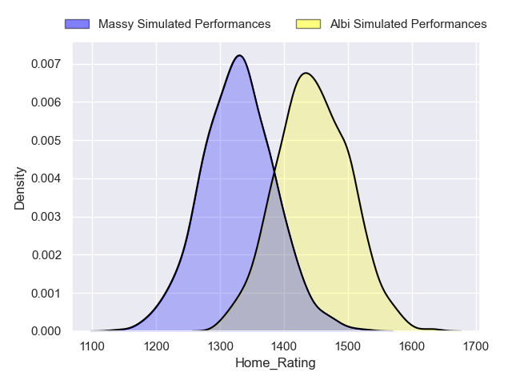
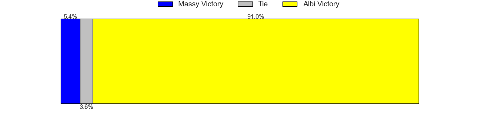
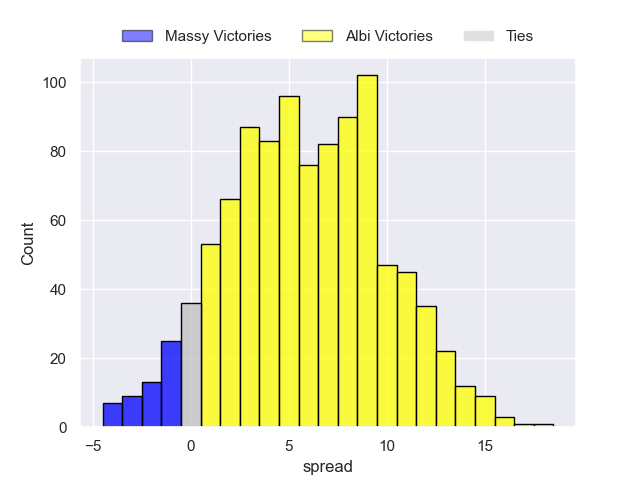
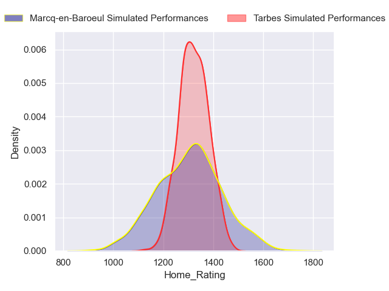
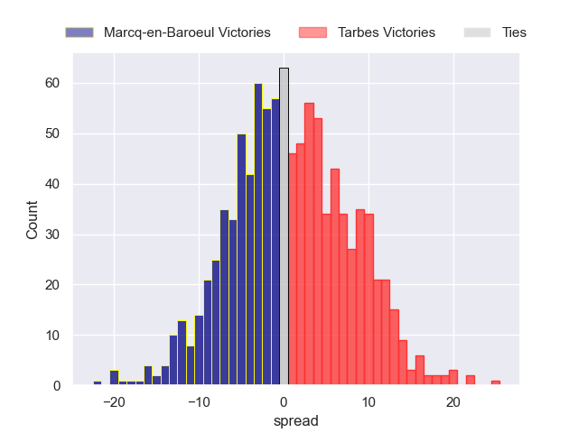
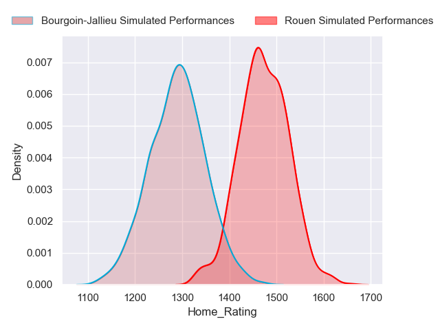
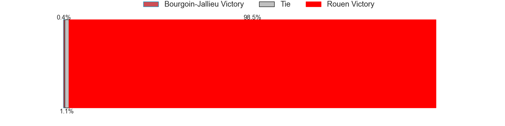

---  
title: "Nationale 2024 Status"  
date: 2024-11-11 6:00:00 -0500  
categories: model review projection  
layout: article  
aside:  
    toc: true  
---
# Current Team Rankings

# Standings

## Current Standings

| Club                |   Played |   Wins |   Point Differential |   Losing Bonus Points |   Try Bonus Points |   Competition Points |
|:--------------------|---------:|-------:|---------------------:|----------------------:|-------------------:|---------------------:|
| Rouen               |       10 |      8 |                  120 |                     0 |                nan |                   36 |
| Chambery            |       11 |      7 |                   95 |                     3 |                nan |                   35 |
| Périgueux           |       10 |      7 |                  104 |                     2 |                nan |                   33 |
| Carcassonne         |       10 |      7 |                   54 |                     2 |                nan |                   32 |
| Narbonne            |       10 |      7 |                    8 |                     1 |                nan |                   31 |
| Albi                |       10 |      6 |                   38 |                     1 |                nan |                   28 |
| Suresnes            |       10 |      4 |                   12 |                     4 |                nan |                   24 |
| Massy               |       10 |      4 |                   37 |                     4 |                nan |                   23 |
| Langon              |       10 |      5 |                   -3 |                     2 |                nan |                   23 |
| US Bressane         |       10 |      5 |                   -6 |                     2 |                nan |                   22 |
| Bourgoin-Jallieu    |       10 |      4 |                  -43 |                     2 |                  1 |                   19 |
| Marcq-en-Baroeul    |       11 |      3 |                  -46 |                     3 |                nan |                   17 |
| Tarbes              |       10 |      3 |                  -70 |                     3 |                nan |                   16 |
| Carqueiranne-Hyères |       12 |      0 |                 -300 |                     0 |                nan |                    0 |

## Projected Remaining Table

| Club             |   Matches Remaining |   Wins |   Point Differential |   Losing Bonus Points |   Try Bonus Points |   Competition Points |
|:-----------------|--------------------:|-------:|---------------------:|----------------------:|-------------------:|---------------------:|
| Rouen            |                  15 |    9.9 |              55.9195 |                   3.2 |                6.2 |                 49.1 |
| Carcassonne      |                  15 |    9.8 |              55.5699 |                   3.3 |                5.1 |                 47.7 |
| Périgueux        |                  15 |    9.4 |              47.0565 |                   3.6 |                6.4 |                 47.5 |
| Chambery         |                  14 |    8.8 |              43.6733 |                   3.3 |                5.7 |                 44.3 |
| Albi             |                  15 |    9.2 |              39.3822 |                   3.6 |                4   |                 44.3 |
| Narbonne         |                  15 |    8.3 |              20.2555 |                   4.1 |                5.1 |                 42.4 |
| Massy            |                  15 |    7.4 |              -6.1308 |                   4.2 |                4.6 |                 38.2 |
| US Bressane      |                  15 |    6.4 |             -27.3271 |                   4.5 |                3.6 |                 33.5 |
| Marcq-en-Baroeul |                  14 |    6.2 |             -23.2184 |                   3.6 |                4.2 |                 32.7 |
| Suresnes         |                  15 |    5.4 |             -48.557  |                   5   |                4.1 |                 30.5 |
| Langon           |                  15 |    5.4 |             -55.0605 |                   4.4 |                4.1 |                 30   |
| Bourgoin-Jallieu |                  14 |    5.2 |             -39.4749 |                   4.5 |                4   |                 29.2 |
| Tarbes           |                  15 |    4.7 |             -62.0884 |                   5.2 |                2.9 |                 26.9 |

## Projected Total Table

| Club                |   Total Matches |   Wins |   Point Differential |   Losing Bonus Points |   Try Bonus Points |   Competition Points |
|:--------------------|----------------:|-------:|---------------------:|----------------------:|-------------------:|---------------------:|
| Rouen               |              25 |   17.9 |             175.92   |                   3.2 |                6.2 |                 85.1 |
| Périgueux           |              25 |   16.4 |             151.057  |                   5.6 |                6.4 |                 80.5 |
| Carcassonne         |              25 |   16.8 |             109.57   |                   5.3 |                5.1 |                 79.7 |
| Chambery            |              25 |   15.8 |             138.673  |                   6.3 |                5.7 |                 79.3 |
| Narbonne            |              25 |   15.3 |              28.2555 |                   5.1 |                5.1 |                 73.4 |
| Albi                |              25 |   15.2 |              77.3822 |                   4.6 |                4   |                 72.3 |
| Massy               |              25 |   11.4 |              30.8692 |                   8.2 |                4.6 |                 61.2 |
| US Bressane         |              25 |   11.4 |             -33.3271 |                   6.5 |                3.6 |                 55.5 |
| Suresnes            |              25 |    9.4 |             -36.557  |                   9   |                4.1 |                 54.5 |
| Langon              |              25 |   10.4 |             -58.0605 |                   6.4 |                4.1 |                 53   |
| Marcq-en-Baroeul    |              25 |    9.2 |             -69.2184 |                   6.6 |                4.2 |                 49.7 |
| Bourgoin-Jallieu    |              24 |    9.2 |             -82.4749 |                   6.5 |                5   |                 48.2 |
| Tarbes              |              25 |    7.7 |            -132.088  |                   8.2 |                2.9 |                 42.9 |
| Carqueiranne-Hyères |              12 |    0   |            -300      |                   0   |                0   |                  0   |

# Completed Match Review

| Model | Percent Correct Predictions | Spread Error |
| ------ | ------ | ------ |
| Club Level | 77.8% | 10.1 |
| Player Level: Lineup | 71.7% | 8.1 |
| Player Level: Minutes | 73.3% | 8.0 |

# Future Predictions

## Week 13

### Albi V Massy on 2024/11/15

Average Margin: Albi by 6.8

Average Scoreline: 24-17

### Tarbes V Marcq-en-Baroeul on 2024/11/15

Average Margin: Tarbes by 1.3

Average Scoreline: 23-21

### Rouen V Bourgoin-Jallieu on 2024/11/15

Average Margin: Rouen by 10.4

Average Scoreline: 31-21

### Suresnes V Périgueux on 2024/11/16

Average Margin: Périgueux by 2.7

Average Scoreline: 27-24

### Narbonne V US Bressane on 2024/11/16

Average Margin: Narbonne by 6.7

Average Scoreline: 29-22

### Langon V Carcassonne on 2024/11/16

Average Margin: Carcassonne by 2.8

Average Scoreline: 21-18

## Week 14

### Périgueux V Albi on 2024/11/30

Average Margin: Périgueux by 4.5

Average Scoreline: 24-20

### US Bressane V Suresnes on 2024/11/30

Average Margin: US Bressane by 4.4

Average Scoreline: 24-19

### Chambery V Langon on 2024/11/30

Average Margin: Chambery by 9.9

Average Scoreline: 29-19

### Bourgoin-Jallieu V Tarbes on 2024/11/30

Average Margin: Bourgoin-Jallieu by 5.7

Average Scoreline: 24-19

### Carcassonne V Narbonne on 2024/11/30

Average Margin: Carcassonne by 6.5

Average Scoreline: 27-21

### Massy V Rouen on 2024/11/30

Average Margin: Rouen by 0.8

Average Scoreline: 28-27

## Week 15

### Langon V Narbonne on 2024/12/07

Average Margin: Narbonne by 0.2

Average Scoreline: 22-22

### Chambery V Marcq-en-Baroeul on 2024/12/07

Average Margin: Chambery by 8.2

Average Scoreline: 25-17

### Suresnes V Carcassonne on 2024/12/07

Average Margin: Carcassonne by 2.3

Average Scoreline: 24-22

### Tarbes V Massy on 2024/12/07

Average Margin: Massy by 0.7

Average Scoreline: 25-25

### Rouen V Périgueux on 2024/12/07

Average Margin: Rouen by 3.9

Average Scoreline: 25-21

### Albi V US Bressane on 2024/12/07

Average Margin: Albi by 7.7

Average Scoreline: 26-18

## Week 16

### Rouen V US Bressane on 2024/12/14

Average Margin: Rouen by 9.8

Average Scoreline: 29-19

### Chambery V Bourgoin-Jallieu on 2024/12/14

Average Margin: Chambery by 9.1

Average Scoreline: 28-19

### Tarbes V Périgueux on 2024/12/14

Average Margin: Périgueux by 4.0

Average Scoreline: 28-24

### Marcq-en-Baroeul V Langon on 2024/12/14

Average Margin: Marcq-en-Baroeul by 4.5

Average Scoreline: 25-20

### Albi V Carcassonne on 2024/12/14

Average Margin: Albi by 2.8

Average Scoreline: 22-19

### Suresnes V Narbonne on 2024/12/14

Average Margin: Suresnes by 0.4

Average Scoreline: 22-21

## Week 17

### Langon V Suresnes on 2025/01/11

Average Margin: Langon by 3.4

Average Scoreline: 27-24

### Massy V Chambery on 2025/01/11

Average Margin: Massy by 0.8

Average Scoreline: 25-25

### Carcassonne V Rouen on 2025/01/11

Average Margin: Carcassonne by 3.4

Average Scoreline: 25-22

### Narbonne V Albi on 2025/01/11

Average Margin: Narbonne by 2.2

Average Scoreline: 25-23

### US Bressane V Tarbes on 2025/01/11

Average Margin: US Bressane by 7.0

Average Scoreline: 24-17

### Bourgoin-Jallieu V Marcq-en-Baroeul on 2025/01/11

Average Margin: Bourgoin-Jallieu by 2.8

Average Scoreline: 25-22

## Week 18

### Rouen V Narbonne on 2025/01/18

Average Margin: Rouen by 6.3

Average Scoreline: 29-23

### Tarbes V Carcassonne on 2025/01/18

Average Margin: Carcassonne by 4.0

Average Scoreline: 29-25

### Chambery V Périgueux on 2025/01/18

Average Margin: Chambery by 3.4

Average Scoreline: 24-20

### Albi V Suresnes on 2025/01/18

Average Margin: Albi by 8.2

Average Scoreline: 28-20

### Marcq-en-Baroeul V Massy on 2025/01/18

Average Margin: Marcq-en-Baroeul by 2.3

Average Scoreline: 25-22

### Bourgoin-Jallieu V Langon on 2025/01/18

Average Margin: Bourgoin-Jallieu by 3.6

Average Scoreline: 28-25

## Week 19

### Langon V Albi on 2025/01/25

Average Margin: Albi by 1.5

Average Scoreline: 22-21

### US Bressane V Chambery on 2025/01/25

Average Margin: Chambery by 0.6

Average Scoreline: 25-25

### Narbonne V Tarbes on 2025/01/25

Average Margin: Narbonne by 9.3

Average Scoreline: 31-21

### Périgueux V Marcq-en-Baroeul on 2025/01/25

Average Margin: Périgueux by 9.1

Average Scoreline: 23-14

### Suresnes V Rouen on 2025/01/25

Average Margin: Rouen by 2.1

Average Scoreline: 22-20

### Massy V Bourgoin-Jallieu on 2025/01/25

Average Margin: Massy by 6.2

Average Scoreline: 26-20

## Week 20

### Rouen V Albi on 2025/02/01

Average Margin: Rouen by 5.5

Average Scoreline: 26-21

### Tarbes V Suresnes on 2025/02/01

Average Margin: Tarbes by 2.0

Average Scoreline: 24-22

### Chambery V Carcassonne on 2025/02/01

Average Margin: Chambery by 3.1

Average Scoreline: 22-19

### Marcq-en-Baroeul V US Bressane on 2025/02/01

Average Margin: Marcq-en-Baroeul by 4.6

Average Scoreline: 25-20

### Bourgoin-Jallieu V Périgueux on 2025/02/01

Average Margin: Périgueux by 2.9

Average Scoreline: 22-19

### Massy V Langon on 2025/02/01

Average Margin: Massy by 5.9

Average Scoreline: 28-22

## Week 21

### Périgueux V Massy on 2025/02/15

Average Margin: Périgueux by 7.7

Average Scoreline: 28-20

### Langon V Rouen on 2025/02/15

Average Margin: Rouen by 3.0

Average Scoreline: 28-25

### Narbonne V Chambery on 2025/02/15

Average Margin: Narbonne by 2.5

Average Scoreline: 28-25

### Carcassonne V Marcq-en-Baroeul on 2025/02/15

Average Margin: Carcassonne by 8.7

Average Scoreline: 27-18

### US Bressane V Bourgoin-Jallieu on 2025/02/15

Average Margin: US Bressane by 4.6

Average Scoreline: 24-19

### Albi V Tarbes on 2025/02/15

Average Margin: Albi by 10.8

Average Scoreline: 30-19

## Week 22

### Massy V US Bressane on 2025/02/22

Average Margin: Massy by 5.4

Average Scoreline: 24-19

### Tarbes V Rouen on 2025/02/22

Average Margin: Rouen by 3.9

Average Scoreline: 27-23

### Périgueux V Langon on 2025/02/22

Average Margin: Périgueux by 9.4

Average Scoreline: 27-18

### Bourgoin-Jallieu V Carcassonne on 2025/02/22

Average Margin: Carcassonne by 2.8

Average Scoreline: 24-21

### Marcq-en-Baroeul V Narbonne on 2025/02/22

Average Margin: Marcq-en-Baroeul by 1.3

Average Scoreline: 25-23

### Chambery V Suresnes on 2025/02/22

Average Margin: Chambery by 9.2

Average Scoreline: 27-18

## Week 23

### Suresnes V Marcq-en-Baroeul on 2025/03/01

Average Margin: Suresnes by 3.2

Average Scoreline: 25-22

### US Bressane V Périgueux on 2025/03/01

Average Margin: Périgueux by 1.3

Average Scoreline: 24-23

### Langon V Tarbes on 2025/03/01

Average Margin: Langon by 5.1

Average Scoreline: 31-26

### Narbonne V Bourgoin-Jallieu on 2025/03/01

Average Margin: Narbonne by 7.0

Average Scoreline: 28-21

### Albi V Chambery on 2025/03/01

Average Margin: Albi by 3.6

Average Scoreline: 24-21

### Carcassonne V Massy on 2025/03/01

Average Margin: Carcassonne by 7.4

Average Scoreline: 28-21

## Week 24

### Chambery V Rouen on 2025/03/07

Average Margin: Chambery by 2.8

Average Scoreline: 26-23

### US Bressane V Langon on 2025/03/07

Average Margin: US Bressane by 5.1

Average Scoreline: 28-23

### Périgueux V Carcassonne on 2025/03/08

Average Margin: Périgueux by 3.8

Average Scoreline: 25-21

### Marcq-en-Baroeul V Albi on 2025/03/08

Average Margin: Marcq-en-Baroeul by 0.2

Average Scoreline: 19-19

### Bourgoin-Jallieu V Suresnes on 2025/03/08

Average Margin: Bourgoin-Jallieu by 3.6

Average Scoreline: 22-19

### Massy V Narbonne on 2025/03/08

Average Margin: Massy by 1.8

Average Scoreline: 25-23

## Week 25

### Tarbes V Chambery on 2025/03/21

Average Margin: Chambery by 3.3

Average Scoreline: 27-24

### Albi V Bourgoin-Jallieu on 2025/03/21

Average Margin: Albi by 8.2

Average Scoreline: 28-20

### Carcassonne V US Bressane on 2025/03/21

Average Margin: Carcassonne by 9.3

Average Scoreline: 27-18

### Rouen V Marcq-en-Baroeul on 2025/03/21

Average Margin: Rouen by 9.1

Average Scoreline: 27-18

### Narbonne V Périgueux on 2025/03/22

Average Margin: Narbonne by 1.7

Average Scoreline: 27-26

### Suresnes V Massy on 2025/03/22

Average Margin: Suresnes by 1.9

Average Scoreline: 24-23

## Week 26

### Carcassonne V Langon on 2025/03/28

Average Margin: Carcassonne by 9.6

Average Scoreline: 30-21

### US Bressane V Narbonne on 2025/03/28

Average Margin: US Bressane by 1.0

Average Scoreline: 25-24

### Bourgoin-Jallieu V Rouen on 2025/03/29

Average Margin: Rouen by 2.2

Average Scoreline: 26-23

### Massy V Albi on 2025/03/29

Average Margin: Massy by 0.6

Average Scoreline: 22-22

### Périgueux V Suresnes on 2025/03/29

Average Margin: Périgueux by 9.9

Average Scoreline: 27-17

### Marcq-en-Baroeul V Tarbes on 2025/03/29

Average Margin: Marcq-en-Baroeul by 6.1

Average Scoreline: 29-23

## Week 27

### Albi V Périgueux on 2025/04/11

Average Margin: Albi by 2.4

Average Scoreline: 26-23

### Tarbes V Bourgoin-Jallieu on 2025/04/11

Average Margin: Tarbes by 1.9

Average Scoreline: 24-22

### Rouen V Massy on 2025/04/11

Average Margin: Rouen by 8.2

Average Scoreline: 29-21

### Langon V Chambery on 2025/04/12

Average Margin: Chambery by 1.0

Average Scoreline: 28-27

### Suresnes V US Bressane on 2025/04/12

Average Margin: Suresnes by 3.5

Average Scoreline: 24-21

### Narbonne V Carcassonne on 2025/04/12

Average Margin: Narbonne by 0.9

Average Scoreline: 30-29

## Week 28

### US Bressane V Albi on 2025/04/26

Average Margin: Albi by 0.4

Average Scoreline: 24-24

### Carcassonne V Suresnes on 2025/04/26

Average Margin: Carcassonne by 9.5

Average Scoreline: 28-19

### Narbonne V Langon on 2025/04/26

Average Margin: Narbonne by 7.2

Average Scoreline: 29-22

### Massy V Tarbes on 2025/04/26

Average Margin: Massy by 7.6

Average Scoreline: 27-19

### Marcq-en-Baroeul V Chambery on 2025/04/26

Average Margin: Marcq-en-Baroeul by 0.1

Average Scoreline: 26-26

### Périgueux V Rouen on 2025/04/26

Average Margin: Périgueux by 3.1

Average Scoreline: 29-26

