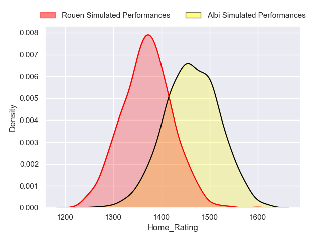
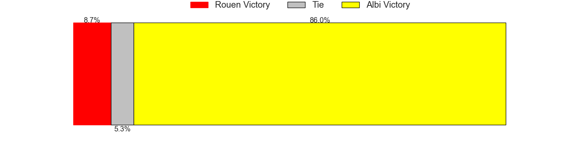
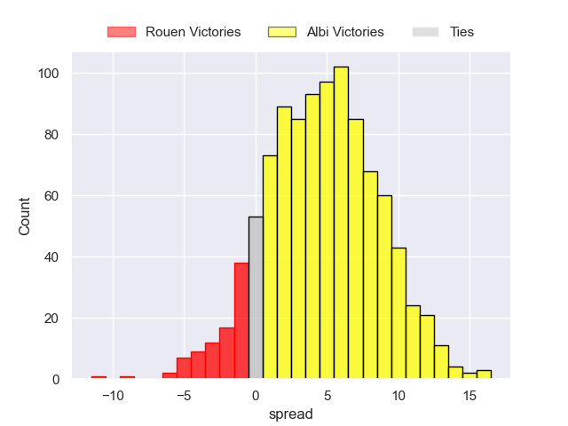
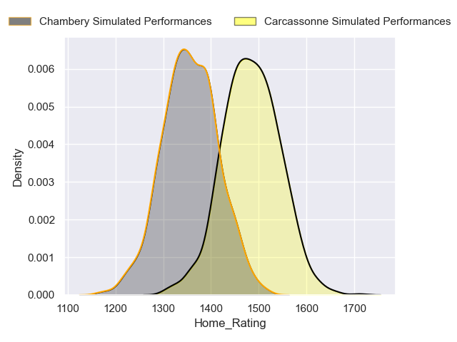
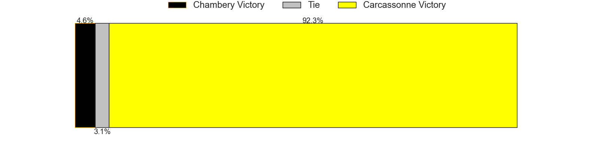
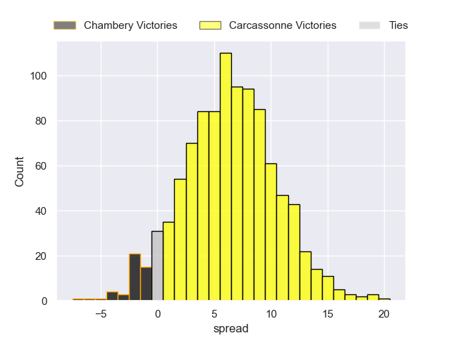
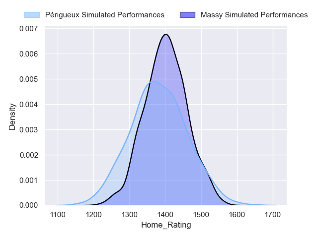
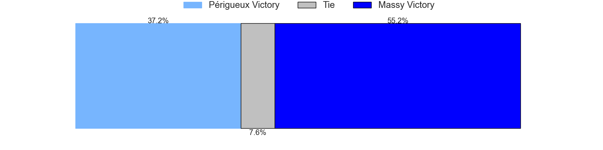
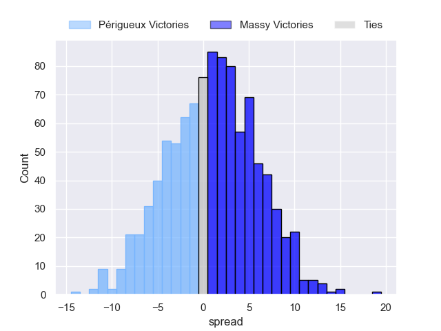

---  
title: "Nationale 2024 Status"  
date: 2024-09-26 6:00:00 -0500  
categories: model review projection  
layout: article  
aside:  
    toc: true  
---
# Current Team Rankings

# Standings

## Current Standings

| Club                |   Played |   Wins |   Point Differential |   Losing Bonus Points |   Try Bonus Points |   Competition Points |
|:--------------------|---------:|-------:|---------------------:|----------------------:|-------------------:|---------------------:|
| Narbonne            |        5 |      4 |                   38 |                     1 |                nan |                   18 |
| Périgueux           |        4 |      4 |                   47 |                     0 |                nan |                   17 |
| Carcassonne         |        4 |      3 |                   41 |                     1 |                nan |                   14 |
| Chambery            |        4 |      3 |                   15 |                     1 |                  0 |                   13 |
| Albi                |        4 |      3 |                    9 |                     0 |                  1 |                   13 |
| Massy               |        4 |      2 |                   34 |                     2 |                nan |                   12 |
| Rouen               |        4 |      3 |                   -1 |                     0 |                  0 |                   12 |
| Bourgoin-Jallieu    |        4 |      2 |                    3 |                     1 |                  1 |                   10 |
| Langon              |        4 |      2 |                    6 |                     1 |                  0 |                    9 |
| Suresnes            |        4 |      1 |                   -2 |                     3 |                  1 |                    8 |
| Tarbes              |        4 |      1 |                   -6 |                     1 |                  0 |                    5 |
| US Bressane         |        4 |      1 |                  -11 |                     1 |                nan |                    5 |
| Marcq-en-Baroeul    |        4 |      0 |                  -48 |                     1 |                  0 |                    1 |
| Carqueiranne-Hyères |        5 |      0 |                 -125 |                     0 |                nan |                    0 |

## Projected Remaining Table

| Club             |   Matches Remaining |   Wins |   Point Differential |   Losing Bonus Points |   Try Bonus Points |   Competition Points |
|:-----------------|--------------------:|-------:|---------------------:|----------------------:|-------------------:|---------------------:|
| Carcassonne      |                  21 |   15.5 |             89.9162  |                   4.7 |                6.4 |                 73.1 |
| Albi             |                  20 |   14.1 |             71.6641  |                   5   |                5.2 |                 66.4 |
| Périgueux        |                  21 |   12.3 |             33.8402  |                   6.8 |                9.7 |                 65.5 |
| Narbonne         |                  20 |   12.3 |             45.1713  |                   6.1 |                7.5 |                 63   |
| Rouen            |                  20 |   11.9 |             37.7671  |                   6.2 |                7.6 |                 61.6 |
| Langon           |                  20 |   12.1 |             48.9328  |                   4.6 |                7.4 |                 60.3 |
| Chambery         |                  20 |   11   |             22.7642  |                   6.9 |                7   |                 58   |
| Massy            |                  21 |   10.1 |             -8.65643 |                   7.7 |                6.6 |                 54.7 |
| US Bressane      |                  21 |    8.1 |            -33.8798  |                   8.1 |                6.5 |                 47   |
| Suresnes         |                  20 |    7.4 |            -37.4926  |                   8.1 |                6.7 |                 44.4 |
| Bourgoin-Jallieu |                  20 |    7.3 |            -36.2984  |                   8.4 |                4.5 |                 42   |
| Tarbes           |                  20 |    5.7 |            -64.8663  |                   8.4 |                4.5 |                 35.8 |
| Marcq-en-Baroeul |                  20 |    4.2 |           -168.862   |                   4.7 |                4.4 |                 26   |

## Projected Total Table

| Club                |   Total Matches |   Wins |   Point Differential |   Losing Bonus Points |   Try Bonus Points |   Competition Points |
|:--------------------|----------------:|-------:|---------------------:|----------------------:|-------------------:|---------------------:|
| Carcassonne         |              25 |   18.5 |             130.916  |                   5.7 |                6.4 |                 87.1 |
| Périgueux           |              25 |   16.3 |              80.8402 |                   6.8 |                9.7 |                 82.5 |
| Narbonne            |              25 |   16.3 |              83.1713 |                   7.1 |                7.5 |                 81   |
| Albi                |              24 |   17.1 |              80.6641 |                   5   |                6.2 |                 79.4 |
| Rouen               |              24 |   14.9 |              36.7671 |                   6.2 |                7.6 |                 73.6 |
| Chambery            |              24 |   14   |              37.7642 |                   7.9 |                7   |                 71   |
| Langon              |              24 |   14.1 |              54.9328 |                   5.6 |                7.4 |                 69.3 |
| Massy               |              25 |   12.1 |              25.3436 |                   9.7 |                6.6 |                 66.7 |
| Suresnes            |              24 |    8.4 |             -39.4926 |                  11.1 |                7.7 |                 52.4 |
| Bourgoin-Jallieu    |              24 |    9.3 |             -33.2984 |                   9.4 |                5.5 |                 52   |
| US Bressane         |              25 |    9.1 |             -44.8798 |                   9.1 |                6.5 |                 52   |
| Tarbes              |              24 |    6.7 |             -70.8663 |                   9.4 |                4.5 |                 40.8 |
| Marcq-en-Baroeul    |              24 |    4.2 |            -216.862  |                   5.7 |                4.4 |                 27   |
| Carqueiranne-Hyères |               5 |    0   |            -125      |                   0   |                0   |                  0   |

# Completed Match Review

| Model | Percent Correct Predictions | Spread Error |
| ------ | ------ | ------ |
| Club Level | 82.8% | 8.6 |
| Player Level: Lineup | 80.0% | 5.8 |
| Player Level: Minutes | 66.7% | 4.9 |

# Future Predictions

## Week 6

### Albi V Rouen on 2024/09/27

Average Margin: Albi by 4.7

Average Scoreline: 16-11

### Carcassonne V Chambery on 2024/09/27

Average Margin: Carcassonne by 6.4

Average Scoreline: 18-12

### US Bressane V Marcq-en-Baroeul on 2024/09/28

Average Margin: US Bressane by 12.4

Average Scoreline: 23-11

### Périgueux V Bourgoin-Jallieu on 2024/09/28

Average Margin: Périgueux by 6.9

Average Scoreline: 17-10

### Suresnes V Tarbes on 2024/09/28

Average Margin: Suresnes by 4.4

Average Scoreline: 17-12

### Langon V Massy on 2024/09/28

Average Margin: Langon by 7.3

Average Scoreline: 18-11

## Week 7

### Bourgoin-Jallieu V US Bressane on 2024/10/04

Average Margin: Bourgoin-Jallieu by 3.5

Average Scoreline: 13-9

### Marcq-en-Baroeul V Carcassonne on 2024/10/04

Average Margin: Carcassonne by 10.2

Average Scoreline: 14-4

### Rouen V Langon on 2024/10/04

Average Margin: Rouen by 2.1

Average Scoreline: 13-11

### Chambery V Narbonne on 2024/10/04

Average Margin: Chambery by 2.4

Average Scoreline: 16-14

### Tarbes V Albi on 2024/10/04

Average Margin: Albi by 3.0

Average Scoreline: 13-10

### Massy V Périgueux on 2024/10/05

Average Margin: Massy by 1.0

Average Scoreline: 17-16

## Week 8

### Suresnes V Chambery on 2024/10/12

Average Margin: Chambery by 0.1

Average Scoreline: 14-14

### Langon V Périgueux on 2024/10/12

Average Margin: Langon by 4.5

Average Scoreline: 16-12

### Rouen V Tarbes on 2024/10/12

Average Margin: Rouen by 8.4

Average Scoreline: 19-11

### Narbonne V Marcq-en-Baroeul on 2024/10/12

Average Margin: Narbonne by 15.0

Average Scoreline: 26-11

### US Bressane V Massy on 2024/10/12

Average Margin: US Bressane by 1.7

Average Scoreline: 14-12

### Carcassonne V Bourgoin-Jallieu on 2024/10/12

Average Margin: Carcassonne by 8.8

Average Scoreline: 20-11

## Week 9

### Marcq-en-Baroeul V Suresnes on 2024/10/18

Average Margin: Suresnes by 4.1

Average Scoreline: 8-4

### Massy V Carcassonne on 2024/10/18

Average Margin: Carcassonne by 0.8

Average Scoreline: 11-10

### Bourgoin-Jallieu V Narbonne on 2024/10/18

Average Margin: Narbonne by 0.4

Average Scoreline: 16-16

### Tarbes V Langon on 2024/10/18

Average Margin: Langon by 2.7

Average Scoreline: 12-9

### Chambery V Albi on 2024/10/18

Average Margin: Chambery by 1.6

Average Scoreline: 15-14

### Périgueux V US Bressane on 2024/10/18

Average Margin: Périgueux by 7.3

Average Scoreline: 18-11

## Week 10

### Langon V US Bressane on 2024/11/02

Average Margin: Langon by 7.9

Average Scoreline: 16-8

### Narbonne V Massy on 2024/11/02

Average Margin: Narbonne by 5.5

Average Scoreline: 18-13

### Rouen V Chambery on 2024/11/02

Average Margin: Rouen by 4.0

Average Scoreline: 19-15

### Albi V Marcq-en-Baroeul on 2024/11/02

Average Margin: Albi by 14.6

Average Scoreline: 22-7

### Suresnes V Bourgoin-Jallieu on 2024/11/02

Average Margin: Suresnes by 2.7

Average Scoreline: 16-13

### Carcassonne V Périgueux on 2024/11/02

Average Margin: Carcassonne by 5.1

Average Scoreline: 15-10

## Week 11

### Bourgoin-Jallieu V Albi on 2024/11/09

Average Margin: Albi by 1.2

Average Scoreline: 16-15

### Marcq-en-Baroeul V Rouen on 2024/11/09

Average Margin: Rouen by 6.9

Average Scoreline: 13-6

### Chambery V Tarbes on 2024/11/09

Average Margin: Chambery by 7.8

Average Scoreline: 21-13

### Massy V Suresnes on 2024/11/09

Average Margin: Massy by 5.3

Average Scoreline: 17-12

### US Bressane V Carcassonne on 2024/11/09

Average Margin: Carcassonne by 2.3

Average Scoreline: 13-10

### Périgueux V Narbonne on 2024/11/09

Average Margin: Périgueux by 3.4

Average Scoreline: 19-15

## Week 12

### Langon V Carcassonne on 2024/11/16

Average Margin: Langon by 2.1

Average Scoreline: 11-9

### Albi V Massy on 2024/11/16

Average Margin: Albi by 6.4

Average Scoreline: 16-9

### Narbonne V US Bressane on 2024/11/16

Average Margin: Narbonne by 7.1

Average Scoreline: 20-13

### Tarbes V Marcq-en-Baroeul on 2024/11/16

Average Margin: Tarbes by 8.8

Average Scoreline: 20-11

### Rouen V Bourgoin-Jallieu on 2024/11/16

Average Margin: Rouen by 6.5

Average Scoreline: 22-16

### Suresnes V Périgueux on 2024/11/16

Average Margin: Périgueux by 0.9

Average Scoreline: 17-16

## Week 13

### US Bressane V Suresnes on 2024/11/30

Average Margin: US Bressane by 3.9

Average Scoreline: 16-13

### Périgueux V Albi on 2024/11/30

Average Margin: Périgueux by 2.6

Average Scoreline: 17-14

### Massy V Rouen on 2024/11/30

Average Margin: Massy by 1.6

Average Scoreline: 15-14

### Carcassonne V Narbonne on 2024/11/30

Average Margin: Carcassonne by 5.4

Average Scoreline: 18-12

### Chambery V Langon on 2024/11/30

Average Margin: Chambery by 1.7

Average Scoreline: 14-12

### Bourgoin-Jallieu V Tarbes on 2024/11/30

Average Margin: Bourgoin-Jallieu by 5.2

Average Scoreline: 16-11

## Week 14

### Tarbes V Massy on 2024/12/07

Average Margin: Tarbes by 0.1

Average Scoreline: 17-17

### Albi V US Bressane on 2024/12/07

Average Margin: Albi by 8.2

Average Scoreline: 18-10

### Rouen V Périgueux on 2024/12/07

Average Margin: Rouen by 2.8

Average Scoreline: 16-14

### Chambery V Marcq-en-Baroeul on 2024/12/07

Average Margin: Chambery by 11.8

Average Scoreline: 22-10

### Langon V Narbonne on 2024/12/07

Average Margin: Langon by 4.2

Average Scoreline: 15-11

### Suresnes V Carcassonne on 2024/12/07

Average Margin: Carcassonne by 2.6

Average Scoreline: 15-12

## Week 15

### Marcq-en-Baroeul V Langon on 2024/12/14

Average Margin: Langon by 6.3

Average Scoreline: 15-9

### Tarbes V Périgueux on 2024/12/14

Average Margin: Périgueux by 2.0

Average Scoreline: 16-14

### Rouen V US Bressane on 2024/12/14

Average Margin: Rouen by 6.4

Average Scoreline: 19-13

### Chambery V Bourgoin-Jallieu on 2024/12/14

Average Margin: Chambery by 5.8

Average Scoreline: 20-14

### Suresnes V Narbonne on 2024/12/14

Average Margin: Narbonne by 0.8

Average Scoreline: 17-16

### Albi V Carcassonne on 2024/12/14

Average Margin: Albi by 2.5

Average Scoreline: 11-9

## Week 16

### US Bressane V Tarbes on 2025/01/11

Average Margin: US Bressane by 4.9

Average Scoreline: 19-15

### Narbonne V Albi on 2025/01/11

Average Margin: Narbonne by 2.3

Average Scoreline: 16-14

### Bourgoin-Jallieu V Marcq-en-Baroeul on 2025/01/11

Average Margin: Bourgoin-Jallieu by 9.3

Average Scoreline: 17-8

### Langon V Suresnes on 2025/01/11

Average Margin: Langon by 8.1

Average Scoreline: 20-12

### Carcassonne V Rouen on 2025/01/11

Average Margin: Carcassonne by 5.6

Average Scoreline: 15-10

### Massy V Chambery on 2025/01/11

Average Margin: Massy by 2.1

Average Scoreline: 16-14

## Week 17

### Bourgoin-Jallieu V Langon on 2025/01/18

Average Margin: Langon by 0.5

Average Scoreline: 13-12

### Albi V Suresnes on 2025/01/18

Average Margin: Albi by 8.5

Average Scoreline: 19-10

### Marcq-en-Baroeul V Massy on 2025/01/18

Average Margin: Massy by 4.0

Average Scoreline: 15-11

### Chambery V Périgueux on 2025/01/18

Average Margin: Chambery by 2.7

Average Scoreline: 17-14

### Rouen V Narbonne on 2025/01/18

Average Margin: Rouen by 2.9

Average Scoreline: 18-15

### Tarbes V Carcassonne on 2025/01/18

Average Margin: Carcassonne by 3.8

Average Scoreline: 12-9

## Week 18

### Périgueux V Marcq-en-Baroeul on 2025/01/25

Average Margin: Périgueux by 12.5

Average Scoreline: 21-9

### US Bressane V Chambery on 2025/01/25

Average Margin: US Bressane by 0.4

Average Scoreline: 16-16

### Massy V Bourgoin-Jallieu on 2025/01/25

Average Margin: Massy by 4.7

Average Scoreline: 19-14

### Narbonne V Tarbes on 2025/01/25

Average Margin: Narbonne by 8.7

Average Scoreline: 24-15

### Langon V Albi on 2025/01/25

Average Margin: Langon by 2.9

Average Scoreline: 15-13

### Suresnes V Rouen on 2025/01/25

Average Margin: Rouen by 0.4

Average Scoreline: 17-17

## Week 19

### Marcq-en-Baroeul V US Bressane on 2025/02/01

Average Margin: US Bressane by 1.8

Average Scoreline: 12-11

### Bourgoin-Jallieu V Périgueux on 2025/02/01

Average Margin: Périgueux by 0.2

Average Scoreline: 13-13

### Tarbes V Suresnes on 2025/02/01

Average Margin: Tarbes by 2.5

Average Scoreline: 18-16

### Rouen V Albi on 2025/02/01

Average Margin: Rouen by 2.1

Average Scoreline: 16-14

### Massy V Langon on 2025/02/01

Average Margin: Massy by 0.8

Average Scoreline: 13-12

### Chambery V Carcassonne on 2025/02/01

Average Margin: Chambery by 0.5

Average Scoreline: 13-12

## Week 20

### Narbonne V Chambery on 2025/02/15

Average Margin: Narbonne by 4.2

Average Scoreline: 18-14

### Albi V Tarbes on 2025/02/15

Average Margin: Albi by 9.5

Average Scoreline: 21-11

### Carcassonne V Marcq-en-Baroeul on 2025/02/15

Average Margin: Carcassonne by 14.3

Average Scoreline: 22-8

### Périgueux V Massy on 2025/02/15

Average Margin: Périgueux by 5.5

Average Scoreline: 18-13

### US Bressane V Bourgoin-Jallieu on 2025/02/15

Average Margin: US Bressane by 3.2

Average Scoreline: 18-15

### Langon V Rouen on 2025/02/15

Average Margin: Langon by 4.2

Average Scoreline: 16-12

## Week 21

### Périgueux V Langon on 2025/02/22

Average Margin: Périgueux by 3.1

Average Scoreline: 15-12

### Bourgoin-Jallieu V Carcassonne on 2025/02/22

Average Margin: Carcassonne by 1.8

Average Scoreline: 14-12

### Tarbes V Rouen on 2025/02/22

Average Margin: Rouen by 1.5

Average Scoreline: 16-14

### Chambery V Suresnes on 2025/02/22

Average Margin: Chambery by 6.7

Average Scoreline: 21-15

### Marcq-en-Baroeul V Narbonne on 2025/02/22

Average Margin: Narbonne by 5.8

Average Scoreline: 14-8

### Massy V US Bressane on 2025/02/22

Average Margin: Massy by 5.0

Average Scoreline: 19-14

## Week 22

### Albi V Chambery on 2025/03/01

Average Margin: Albi by 5.1

Average Scoreline: 15-10

### Suresnes V Marcq-en-Baroeul on 2025/03/01

Average Margin: Suresnes by 8.0

Average Scoreline: 20-12

### US Bressane V Périgueux on 2025/03/01

Average Margin: Périgueux by 0.4

Average Scoreline: 16-16

### Narbonne V Bourgoin-Jallieu on 2025/03/01

Average Margin: Narbonne by 6.8

Average Scoreline: 24-17

### Langon V Tarbes on 2025/03/01

Average Margin: Langon by 8.8

Average Scoreline: 23-14

### Carcassonne V Massy on 2025/03/01

Average Margin: Carcassonne by 7.4

Average Scoreline: 18-10

## Week 23

### US Bressane V Langon on 2025/03/07

Average Margin: Langon by 0.6

Average Scoreline: 13-12

### Chambery V Rouen on 2025/03/07

Average Margin: Chambery by 2.8

Average Scoreline: 17-14

### Bourgoin-Jallieu V Suresnes on 2025/03/08

Average Margin: Bourgoin-Jallieu by 4.1

Average Scoreline: 20-16

### Marcq-en-Baroeul V Albi on 2025/03/08

Average Margin: Albi by 6.4

Average Scoreline: 14-8

### Massy V Narbonne on 2025/03/08

Average Margin: Massy by 1.1

Average Scoreline: 18-17

### Périgueux V Carcassonne on 2025/03/08

Average Margin: Périgueux by 1.4

Average Scoreline: 15-14

## Week 24

### Carcassonne V US Bressane on 2025/03/21

Average Margin: Carcassonne by 8.9

Average Scoreline: 22-13

### Albi V Bourgoin-Jallieu on 2025/03/21

Average Margin: Albi by 7.5

Average Scoreline: 19-11

### Rouen V Marcq-en-Baroeul on 2025/03/21

Average Margin: Rouen by 11.9

Average Scoreline: 24-12

### Tarbes V Chambery on 2025/03/21

Average Margin: Chambery by 1.0

Average Scoreline: 18-17

### Narbonne V Périgueux on 2025/03/22

Average Margin: Narbonne by 3.3

Average Scoreline: 19-15

### Suresnes V Massy on 2025/03/22

Average Margin: Suresnes by 1.3

Average Scoreline: 16-15

## Week 25

### Carcassonne V Langon on 2025/03/28

Average Margin: Carcassonne by 4.9

Average Scoreline: 17-12

### US Bressane V Narbonne on 2025/03/28

Average Margin: Narbonne by 0.3

Average Scoreline: 18-18

### Périgueux V Suresnes on 2025/03/29

Average Margin: Périgueux by 7.6

Average Scoreline: 20-12

### Bourgoin-Jallieu V Rouen on 2025/03/29

Average Margin: Bourgoin-Jallieu by 0.4

Average Scoreline: 15-15

### Marcq-en-Baroeul V Tarbes on 2025/03/29

Average Margin: Tarbes by 0.2

Average Scoreline: 15-15

### Massy V Albi on 2025/03/29

Average Margin: Massy by 0.2

Average Scoreline: 12-12

## Week 26

### Albi V Périgueux on 2025/04/11

Average Margin: Albi by 4.3

Average Scoreline: 15-11

### Rouen V Massy on 2025/04/11

Average Margin: Rouen by 5.0

Average Scoreline: 22-16

### Tarbes V Bourgoin-Jallieu on 2025/04/11

Average Margin: Tarbes by 1.7

Average Scoreline: 17-16

### Suresnes V US Bressane on 2025/04/12

Average Margin: Suresnes by 2.8

Average Scoreline: 22-19

### Narbonne V Carcassonne on 2025/04/12

Average Margin: Narbonne by 1.5

Average Scoreline: 17-16

### Langon V Chambery on 2025/04/12

Average Margin: Langon by 4.6

Average Scoreline: 17-13

## Week 27

### Narbonne V Langon on 2025/04/26

Average Margin: Narbonne by 3.0

Average Scoreline: 16-13

### Carcassonne V Suresnes on 2025/04/26

Average Margin: Carcassonne by 9.4

Average Scoreline: 20-11

### US Bressane V Albi on 2025/04/26

Average Margin: Albi by 1.4

Average Scoreline: 15-14

### Massy V Tarbes on 2025/04/26

Average Margin: Massy by 6.5

Average Scoreline: 21-15

### Marcq-en-Baroeul V Chambery on 2025/04/26

Average Margin: Chambery by 4.5

Average Scoreline: 16-12

### Périgueux V Rouen on 2025/04/26

Average Margin: Périgueux by 3.9

Average Scoreline: 17-13

