---  
title: "Nationale 2024 Status"  
date: 2024-12-06 6:00:00 -0500  
categories: model review projection  
layout: article  
aside:  
    toc: true  
---
# Current Team Rankings

# Standings

## Current Standings

| Club                |   Played |   Wins |   Point Differential |   Losing Bonus Points |   Try Bonus Points |   Competition Points |
|:--------------------|---------:|-------:|---------------------:|----------------------:|-------------------:|---------------------:|
| Rouen               |       12 |     10 |                  167 |                     0 |                nan |                   45 |
| Chambery            |       12 |      8 |                  137 |                     3 |                nan |                   40 |
| Narbonne            |       12 |      9 |                   14 |                     1 |                nan |                   40 |
| Périgueux           |       12 |      8 |                  107 |                     3 |                nan |                   39 |
| Carcassonne         |       12 |      7 |                   43 |                     3 |                nan |                   33 |
| Albi                |       12 |      7 |                   38 |                     2 |                nan |                   33 |
| Massy               |       13 |      5 |                   56 |                     6 |                nan |                   29 |
| Suresnes            |       12 |      5 |                   10 |                     5 |                nan |                   29 |
| US Bressane         |       12 |      6 |                   -5 |                     3 |                nan |                   27 |
| Langon              |       12 |      6 |                  -37 |                     2 |                nan |                   27 |
| Tarbes              |       12 |      5 |                  -55 |                     3 |                nan |                   25 |
| Bourgoin-Jallieu    |       13 |      5 |                  -75 |                     2 |                nan |                   23 |
| Marcq-en-Baroeul    |       12 |      3 |                  -50 |                     4 |                nan |                   18 |
| Carqueiranne-Hyères |       14 |      0 |                 -350 |                     0 |                nan |                    0 |

## Projected Remaining Table

| Club             |   Matches Remaining |   Wins |   Point Differential |   Losing Bonus Points |   Try Bonus Points |   Competition Points |
|:-----------------|--------------------:|-------:|---------------------:|----------------------:|-------------------:|---------------------:|
| Rouen            |                  13 |    8.7 |             52.1278  |                   2.7 |                5.4 |                 43   |
| Périgueux        |                  13 |    8.1 |             39.5502  |                   3   |                5.4 |                 40.9 |
| Chambery         |                  13 |    8.1 |             38.8263  |                   3.2 |                5   |                 40.6 |
| Carcassonne      |                  13 |    7.8 |             31.254   |                   3.2 |                3.6 |                 37.9 |
| Albi             |                  13 |    8   |             35.7827  |                   3.1 |                2.6 |                 37.7 |
| Narbonne         |                  13 |    7.3 |             18.6581  |                   3.5 |                4.5 |                 37.1 |
| Massy            |                  13 |    6.8 |              5.07504 |                   3.5 |                4.4 |                 35.1 |
| US Bressane      |                  13 |    5.6 |            -21.5065  |                   3.9 |                3.7 |                 30   |
| Marcq-en-Baroeul |                  13 |    5.6 |            -26.7629  |                   3.5 |                3.9 |                 29.6 |
| Langon           |                  13 |    5   |            -37.4135  |                   3.8 |                3.8 |                 27.8 |
| Suresnes         |                  13 |    4.8 |            -40.2725  |                   4.2 |                3.7 |                 27.2 |
| Tarbes           |                  13 |    4.3 |            -50.7083  |                   4.5 |                3.1 |                 24.7 |
| Bourgoin-Jallieu |                  12 |    3.9 |            -44.6103  |                   4   |                2.2 |                 22   |

## Projected Total Table

| Club                |   Total Matches |   Wins |   Point Differential |   Losing Bonus Points |   Try Bonus Points |   Competition Points |
|:--------------------|----------------:|-------:|---------------------:|----------------------:|-------------------:|---------------------:|
| Rouen               |              25 |   18.7 |             219.128  |                   2.7 |                5.4 |                 88   |
| Chambery            |              25 |   16.1 |             175.826  |                   6.2 |                5   |                 80.6 |
| Périgueux           |              25 |   16.1 |             146.55   |                   6   |                5.4 |                 79.9 |
| Narbonne            |              25 |   16.3 |              32.6581 |                   4.5 |                4.5 |                 77.1 |
| Carcassonne         |              25 |   14.8 |              74.254  |                   6.2 |                3.6 |                 70.9 |
| Albi                |              25 |   15   |              73.7827 |                   5.1 |                2.6 |                 70.7 |
| Massy               |              26 |   11.8 |              61.075  |                   9.5 |                4.4 |                 64.1 |
| US Bressane         |              25 |   11.6 |             -26.5065 |                   6.9 |                3.7 |                 57   |
| Suresnes            |              25 |    9.8 |             -30.2725 |                   9.2 |                3.7 |                 56.2 |
| Langon              |              25 |   11   |             -74.4135 |                   5.8 |                3.8 |                 54.8 |
| Tarbes              |              25 |    9.3 |            -105.708  |                   7.5 |                3.1 |                 49.7 |
| Marcq-en-Baroeul    |              25 |    8.6 |             -76.7629 |                   7.5 |                3.9 |                 47.6 |
| Bourgoin-Jallieu    |              25 |    8.9 |            -119.61   |                   6   |                2.2 |                 45   |
| Carqueiranne-Hyères |              14 |    0   |            -350      |                   0   |                0   |                  0   |

# Completed Match Review

| Model | Percent Correct Predictions | Spread Error |
| ------ | ------ | ------ |
| Club Level | 75.6% | 10.4 |
| Player Level: Lineup | 75.0% | 8.9 |
| Player Level: Minutes | 75.0% | 8.7 |

# Future Predictions

## Week 15

### Tarbes V Massy on 2024/12/06

Average Margin: Tarbes by 0.2

Average Scoreline: 23-23

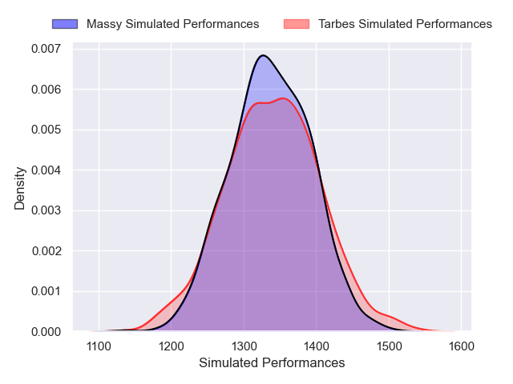

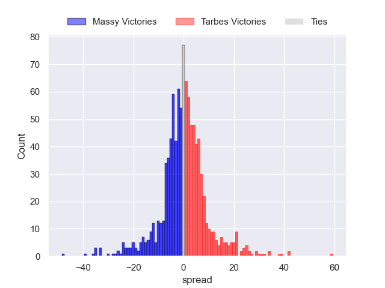

### Albi V US Bressane on 2024/12/06

Average Margin: Albi by 7.5

Average Scoreline: 26-19

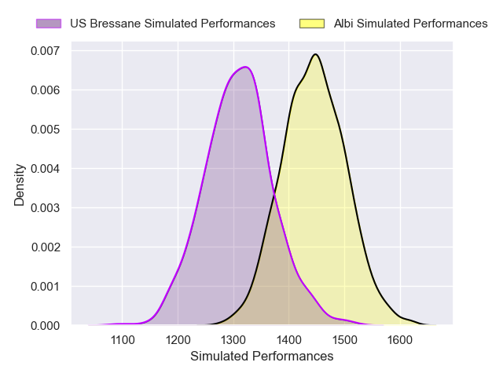
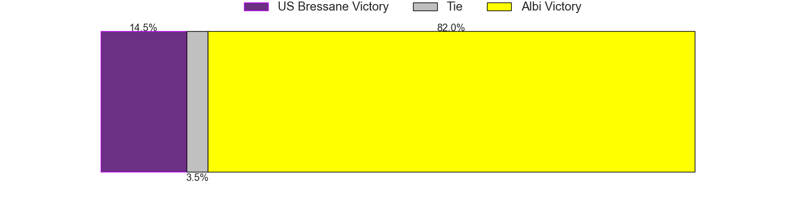
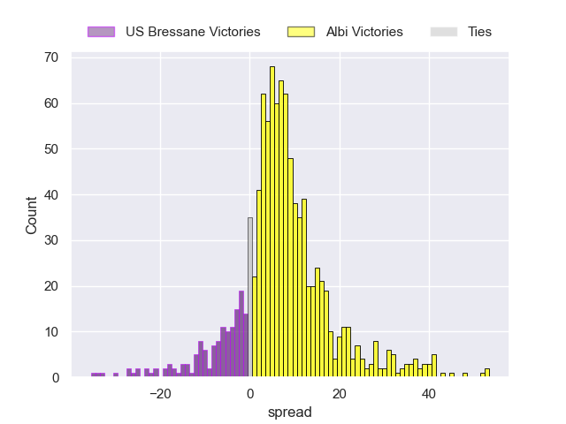

### Chambery V Marcq-en-Baroeul on 2024/12/07

Average Margin: Chambery by 9.2

Average Scoreline: 28-19

### Suresnes V Carcassonne on 2024/12/07

Average Margin: Carcassonne by 1.3

Average Scoreline: 18-17

### Langon V Narbonne on 2024/12/07

Average Margin: Langon by 0.2

Average Scoreline: 18-18

### Rouen V Périgueux on 2024/12/07

Average Margin: Rouen by 4.6

Average Scoreline: 24-20

## Week 16

### Rouen V US Bressane on 2024/12/13

Average Margin: Rouen by 10.0

Average Scoreline: 27-17

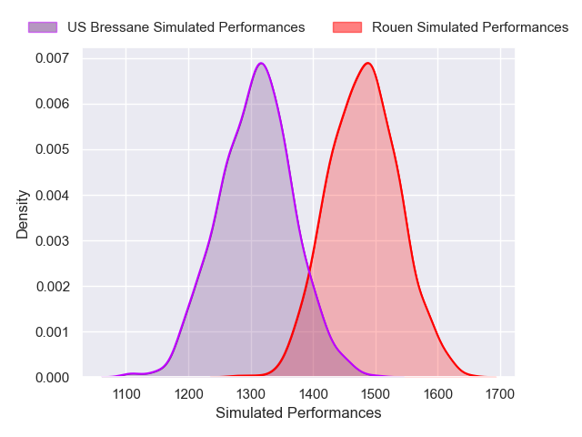
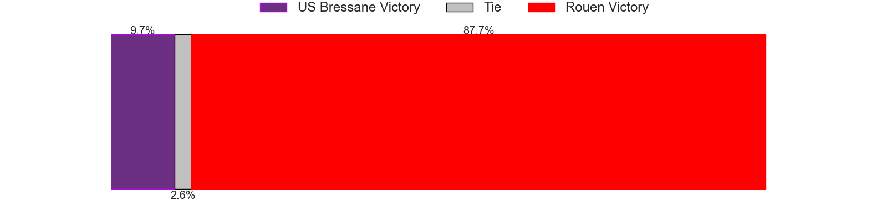
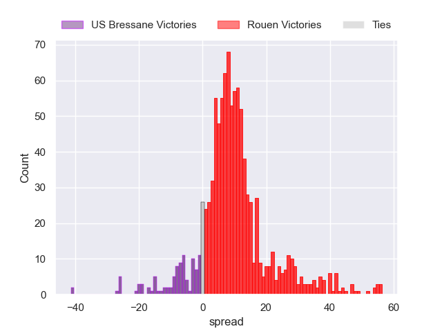

### Tarbes V Périgueux on 2024/12/13

Average Margin: Périgueux by 3.9

Average Scoreline: 23-19

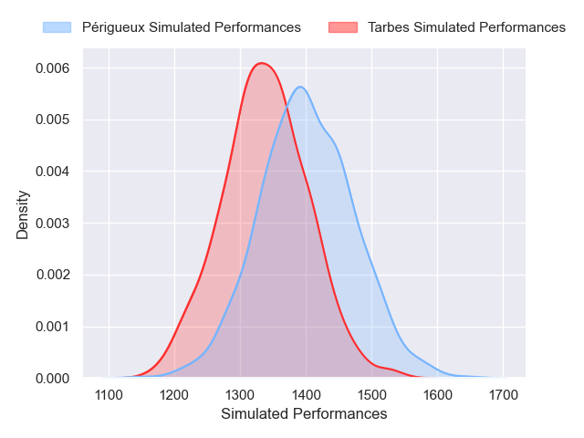
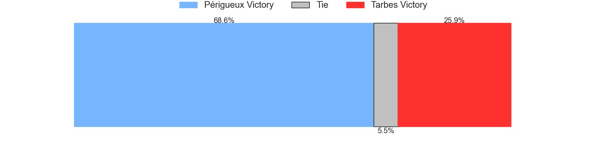
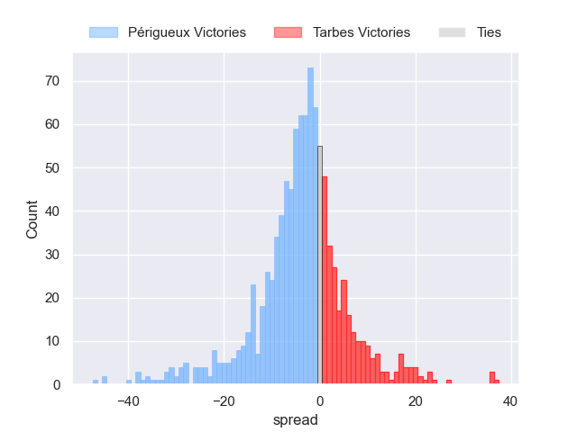

### Albi V Carcassonne on 2024/12/13

Average Margin: Albi by 3.5

Average Scoreline: 16-12

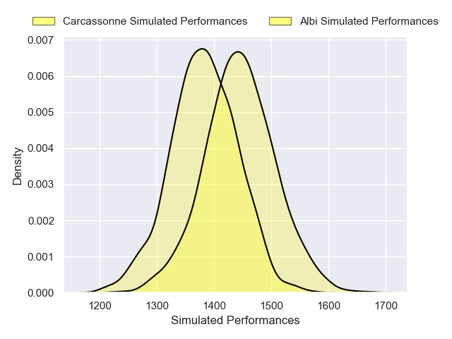
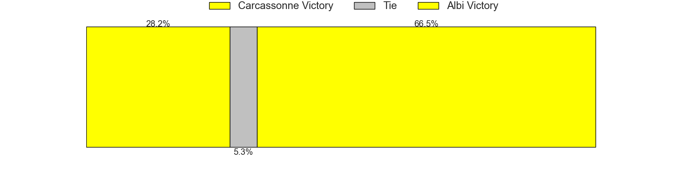
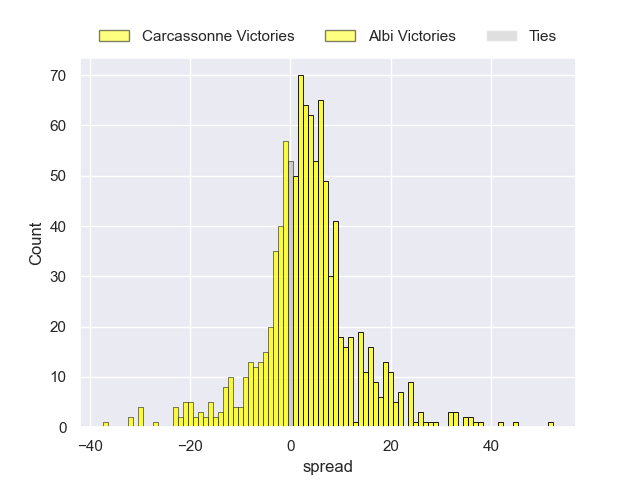

### Suresnes V Narbonne on 2024/12/14

Average Margin: Suresnes by 0.6

Average Scoreline: 22-22

### Chambery V Bourgoin-Jallieu on 2024/12/14

Average Margin: Chambery by 10.2

Average Scoreline: 28-18

### Marcq-en-Baroeul V Langon on 2024/12/14

Average Margin: Marcq-en-Baroeul by 3.8

Average Scoreline: 22-18

## Week 17

### Massy V Chambery on 2025/01/10

Average Margin: Massy by 0.6

Average Scoreline: 20-20

### US Bressane V Tarbes on 2025/01/10

Average Margin: US Bressane by 6.2

Average Scoreline: 24-18

### Carcassonne V Rouen on 2025/01/10

Average Margin: Carcassonne by 1.7

Average Scoreline: 20-18

### Narbonne V Albi on 2025/01/11

Average Margin: Narbonne by 2.9

Average Scoreline: 19-16

### Langon V Suresnes on 2025/01/11

Average Margin: Langon by 3.8

Average Scoreline: 25-21

### Bourgoin-Jallieu V Marcq-en-Baroeul on 2025/01/11

Average Margin: Bourgoin-Jallieu by 3.0

Average Scoreline: 19-16

## Week 18

### Tarbes V Carcassonne on 2025/01/17

Average Margin: Carcassonne by 2.8

Average Scoreline: 23-20

### Albi V Suresnes on 2025/01/17

Average Margin: Albi by 8.8

Average Scoreline: 25-16

### Marcq-en-Baroeul V Massy on 2025/01/18

Average Margin: Marcq-en-Baroeul by 1.8

Average Scoreline: 22-21

### Bourgoin-Jallieu V Langon on 2025/01/18

Average Margin: Bourgoin-Jallieu by 2.9

Average Scoreline: 20-17

### Chambery V Périgueux on 2025/01/18

Average Margin: Chambery by 3.3

Average Scoreline: 24-21

### Rouen V Narbonne on 2025/01/18

Average Margin: Rouen by 7.5

Average Scoreline: 27-20

## Week 19

### US Bressane V Chambery on 2025/01/24

Average Margin: Chambery by 0.6

Average Scoreline: 21-21

### Suresnes V Rouen on 2025/01/25

Average Margin: Rouen by 2.8

Average Scoreline: 26-23

### Narbonne V Tarbes on 2025/01/25

Average Margin: Narbonne by 8.2

Average Scoreline: 29-20

### Périgueux V Marcq-en-Baroeul on 2025/01/25

Average Margin: Périgueux by 8.7

Average Scoreline: 27-18

### Langon V Albi on 2025/01/25

Average Margin: Albi by 0.6

Average Scoreline: 21-21

### Massy V Bourgoin-Jallieu on 2025/01/25

Average Margin: Massy by 6.9

Average Scoreline: 26-20

## Week 20

### Tarbes V Suresnes on 2025/01/31

Average Margin: Tarbes by 3.0

Average Scoreline: 19-16

### Rouen V Albi on 2025/01/31

Average Margin: Rouen by 5.1

Average Scoreline: 26-21

### Massy V Langon on 2025/02/01

Average Margin: Massy by 5.5

Average Scoreline: 24-19

### Marcq-en-Baroeul V US Bressane on 2025/02/01

Average Margin: Marcq-en-Baroeul by 3.3

Average Scoreline: 22-19

### Bourgoin-Jallieu V Périgueux on 2025/02/01

Average Margin: Périgueux by 3.4

Average Scoreline: 21-17

### Chambery V Carcassonne on 2025/02/01

Average Margin: Chambery by 4.3

Average Scoreline: 24-20

## Week 21

### US Bressane V Bourgoin-Jallieu on 2025/02/14

Average Margin: US Bressane by 5.5

Average Scoreline: 20-14

### Albi V Tarbes on 2025/02/14

Average Margin: Albi by 9.9

Average Scoreline: 26-16

### Carcassonne V Marcq-en-Baroeul on 2025/02/14

Average Margin: Carcassonne by 8.1

Average Scoreline: 26-17

### Périgueux V Massy on 2025/02/15

Average Margin: Périgueux by 7.5

Average Scoreline: 28-20

### Narbonne V Chambery on 2025/02/15

Average Margin: Narbonne by 1.7

Average Scoreline: 23-21

### Langon V Rouen on 2025/02/15

Average Margin: Rouen by 3.3

Average Scoreline: 28-25

## Week 22

### Tarbes V Rouen on 2025/02/21

Average Margin: Rouen by 4.0

Average Scoreline: 27-23

### Bourgoin-Jallieu V Carcassonne on 2025/02/21

Average Margin: Carcassonne by 2.5

Average Scoreline: 22-19

### Chambery V Suresnes on 2025/02/22

Average Margin: Chambery by 8.7

Average Scoreline: 28-20

### Périgueux V Langon on 2025/02/22

Average Margin: Périgueux by 9.3

Average Scoreline: 28-19

### Marcq-en-Baroeul V Narbonne on 2025/02/22

Average Margin: Marcq-en-Baroeul by 1.0

Average Scoreline: 26-25

### Massy V US Bressane on 2025/02/22

Average Margin: Massy by 5.4

Average Scoreline: 22-17

## Week 23

### Albi V Chambery on 2025/02/28

Average Margin: Albi by 2.8

Average Scoreline: 22-19

### Carcassonne V Massy on 2025/02/28

Average Margin: Carcassonne by 6.0

Average Scoreline: 24-18

### US Bressane V Périgueux on 2025/02/28

Average Margin: Périgueux by 1.6

Average Scoreline: 20-19

### Suresnes V Marcq-en-Baroeul on 2025/03/01

Average Margin: Suresnes by 2.8

Average Scoreline: 23-21

### Narbonne V Bourgoin-Jallieu on 2025/03/01

Average Margin: Narbonne by 8.0

Average Scoreline: 30-22

### Langon V Tarbes on 2025/03/01

Average Margin: Langon by 5.4

Average Scoreline: 26-20

## Week 24

### US Bressane V Langon on 2025/03/07

Average Margin: US Bressane by 5.1

Average Scoreline: 22-17

### Chambery V Rouen on 2025/03/07

Average Margin: Chambery by 2.8

Average Scoreline: 24-21

### Périgueux V Carcassonne on 2025/03/08

Average Margin: Périgueux by 5.1

Average Scoreline: 24-19

### Marcq-en-Baroeul V Albi on 2025/03/08

Average Margin: Albi by 0.3

Average Scoreline: 22-22

### Bourgoin-Jallieu V Suresnes on 2025/03/08

Average Margin: Bourgoin-Jallieu by 2.8

Average Scoreline: 22-19

### Massy V Narbonne on 2025/03/08

Average Margin: Massy by 3.4

Average Scoreline: 22-18

## Week 25

### Rouen V Marcq-en-Baroeul on 2025/03/21

Average Margin: Rouen by 9.6

Average Scoreline: 32-22

### Albi V Bourgoin-Jallieu on 2025/03/21

Average Margin: Albi by 9.3

Average Scoreline: 24-15

### Carcassonne V US Bressane on 2025/03/21

Average Margin: Carcassonne by 7.9

Average Scoreline: 26-18

### Tarbes V Chambery on 2025/03/21

Average Margin: Chambery by 2.7

Average Scoreline: 27-25

### Suresnes V Massy on 2025/03/22

Average Margin: Suresnes by 1.9

Average Scoreline: 23-21

### Narbonne V Périgueux on 2025/03/22

Average Margin: Narbonne by 1.7

Average Scoreline: 23-22

## Week 26

### US Bressane V Narbonne on 2025/03/28

Average Margin: US Bressane by 1.0

Average Scoreline: 19-18

### Bourgoin-Jallieu V Rouen on 2025/03/28

Average Margin: Rouen by 4.1

Average Scoreline: 26-22

### Carcassonne V Langon on 2025/03/28

Average Margin: Carcassonne by 8.3

Average Scoreline: 27-18

### Massy V Albi on 2025/03/29

Average Margin: Massy by 1.3

Average Scoreline: 20-18

### Marcq-en-Baroeul V Tarbes on 2025/03/29

Average Margin: Marcq-en-Baroeul by 6.0

Average Scoreline: 27-21

### Périgueux V Suresnes on 2025/03/29

Average Margin: Périgueux by 9.2

Average Scoreline: 26-17

## Week 27

### Albi V Périgueux on 2025/04/11

Average Margin: Albi by 2.7

Average Scoreline: 25-22

### Rouen V Massy on 2025/04/11

Average Margin: Rouen by 8.5

Average Scoreline: 30-22

### Tarbes V Bourgoin-Jallieu on 2025/04/11

Average Margin: Tarbes by 3.2

Average Scoreline: 22-19

### Narbonne V Carcassonne on 2025/04/12

Average Margin: Narbonne by 2.9

Average Scoreline: 22-19

### Suresnes V US Bressane on 2025/04/12

Average Margin: Suresnes by 3.2

Average Scoreline: 22-19

### Langon V Chambery on 2025/04/12

Average Margin: Chambery by 1.1

Average Scoreline: 28-27

## Week 28

### Narbonne V Langon on 2025/04/26

Average Margin: Narbonne by 6.9

Average Scoreline: 28-21

### US Bressane V Albi on 2025/04/26

Average Margin: US Bressane by 0.4

Average Scoreline: 20-20

### Marcq-en-Baroeul V Chambery on 2025/04/26

Average Margin: Chambery by 1.0

Average Scoreline: 27-26

### Périgueux V Rouen on 2025/04/26

Average Margin: Périgueux by 3.0

Average Scoreline: 25-22

### Carcassonne V Suresnes on 2025/04/26

Average Margin: Carcassonne by 8.4

Average Scoreline: 26-17

### Massy V Tarbes on 2025/04/26

Average Margin: Massy by 7.8

Average Scoreline: 25-17

