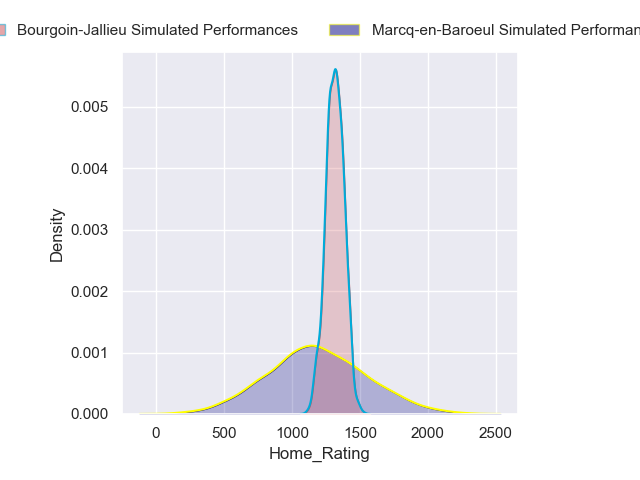
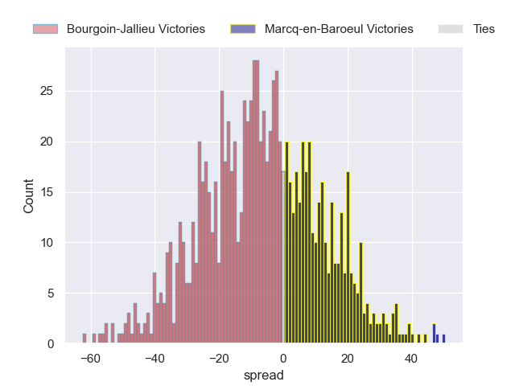
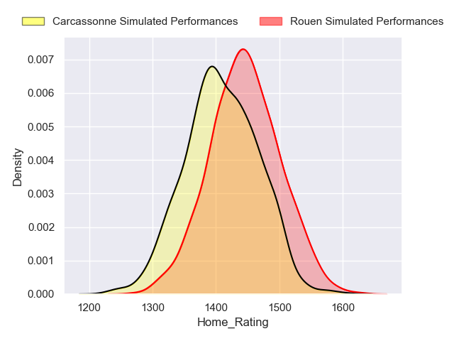
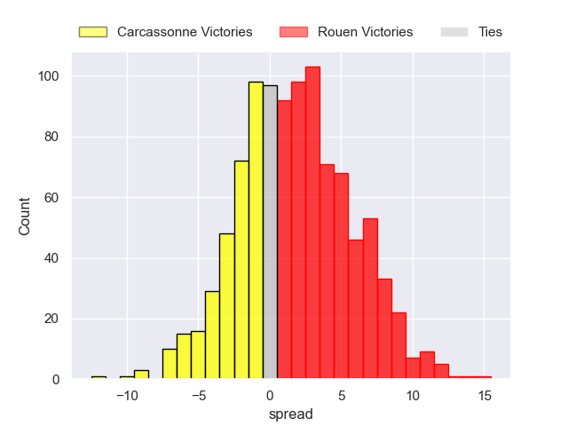
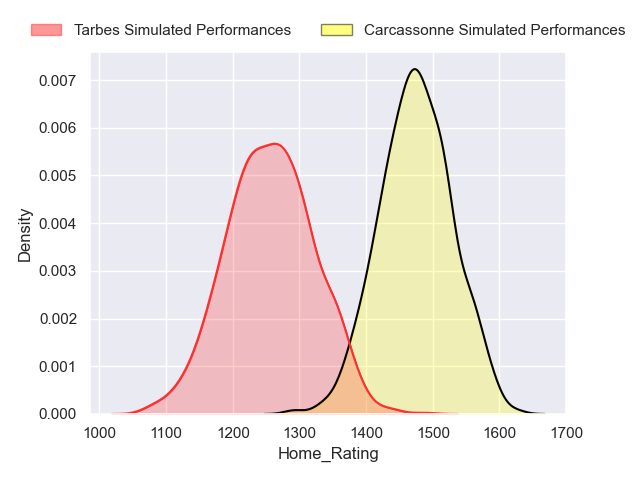
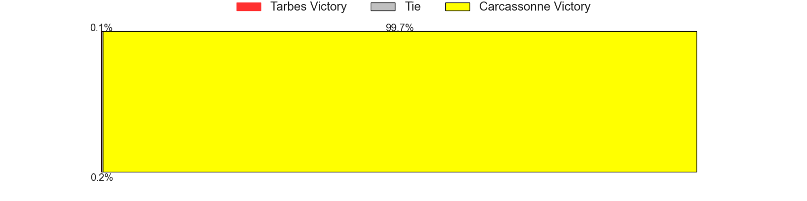
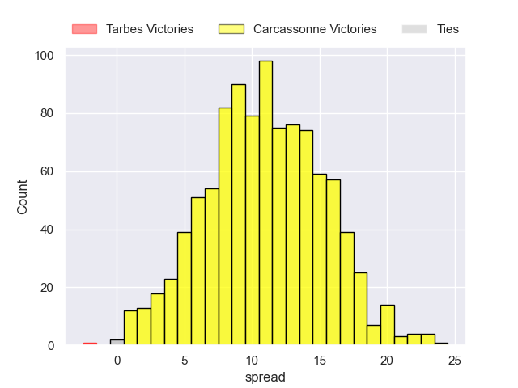

---  
title: "Nationale 2024 Status"  
date: 2024-08-27 6:00:00 -0500  
categories: model review projection  
layout: article  
aside:  
    toc: true  
---
# Current Team Rankings

# Standings

## Current Standings

| Club                |   Played |   Wins |   Point Differential |   Losing Bonus Points |   Try Bonus Points |   Competition Points |
|:--------------------|---------:|-------:|---------------------:|----------------------:|-------------------:|---------------------:|
| Périgueux           |        2 |      2 |                   36 |                     0 |                nan |                    8 |
| Massy               |        1 |      1 |                   25 |                     0 |                nan |                    4 |
| Langon              |        1 |      1 |                   12 |                     0 |                  0 |                    4 |
| Carcassonne         |        1 |      1 |                    8 |                     0 |                  0 |                    4 |
| Narbonne            |        1 |      1 |                    5 |                     0 |                  0 |                    4 |
| Chambery            |        1 |      1 |                    4 |                     0 |                  0 |                    4 |
| Rouen               |        1 |      1 |                    3 |                     0 |                  0 |                    4 |
| US Bressane         |        1 |      0 |                   -3 |                     1 |                  0 |                    1 |
| Bourgoin-Jallieu    |        1 |      0 |                   -4 |                     1 |                  0 |                    1 |
| Suresnes            |        1 |      0 |                   -5 |                     1 |                  0 |                    1 |
| Albi                |        1 |      0 |                   -8 |                     0 |                  0 |                    0 |
| Tarbes              |        1 |      0 |                  -11 |                     0 |                  0 |                    0 |
| Marcq-en-Baroeul    |        1 |      0 |                  -12 |                     0 |                  0 |                    0 |
| Carqueiranne-Hyères |        2 |      0 |                  -50 |                     0 |                nan |                    0 |

## Projected Remaining Table

| Club             |   Matches Remaining |   Wins |   Point Differential |   Losing Bonus Points |   Try Bonus Points |   Competition Points |
|:-----------------|--------------------:|-------:|---------------------:|----------------------:|-------------------:|---------------------:|
| Carcassonne      |                  23 |   16.2 |              86.7017 |                   5.4 |                8.4 |                 78.7 |
| Albi             |                  23 |   16.3 |              84.3166 |                   5.3 |                7.2 |                 77.8 |
| Rouen            |                  23 |   14.4 |              53.5265 |                   6.6 |                9.8 |                 74.2 |
| Périgueux        |                  23 |   13.5 |              41.5655 |                   7.1 |                9.4 |                 70.3 |
| Narbonne         |                  23 |   12.8 |              25.9877 |                   7.7 |                9.7 |                 68.5 |
| Chambery         |                  23 |   12.7 |              21.4489 |                   7.4 |                9.1 |                 67.2 |
| Langon           |                  23 |   13   |              55.6201 |                   4   |                7   |                 63.1 |
| Massy            |                  24 |   10.7 |             -18.6816 |                   8.8 |                8.7 |                 60.1 |
| US Bressane      |                  23 |    9.4 |             -26.9603 |                   8.8 |                8.4 |                 54.9 |
| Bourgoin-Jallieu |                  23 |    9.7 |             -24.1523 |                   8.6 |                6.4 |                 53.7 |
| Suresnes         |                  23 |    7.3 |             -70.395  |                   9.1 |                8.1 |                 46.6 |
| Marcq-en-Baroeul |                  23 |    8   |            -133.94   |                   4.4 |                5   |                 41.5 |
| Tarbes           |                  23 |    5.9 |             -95.0379 |                   9.3 |                6.3 |                 39.3 |

## Projected Total Table

| Club                |   Total Matches |   Wins |   Point Differential |   Losing Bonus Points |   Try Bonus Points |   Competition Points |
|:--------------------|----------------:|-------:|---------------------:|----------------------:|-------------------:|---------------------:|
| Carcassonne         |              24 |   17.2 |             94.7017  |                   5.4 |                8.4 |                 82.7 |
| Périgueux           |              25 |   15.5 |             77.5655  |                   7.1 |                9.4 |                 78.3 |
| Rouen               |              24 |   15.4 |             56.5265  |                   6.6 |                9.8 |                 78.2 |
| Albi                |              24 |   16.3 |             76.3166  |                   5.3 |                7.2 |                 77.8 |
| Narbonne            |              24 |   13.8 |             30.9877  |                   7.7 |                9.7 |                 72.5 |
| Chambery            |              24 |   13.7 |             25.4489  |                   7.4 |                9.1 |                 71.2 |
| Langon              |              24 |   14   |             67.6201  |                   4   |                7   |                 67.1 |
| Massy               |              25 |   11.7 |              6.31836 |                   8.8 |                8.7 |                 64.1 |
| US Bressane         |              24 |    9.4 |            -29.9603  |                   9.8 |                8.4 |                 55.9 |
| Bourgoin-Jallieu    |              24 |    9.7 |            -28.1523  |                   9.6 |                6.4 |                 54.7 |
| Suresnes            |              24 |    7.3 |            -75.395   |                  10.1 |                8.1 |                 47.6 |
| Marcq-en-Baroeul    |              24 |    8   |           -145.94    |                   4.4 |                5   |                 41.5 |
| Tarbes              |              24 |    5.9 |           -106.038   |                   9.3 |                6.3 |                 39.3 |
| Carqueiranne-Hyères |               2 |    0   |            -50       |                   0   |                0   |                  0   |

# Completed Match Review

| Model | Percent Correct Predictions | Spread Error |
| ------ | ------ | ------ |
| Club Level | 75.0% | 9.5 |
| Player Level: Lineup | 83.3% | 3.8 |
| Player Level: Minutes | 60.0% | 3.4 |

# Future Predictions

## Week 3

### Tarbes V US Bressane on 2024/08/30

Average Margin: Tarbes by 0.6

Average Scoreline: 23-22

### Chambery V Massy on 2024/08/30

Average Margin: Chambery by 5.1

Average Scoreline: 23-17

### Albi V Narbonne on 2024/08/30

Average Margin: Albi by 5.3

Average Scoreline: 22-17

### Marcq-en-Baroeul V Bourgoin-Jallieu on 2024/08/31

Average Margin: Bourgoin-Jallieu by 6.5

Average Scoreline: 21-14

### Rouen V Carcassonne on 2024/08/31

Average Margin: Rouen by 1.8

Average Scoreline: 17-15

### Suresnes V Langon on 2024/08/31

Average Margin: Langon by 5.5

Average Scoreline: 19-13

## Week 4

### Carcassonne V Tarbes on 2024/09/06

Average Margin: Carcassonne by 10.9

Average Scoreline: 23-13

### Massy V Marcq-en-Baroeul on 2024/09/07

Average Margin: Massy by 10.7

Average Scoreline: 22-11

### Narbonne V Rouen on 2024/09/07

Average Margin: Narbonne by 2.6

Average Scoreline: 21-18

### Suresnes V Albi on 2024/09/07

Average Margin: Albi by 2.6

Average Scoreline: 24-21

### Périgueux V Chambery on 2024/09/07

Average Margin: Périgueux by 4.8

Average Scoreline: 21-16

### Langon V Bourgoin-Jallieu on 2024/09/07

Average Margin: Langon by 8.0

Average Scoreline: 24-16

## Week 5

### Tarbes V Narbonne on 2024/09/13

Average Margin: Narbonne by 2.1

Average Scoreline: 24-21

### Rouen V Suresnes on 2024/09/13

Average Margin: Rouen by 8.5

Average Scoreline: 23-15

### Albi V Langon on 2024/09/13

Average Margin: Albi by 3.0

Average Scoreline: 19-16

### Chambery V US Bressane on 2024/09/14

Average Margin: Chambery by 5.4

Average Scoreline: 24-18

### Marcq-en-Baroeul V Périgueux on 2024/09/14

Average Margin: Périgueux by 6.3

Average Scoreline: 24-18

### Bourgoin-Jallieu V Massy on 2024/09/14

Average Margin: Bourgoin-Jallieu by 2.9

Average Scoreline: 21-18

## Week 6

### Albi V Rouen on 2024/09/27

Average Margin: Albi by 4.4

Average Scoreline: 21-16

### Carcassonne V Chambery on 2024/09/27

Average Margin: Carcassonne by 6.0

Average Scoreline: 22-16

### US Bressane V Marcq-en-Baroeul on 2024/09/27

Average Margin: US Bressane by 10.9

Average Scoreline: 23-12

### Langon V Massy on 2024/09/28

Average Margin: Langon by 7.8

Average Scoreline: 24-16

### Périgueux V Bourgoin-Jallieu on 2024/09/28

Average Margin: Périgueux by 6.5

Average Scoreline: 24-17

### Suresnes V Tarbes on 2024/09/28

Average Margin: Suresnes by 4.5

Average Scoreline: 23-18

## Week 7

### Bourgoin-Jallieu V US Bressane on 2024/10/04

Average Margin: Bourgoin-Jallieu by 3.5

Average Scoreline: 17-14

### Tarbes V Albi on 2024/10/04

Average Margin: Albi by 3.8

Average Scoreline: 25-21

### Marcq-en-Baroeul V Carcassonne on 2024/10/04

Average Margin: Carcassonne by 6.2

Average Scoreline: 23-17

### Rouen V Langon on 2024/10/04

Average Margin: Rouen by 3.4

Average Scoreline: 19-15

### Chambery V Narbonne on 2024/10/04

Average Margin: Chambery by 3.0

Average Scoreline: 26-23

### Massy V Périgueux on 2024/10/05

Average Margin: Massy by 0.7

Average Scoreline: 22-21

## Week 8

### Rouen V Tarbes on 2024/10/12

Average Margin: Rouen by 9.5

Average Scoreline: 24-14

### Suresnes V Chambery on 2024/10/12

Average Margin: Chambery by 0.4

Average Scoreline: 21-21

### Langon V Périgueux on 2024/10/12

Average Margin: Langon by 4.2

Average Scoreline: 23-19

### US Bressane V Massy on 2024/10/12

Average Margin: US Bressane by 3.1

Average Scoreline: 21-18

### Narbonne V Marcq-en-Baroeul on 2024/10/12

Average Margin: Narbonne by 10.5

Average Scoreline: 24-13

### Carcassonne V Bourgoin-Jallieu on 2024/10/12

Average Margin: Carcassonne by 8.0

Average Scoreline: 23-15

## Week 9

### Chambery V Albi on 2024/10/18

Average Margin: Chambery by 1.0

Average Scoreline: 18-17

### Périgueux V US Bressane on 2024/10/18

Average Margin: Périgueux by 6.1

Average Scoreline: 23-17

### Bourgoin-Jallieu V Narbonne on 2024/10/18

Average Margin: Bourgoin-Jallieu by 1.1

Average Scoreline: 24-23

### Tarbes V Langon on 2024/10/18

Average Margin: Langon by 3.3

Average Scoreline: 21-18

### Massy V Carcassonne on 2024/10/18

Average Margin: Carcassonne by 0.9

Average Scoreline: 23-22

### Marcq-en-Baroeul V Suresnes on 2024/10/18

Average Margin: Marcq-en-Baroeul by 0.1

Average Scoreline: 19-19

## Week 10

### Rouen V Chambery on 2024/11/02

Average Margin: Rouen by 4.5

Average Scoreline: 21-16

### Langon V US Bressane on 2024/11/02

Average Margin: Langon by 7.2

Average Scoreline: 24-17

### Carcassonne V Périgueux on 2024/11/02

Average Margin: Carcassonne by 5.0

Average Scoreline: 21-16

### Narbonne V Massy on 2024/11/02

Average Margin: Narbonne by 5.3

Average Scoreline: 23-18

### Albi V Marcq-en-Baroeul on 2024/11/02

Average Margin: Albi by 11.7

Average Scoreline: 25-13

### Suresnes V Bourgoin-Jallieu on 2024/11/02

Average Margin: Suresnes by 1.5

Average Scoreline: 21-19

## Week 11

### Marcq-en-Baroeul V Rouen on 2024/11/09

Average Margin: Rouen by 4.3

Average Scoreline: 23-18

### US Bressane V Carcassonne on 2024/11/09

Average Margin: Carcassonne by 1.3

Average Scoreline: 21-20

### Massy V Suresnes on 2024/11/09

Average Margin: Massy by 5.5

Average Scoreline: 24-19

### Périgueux V Narbonne on 2024/11/09

Average Margin: Périgueux by 4.0

Average Scoreline: 22-18

### Bourgoin-Jallieu V Albi on 2024/11/09

Average Margin: Albi by 0.9

Average Scoreline: 19-18

### Chambery V Tarbes on 2024/11/09

Average Margin: Chambery by 8.2

Average Scoreline: 23-15

## Week 12

### Suresnes V Périgueux on 2024/11/16

Average Margin: Périgueux by 1.4

Average Scoreline: 25-24

### Tarbes V Marcq-en-Baroeul on 2024/11/16

Average Margin: Tarbes by 4.8

Average Scoreline: 22-17

### Langon V Carcassonne on 2024/11/16

Average Margin: Langon by 2.3

Average Scoreline: 21-19

### Albi V Massy on 2024/11/16

Average Margin: Albi by 7.2

Average Scoreline: 23-15

### Rouen V Bourgoin-Jallieu on 2024/11/16

Average Margin: Rouen by 6.3

Average Scoreline: 24-17

### Narbonne V US Bressane on 2024/11/16

Average Margin: Narbonne by 5.7

Average Scoreline: 24-18

## Week 13

### Carcassonne V Narbonne on 2024/11/30

Average Margin: Carcassonne by 5.6

Average Scoreline: 22-17

### Massy V Rouen on 2024/11/30

Average Margin: Massy by 0.6

Average Scoreline: 24-23

### Chambery V Langon on 2024/11/30

Average Margin: Chambery by 1.8

Average Scoreline: 19-18

### Périgueux V Albi on 2024/11/30

Average Margin: Périgueux by 2.0

Average Scoreline: 17-15

### US Bressane V Suresnes on 2024/11/30

Average Margin: US Bressane by 5.1

Average Scoreline: 24-19

### Bourgoin-Jallieu V Tarbes on 2024/11/30

Average Margin: Bourgoin-Jallieu by 6.3

Average Scoreline: 22-15

## Week 14

### Chambery V Marcq-en-Baroeul on 2024/12/07

Average Margin: Chambery by 9.4

Average Scoreline: 25-15

### Albi V US Bressane on 2024/12/07

Average Margin: Albi by 7.6

Average Scoreline: 23-15

### Tarbes V Massy on 2024/12/07

Average Margin: Tarbes by 0.3

Average Scoreline: 20-20

### Langon V Narbonne on 2024/12/07

Average Margin: Langon by 4.4

Average Scoreline: 22-18

### Rouen V Périgueux on 2024/12/07

Average Margin: Rouen by 3.6

Average Scoreline: 19-15

### Suresnes V Carcassonne on 2024/12/07

Average Margin: Carcassonne by 2.8

Average Scoreline: 27-24

## Week 15

### Suresnes V Narbonne on 2024/12/14

Average Margin: Narbonne by 0.7

Average Scoreline: 21-21

### Chambery V Bourgoin-Jallieu on 2024/12/14

Average Margin: Chambery by 5.2

Average Scoreline: 24-19

### Tarbes V Périgueux on 2024/12/14

Average Margin: Périgueux by 2.4

Average Scoreline: 25-23

### Rouen V US Bressane on 2024/12/14

Average Margin: Rouen by 6.6

Average Scoreline: 24-17

### Albi V Carcassonne on 2024/12/14

Average Margin: Albi by 3.2

Average Scoreline: 19-16

### Marcq-en-Baroeul V Langon on 2024/12/14

Average Margin: Langon by 4.0

Average Scoreline: 23-19

## Week 16

### Narbonne V Albi on 2025/01/11

Average Margin: Narbonne by 1.3

Average Scoreline: 22-21

### US Bressane V Tarbes on 2025/01/11

Average Margin: US Bressane by 6.3

Average Scoreline: 23-17

### Langon V Suresnes on 2025/01/11

Average Margin: Langon by 8.5

Average Scoreline: 25-17

### Massy V Chambery on 2025/01/11

Average Margin: Massy by 1.9

Average Scoreline: 25-23

### Carcassonne V Rouen on 2025/01/11

Average Margin: Carcassonne by 4.7

Average Scoreline: 21-16

### Bourgoin-Jallieu V Marcq-en-Baroeul on 2025/01/11

Average Margin: Bourgoin-Jallieu by 7.2

Average Scoreline: 23-16

## Week 17

### Marcq-en-Baroeul V Massy on 2025/01/18

Average Margin: Massy by 0.5

Average Scoreline: 20-20

### Tarbes V Carcassonne on 2025/01/18

Average Margin: Carcassonne by 4.0

Average Scoreline: 25-21

### Rouen V Narbonne on 2025/01/18

Average Margin: Rouen by 4.2

Average Scoreline: 22-18

### Albi V Suresnes on 2025/01/18

Average Margin: Albi by 9.5

Average Scoreline: 25-15

### Bourgoin-Jallieu V Langon on 2025/01/18

Average Margin: Bourgoin-Jallieu by 0.2

Average Scoreline: 19-19

### Chambery V Périgueux on 2025/01/18

Average Margin: Chambery by 2.3

Average Scoreline: 19-17

## Week 18

### Suresnes V Rouen on 2025/01/25

Average Margin: Rouen by 1.4

Average Scoreline: 24-22

### Périgueux V Marcq-en-Baroeul on 2025/01/25

Average Margin: Périgueux by 10.0

Average Scoreline: 24-15

### US Bressane V Chambery on 2025/01/25

Average Margin: US Bressane by 1.4

Average Scoreline: 22-20

### Massy V Bourgoin-Jallieu on 2025/01/25

Average Margin: Massy by 3.6

Average Scoreline: 25-22

### Langon V Albi on 2025/01/25

Average Margin: Langon by 2.3

Average Scoreline: 22-19

### Narbonne V Tarbes on 2025/01/25

Average Margin: Narbonne by 8.6

Average Scoreline: 23-14

## Week 19

### Chambery V Carcassonne on 2025/02/01

Average Margin: Chambery by 0.7

Average Scoreline: 18-18

### Massy V Langon on 2025/02/01

Average Margin: Massy by 0.4

Average Scoreline: 20-20

### Marcq-en-Baroeul V US Bressane on 2025/02/01

Average Margin: US Bressane by 0.0

Average Scoreline: 21-21

### Bourgoin-Jallieu V Périgueux on 2025/02/01

Average Margin: Bourgoin-Jallieu by 0.4

Average Scoreline: 19-18

### Tarbes V Suresnes on 2025/02/01

Average Margin: Tarbes by 2.2

Average Scoreline: 25-23

### Rouen V Albi on 2025/02/01

Average Margin: Rouen by 2.3

Average Scoreline: 20-17

## Week 20

### US Bressane V Bourgoin-Jallieu on 2025/02/15

Average Margin: US Bressane by 3.2

Average Scoreline: 22-19

### Albi V Tarbes on 2025/02/15

Average Margin: Albi by 10.5

Average Scoreline: 25-14

### Carcassonne V Marcq-en-Baroeul on 2025/02/15

Average Margin: Carcassonne by 11.4

Average Scoreline: 25-14

### Périgueux V Massy on 2025/02/15

Average Margin: Périgueux by 6.1

Average Scoreline: 23-17

### Langon V Rouen on 2025/02/15

Average Margin: Langon by 3.4

Average Scoreline: 22-19

### Narbonne V Chambery on 2025/02/15

Average Margin: Narbonne by 3.7

Average Scoreline: 25-21

## Week 21

### Périgueux V Langon on 2025/02/22

Average Margin: Périgueux by 3.2

Average Scoreline: 21-18

### Tarbes V Rouen on 2025/02/22

Average Margin: Rouen by 2.7

Average Scoreline: 27-24

### Bourgoin-Jallieu V Carcassonne on 2025/02/22

Average Margin: Carcassonne by 1.1

Average Scoreline: 20-19

### Massy V US Bressane on 2025/02/22

Average Margin: Massy by 4.0

Average Scoreline: 25-21

### Marcq-en-Baroeul V Narbonne on 2025/02/22

Average Margin: Narbonne by 2.6

Average Scoreline: 21-18

### Chambery V Suresnes on 2025/02/22

Average Margin: Chambery by 7.0

Average Scoreline: 27-20

## Week 22

### Carcassonne V Massy on 2025/03/01

Average Margin: Carcassonne by 7.3

Average Scoreline: 23-16

### Albi V Chambery on 2025/03/01

Average Margin: Albi by 5.9

Average Scoreline: 22-16

### Langon V Tarbes on 2025/03/01

Average Margin: Langon by 9.7

Average Scoreline: 27-18

### US Bressane V Périgueux on 2025/03/01

Average Margin: US Bressane by 0.6

Average Scoreline: 18-18

### Suresnes V Marcq-en-Baroeul on 2025/03/01

Average Margin: Suresnes by 4.7

Average Scoreline: 23-18

### Narbonne V Bourgoin-Jallieu on 2025/03/01

Average Margin: Narbonne by 5.8

Average Scoreline: 26-21

## Week 23

### US Bressane V Langon on 2025/03/07

Average Margin: Langon by 0.0

Average Scoreline: 20-20

### Chambery V Rouen on 2025/03/07

Average Margin: Chambery by 2.1

Average Scoreline: 19-17

### Périgueux V Carcassonne on 2025/03/08

Average Margin: Périgueux by 1.7

Average Scoreline: 18-16

### Bourgoin-Jallieu V Suresnes on 2025/03/08

Average Margin: Bourgoin-Jallieu by 5.3

Average Scoreline: 29-23

### Marcq-en-Baroeul V Albi on 2025/03/08

Average Margin: Albi by 4.0

Average Scoreline: 22-18

### Massy V Narbonne on 2025/03/08

Average Margin: Massy by 1.3

Average Scoreline: 22-21

## Week 24

### Tarbes V Chambery on 2025/03/21

Average Margin: Chambery by 1.3

Average Scoreline: 25-23

### Albi V Bourgoin-Jallieu on 2025/03/21

Average Margin: Albi by 7.5

Average Scoreline: 23-16

### Carcassonne V US Bressane on 2025/03/21

Average Margin: Carcassonne by 7.9

Average Scoreline: 23-15

### Rouen V Marcq-en-Baroeul on 2025/03/21

Average Margin: Rouen by 9.4

Average Scoreline: 24-15

### Suresnes V Massy on 2025/03/22

Average Margin: Suresnes by 1.4

Average Scoreline: 22-21

### Narbonne V Périgueux on 2025/03/22

Average Margin: Narbonne by 2.8

Average Scoreline: 21-19

## Week 25

### US Bressane V Narbonne on 2025/03/28

Average Margin: US Bressane by 0.9

Average Scoreline: 19-18

### Carcassonne V Langon on 2025/03/28

Average Margin: Carcassonne by 5.1

Average Scoreline: 23-17

### Marcq-en-Baroeul V Tarbes on 2025/03/29

Average Margin: Marcq-en-Baroeul by 2.7

Average Scoreline: 24-21

### Bourgoin-Jallieu V Rouen on 2025/03/29

Average Margin: Bourgoin-Jallieu by 0.3

Average Scoreline: 19-19

### Périgueux V Suresnes on 2025/03/29

Average Margin: Périgueux by 8.1

Average Scoreline: 25-17

### Massy V Albi on 2025/03/29

Average Margin: Albi by 0.6

Average Scoreline: 21-20

## Week 26

### Tarbes V Bourgoin-Jallieu on 2025/04/11

Average Margin: Tarbes by 0.3

Average Scoreline: 22-21

### Rouen V Massy on 2025/04/11

Average Margin: Rouen by 6.2

Average Scoreline: 24-18

### Albi V Périgueux on 2025/04/11

Average Margin: Albi by 4.5

Average Scoreline: 21-17

### Langon V Chambery on 2025/04/12

Average Margin: Langon by 4.7

Average Scoreline: 23-18

### Suresnes V US Bressane on 2025/04/12

Average Margin: Suresnes by 1.6

Average Scoreline: 23-22

### Narbonne V Carcassonne on 2025/04/12

Average Margin: Narbonne by 1.2

Average Scoreline: 23-22

## Week 27

### Narbonne V Langon on 2025/04/26

Average Margin: Narbonne by 2.6

Average Scoreline: 21-18

### Carcassonne V Suresnes on 2025/04/26

Average Margin: Carcassonne by 9.5

Average Scoreline: 23-13

### Périgueux V Rouen on 2025/04/26

Average Margin: Périgueux by 3.1

Average Scoreline: 20-17

### Marcq-en-Baroeul V Chambery on 2025/04/26

Average Margin: Chambery by 1.5

Average Scoreline: 21-20

### US Bressane V Albi on 2025/04/26

Average Margin: Albi by 0.8

Average Scoreline: 18-17

### Massy V Tarbes on 2025/04/26

Average Margin: Massy by 6.5

Average Scoreline: 25-18

