---  
title: "Nationale 2024 Status"  
date: 2024-10-14 6:00:00 -0500  
categories: model review projection  
layout: article  
aside:  
    toc: true  
---
# Current Team Rankings

# Standings

## Current Standings

| Club                |   Played |   Wins |   Point Differential |   Losing Bonus Points |   Try Bonus Points |   Competition Points |
|:--------------------|---------:|-------:|---------------------:|----------------------:|-------------------:|---------------------:|
| Rouen               |        8 |      6 |                  112 |                     0 |                nan |                   28 |
| Carcassonne         |        7 |      5 |                   54 |                     2 |                nan |                   24 |
| Périgueux           |        7 |      5 |                   72 |                     1 |                nan |                   23 |
| Albi                |        7 |      5 |                   40 |                     0 |                nan |                   23 |
| Narbonne            |        7 |      5 |                   31 |                     1 |                nan |                   23 |
| Chambery            |        7 |      4 |                   32 |                     2 |                  1 |                   21 |
| Suresnes            |        7 |      3 |                   24 |                     3 |                nan |                   19 |
| Langon              |        7 |      4 |                  -14 |                     1 |                  1 |                   18 |
| Massy               |        7 |      3 |                   23 |                     2 |                nan |                   16 |
| Bourgoin-Jallieu    |        7 |      3 |                  -33 |                     1 |                  1 |                   14 |
| US Bressane         |        7 |      3 |                  -10 |                     1 |                nan |                   13 |
| Marcq-en-Baroeul    |        7 |      1 |                  -60 |                     2 |                  2 |                    8 |
| Tarbes              |        7 |      1 |                  -71 |                     3 |                  1 |                    8 |
| Carqueiranne-Hyères |        8 |      0 |                 -200 |                     0 |                nan |                    0 |

## Projected Remaining Table

| Club             |   Matches Remaining |   Wins |   Point Differential |   Losing Bonus Points |   Try Bonus Points |   Competition Points |
|:-----------------|--------------------:|-------:|---------------------:|----------------------:|-------------------:|---------------------:|
| Carcassonne      |                  18 |   12.5 |              57.8431 |                   4.8 |                7.6 |                 62.6 |
| Rouen            |                  17 |   12.2 |              57.9675 |                   4.2 |                8.9 |                 61.9 |
| Albi             |                  18 |   12.6 |              63.2347 |                   4.6 |                6.2 |                 61.2 |
| Périgueux        |                  18 |   11.1 |              36.4882 |                   5.6 |                7.7 |                 57.5 |
| Narbonne         |                  18 |   10.8 |              27.5173 |                   5.8 |                8.2 |                 57.2 |
| Chambery         |                  17 |   10.5 |              35.6834 |                   5.3 |                7.7 |                 54.9 |
| Massy            |                  18 |    8   |             -18.301  |                   6.8 |                7   |                 45.6 |
| Suresnes         |                  18 |    6.5 |             -38.9524 |                   7.6 |                6.9 |                 40.4 |
| Langon           |                  17 |    7.1 |             -26.7719 |                   5.7 |                5.4 |                 39.4 |
| US Bressane      |                  18 |    6   |             -47.6845 |                   7.3 |                7.2 |                 38.7 |
| Bourgoin-Jallieu |                  17 |    6.1 |             -32.8423 |                   7.4 |                6.7 |                 38.5 |
| Marcq-en-Baroeul |                  17 |    6.9 |             -36.6293 |                   5.1 |                5.1 |                 37.7 |
| Tarbes           |                  17 |    3.8 |             -77.5528 |                   7.2 |                4.2 |                 26.5 |

## Projected Total Table

| Club                |   Total Matches |   Wins |   Point Differential |   Losing Bonus Points |   Try Bonus Points |   Competition Points |
|:--------------------|----------------:|-------:|---------------------:|----------------------:|-------------------:|---------------------:|
| Rouen               |              25 |   18.2 |            169.968   |                   4.2 |                8.9 |                 89.9 |
| Carcassonne         |              25 |   17.5 |            111.843   |                   6.8 |                7.6 |                 86.6 |
| Albi                |              25 |   17.6 |            103.235   |                   4.6 |                6.2 |                 84.2 |
| Périgueux           |              25 |   16.1 |            108.488   |                   6.6 |                7.7 |                 80.5 |
| Narbonne            |              25 |   15.8 |             58.5173  |                   6.8 |                8.2 |                 80.2 |
| Chambery            |              24 |   14.5 |             67.6834  |                   7.3 |                8.7 |                 75.9 |
| Massy               |              25 |   11   |              4.69902 |                   8.8 |                7   |                 61.6 |
| Suresnes            |              25 |    9.5 |            -14.9524  |                  10.6 |                6.9 |                 59.4 |
| Langon              |              24 |   11.1 |            -40.7719  |                   6.7 |                6.4 |                 57.4 |
| Bourgoin-Jallieu    |              24 |    9.1 |            -65.8423  |                   8.4 |                7.7 |                 52.5 |
| US Bressane         |              25 |    9   |            -57.6845  |                   8.3 |                7.2 |                 51.7 |
| Marcq-en-Baroeul    |              24 |    7.9 |            -96.6293  |                   7.1 |                7.1 |                 45.7 |
| Tarbes              |              24 |    4.8 |           -148.553   |                  10.2 |                5.2 |                 34.5 |
| Carqueiranne-Hyères |               8 |    0   |           -200       |                   0   |                0   |                  0   |

# Completed Match Review

| Model | Percent Correct Predictions | Spread Error |
| ------ | ------ | ------ |
| Club Level | 82.0% | 10.2 |
| Player Level: Lineup | 72.7% | 6.4 |
| Player Level: Minutes | 61.5% | 7.5 |

# Future Predictions

## Week 9

### Tarbes V Langon on 2024/10/18

Average Margin: Langon by 0.1

Average Scoreline: 16-16

### Chambery V Albi on 2024/10/18

Average Margin: Chambery by 1.9

Average Scoreline: 20-18

### Périgueux V US Bressane on 2024/10/19

Average Margin: Périgueux by 7.9

Average Scoreline: 24-16

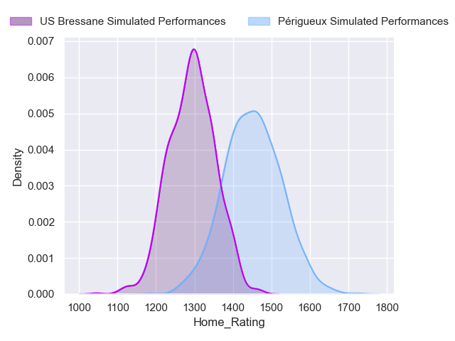
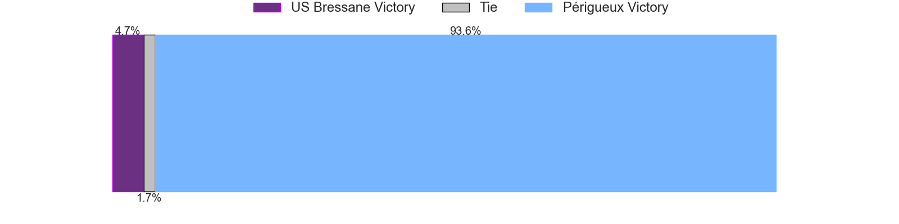
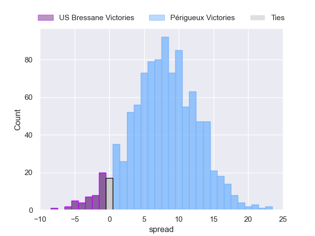

### Massy V Carcassonne on 2024/10/19

Average Margin: Carcassonne by 1.0

Average Scoreline: 31-30

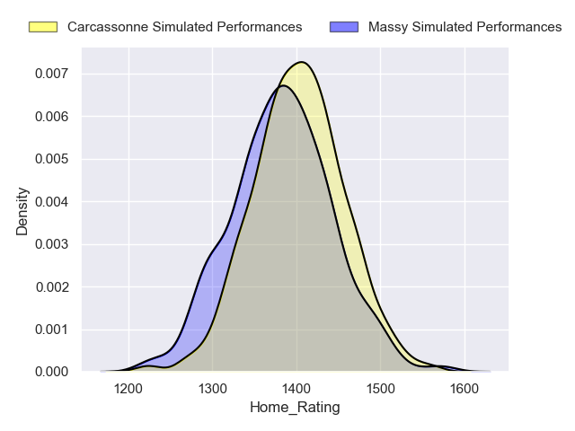
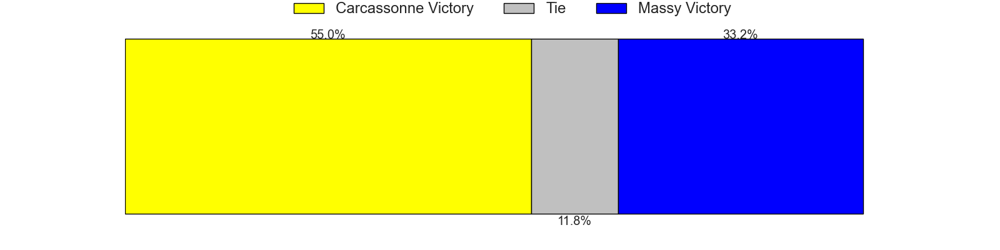
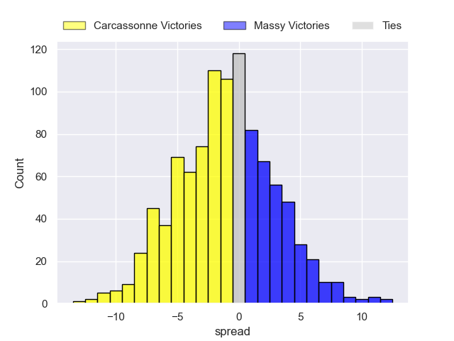

### Marcq-en-Baroeul V Suresnes on 2024/10/19

Average Margin: Marcq-en-Baroeul by 2.7

Average Scoreline: 17-14

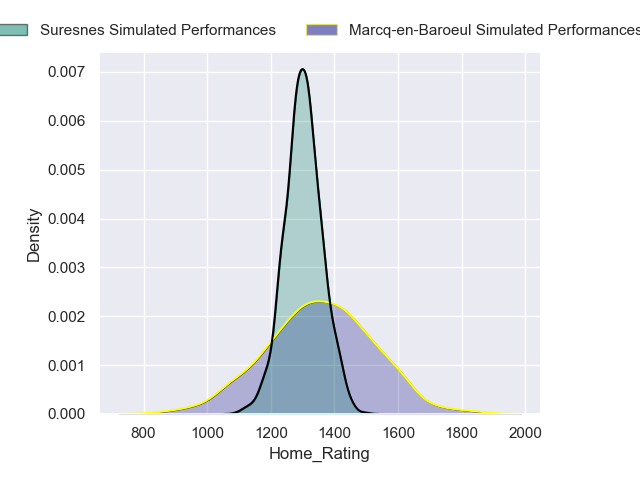
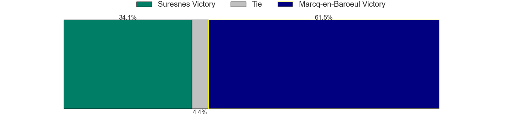
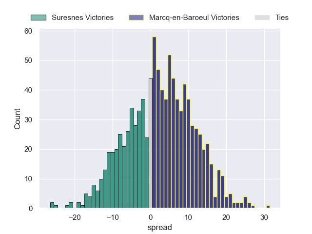

### Bourgoin-Jallieu V Narbonne on 2024/10/19

Average Margin: Narbonne by 0.1

Average Scoreline: 31-31

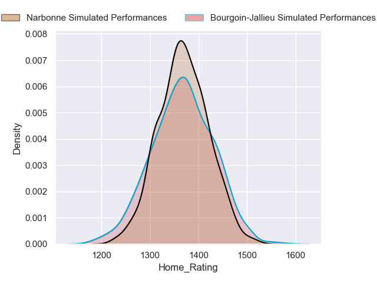
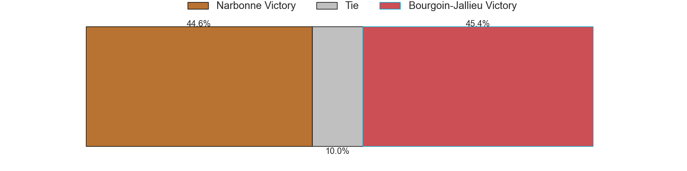
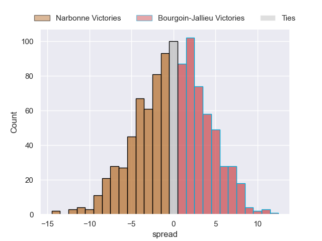

## Week 10

### Carcassonne V Périgueux on 2024/11/02

Average Margin: Carcassonne by 4.5

Average Scoreline: 20-15

### Langon V US Bressane on 2024/11/02

Average Margin: Langon by 4.1

Average Scoreline: 19-15

### Rouen V Chambery on 2024/11/02

Average Margin: Rouen by 5.1

Average Scoreline: 30-25

### Suresnes V Bourgoin-Jallieu on 2024/11/02

Average Margin: Suresnes by 3.5

Average Scoreline: 31-28

### Narbonne V Massy on 2024/11/02

Average Margin: Narbonne by 6.0

Average Scoreline: 29-23

### Albi V Marcq-en-Baroeul on 2024/11/02

Average Margin: Albi by 8.9

Average Scoreline: 22-13

## Week 11

### Périgueux V Narbonne on 2024/11/09

Average Margin: Périgueux by 4.6

Average Scoreline: 19-14

### US Bressane V Carcassonne on 2024/11/09

Average Margin: Carcassonne by 2.1

Average Scoreline: 33-31

### Massy V Suresnes on 2024/11/09

Average Margin: Massy by 4.1

Average Scoreline: 28-24

### Marcq-en-Baroeul V Rouen on 2024/11/09

Average Margin: Rouen by 2.5

Average Scoreline: 26-23

### Chambery V Tarbes on 2024/11/09

Average Margin: Chambery by 9.9

Average Scoreline: 29-19

### Bourgoin-Jallieu V Albi on 2024/11/09

Average Margin: Albi by 1.7

Average Scoreline: 26-25

## Week 12

### Tarbes V Marcq-en-Baroeul on 2024/11/16

Average Margin: Tarbes by 0.7

Average Scoreline: 15-14

### Narbonne V US Bressane on 2024/11/16

Average Margin: Narbonne by 7.1

Average Scoreline: 27-20

### Rouen V Bourgoin-Jallieu on 2024/11/16

Average Margin: Rouen by 8.8

Average Scoreline: 28-19

### Langon V Carcassonne on 2024/11/16

Average Margin: Carcassonne by 1.4

Average Scoreline: 25-23

### Albi V Massy on 2024/11/16

Average Margin: Albi by 7.7

Average Scoreline: 24-16

### Suresnes V Périgueux on 2024/11/16

Average Margin: Périgueux by 0.8

Average Scoreline: 29-28

## Week 13

### US Bressane V Suresnes on 2024/11/30

Average Margin: US Bressane by 3.2

Average Scoreline: 26-23

### Chambery V Langon on 2024/11/30

Average Margin: Chambery by 6.6

Average Scoreline: 19-13

### Périgueux V Albi on 2024/11/30

Average Margin: Périgueux by 2.5

Average Scoreline: 20-18

### Carcassonne V Narbonne on 2024/11/30

Average Margin: Carcassonne by 5.2

Average Scoreline: 18-13

### Bourgoin-Jallieu V Tarbes on 2024/11/30

Average Margin: Bourgoin-Jallieu by 6.2

Average Scoreline: 23-17

### Massy V Rouen on 2024/11/30

Average Margin: Rouen by 1.0

Average Scoreline: 32-31

## Week 14

### Suresnes V Carcassonne on 2024/12/07

Average Margin: Carcassonne by 1.6

Average Scoreline: 33-32

### Chambery V Marcq-en-Baroeul on 2024/12/07

Average Margin: Chambery by 7.3

Average Scoreline: 19-11

### Albi V US Bressane on 2024/12/07

Average Margin: Albi by 8.6

Average Scoreline: 22-14

### Rouen V Périgueux on 2024/12/07

Average Margin: Rouen by 4.6

Average Scoreline: 29-24

### Tarbes V Massy on 2024/12/07

Average Margin: Massy by 0.3

Average Scoreline: 24-23

### Langon V Narbonne on 2024/12/07

Average Margin: Langon by 0.5

Average Scoreline: 22-21

## Week 15

### Suresnes V Narbonne on 2024/12/14

Average Margin: Suresnes by 0.1

Average Scoreline: 31-31

### Chambery V Bourgoin-Jallieu on 2024/12/14

Average Margin: Chambery by 6.9

Average Scoreline: 27-21

### Marcq-en-Baroeul V Langon on 2024/12/14

Average Margin: Marcq-en-Baroeul by 2.8

Average Scoreline: 22-19

### Albi V Carcassonne on 2024/12/14

Average Margin: Albi by 3.3

Average Scoreline: 27-23

### Rouen V US Bressane on 2024/12/14

Average Margin: Rouen by 8.8

Average Scoreline: 27-18

### Tarbes V Périgueux on 2024/12/14

Average Margin: Périgueux by 3.8

Average Scoreline: 32-29

## Week 16

### Carcassonne V Rouen on 2025/01/11

Average Margin: Carcassonne by 3.2

Average Scoreline: 21-18

### US Bressane V Tarbes on 2025/01/11

Average Margin: US Bressane by 5.9

Average Scoreline: 25-19

### Massy V Chambery on 2025/01/11

Average Margin: Massy by 0.5

Average Scoreline: 35-35

### Narbonne V Albi on 2025/01/11

Average Margin: Narbonne by 1.6

Average Scoreline: 26-25

### Langon V Suresnes on 2025/01/11

Average Margin: Langon by 3.9

Average Scoreline: 21-17

### Bourgoin-Jallieu V Marcq-en-Baroeul on 2025/01/11

Average Margin: Bourgoin-Jallieu by 3.5

Average Scoreline: 21-17

## Week 17

### Chambery V Périgueux on 2025/01/18

Average Margin: Chambery by 2.9

Average Scoreline: 26-23

### Albi V Suresnes on 2025/01/18

Average Margin: Albi by 8.2

Average Scoreline: 24-15

### Rouen V Narbonne on 2025/01/18

Average Margin: Rouen by 5.4

Average Scoreline: 28-23

### Marcq-en-Baroeul V Massy on 2025/01/18

Average Margin: Marcq-en-Baroeul by 2.2

Average Scoreline: 21-19

### Bourgoin-Jallieu V Langon on 2025/01/18

Average Margin: Bourgoin-Jallieu by 2.6

Average Scoreline: 20-17

### Tarbes V Carcassonne on 2025/01/18

Average Margin: Carcassonne by 4.4

Average Scoreline: 34-29

## Week 18

### Périgueux V Marcq-en-Baroeul on 2025/01/25

Average Margin: Périgueux by 8.1

Average Scoreline: 21-13

### US Bressane V Chambery on 2025/01/25

Average Margin: Chambery by 0.6

Average Scoreline: 34-33

### Suresnes V Rouen on 2025/01/25

Average Margin: Rouen by 1.8

Average Scoreline: 32-31

### Narbonne V Tarbes on 2025/01/25

Average Margin: Narbonne by 9.4

Average Scoreline: 29-20

### Massy V Bourgoin-Jallieu on 2025/01/25

Average Margin: Massy by 4.3

Average Scoreline: 34-30

### Langon V Albi on 2025/01/25

Average Margin: Albi by 0.7

Average Scoreline: 21-20

## Week 19

### Tarbes V Suresnes on 2025/02/01

Average Margin: Tarbes by 0.3

Average Scoreline: 27-27

### Chambery V Carcassonne on 2025/02/01

Average Margin: Chambery by 1.7

Average Scoreline: 26-24

### Marcq-en-Baroeul V US Bressane on 2025/02/01

Average Margin: Marcq-en-Baroeul by 3.5

Average Scoreline: 21-18

### Bourgoin-Jallieu V Périgueux on 2025/02/01

Average Margin: Périgueux by 0.9

Average Scoreline: 27-26

### Massy V Langon on 2025/02/01

Average Margin: Massy by 4.0

Average Scoreline: 24-20

### Rouen V Albi on 2025/02/01

Average Margin: Rouen by 3.5

Average Scoreline: 24-21

## Week 20

### Albi V Tarbes on 2025/02/15

Average Margin: Albi by 11.3

Average Scoreline: 31-19

### Narbonne V Chambery on 2025/02/15

Average Margin: Narbonne by 3.0

Average Scoreline: 32-29

### US Bressane V Bourgoin-Jallieu on 2025/02/15

Average Margin: US Bressane by 3.2

Average Scoreline: 31-28

### Périgueux V Massy on 2025/02/15

Average Margin: Périgueux by 6.8

Average Scoreline: 24-18

### Langon V Rouen on 2025/02/15

Average Margin: Rouen by 1.3

Average Scoreline: 24-23

### Carcassonne V Marcq-en-Baroeul on 2025/02/15

Average Margin: Carcassonne by 8.8

Average Scoreline: 22-13

## Week 21

### Chambery V Suresnes on 2025/02/22

Average Margin: Chambery by 6.9

Average Scoreline: 28-21

### Bourgoin-Jallieu V Carcassonne on 2025/02/22

Average Margin: Carcassonne by 1.9

Average Scoreline: 32-30

### Périgueux V Langon on 2025/02/22

Average Margin: Périgueux by 6.8

Average Scoreline: 21-14

### Tarbes V Rouen on 2025/02/22

Average Margin: Rouen by 4.7

Average Scoreline: 31-27

### Massy V US Bressane on 2025/02/22

Average Margin: Massy by 4.3

Average Scoreline: 28-24

### Marcq-en-Baroeul V Narbonne on 2025/02/22

Average Margin: Narbonne by 0.1

Average Scoreline: 22-22

## Week 22

### Carcassonne V Massy on 2025/03/01

Average Margin: Carcassonne by 7.7

Average Scoreline: 24-17

### Langon V Tarbes on 2025/03/01

Average Margin: Langon by 7.1

Average Scoreline: 29-22

### US Bressane V Périgueux on 2025/03/01

Average Margin: Périgueux by 1.5

Average Scoreline: 32-30

### Albi V Chambery on 2025/03/01

Average Margin: Albi by 5.0

Average Scoreline: 29-24

### Suresnes V Marcq-en-Baroeul on 2025/03/01

Average Margin: Suresnes by 3.5

Average Scoreline: 23-20

### Narbonne V Bourgoin-Jallieu on 2025/03/01

Average Margin: Narbonne by 6.6

Average Scoreline: 31-24

## Week 23

### Chambery V Rouen on 2025/03/07

Average Margin: Chambery by 1.7

Average Scoreline: 26-24

### US Bressane V Langon on 2025/03/07

Average Margin: US Bressane by 2.7

Average Scoreline: 22-19

### Marcq-en-Baroeul V Albi on 2025/03/08

Average Margin: Albi by 1.9

Average Scoreline: 21-19

### Bourgoin-Jallieu V Suresnes on 2025/03/08

Average Margin: Bourgoin-Jallieu by 3.2

Average Scoreline: 30-27

### Périgueux V Carcassonne on 2025/03/08

Average Margin: Périgueux by 2.1

Average Scoreline: 27-25

### Massy V Narbonne on 2025/03/08

Average Margin: Massy by 1.0

Average Scoreline: 33-32

## Week 24

### Rouen V Marcq-en-Baroeul on 2025/03/21

Average Margin: Rouen by 8.2

Average Scoreline: 23-14

### Tarbes V Chambery on 2025/03/21

Average Margin: Chambery by 3.0

Average Scoreline: 34-31

### Albi V Bourgoin-Jallieu on 2025/03/21

Average Margin: Albi by 8.4

Average Scoreline: 25-17

### Carcassonne V US Bressane on 2025/03/21

Average Margin: Carcassonne by 8.7

Average Scoreline: 26-18

### Narbonne V Périgueux on 2025/03/22

Average Margin: Narbonne by 2.6

Average Scoreline: 29-27

### Suresnes V Massy on 2025/03/22

Average Margin: Suresnes by 2.6

Average Scoreline: 32-29

## Week 25

### US Bressane V Narbonne on 2025/03/28

Average Margin: Narbonne by 0.1

Average Scoreline: 32-32

### Carcassonne V Langon on 2025/03/28

Average Margin: Carcassonne by 7.8

Average Scoreline: 20-12

### Bourgoin-Jallieu V Rouen on 2025/03/29

Average Margin: Rouen by 1.8

Average Scoreline: 33-31

### Massy V Albi on 2025/03/29

Average Margin: Albi by 0.8

Average Scoreline: 32-31

### Marcq-en-Baroeul V Tarbes on 2025/03/29

Average Margin: Marcq-en-Baroeul by 6.0

Average Scoreline: 28-22

### Périgueux V Suresnes on 2025/03/29

Average Margin: Périgueux by 7.5

Average Scoreline: 24-16

## Week 26

### Tarbes V Bourgoin-Jallieu on 2025/04/11

Average Margin: Tarbes by 0.4

Average Scoreline: 27-27

### Albi V Périgueux on 2025/04/11

Average Margin: Albi by 4.3

Average Scoreline: 24-20

### Rouen V Massy on 2025/04/11

Average Margin: Rouen by 8.0

Average Scoreline: 30-23

### Langon V Chambery on 2025/04/12

Average Margin: Langon by 0.3

Average Scoreline: 28-28

### Suresnes V US Bressane on 2025/04/12

Average Margin: Suresnes by 3.7

Average Scoreline: 31-27

### Narbonne V Carcassonne on 2025/04/12

Average Margin: Narbonne by 1.5

Average Scoreline: 30-29

## Week 27

### US Bressane V Albi on 2025/04/26

Average Margin: Albi by 1.9

Average Scoreline: 33-31

### Marcq-en-Baroeul V Chambery on 2025/04/26

Average Margin: Chambery by 0.3

Average Scoreline: 28-28

### Narbonne V Langon on 2025/04/26

Average Margin: Narbonne by 6.1

Average Scoreline: 21-15

### Périgueux V Rouen on 2025/04/26

Average Margin: Périgueux by 2.4

Average Scoreline: 29-27

### Carcassonne V Suresnes on 2025/04/26

Average Margin: Carcassonne by 8.2

Average Scoreline: 25-17

### Massy V Tarbes on 2025/04/26

Average Margin: Massy by 6.9

Average Scoreline: 30-24

