---  
title: "Nationale 2024 Status"  
date: 2024-09-09 6:00:00 -0500  
categories: model review projection  
layout: article  
aside:  
    toc: true  
---
# Current Team Rankings

# Standings

## Current Standings

| Club                |   Played |   Wins |   Point Differential |   Losing Bonus Points |   Try Bonus Points |   Competition Points |
|:--------------------|---------:|-------:|---------------------:|----------------------:|-------------------:|---------------------:|
| Carcassonne         |        4 |      3 |                   41 |                     1 |                nan |                   14 |
| Narbonne            |        4 |      3 |                   36 |                     1 |                nan |                   14 |
| Périgueux           |        3 |      3 |                   41 |                     0 |                nan |                   12 |
| Massy               |        3 |      2 |                   37 |                     1 |                nan |                   11 |
| Chambery            |        3 |      2 |                    2 |                     1 |                  0 |                    9 |
| Langon              |        3 |      2 |                   13 |                     0 |                  0 |                    8 |
| Albi                |        3 |      2 |                    2 |                     0 |                  0 |                    8 |
| Rouen               |        3 |      2 |                   -5 |                     0 |                  0 |                    8 |
| Suresnes            |        3 |      1 |                    2 |                     2 |                  1 |                    7 |
| Bourgoin-Jallieu    |        3 |      1 |                    0 |                     1 |                  1 |                    6 |
| US Bressane         |        3 |      1 |                    2 |                     1 |                nan |                    5 |
| Tarbes              |        3 |      1 |                   -4 |                     0 |                  0 |                    4 |
| Marcq-en-Baroeul    |        3 |      0 |                  -42 |                     0 |                  0 |                    0 |
| Carqueiranne-Hyères |        5 |      0 |                 -125 |                     0 |                nan |                    0 |

## Projected Remaining Table

| Club             |   Matches Remaining |   Wins |   Point Differential |   Losing Bonus Points |   Try Bonus Points |   Competition Points |
|:-----------------|--------------------:|-------:|---------------------:|----------------------:|-------------------:|---------------------:|
| Carcassonne      |                  21 |   15.8 |             99.3358  |                   4.5 |                6.8 |                 74.4 |
| Albi             |                  21 |   15.3 |             94.7695  |                   4.8 |                6.8 |                 72.9 |
| Rouen            |                  21 |   13.6 |             60.694   |                   5.8 |                9   |                 69.3 |
| Narbonne         |                  21 |   13.2 |             55.5844  |                   6.3 |                9   |                 68   |
| Périgueux        |                  22 |   12.8 |             46.6317  |                   7   |                9.3 |                 67.5 |
| Chambery         |                  21 |   11.4 |             24.1148  |                   7.1 |                8   |                 60.7 |
| Massy            |                  22 |   10.9 |             -2.45263 |                   7.9 |                7.9 |                 59.2 |
| Langon           |                  21 |   11.3 |             20.1724  |                   5.1 |                7.3 |                 57.4 |
| US Bressane      |                  22 |    8.8 |            -25.1354  |                   8.4 |                6.9 |                 50.4 |
| Bourgoin-Jallieu |                  21 |    8.4 |            -24.5312  |                   8.6 |                5.4 |                 47.5 |
| Suresnes         |                  21 |    7.6 |            -39.9485  |                   8.3 |                7.2 |                 45.9 |
| Tarbes           |                  21 |    5.4 |            -76.1114  |                   8.7 |                6.7 |                 37.1 |
| Marcq-en-Baroeul |                  21 |    3.6 |           -233.123   |                   4   |                4.1 |                 22.5 |

## Projected Total Table

| Club                |   Total Matches |   Wins |   Point Differential |   Losing Bonus Points |   Try Bonus Points |   Competition Points |
|:--------------------|----------------:|-------:|---------------------:|----------------------:|-------------------:|---------------------:|
| Carcassonne         |              25 |   18.8 |             140.336  |                   5.5 |                6.8 |                 88.4 |
| Narbonne            |              25 |   16.2 |              91.5844 |                   7.3 |                9   |                 82   |
| Albi                |              24 |   17.3 |              96.7695 |                   4.8 |                6.8 |                 80.9 |
| Périgueux           |              25 |   15.8 |              87.6317 |                   7   |                9.3 |                 79.5 |
| Rouen               |              24 |   15.6 |              55.694  |                   5.8 |                9   |                 77.3 |
| Massy               |              25 |   12.9 |              34.5474 |                   8.9 |                7.9 |                 70.2 |
| Chambery            |              24 |   13.4 |              26.1148 |                   8.1 |                8   |                 69.7 |
| Langon              |              24 |   13.3 |              33.1724 |                   5.1 |                7.3 |                 65.4 |
| US Bressane         |              25 |    9.8 |             -23.1354 |                   9.4 |                6.9 |                 55.4 |
| Bourgoin-Jallieu    |              24 |    9.4 |             -24.5312 |                   9.6 |                6.4 |                 53.5 |
| Suresnes            |              24 |    8.6 |             -37.9485 |                  10.3 |                8.2 |                 52.9 |
| Tarbes              |              24 |    6.4 |             -80.1114 |                   8.7 |                6.7 |                 41.1 |
| Marcq-en-Baroeul    |              24 |    3.6 |            -275.123  |                   4   |                4.1 |                 22.5 |
| Carqueiranne-Hyères |               5 |    0   |            -125      |                   0   |                0   |                  0   |

# Completed Match Review

| Model | Percent Correct Predictions | Spread Error |
| ------ | ------ | ------ |
| Club Level | 82.6% | 9.0 |
| Player Level: Lineup | 81.2% | 5.9 |
| Player Level: Minutes | 83.3% | 5.3 |

# Future Predictions

## Week 6

### Tarbes V Narbonne on 2024/09/13

Average Margin: Narbonne by 2.9

Average Scoreline: 29-26

### Albi V Langon on 2024/09/13

Average Margin: Albi by 5.3

Average Scoreline: 22-16

### Rouen V Suresnes on 2024/09/13

Average Margin: Rouen by 7.6

Average Scoreline: 26-18

### Bourgoin-Jallieu V Massy on 2024/09/14

Average Margin: Bourgoin-Jallieu by 2.4

Average Scoreline: 17-15

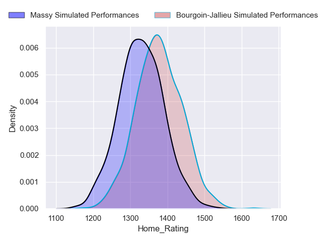
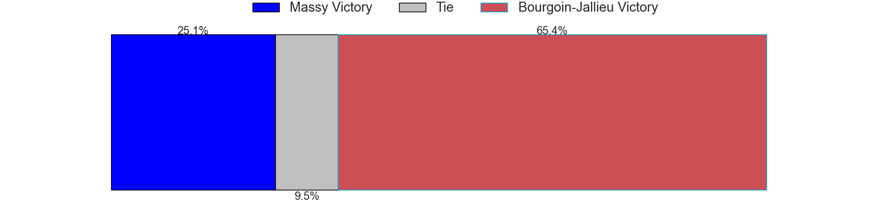
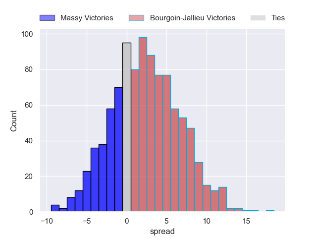

### Chambery V US Bressane on 2024/09/14

Average Margin: Chambery by 5.6

Average Scoreline: 23-17

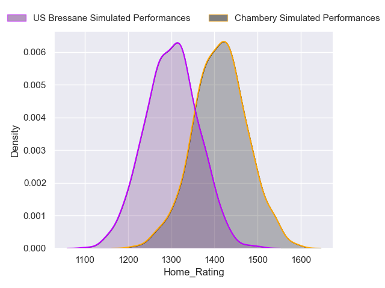
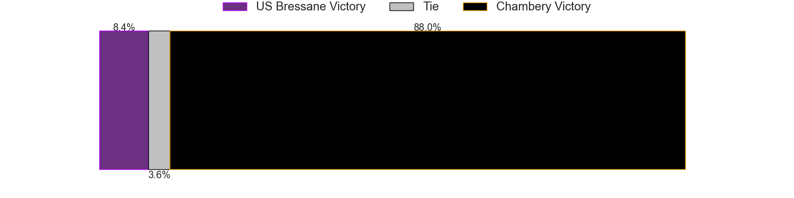
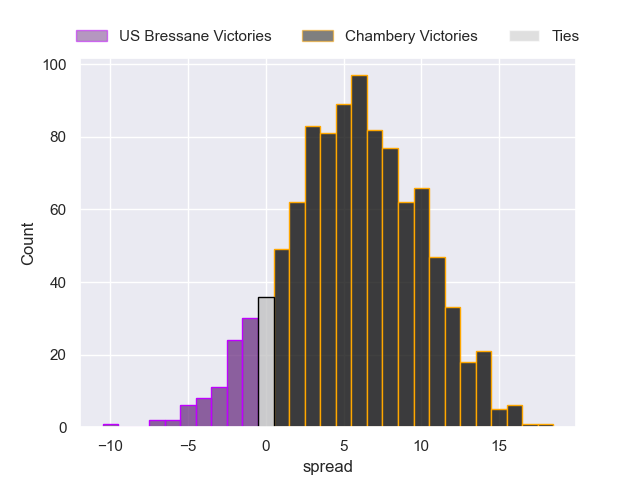

### Marcq-en-Baroeul V Périgueux on 2024/09/14

Average Margin: Périgueux by 13.9

Average Scoreline: 22-9

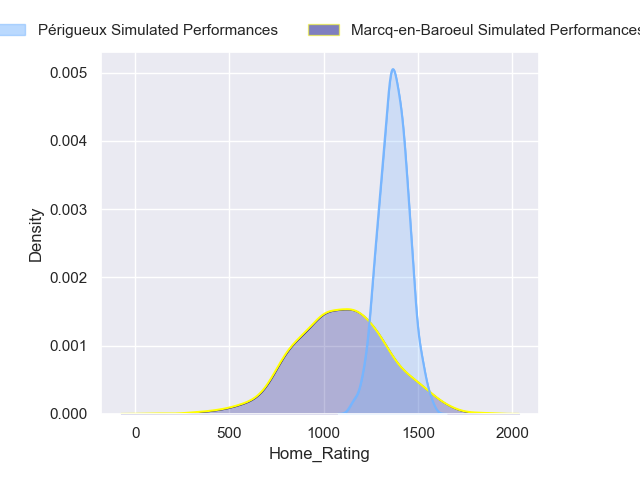
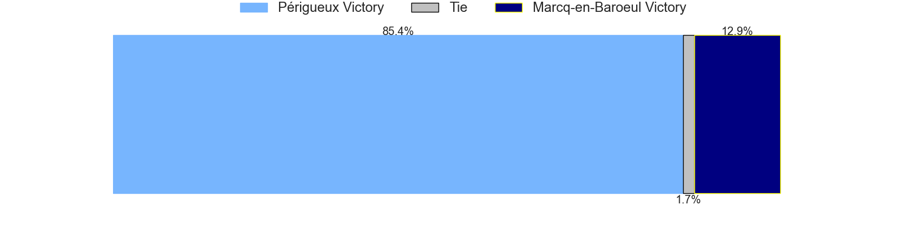
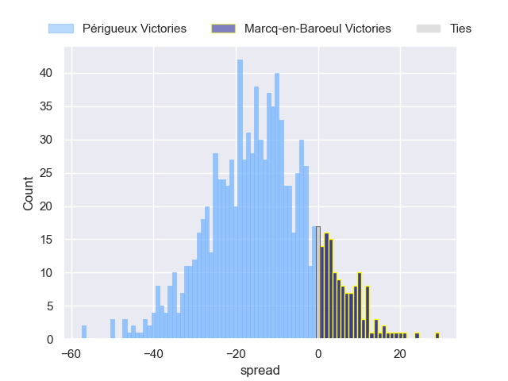

## Week 7

### Carcassonne V Chambery on 2024/09/27

Average Margin: Carcassonne by 7.0

Average Scoreline: 20-13

### US Bressane V Marcq-en-Baroeul on 2024/09/27

Average Margin: US Bressane by 16.9

Average Scoreline: 30-13

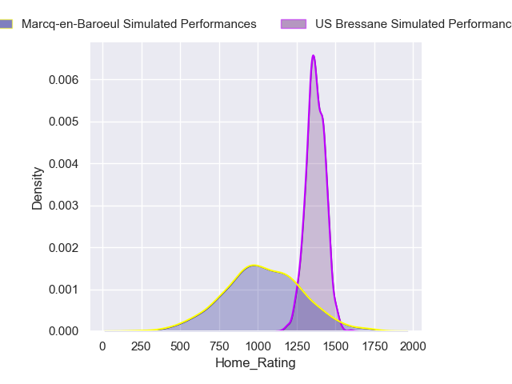
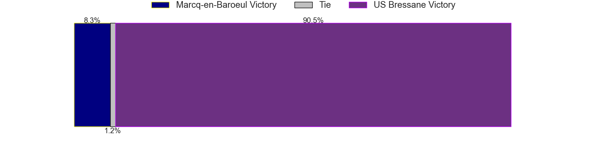
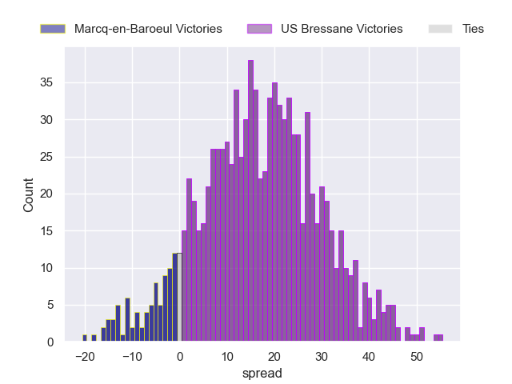

### Albi V Rouen on 2024/09/27

Average Margin: Albi by 5.0

Average Scoreline: 19-14

### Périgueux V Bourgoin-Jallieu on 2024/09/28

Average Margin: Périgueux by 6.7

Average Scoreline: 22-16

### Suresnes V Tarbes on 2024/09/28

Average Margin: Suresnes by 5.3

Average Scoreline: 25-20

### Langon V Massy on 2024/09/28

Average Margin: Langon by 4.5

Average Scoreline: 22-17

## Week 8

### Marcq-en-Baroeul V Carcassonne on 2024/10/04

Average Margin: Carcassonne by 13.1

Average Scoreline: 23-10

### Rouen V Langon on 2024/10/04

Average Margin: Rouen by 3.9

Average Scoreline: 23-19

### Bourgoin-Jallieu V US Bressane on 2024/10/04

Average Margin: Bourgoin-Jallieu by 3.6

Average Scoreline: 19-15

### Chambery V Narbonne on 2024/10/04

Average Margin: Chambery by 2.1

Average Scoreline: 20-18

### Tarbes V Albi on 2024/10/04

Average Margin: Albi by 4.1

Average Scoreline: 26-22

### Massy V Périgueux on 2024/10/05

Average Margin: Massy by 1.5

Average Scoreline: 19-17

## Week 9

### Carcassonne V Bourgoin-Jallieu on 2024/10/12

Average Margin: Carcassonne by 8.7

Average Scoreline: 25-17

### Narbonne V Marcq-en-Baroeul on 2024/10/12

Average Margin: Narbonne by 18.1

Average Scoreline: 29-10

### Rouen V Tarbes on 2024/10/12

Average Margin: Rouen by 9.2

Average Scoreline: 29-20

### Suresnes V Chambery on 2024/10/12

Average Margin: Suresnes by 0.6

Average Scoreline: 21-21

### US Bressane V Massy on 2024/10/12

Average Margin: US Bressane by 1.9

Average Scoreline: 17-15

### Langon V Périgueux on 2024/10/12

Average Margin: Langon by 2.9

Average Scoreline: 18-15

## Week 10

### Chambery V Albi on 2024/10/18

Average Margin: Chambery by 0.4

Average Scoreline: 18-17

### Massy V Carcassonne on 2024/10/18

Average Margin: Carcassonne by 0.8

Average Scoreline: 20-19

### Tarbes V Langon on 2024/10/18

Average Margin: Langon by 2.2

Average Scoreline: 19-16

### Marcq-en-Baroeul V Suresnes on 2024/10/18

Average Margin: Suresnes by 6.7

Average Scoreline: 20-13

### Périgueux V US Bressane on 2024/10/18

Average Margin: Périgueux by 6.7

Average Scoreline: 20-14

### Bourgoin-Jallieu V Narbonne on 2024/10/18

Average Margin: Bourgoin-Jallieu by 0.2

Average Scoreline: 20-20

## Week 11

### Langon V US Bressane on 2024/11/02

Average Margin: Langon by 5.9

Average Scoreline: 21-15

### Suresnes V Bourgoin-Jallieu on 2024/11/02

Average Margin: Suresnes by 2.2

Average Scoreline: 19-17

### Rouen V Chambery on 2024/11/02

Average Margin: Rouen by 4.9

Average Scoreline: 25-20

### Carcassonne V Périgueux on 2024/11/02

Average Margin: Carcassonne by 5.5

Average Scoreline: 24-18

### Narbonne V Massy on 2024/11/02

Average Margin: Narbonne by 5.4

Average Scoreline: 25-20

### Albi V Marcq-en-Baroeul on 2024/11/02

Average Margin: Albi by 17.9

Average Scoreline: 28-10

## Week 12

### Chambery V Tarbes on 2024/11/09

Average Margin: Chambery by 7.9

Average Scoreline: 26-18

### Massy V Suresnes on 2024/11/09

Average Margin: Massy by 5.6

Average Scoreline: 21-16

### Marcq-en-Baroeul V Rouen on 2024/11/09

Average Margin: Rouen by 9.5

Average Scoreline: 24-15

### US Bressane V Carcassonne on 2024/11/09

Average Margin: Carcassonne by 2.3

Average Scoreline: 21-19

### Bourgoin-Jallieu V Albi on 2024/11/09

Average Margin: Albi by 1.2

Average Scoreline: 21-19

### Périgueux V Narbonne on 2024/11/09

Average Margin: Périgueux by 3.3

Average Scoreline: 21-17

## Week 13

### Narbonne V US Bressane on 2024/11/16

Average Margin: Narbonne by 6.8

Average Scoreline: 26-19

### Langon V Carcassonne on 2024/11/16

Average Margin: Langon by 0.7

Average Scoreline: 18-17

### Albi V Massy on 2024/11/16

Average Margin: Albi by 7.1

Average Scoreline: 21-14

### Suresnes V Périgueux on 2024/11/16

Average Margin: Périgueux by 0.7

Average Scoreline: 24-23

### Rouen V Bourgoin-Jallieu on 2024/11/16

Average Margin: Rouen by 6.6

Average Scoreline: 25-19

### Tarbes V Marcq-en-Baroeul on 2024/11/16

Average Margin: Tarbes by 10.7

Average Scoreline: 25-14

## Week 14

### Bourgoin-Jallieu V Tarbes on 2024/11/30

Average Margin: Bourgoin-Jallieu by 6.3

Average Scoreline: 23-16

### Massy V Rouen on 2024/11/30

Average Margin: Massy by 1.2

Average Scoreline: 19-18

### Carcassonne V Narbonne on 2024/11/30

Average Margin: Carcassonne by 5.3

Average Scoreline: 24-19

### Chambery V Langon on 2024/11/30

Average Margin: Chambery by 2.9

Average Scoreline: 19-16

### Périgueux V Albi on 2024/11/30

Average Margin: Périgueux by 1.5

Average Scoreline: 16-14

### US Bressane V Suresnes on 2024/11/30

Average Margin: US Bressane by 4.2

Average Scoreline: 22-18

## Week 15

### Tarbes V Massy on 2024/12/07

Average Margin: Massy by 0.7

Average Scoreline: 22-21

### Chambery V Marcq-en-Baroeul on 2024/12/07

Average Margin: Chambery by 14.0

Average Scoreline: 30-16

### Suresnes V Carcassonne on 2024/12/07

Average Margin: Carcassonne by 3.0

Average Scoreline: 25-22

### Rouen V Périgueux on 2024/12/07

Average Margin: Rouen by 3.6

Average Scoreline: 22-18

### Albi V US Bressane on 2024/12/07

Average Margin: Albi by 8.2

Average Scoreline: 25-16

### Langon V Narbonne on 2024/12/07

Average Margin: Langon by 2.8

Average Scoreline: 20-17

## Week 16

### Suresnes V Narbonne on 2024/12/14

Average Margin: Narbonne by 0.8

Average Scoreline: 25-24

### Marcq-en-Baroeul V Langon on 2024/12/14

Average Margin: Langon by 8.1

Average Scoreline: 22-14

### Chambery V Bourgoin-Jallieu on 2024/12/14

Average Margin: Chambery by 5.2

Average Scoreline: 25-20

### Tarbes V Périgueux on 2024/12/14

Average Margin: Périgueux by 2.4

Average Scoreline: 22-19

### Rouen V US Bressane on 2024/12/14

Average Margin: Rouen by 6.7

Average Scoreline: 25-18

### Albi V Carcassonne on 2024/12/14

Average Margin: Albi by 2.8

Average Scoreline: 23-21

## Week 17

### Bourgoin-Jallieu V Marcq-en-Baroeul on 2025/01/11

Average Margin: Bourgoin-Jallieu by 11.8

Average Scoreline: 24-12

### Massy V Chambery on 2025/01/11

Average Margin: Massy by 2.9

Average Scoreline: 24-21

### Langon V Suresnes on 2025/01/11

Average Margin: Langon by 6.8

Average Scoreline: 24-17

### US Bressane V Tarbes on 2025/01/11

Average Margin: US Bressane by 5.8

Average Scoreline: 23-17

### Narbonne V Albi on 2025/01/11

Average Margin: Narbonne by 2.0

Average Scoreline: 24-22

### Carcassonne V Rouen on 2025/01/11

Average Margin: Carcassonne by 5.5

Average Scoreline: 24-19

## Week 18

### Rouen V Narbonne on 2025/01/18

Average Margin: Rouen by 3.4

Average Scoreline: 25-22

### Tarbes V Carcassonne on 2025/01/18

Average Margin: Carcassonne by 4.5

Average Scoreline: 28-24

### Chambery V Périgueux on 2025/01/18

Average Margin: Chambery by 2.2

Average Scoreline: 20-18

### Marcq-en-Baroeul V Massy on 2025/01/18

Average Margin: Massy by 6.6

Average Scoreline: 24-18

### Bourgoin-Jallieu V Langon on 2025/01/18

Average Margin: Bourgoin-Jallieu by 1.1

Average Scoreline: 21-20

### Albi V Suresnes on 2025/01/18

Average Margin: Albi by 9.1

Average Scoreline: 26-17

## Week 19

### Langon V Albi on 2025/01/25

Average Margin: Langon by 1.2

Average Scoreline: 20-18

### Périgueux V Marcq-en-Baroeul on 2025/01/25

Average Margin: Périgueux by 14.9

Average Scoreline: 27-12

### US Bressane V Chambery on 2025/01/25

Average Margin: US Bressane by 1.3

Average Scoreline: 23-22

### Suresnes V Rouen on 2025/01/25

Average Margin: Rouen by 1.0

Average Scoreline: 26-25

### Narbonne V Tarbes on 2025/01/25

Average Margin: Narbonne by 9.5

Average Scoreline: 30-20

### Massy V Bourgoin-Jallieu on 2025/01/25

Average Margin: Massy by 4.5

Average Scoreline: 20-16

## Week 20

### Chambery V Carcassonne on 2025/02/01

Average Margin: Carcassonne by 0.1

Average Scoreline: 26-25

### Rouen V Albi on 2025/02/01

Average Margin: Rouen by 1.9

Average Scoreline: 22-20

### Tarbes V Suresnes on 2025/02/01

Average Margin: Tarbes by 1.8

Average Scoreline: 22-21

### Massy V Langon on 2025/02/01

Average Margin: Massy by 2.2

Average Scoreline: 23-21

### Bourgoin-Jallieu V Périgueux on 2025/02/01

Average Margin: Bourgoin-Jallieu by 0.3

Average Scoreline: 25-24

### Marcq-en-Baroeul V US Bressane on 2025/02/01

Average Margin: US Bressane by 4.5

Average Scoreline: 24-19

## Week 21

### Albi V Tarbes on 2025/02/15

Average Margin: Albi by 10.8

Average Scoreline: 29-18

### Narbonne V Chambery on 2025/02/15

Average Margin: Narbonne by 4.8

Average Scoreline: 28-23

### Carcassonne V Marcq-en-Baroeul on 2025/02/15

Average Margin: Carcassonne by 16.3

Average Scoreline: 33-17

### Périgueux V Massy on 2025/02/15

Average Margin: Périgueux by 5.4

Average Scoreline: 21-15

### US Bressane V Bourgoin-Jallieu on 2025/02/15

Average Margin: US Bressane by 3.0

Average Scoreline: 22-19

### Langon V Rouen on 2025/02/15

Average Margin: Langon by 2.7

Average Scoreline: 20-17

## Week 22

### Chambery V Suresnes on 2025/02/22

Average Margin: Chambery by 6.3

Average Scoreline: 28-22

### Périgueux V Langon on 2025/02/22

Average Margin: Périgueux by 4.1

Average Scoreline: 20-16

### Massy V US Bressane on 2025/02/22

Average Margin: Massy by 4.8

Average Scoreline: 24-19

### Marcq-en-Baroeul V Narbonne on 2025/02/22

Average Margin: Narbonne by 8.0

Average Scoreline: 25-17

### Bourgoin-Jallieu V Carcassonne on 2025/02/22

Average Margin: Carcassonne by 1.8

Average Scoreline: 27-25

### Tarbes V Rouen on 2025/02/22

Average Margin: Rouen by 2.4

Average Scoreline: 27-25

## Week 23

### Narbonne V Bourgoin-Jallieu on 2025/03/01

Average Margin: Narbonne by 6.3

Average Scoreline: 28-22

### Albi V Chambery on 2025/03/01

Average Margin: Albi by 6.2

Average Scoreline: 25-19

### US Bressane V Périgueux on 2025/03/01

Average Margin: Périgueux by 0.0

Average Scoreline: 24-24

### Suresnes V Marcq-en-Baroeul on 2025/03/01

Average Margin: Suresnes by 10.3

Average Scoreline: 32-22

### Langon V Tarbes on 2025/03/01

Average Margin: Langon by 8.3

Average Scoreline: 27-19

### Carcassonne V Massy on 2025/03/01

Average Margin: Carcassonne by 7.4

Average Scoreline: 26-19

## Week 24

### Chambery V Rouen on 2025/03/07

Average Margin: Chambery by 2.0

Average Scoreline: 24-22

### US Bressane V Langon on 2025/03/07

Average Margin: US Bressane by 0.7

Average Scoreline: 23-22

### Massy V Narbonne on 2025/03/08

Average Margin: Massy by 1.4

Average Scoreline: 25-23

### Marcq-en-Baroeul V Albi on 2025/03/08

Average Margin: Albi by 9.4

Average Scoreline: 25-16

### Bourgoin-Jallieu V Suresnes on 2025/03/08

Average Margin: Bourgoin-Jallieu by 4.4

Average Scoreline: 26-22

### Périgueux V Carcassonne on 2025/03/08

Average Margin: Périgueux by 1.2

Average Scoreline: 19-17

## Week 25

### Albi V Bourgoin-Jallieu on 2025/03/21

Average Margin: Albi by 8.0

Average Scoreline: 26-18

### Carcassonne V US Bressane on 2025/03/21

Average Margin: Carcassonne by 8.7

Average Scoreline: 27-18

### Rouen V Marcq-en-Baroeul on 2025/03/21

Average Margin: Rouen by 14.5

Average Scoreline: 32-18

### Tarbes V Chambery on 2025/03/21

Average Margin: Chambery by 1.2

Average Scoreline: 30-29

### Narbonne V Périgueux on 2025/03/22

Average Margin: Narbonne by 3.6

Average Scoreline: 23-19

### Suresnes V Massy on 2025/03/22

Average Margin: Suresnes by 1.1

Average Scoreline: 28-27

## Week 26

### US Bressane V Narbonne on 2025/03/28

Average Margin: Narbonne by 0.2

Average Scoreline: 23-23

### Carcassonne V Langon on 2025/03/28

Average Margin: Carcassonne by 5.9

Average Scoreline: 25-20

### Marcq-en-Baroeul V Tarbes on 2025/03/29

Average Margin: Tarbes by 2.0

Average Scoreline: 23-21

### Bourgoin-Jallieu V Rouen on 2025/03/29

Average Margin: Bourgoin-Jallieu by 0.2

Average Scoreline: 24-24

### Périgueux V Suresnes on 2025/03/29

Average Margin: Périgueux by 7.4

Average Scoreline: 22-15

### Massy V Albi on 2025/03/29

Average Margin: Albi by 0.0

Average Scoreline: 25-25

## Week 27

### Tarbes V Bourgoin-Jallieu on 2025/04/11

Average Margin: Tarbes by 0.6

Average Scoreline: 28-27

### Albi V Périgueux on 2025/04/11

Average Margin: Albi by 5.1

Average Scoreline: 24-19

### Rouen V Massy on 2025/04/11

Average Margin: Rouen by 5.3

Average Scoreline: 30-25

### Langon V Chambery on 2025/04/12

Average Margin: Langon by 4.2

Average Scoreline: 23-19

### Narbonne V Carcassonne on 2025/04/12

Average Margin: Narbonne by 1.6

Average Scoreline: 27-25

### Suresnes V US Bressane on 2025/04/12

Average Margin: Suresnes by 2.4

Average Scoreline: 29-27

## Week 28

### Périgueux V Rouen on 2025/04/26

Average Margin: Périgueux by 3.2

Average Scoreline: 20-17

### US Bressane V Albi on 2025/04/26

Average Margin: Albi by 1.6

Average Scoreline: 25-24

### Marcq-en-Baroeul V Chambery on 2025/04/26

Average Margin: Chambery by 6.1

Average Scoreline: 26-20

### Massy V Tarbes on 2025/04/26

Average Margin: Massy by 7.4

Average Scoreline: 28-21

### Narbonne V Langon on 2025/04/26

Average Margin: Narbonne by 4.2

Average Scoreline: 25-21

### Carcassonne V Suresnes on 2025/04/26

Average Margin: Carcassonne by 9.8

Average Scoreline: 29-19

