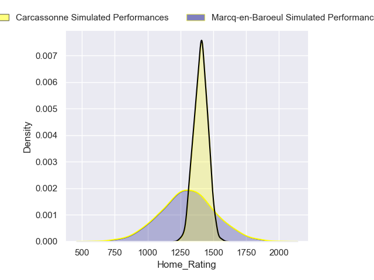
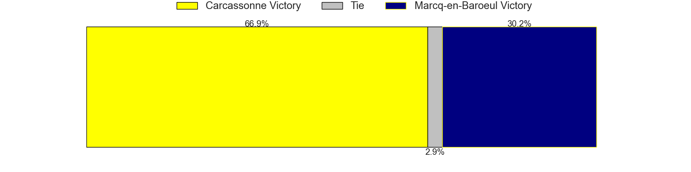
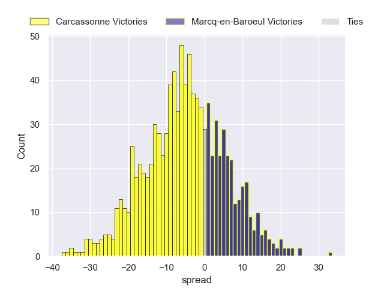

---  
title: "Nationale 2024 Status"  
date: 2024-09-30 6:00:00 -0500  
categories: model review projection  
layout: article  
aside:  
    toc: true  
---
# Current Team Rankings

# Standings

## Current Standings

| Club                |   Played |   Wins |   Point Differential |   Losing Bonus Points |   Try Bonus Points |   Competition Points |
|:--------------------|---------:|-------:|---------------------:|----------------------:|-------------------:|---------------------:|
| Périgueux           |        5 |      5 |                   81 |                     0 |                nan |                   22 |
| Carcassonne         |        5 |      4 |                   43 |                     1 |                nan |                   18 |
| Narbonne            |        5 |      4 |                   38 |                     1 |                nan |                   18 |
| Albi                |        5 |      3 |                    9 |                     0 |                  1 |                   15 |
| Langon              |        5 |      3 |                   15 |                     1 |                  1 |                   14 |
| Chambery            |        5 |      3 |                   13 |                     2 |                  0 |                   14 |
| Rouen               |        5 |      3 |                   -1 |                     0 |                  0 |                   14 |
| Suresnes            |        5 |      2 |                   -1 |                     3 |                  2 |                   13 |
| Massy               |        5 |      2 |                   25 |                     2 |                nan |                   12 |
| Bourgoin-Jallieu    |        5 |      2 |                  -31 |                     1 |                  1 |                   10 |
| US Bressane         |        5 |      2 |                   -7 |                     1 |                nan |                    9 |
| Tarbes              |        5 |      1 |                   -7 |                     2 |                  1 |                    7 |
| Marcq-en-Baroeul    |        5 |      0 |                  -52 |                     2 |                  1 |                    3 |
| Carqueiranne-Hyères |        5 |      0 |                 -125 |                     0 |                nan |                    0 |

## Projected Remaining Table

| Club             |   Matches Remaining |   Wins |   Point Differential |   Losing Bonus Points |   Try Bonus Points |   Competition Points |
|:-----------------|--------------------:|-------:|---------------------:|----------------------:|-------------------:|---------------------:|
| Langon           |                  19 |   14.2 |             118.875  |                   3.4 |                7.7 |                 68   |
| Carcassonne      |                  20 |   13.6 |              58.8345 |                   5.2 |                7   |                 66.5 |
| Périgueux        |                  20 |   12.4 |              38.0356 |                   5.9 |                7.9 |                 63.3 |
| Albi             |                  19 |   12.9 |              56.9091 |                   4.9 |                4.7 |                 61.2 |
| Narbonne         |                  20 |   11.6 |              27.0041 |                   6.4 |                7.9 |                 60.9 |
| Rouen            |                  19 |   11.7 |              31.7664 |                   5.4 |                7.9 |                 60.2 |
| Chambery         |                  19 |   10.7 |              18.4603 |                   6.3 |                7.1 |                 56.2 |
| Massy            |                  20 |    9   |             -18.2108 |                   7.8 |                6.3 |                 49.9 |
| US Bressane      |                  20 |    6.5 |             -63.3419 |                   8.1 |                6.5 |                 40.5 |
| Bourgoin-Jallieu |                  19 |    6.4 |             -43.9218 |                   8.2 |                4.3 |                 38.2 |
| Suresnes         |                  19 |    6   |             -59.68   |                   7.9 |                6.3 |                 38   |
| Marcq-en-Baroeul |                  19 |    6.4 |             -77.5755 |                   5.4 |                4.7 |                 35.7 |
| Tarbes           |                  19 |    4.6 |             -87.1549 |                   7.7 |                4.9 |                 31   |

## Projected Total Table

| Club                |   Total Matches |   Wins |   Point Differential |   Losing Bonus Points |   Try Bonus Points |   Competition Points |
|:--------------------|----------------:|-------:|---------------------:|----------------------:|-------------------:|---------------------:|
| Périgueux           |              25 |   17.4 |            119.036   |                   5.9 |                7.9 |                 85.3 |
| Carcassonne         |              25 |   17.6 |            101.834   |                   6.2 |                7   |                 84.5 |
| Langon              |              24 |   17.2 |            133.875   |                   4.4 |                8.7 |                 82   |
| Narbonne            |              25 |   15.6 |             65.0041  |                   7.4 |                7.9 |                 78.9 |
| Albi                |              24 |   15.9 |             65.9091  |                   4.9 |                5.7 |                 76.2 |
| Rouen               |              24 |   14.7 |             30.7664  |                   5.4 |                7.9 |                 74.2 |
| Chambery            |              24 |   13.7 |             31.4603  |                   8.3 |                7.1 |                 70.2 |
| Massy               |              25 |   11   |              6.78923 |                   9.8 |                6.3 |                 61.9 |
| Suresnes            |              24 |    8   |            -60.68    |                  10.9 |                8.3 |                 51   |
| US Bressane         |              25 |    8.5 |            -70.3419  |                   9.1 |                6.5 |                 49.5 |
| Bourgoin-Jallieu    |              24 |    8.4 |            -74.9218  |                   9.2 |                5.3 |                 48.2 |
| Marcq-en-Baroeul    |              24 |    6.4 |           -129.576   |                   7.4 |                5.7 |                 38.7 |
| Tarbes              |              24 |    5.6 |            -94.1549  |                   9.7 |                5.9 |                 38   |
| Carqueiranne-Hyères |               5 |    0   |           -125       |                   0   |                0   |                  0   |

# Completed Match Review

| Model | Percent Correct Predictions | Spread Error |
| ------ | ------ | ------ |
| Club Level | 82.9% | 9.2 |
| Player Level: Lineup | 72.7% | 6.4 |
| Player Level: Minutes | 61.5% | 7.5 |

# Future Predictions

## Week 6

### Rouen V Langon on 2024/10/04

Average Margin: Langon by 2.9

Average Scoreline: 25-22

### Chambery V Narbonne on 2024/10/04

Average Margin: Chambery by 2.9

Average Scoreline: 28-25

### Tarbes V Albi on 2024/10/04

Average Margin: Albi by 3.7

Average Scoreline: 26-22

### Bourgoin-Jallieu V US Bressane on 2024/10/04

Average Margin: Bourgoin-Jallieu by 3.6

Average Scoreline: 21-17

### Marcq-en-Baroeul V Carcassonne on 2024/10/05

Average Margin: Carcassonne by 5.0

Average Scoreline: 23-18

### Massy V Périgueux on 2024/10/05

Average Margin: Périgueux by 0.4

Average Scoreline: 14-14

## Week 7

### Narbonne V Marcq-en-Baroeul on 2024/10/12

Average Margin: Narbonne by 9.7

Average Scoreline: 27-18

### Rouen V Tarbes on 2024/10/12

Average Margin: Rouen by 9.1

Average Scoreline: 31-21

### Suresnes V Chambery on 2024/10/12

Average Margin: Chambery by 0.4

Average Scoreline: 22-21

### Langon V Périgueux on 2024/10/12

Average Margin: Langon by 8.4

Average Scoreline: 23-15

### Carcassonne V Bourgoin-Jallieu on 2024/10/12

Average Margin: Carcassonne by 8.6

Average Scoreline: 28-19

### US Bressane V Massy on 2024/10/12

Average Margin: US Bressane by 2.1

Average Scoreline: 26-24

## Week 8

### Marcq-en-Baroeul V Suresnes on 2024/10/18

Average Margin: Marcq-en-Baroeul by 1.6

Average Scoreline: 23-21

### Massy V Carcassonne on 2024/10/18

Average Margin: Carcassonne by 0.9

Average Scoreline: 22-21

### Chambery V Albi on 2024/10/18

Average Margin: Chambery by 1.8

Average Scoreline: 22-20

### Bourgoin-Jallieu V Narbonne on 2024/10/18

Average Margin: Narbonne by 0.5

Average Scoreline: 27-26

### Périgueux V US Bressane on 2024/10/18

Average Margin: Périgueux by 8.4

Average Scoreline: 30-21

### Tarbes V Langon on 2024/10/18

Average Margin: Langon by 8.6

Average Scoreline: 23-14

## Week 9

### Suresnes V Bourgoin-Jallieu on 2024/11/02

Average Margin: Suresnes by 2.7

Average Scoreline: 25-22

### Langon V US Bressane on 2024/11/02

Average Margin: Langon by 12.9

Average Scoreline: 25-13

### Rouen V Chambery on 2024/11/02

Average Margin: Rouen by 4.1

Average Scoreline: 25-21

### Carcassonne V Périgueux on 2024/11/02

Average Margin: Carcassonne by 3.7

Average Scoreline: 19-16

### Narbonne V Massy on 2024/11/02

Average Margin: Narbonne by 5.8

Average Scoreline: 30-24

### Albi V Marcq-en-Baroeul on 2024/11/02

Average Margin: Albi by 10.0

Average Scoreline: 25-15

## Week 10

### Massy V Suresnes on 2024/11/09

Average Margin: Massy by 5.2

Average Scoreline: 25-20

### Marcq-en-Baroeul V Rouen on 2024/11/09

Average Margin: Rouen by 2.4

Average Scoreline: 21-19

### Chambery V Tarbes on 2024/11/09

Average Margin: Chambery by 8.5

Average Scoreline: 32-24

### Périgueux V Narbonne on 2024/11/09

Average Margin: Périgueux by 4.5

Average Scoreline: 24-20

### Bourgoin-Jallieu V Albi on 2024/11/09

Average Margin: Albi by 1.7

Average Scoreline: 21-20

### US Bressane V Carcassonne on 2024/11/09

Average Margin: Carcassonne by 2.6

Average Scoreline: 24-22

## Week 11

### Tarbes V Marcq-en-Baroeul on 2024/11/16

Average Margin: Tarbes by 3.4

Average Scoreline: 20-16

### Albi V Massy on 2024/11/16

Average Margin: Albi by 6.8

Average Scoreline: 25-18

### Narbonne V US Bressane on 2024/11/16

Average Margin: Narbonne by 7.1

Average Scoreline: 31-24

### Langon V Carcassonne on 2024/11/16

Average Margin: Langon by 7.1

Average Scoreline: 25-18

### Rouen V Bourgoin-Jallieu on 2024/11/16

Average Margin: Rouen by 7.2

Average Scoreline: 29-22

### Suresnes V Périgueux on 2024/11/16

Average Margin: Périgueux by 2.3

Average Scoreline: 22-19

## Week 12

### Carcassonne V Narbonne on 2024/11/30

Average Margin: Carcassonne by 4.7

Average Scoreline: 23-19

### Bourgoin-Jallieu V Tarbes on 2024/11/30

Average Margin: Bourgoin-Jallieu by 5.3

Average Scoreline: 23-17

### Chambery V Langon on 2024/11/30

Average Margin: Langon by 2.2

Average Scoreline: 22-20

### US Bressane V Suresnes on 2024/11/30

Average Margin: US Bressane by 3.7

Average Scoreline: 25-21

### Massy V Rouen on 2024/11/30

Average Margin: Massy by 0.6

Average Scoreline: 25-25

### Périgueux V Albi on 2024/11/30

Average Margin: Périgueux by 3.6

Average Scoreline: 24-20

## Week 13

### Tarbes V Massy on 2024/12/07

Average Margin: Tarbes by 0.3

Average Scoreline: 25-25

### Albi V US Bressane on 2024/12/07

Average Margin: Albi by 8.3

Average Scoreline: 27-19

### Suresnes V Carcassonne on 2024/12/07

Average Margin: Carcassonne by 2.8

Average Scoreline: 27-24

### Rouen V Périgueux on 2024/12/07

Average Margin: Rouen by 2.1

Average Scoreline: 19-17

### Chambery V Marcq-en-Baroeul on 2024/12/07

Average Margin: Chambery by 8.0

Average Scoreline: 26-18

### Langon V Narbonne on 2024/12/07

Average Margin: Langon by 8.1

Average Scoreline: 24-16

## Week 14

### Albi V Carcassonne on 2024/12/14

Average Margin: Albi by 2.7

Average Scoreline: 21-19

### Rouen V US Bressane on 2024/12/14

Average Margin: Rouen by 7.1

Average Scoreline: 30-22

### Chambery V Bourgoin-Jallieu on 2024/12/14

Average Margin: Chambery by 6.6

Average Scoreline: 29-23

### Suresnes V Narbonne on 2024/12/14

Average Margin: Narbonne by 1.0

Average Scoreline: 25-24

### Marcq-en-Baroeul V Langon on 2024/12/14

Average Margin: Langon by 6.8

Average Scoreline: 25-18

### Tarbes V Périgueux on 2024/12/14

Average Margin: Périgueux by 3.4

Average Scoreline: 22-18

## Week 15

### Carcassonne V Rouen on 2025/01/11

Average Margin: Carcassonne by 4.9

Average Scoreline: 24-19

### Narbonne V Albi on 2025/01/11

Average Margin: Narbonne by 2.1

Average Scoreline: 19-17

### Bourgoin-Jallieu V Marcq-en-Baroeul on 2025/01/11

Average Margin: Bourgoin-Jallieu by 4.8

Average Scoreline: 22-18

### Langon V Suresnes on 2025/01/11

Average Margin: Langon by 12.4

Average Scoreline: 28-16

### US Bressane V Tarbes on 2025/01/11

Average Margin: US Bressane by 5.0

Average Scoreline: 24-19

### Massy V Chambery on 2025/01/11

Average Margin: Massy by 1.4

Average Scoreline: 23-21

## Week 16

### Bourgoin-Jallieu V Langon on 2025/01/18

Average Margin: Langon by 4.9

Average Scoreline: 22-17

### Tarbes V Carcassonne on 2025/01/18

Average Margin: Carcassonne by 4.0

Average Scoreline: 25-21

### Rouen V Narbonne on 2025/01/18

Average Margin: Rouen by 3.5

Average Scoreline: 26-23

### Chambery V Périgueux on 2025/01/18

Average Margin: Chambery by 1.6

Average Scoreline: 20-18

### Albi V Suresnes on 2025/01/18

Average Margin: Albi by 8.8

Average Scoreline: 25-17

### Marcq-en-Baroeul V Massy on 2025/01/18

Average Margin: Marcq-en-Baroeul by 0.7

Average Scoreline: 24-23

## Week 17

### Périgueux V Marcq-en-Baroeul on 2025/01/25

Average Margin: Périgueux by 10.0

Average Scoreline: 27-17

### US Bressane V Chambery on 2025/01/25

Average Margin: US Bressane by 0.1

Average Scoreline: 23-23

### Massy V Bourgoin-Jallieu on 2025/01/25

Average Margin: Massy by 4.8

Average Scoreline: 27-22

### Narbonne V Tarbes on 2025/01/25

Average Margin: Narbonne by 9.1

Average Scoreline: 33-24

### Suresnes V Rouen on 2025/01/25

Average Margin: Rouen by 1.0

Average Scoreline: 27-26

### Langon V Albi on 2025/01/25

Average Margin: Langon by 7.1

Average Scoreline: 24-17

## Week 18

### Massy V Langon on 2025/02/01

Average Margin: Langon by 3.4

Average Scoreline: 22-19

### Chambery V Carcassonne on 2025/02/01

Average Margin: Chambery by 1.3

Average Scoreline: 20-19

### Rouen V Albi on 2025/02/01

Average Margin: Rouen by 2.2

Average Scoreline: 19-17

### Bourgoin-Jallieu V Périgueux on 2025/02/01

Average Margin: Périgueux by 1.7

Average Scoreline: 18-16

### Marcq-en-Baroeul V US Bressane on 2025/02/01

Average Margin: Marcq-en-Baroeul by 2.1

Average Scoreline: 25-23

### Tarbes V Suresnes on 2025/02/01

Average Margin: Tarbes by 2.1

Average Scoreline: 26-24

## Week 19

### US Bressane V Bourgoin-Jallieu on 2025/02/15

Average Margin: US Bressane by 3.3

Average Scoreline: 23-20

### Périgueux V Massy on 2025/02/15

Average Margin: Périgueux by 6.7

Average Scoreline: 29-22

### Narbonne V Chambery on 2025/02/15

Average Margin: Narbonne by 3.9

Average Scoreline: 26-22

### Albi V Tarbes on 2025/02/15

Average Margin: Albi by 10.1

Average Scoreline: 30-20

### Carcassonne V Marcq-en-Baroeul on 2025/02/15

Average Margin: Carcassonne by 9.4

Average Scoreline: 26-16

### Langon V Rouen on 2025/02/15

Average Margin: Langon by 7.7

Average Scoreline: 25-17

## Week 20

### Bourgoin-Jallieu V Carcassonne on 2025/02/22

Average Margin: Carcassonne by 2.0

Average Scoreline: 22-20

### Marcq-en-Baroeul V Narbonne on 2025/02/22

Average Margin: Narbonne by 1.4

Average Scoreline: 22-21

### Massy V US Bressane on 2025/02/22

Average Margin: Massy by 4.6

Average Scoreline: 27-22

### Périgueux V Langon on 2025/02/22

Average Margin: Langon by 0.0

Average Scoreline: 19-19

### Chambery V Suresnes on 2025/02/22

Average Margin: Chambery by 7.2

Average Scoreline: 29-22

### Tarbes V Rouen on 2025/02/22

Average Margin: Rouen by 2.2

Average Scoreline: 24-22

## Week 21

### Narbonne V Bourgoin-Jallieu on 2025/03/01

Average Margin: Narbonne by 7.1

Average Scoreline: 29-22

### Langon V Tarbes on 2025/03/01

Average Margin: Langon by 13.3

Average Scoreline: 30-17

### US Bressane V Périgueux on 2025/03/01

Average Margin: Périgueux by 1.9

Average Scoreline: 22-20

### Carcassonne V Massy on 2025/03/01

Average Margin: Carcassonne by 7.4

Average Scoreline: 26-19

### Suresnes V Marcq-en-Baroeul on 2025/03/01

Average Margin: Suresnes by 3.9

Average Scoreline: 27-23

### Albi V Chambery on 2025/03/01

Average Margin: Albi by 5.2

Average Scoreline: 24-19

## Week 22

### Chambery V Rouen on 2025/03/07

Average Margin: Chambery by 2.8

Average Scoreline: 25-22

### US Bressane V Langon on 2025/03/07

Average Margin: Langon by 5.0

Average Scoreline: 23-18

### Massy V Narbonne on 2025/03/08

Average Margin: Massy by 0.9

Average Scoreline: 24-23

### Bourgoin-Jallieu V Suresnes on 2025/03/08

Average Margin: Bourgoin-Jallieu by 4.0

Average Scoreline: 26-22

### Marcq-en-Baroeul V Albi on 2025/03/08

Average Margin: Albi by 2.7

Average Scoreline: 21-18

### Périgueux V Carcassonne on 2025/03/08

Average Margin: Périgueux by 2.9

Average Scoreline: 22-19

## Week 23

### Rouen V Marcq-en-Baroeul on 2025/03/21

Average Margin: Rouen by 8.1

Average Scoreline: 26-18

### Carcassonne V US Bressane on 2025/03/21

Average Margin: Carcassonne by 8.8

Average Scoreline: 27-18

### Albi V Bourgoin-Jallieu on 2025/03/21

Average Margin: Albi by 8.2

Average Scoreline: 25-17

### Tarbes V Chambery on 2025/03/21

Average Margin: Chambery by 1.6

Average Scoreline: 24-22

### Suresnes V Massy on 2025/03/22

Average Margin: Suresnes by 1.3

Average Scoreline: 28-27

### Narbonne V Périgueux on 2025/03/22

Average Margin: Narbonne by 2.1

Average Scoreline: 25-23

## Week 24

### US Bressane V Narbonne on 2025/03/28

Average Margin: Narbonne by 0.6

Average Scoreline: 24-23

### Carcassonne V Langon on 2025/03/28

Average Margin: Carcassonne by 0.8

Average Scoreline: 21-20

### Bourgoin-Jallieu V Rouen on 2025/03/29

Average Margin: Rouen by 0.4

Average Scoreline: 22-22

### Périgueux V Suresnes on 2025/03/29

Average Margin: Périgueux by 8.9

Average Scoreline: 28-19

### Marcq-en-Baroeul V Tarbes on 2025/03/29

Average Margin: Marcq-en-Baroeul by 4.1

Average Scoreline: 25-21

### Massy V Albi on 2025/03/29

Average Margin: Albi by 0.5

Average Scoreline: 21-20

## Week 25

### Rouen V Massy on 2025/04/11

Average Margin: Rouen by 5.9

Average Scoreline: 30-24

### Tarbes V Bourgoin-Jallieu on 2025/04/11

Average Margin: Tarbes by 1.5

Average Scoreline: 23-21

### Albi V Périgueux on 2025/04/11

Average Margin: Albi by 3.3

Average Scoreline: 23-19

### Suresnes V US Bressane on 2025/04/12

Average Margin: Suresnes by 3.0

Average Scoreline: 30-27

### Langon V Chambery on 2025/04/12

Average Margin: Langon by 8.0

Average Scoreline: 25-17

### Narbonne V Carcassonne on 2025/04/12

Average Margin: Narbonne by 1.9

Average Scoreline: 24-22

## Week 26

### Carcassonne V Suresnes on 2025/04/26

Average Margin: Carcassonne by 9.2

Average Scoreline: 28-19

### US Bressane V Albi on 2025/04/26

Average Margin: Albi by 1.5

Average Scoreline: 21-19

### Périgueux V Rouen on 2025/04/26

Average Margin: Périgueux by 4.6

Average Scoreline: 26-21

### Massy V Tarbes on 2025/04/26

Average Margin: Massy by 6.4

Average Scoreline: 28-22

### Narbonne V Langon on 2025/04/26

Average Margin: Langon by 0.7

Average Scoreline: 23-22

### Marcq-en-Baroeul V Chambery on 2025/04/26

Average Margin: Chambery by 0.6

Average Scoreline: 21-20

