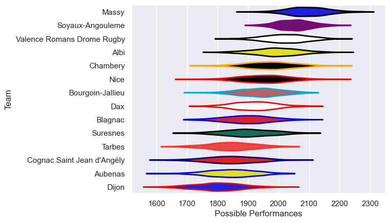

---  
title: "Nationale 21/22"  
date: 2025-07-29 6:00:00 -0500  
categories: model review projection  
layout: article  
aside:  
    toc: true  
---
# Current Team Rankings

# Standings

## Current Standings

| Club                       |   Played |   Wins |   Point Differential |   Losing Bonus Points |   Try Bonus Points |   Competition Points |
|:---------------------------|---------:|-------:|---------------------:|----------------------:|-------------------:|---------------------:|
| Massy                      |       29 |     24 |                  354 |                     3 |                  1 |                  100 |
| Soyaux-Angouleme           |       29 |     20 |                  196 |                     5 |                    |                   85 |
| Albi                       |       29 |     20 |                   90 |                     3 |                    |                   83 |
| Valence Romans Drome Rugby |       29 |     18 |                  222 |                     8 |                    |                   80 |
| Nice                       |       27 |     15 |                   34 |                     5 |                    |                   65 |
| Chambery                   |       27 |     13 |                  112 |                    10 |                    |                   62 |
| Blagnac                    |       26 |     12 |                 -117 |                     4 |                    |                   52 |
| Dax                        |       26 |     11 |                    3 |                     7 |                    |                   51 |
| Bourgoin-Jallieu           |       26 |     10 |                  -79 |                    10 |                    |                   50 |
| Suresnes                   |       26 |     11 |                  -78 |                     4 |                    |                   48 |
| Tarbes                     |       26 |     11 |                 -143 |                     2 |                    |                   48 |
| Cognac Saint Jean d'Angély |       26 |      8 |                 -221 |                    10 |                    |                   42 |
| Aubenas                    |       26 |      7 |                 -174 |                     8 |                    |                   38 |
| Dijon                      |       26 |      7 |                 -199 |                     5 |                    |                   37 |

# Completed Match Review

| Model | Percent Correct Predictions | Spread Error |
| ------ | ------ | ------ |
| Club Level | 69.8% | 9.8 |
| Player Level: Lineup | nan% | nan |
| Player Level: Minutes | nan% | nan |

